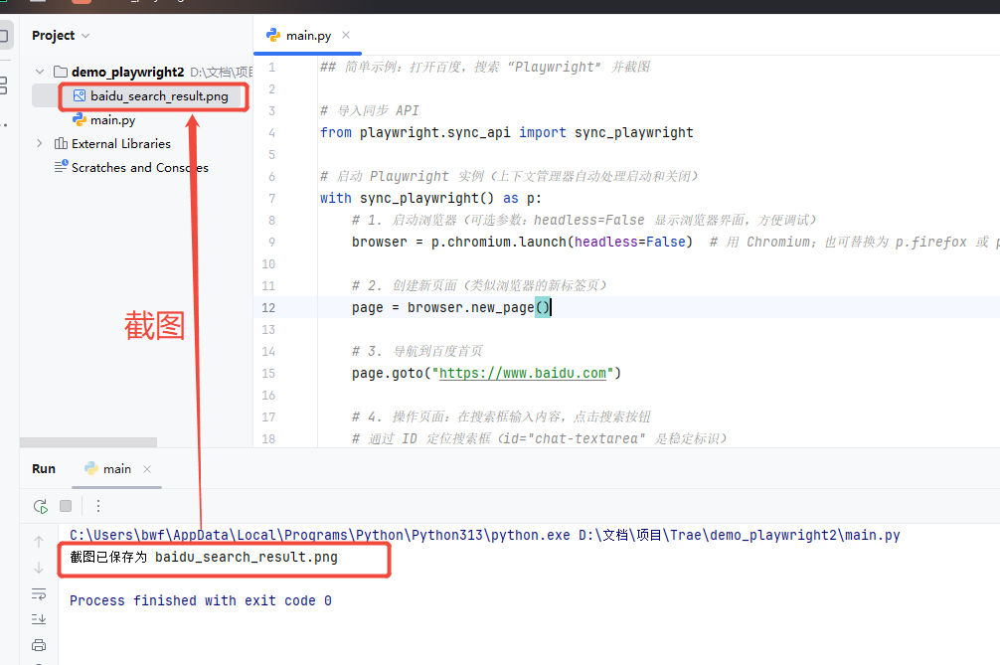
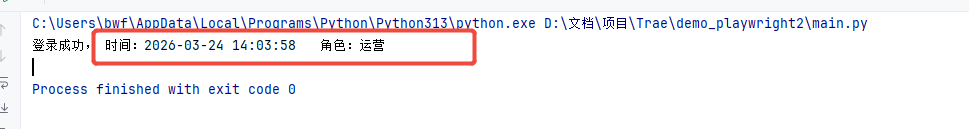
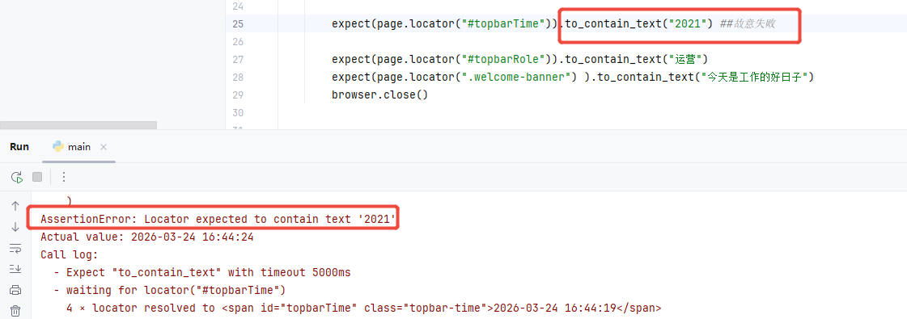
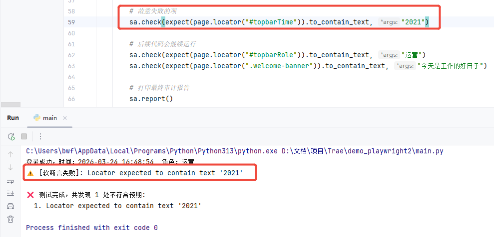
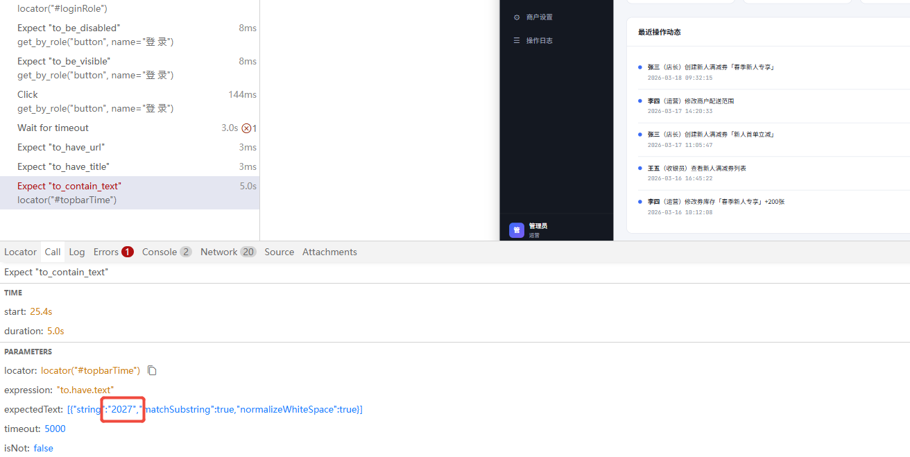
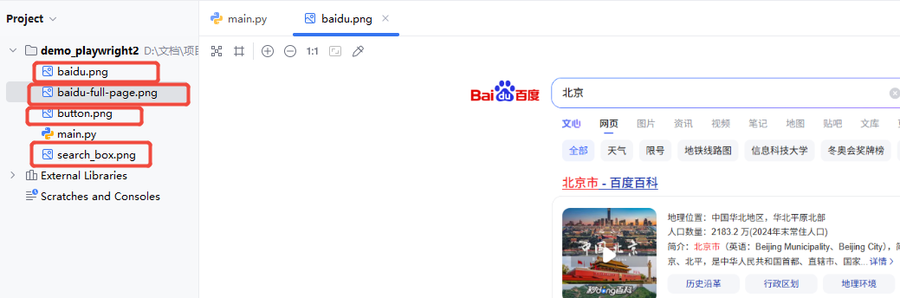
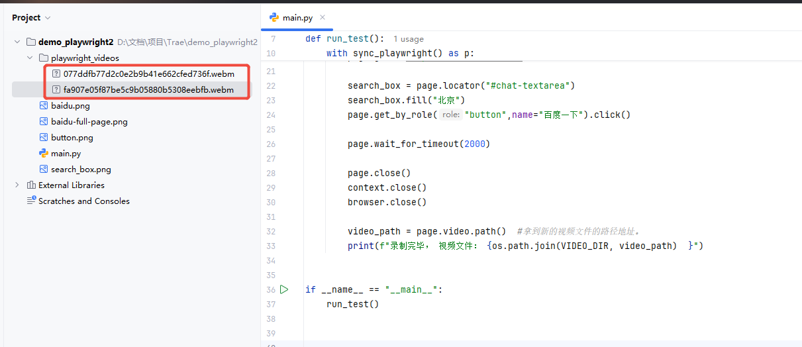
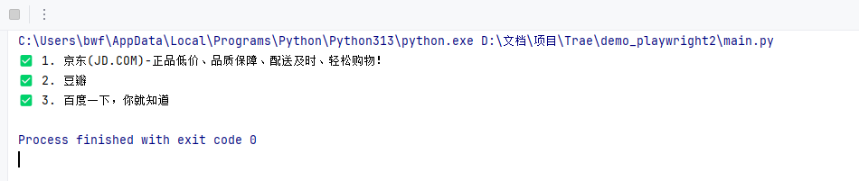
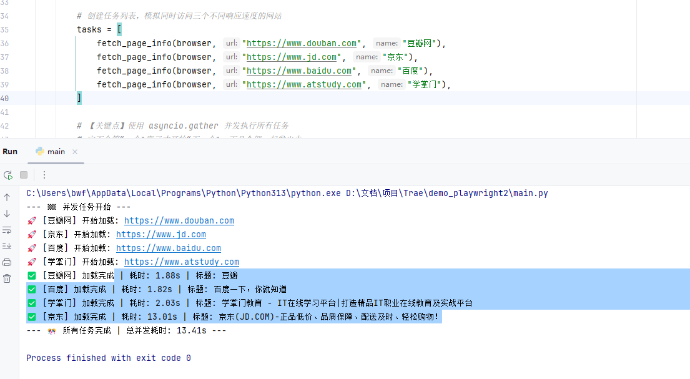

# Playwright 自动化脚本测试基础

> **来源**：`AI+测试：基于 AI 的自主化 Web 探索测试（day1）.pdf`（共 45 页）


## 一、自动化脚本测试（Automated Script-based Testing）

### 1.1 定义

自动化脚本测试就是把测试人员手动操作的步骤（比如点击按钮、输入内容、验证结果），用代码/工具写成可重复执行的脚本，让电脑自动完成测试，核心解决「重复测试效率低、回归测试成本高、人工操作易出错」的问题。

### 1.2 主流技术栈

| 技术栈类型     | 代表工具/框架                | 核心特点（优势 + 劣势）                                                    | 适用场景       |
| --------- | ---------------------- | ---------------------------------------------------------------- | ---------- |
| Web 自动化   | Playwright（微软）         | ✅ 跨浏览器（Chrome/Firefox/Edge）、API简洁、内置等待、支持录制<br>❌ 生态比 Selenium 稍新 | 企业级 Web 应用 |
| Web 自动化   | Selenium（老牌）           | ✅ 生态成熟、社区资源多、支持多语言<br>❌ 需手动处理等待、元素定位易失效                          | 传统 Web 项目  |
| Web 自动化   | Cypress（前端友好）          | ✅ 前端一体化、实时重载、自带断言<br>❌ 仅支持 Chrome 系浏览器、不支持多标签                    | 前端项目（SPA）  |
| 接口自动化     | Postman（低代码）           | ✅ 可视化操作、支持集合管理、一键生成脚本<br>❌ 复杂逻辑需写脚本、批量执行弱                        | 接口调试       |
| 接口自动化     | JMeter（性能+接口）          | ✅ 支持高并发、性能测试+接口测试一体<br>❌ 脚本化能力弱、界面较老旧                            | 接口性能       |
| 接口自动化     | Requests（Python）       | ✅ 代码灵活、定制化强、适配复杂业务逻辑<br>❌ 需懂 Python 基础                           | 企业级复杂接口    |
| 移动端自动化    | Appium（跨平台）            | ✅ 支持 iOS/Android、多语言、兼容原生/混合应用<br>❌ 环境配置复杂、稳定性一般                 | 跨平台 App    |
| 移动端自动化    | Airtest（网易）            | ✅ 图像识别、零代码录制、新手友好<br>❌ 复杂场景易识别失败                                 | 移动端 UI 入门  |
| AI 增强型自动化 | LangChain + Playwright | ✅ AI 生成测试脚本、自动修复脚本、智能断言<br>❌ 需懂 LLM 基础、依赖 AI 模型                  | 前沿探索       |
| AI 增强型自动化 | 扣子（Coze）+ VLM          | ✅ 零代码、上传 UI 图生成脚本、可视化编排<br>❌ 定制化弱、依赖平台、发挥不稳定                     | 新手/非技术落地   |


## 二、Python & Playwright 自动化脚本测试

### 2.1 Playwright 概述

Playwright 是由微软开发的一款开源自动化测试工具，主要用于网页（Web）和跨浏览器的自动化操作，支持模拟用户在浏览器中的各种行为（如点击、输入、导航等），广泛应用于前端测试、UI 自动化、网页数据爬取、用户行为模拟等场景。

**核心定位与目标**：解决现代 Web 应用的自动化难题，尤其针对单页应用（SPA）、动态内容加载、跨浏览器兼容性等复杂场景，提供更稳定、更简洁的自动化方案。

**主要特性**：

1. **跨浏览器支持**：原生支持 Chromium（Chrome/Edge）、Firefox、WebKit（Safari）三大浏览器引擎，无需额外配置即可实现跨浏览器自动化，且保证行为一致性。

2. **跨平台兼容**：可在 Windows、macOS、Linux 系统运行，甚至支持无头模式（无界面运行，适合服务器环境）和有头模式（可视化操作）。

3. **强大的自动化能力**：
   - 支持所有现代 Web 特性：处理单页应用（SPA）的路由跳转、Shadow DOM、iframe 嵌套、动态加载内容等
   - 自动等待机制：无需手动添加 sleep 或等待条件，Playwright 会自动等待元素可交互后再执行操作（如点击、输入），大幅减少不稳定因素
   - 网络控制：可拦截请求、模拟网络状态（如弱网、离线）、修改响应等
   - 多上下文隔离：同一浏览器实例中可创建多个独立的上下文（类似隐私窗口），实现无状态测试，避免会话污染

4. **多语言支持**：提供 Python、JavaScript/TypeScript、Java、C# 四种主流编程语言的 API，开发者可使用熟悉的语言编写自动化脚本。

5. **便捷的辅助工具**：
   - **Codegen（代码生成）** ：通过录制用户在浏览器中的操作，自动生成对应的自动化代码（支持多语言），降低入门门槛
   - **Trace Viewer**：记录自动化过程的详细轨迹（包括截图、视频、网络请求等），便于调试失败用例

**与其他工具的差异**：相比传统自动化工具（如 Selenium），Playwright 更注重“现代 Web 应用”的自动化体验：

- 原生支持异步操作（尤其适合 JavaScript/TypeScript），API 设计更简洁
- 内置更多高级功能（如网络拦截、上下文隔离），无需依赖第三方插件
- 对浏览器的控制更底层（基于浏览器原生协议），稳定性和执行效率更高

**典型用途**：

- 前端自动化测试：验证网页功能、交互逻辑、兼容性（跨浏览器/设备）
- 网页数据爬取：模拟用户操作获取动态加载的内容（如 JavaScript 渲染的数据）
- 用户行为模拟：测试性能、监控页面状态、自动化重复性操作（如表单提交）

**总结**：Playwright 是一款为现代 Web 应用设计的“全能型”自动化工具，凭借简洁的 API、强大的兼容性和稳定性，成为前端测试与自动化领域的热门选择。


### 2.2 安装

打开终端（命令提示符/终端），进行安装：

```bash
# 基于 Python 3.7+

# 安装 Playwright 的 Python 包
pip install playwright pytest-playwright

# 如果需要升级到最新版本，否则跳过
# pip install --upgrade playwright

# 安装浏览器驱动，全部安装
playwright install

# python -m playwright install  # Python 环境变量缺失、路径找不到的情况，可以用这个命令

# 要选择性安装个别浏览器驱动，否则跳过
# playwright install chromium         # 仅安装 Chromium
# playwright install chromium firefox # 安装 Chromium、Firefox
```


### 2.3 编写与运行脚本

#### 2.3.1 简单示例：打开百度，搜索“Playwright”并截图

```python
# 简单示例：打开百度，搜索“Playwright”并截图

# 导入同步 API
from playwright.sync_api import sync_playwright

# 启动 Playwright 实例（上下文管理器自动处理启动和关闭）
with sync_playwright() as p:
    # 1. 启动浏览器（可选参数：headless=False 显示浏览器界面，方便调试）
    browser = p.chromium.launch(headless=False)  # 用 Chromium；也可替换为 p.firefox 或 p.webkit

    # 2. 创建新页面（类似浏览器的新标签页）
    page = browser.new_page()

    # 3. 导航到百度首页
    page.goto("https://www.baidu.com")

    # 4. 操作页面：在搜索框输入内容，点击搜索按钮
    # 通过 ID 定位搜索框（id="chat-textarea" 是稳定标识）
    search_box = page.locator("#chat-textarea")  # CSS 选择器：# 表示 ID
    # search_box = page.locator("textarea.chat-input-textarea")  # 另一种定位输入框的方式
    search_box.fill("Playwright")  # 输入内容

    # 定位搜索按钮（通过文本“百度一下”），点击
    page.get_by_role("button", name="百度一下").click()

    # 5. 等待页面加载完成（Playwright 会自动等待，但可手动加延迟看效果）
    page.wait_for_timeout(5000)  # 等待 5 秒（单位：毫秒）

    # 6. 截图保存结果页面
    page.screenshot(path="baidu_search_result.png")
    print("截图已保存为 baidu_search_result.png")

    # 7. 关闭浏览器（上下文管理器会自动关闭，此处可省略，但显式关闭更规范）
    browser.close()
```

**核心流程**：启动 Playwright → 启动浏览器 → 创建页面 → 操作页面（导航、输入、点击等） → 关闭资源




#### 2.3.2 关键概念详解

##### 1. 浏览器启动参数

`launch()` 方法可配置浏览器启动选项，常用参数：

- `headless=False`：显示浏览器界面（默认 True，无头模式，适合服务器运行）
- `slow_mo=1000`：每个操作延迟 1000 毫秒（慢动作，方便观察）
- `args=["--start-maximized"]`：启动时最大化窗口（Chromium 特有参数）

```python
browser = p.chromium.launch(
    headless=False,
    slow_mo=500,   # 每个操作慢动作 500ms
    args=["--start-maximized"]
)
```

##### 2. Browser、Context 和 Page 的概念

**（1）Browser**：代表一个浏览器实例，Playwright 支持多个浏览器（Chromium、Firefox、WebKit），每个浏览器实例都可以独立运行多个上下文和页面。

```python
browser = p.chromium.launch(headless=False)
```

**（2）Context**：代表一个独立的浏览器上下文（类似隐身窗口），每个 Context 拥有独立的 Cookie、缓存和会话状态，实现测试用例间的完全隔离。

```python
context = browser.new_context()
```

**（3）Page**：代表浏览器中的一个标签页（Tab），每个上下文可以包含多个页面，页面可以进行导航、交互、截图等操作。

```python
page = context.new_page()
# 或者不要 Context
# page = browser.new_page()
```

##### 3. 元素定位（核心）

Playwright 提供多种定位元素的方法，推荐优先使用语义化定位（更稳定）：

| 方法                   | 用途                                 | 示例                                      |
| ---------------------- | ------------------------------------ | ----------------------------------------- |
| `get_by_role()`        | 通过元素角色（如按钮、输入框）定位   | `page.get_by_role("button", name="登录")` |
| `get_by_text()`        | 通过文本内容定位                     | `page.get_by_text("忘记密码")`            |
| `get_by_placeholder()` | 通过输入框占位文本定位               | `page.get_by_placeholder("请输入用户名")` |
| `get_by_label()`       | 通过关联的标签文本定位（如表单元素） | `page.get_by_label("用户名")`             |
| `locator()`            | 通用定位（支持 CSS、XPath 等）       | `page.locator("#username")`               |

##### 4. 常用页面交互

**输入文本**：`fill("内容")`（自动清空原有内容）

```python
page.get_by_placeholder("用户名").fill("test_user")
```

**单选框 & 多选框**：

```python
# Check the checkbox
page.get_by_label('I agree to the terms above').check()

# Select the radio button
page.get_by_label('XL').check()
```

**选择框（下拉框）** ：

```python
# Single selection matching the value or label
page.get_by_label('Choose a color').select_option('blue')

# Single selection matching the label
page.get_by_label('Choose a color').select_option(label='Blue')

# Multiple selected items
page.get_by_label('Choose multiple colors').select_option(['red', 'green', 'blue'])
```

**综合示例**：

```python
from playwright.sync_api import sync_playwright

with sync_playwright() as p:
    browser = p.chromium.launch(headless=False, slow_mo=200)
    page = browser.new_page()
    page.goto("https://vanrevwk.mule.page/")

    user = page.get_by_placeholder("请输入用户名")
    user.fill("zhangsan")

    bio = page.get_by_label("个人简介")
    bio.fill("zhangsan 的个人简介 12233")

    page.get_by_text("女").click()
    page.get_by_text("微信支付").click()

    music = page.get_by_label("音乐")
    music.check()

    read = page.get_by_label("阅读")
    read.check()

    city = page.get_by_label("所在城市")
    city.select_option(label="南京")

    xueli = page.get_by_label("学历")
    xueli.select_option(label="本科")

    jineng = page.get_by_label("技能标签")
    jineng.select_option(label=['Swift', 'Go', 'Rust'])

    page.wait_for_timeout(5000)
    browser.close()
```

**键盘输入模拟**：

```python
page.get_by_text("Submit").press("Enter")

# Dispatch Control+Right
page.get_by_role("textbox").press("Control+ArrowRight")

# Press $ sign on keyboard
page.get_by_role("textbox").press("$")
```

可输入的键：`Backquote`, `Minus`, `Equal`, `Backslash`, `Backspace`, `Tab`, `Delete`, `Escape`, `ArrowDown`, `End`, `Enter`, `Home`, `Insert`, `PageDown`, `PageUp`, `ArrowRight`, `ArrowUp`, `F1 - F12`, `Digit0 - Digit9`, `KeyA - KeyZ` 等。

**键盘输入示例**：

```python
# 简单的键盘输入示例
from playwright.sync_api import sync_playwright

def run_test():
    with sync_playwright() as p:
        browser = p.chromium.launch(
            headless=False,
            slow_mo=1500
        )
        context = browser.new_context()
        page = context.new_page()
        page.goto("https://c3vlzgxj.mule.page/")

        user_box = page.get_by_placeholder("请输入用户名")
        user_box.press("KeyA")
        user_box.press("KeyB")
        user_box.press("KeyC")
        user_box.press("ArrowLeft")
        user_box.press("Backspace")
        user_box.press("KeyD")
        user_box.press("ArrowRight")
        user_box.press("$")
        user_box.press("Tab")

        pwd_box = page.get_by_placeholder("请输入密码")
        pwd_box.press("KeyA")
        pwd_box.press("KeyB")
        pwd_box.press("KeyC")

        page.close()
        context.close()
        browser.close()

if __name__ == "__main__":
    run_test()
```

**获取文本**：`text_content()`

```python
result = page.get_by_text("登录成功").text_content()
print(result)  # 输出：登录成功
```

**获取属性**：`get_attribute("属性名")`

```python
link_href = page.locator("a").get_attribute("href")
```

**获取属性示例**：

```python
from playwright.sync_api import sync_playwright

def run_test():
    with sync_playwright() as p:
        browser = p.chromium.launch(
            headless=False,
            slow_mo=1500
        )
        context = browser.new_context()
        page = context.new_page()
        page.goto("https://c3vlzgxj.mule.page/")

        btn = page.get_by_role("button", name="登 录")
        print(btn.text_content())
        print(btn.inner_text())
        print(btn.get_attribute("class"))
        print(btn.get_attribute("onclick"))
        print(btn.get_attribute("style"))

        page.wait_for_timeout(5000)
        page.close()
        context.close()
        browser.close()

if __name__ == "__main__":
    run_test()
```

**页面导航与刷新**：

```python
page.goto("https://example.com")   # 跳转到指定 URL
page.reload()                      # 刷新页面
page.go_back()                     # 后退
page.go_forward()                  # 前进
```

**基础示例：登录操作**：

```python
from playwright.sync_api import sync_playwright

def run_test():
    with sync_playwright() as p:
        browser = p.chromium.launch(headless=False)
        page = browser.new_page()
        page.goto("https://c3vlzgxj.mule.page/")

        page.get_by_placeholder("请输入用户名").fill("admin")
        page.get_by_placeholder("请输入密码").fill("admin123")
        page.locator("#loginRole").select_option("运营")
        page.get_by_role("button", name="登 录").click()

        page.wait_for_timeout(3000)
        time = page.locator("#topbarTime").text_content()
        role = page.locator("#topbarRole").text_content()
        print("登录成功，时间：" + time + "   角色：" + role)

        browser.close()

if __name__ == "__main__":
    run_test()
```



##### 5. 等待机制

Playwright 自带智能等待（操作前自动等待元素就绪），无需手动加 sleep，但复杂场景可手动控制：

- `page.wait_for_timeout(1000)`：强制等待 1 秒（调试用）
- `page.wait_for_url("目标URL")`：等待页面跳转到指定 URL
- `page.wait_for_selector("CSS 选择器")`：等待元素出现
- 元素自己也可以调用等待方法

```python
# 等待结果加载（等待结果区域出现）
result_area = page.locator("#content_left")  # 百度结果区域的固定 ID
result_area.wait_for()  # 等待元素可见
```

**示例**：

```python
from playwright.sync_api import sync_playwright

def run_test():
    with sync_playwright() as p:
        browser = p.chromium.launch(headless=False)
        page = browser.new_page()

        page.goto("https://c3vlzgxj.mule.page/")
        page.wait_for_timeout(500)

        page.goto("https://www.example.com")
        page.wait_for_url("https://www.example.com")
        page.wait_for_selector("a")
        page.wait_for_timeout(1500)

        browser.close()

if __name__ == "__main__":
    run_test()
```

##### 6. 断言（Assertions）

传统的 Python 断言（如 `assert a == b`）是瞬时的。如果页面还没加载完就执行，测试就会直接失败。

Playwright 的 `expect` 断言具备**自动重试机制（Retries）** ：

- 它会反复检查元素的状态（默认 5 秒内）
- 只要在规定时间内满足条件，断言就通过

**简单示例**：检查页面是否跳转到了正确的地址，或者标题是否正确。

```python
from playwright.sync_api import expect

# 检查 URL 是否包含特定的字符串
expect(page).to_have_url("https://example.com/dashboard")

# 检查页面标题（支持正则表达式）
expect(page).to_have_title(re.compile(r"后台管理"))
```

**示例**：

```python
from playwright.sync_api import sync_playwright, expect

def run_test():
    with sync_playwright() as p:
        browser = p.chromium.launch(headless=False)
        page = browser.new_page()

        page.goto("https://c3vlzgxj.mule.page/")
        page.wait_for_timeout(500)

        expect(page).to_have_url("https://c3vlzgxj.mule.page/")
        expect(page).to_have_title("某电商平台商户端 3.0")
        print("断言成功。")

        browser.close()

if __name__ == "__main__":
    run_test()
```

**常用元素断言**：

```python
locator = page.get_by_role("button", name="提交")

# 检查元素是否可见 (Visible)
expect(locator).to_be_visible()

# 检查按钮是否为禁用状态 (Disabled)
expect(locator).to_be_disabled()

# 检查复选框是否被选中 (Checked)
expect(page.locator("#agree-terms")).to_be_checked()
```

**检查文本、值和属性**：

```python
# 检查元素是否包含特定文本
expect(page.locator(".welcome-msg")).to_contain_text("欢迎回来")

# 检查输入框中的当前值 (Exact Match)
expect(page.get_by_placeholder("请输入用户名")).to_have_value("admin")

# 检查元素是否具有某个 CSS 类（常用于验证 UI 状态）
expect(page.locator("#submit-btn")).to_have_class(re.compile(r"btn-primary"))
```

**示例**：

```python
from playwright.sync_api import sync_playwright, expect

def run_test():
    with sync_playwright() as p:
        browser = p.chromium.launch(headless=False)
        page = browser.new_page()

        page.goto("https://c3vlzgxj.mule.page/")

        page.get_by_placeholder("请输入用户名").fill("admin")
        page.get_by_placeholder("请输入密码").fill("admin123")
        page.locator("#loginRole").select_option("运营")
        page.get_by_role("button", name="登 录").click()

        page.wait_for_timeout(3000)

        time = page.locator("#topbarTime").text_content()
        role = page.locator("#topbarRole").text_content()
        print("登录成功，时间：" + time + "   角色：" + role)

        expect(page).to_have_url("https://c3vlzgxj.mule.page/")
        expect(page).to_have_title("某电商平台商户端 3.0")
        expect(page.locator("#topbarTime")).to_contain_text("2021")  # 断言故意失败
        expect(page.locator("#topbarRole")).to_contain_text("运营")
        expect(page.locator(".welcome-banner")).to_contain_text("今天是工作的好日子")

        browser.close()

if __name__ == "__main__":
    run_test()
```



**反向断言（Not）** ：

```python
# 确认加载图标已经消失
expect(page.locator("#loading-spinner")).not_to_be_visible()

# 确认按钮不再是禁用状态
expect(page.get_by_role("button")).not_to_be_disabled()
```

**软断言（Soft Assertions）** ：

- 普通断言：一旦失败，脚本立即停止
- 软断言：即使失败，脚本也会继续执行后续步骤，但在测试结束时会将该用例标记为失败

适用场景：一个页面有多个无关紧要的检查点（如页脚文字、图标颜色），你不希望因为一个小图标没加载出来就导致整个长流程测试中断。

Node.js 版本 Playwright 可以使用 `expect.soft()`（新版本特性）。Python 版本需要自己封装。

**软断言实现示例**：

```python
from playwright.sync_api import sync_playwright, expect

class SoftAssert:
    def __init__(self):
        self.errors = []

    def check(self, func, *args, **kwargs):
        """核心逻辑：尝试执行断言，失败则记录错误但不中断"""
        try:
            func(*args, **kwargs)
        except AssertionError as e:
            error_msg = str(e).split('\n')[0]
            self.errors.append(error_msg)
            print(f"⚠️ [软断言失败]: {error_msg}")

    def report(self):
        """最后统一收尾"""
        if self.errors:
            print(f"\n❌ 测试完成，共发现 {len(self.errors)} 处不符合预期:")
            for i, err in enumerate(self.errors, 1):
                print(f"  {i}. {err}")
        else:
            print("\n✅ 所有断言通过！")

def run_test():
    with sync_playwright() as p:
        browser = p.chromium.launch(headless=False)
        page = browser.new_page()

        sa = SoftAssert()

        page.goto("https://c3vlzgxj.mule.page/")
        page.get_by_placeholder("请输入用户名").fill("admin")
        # ... 后续操作与软断言检查
```



##### 7. 排查错误原因：Trace Viewer

**示例**：

```python
from playwright.sync_api import sync_playwright, expect

def run_test():
    with sync_playwright() as p:
        browser = p.chromium.launch(headless=False)
        context = browser.new_context()

        # 启动追踪功能
        context.tracing.start(screenshots=True, snapshots=True, sources=True)

        page = context.new_page()

        try:
            page.goto("https://c3vlzgxj.mule.page/")
            page.get_by_placeholder("请输入用户名").fill("admin")
            page.get_by_placeholder("请输入密码").fill("admin123")
            page.locator("#loginRole").select_option("运营")

            btn = page.get_by_role("button", name="登 录")
            expect(btn).not_to_be_disabled()
            expect(btn).to_be_visible()
            btn.click()

            page.wait_for_timeout(3000)

            time = page.locator("#topbarTime").text_content()
            role = page.locator("#topbarRole").text_content()
            print("登录成功，时间：" + time + "   角色：" + role)

            expect(page).to_have_url("https://c3vlzgxj.mule.page/")
            expect(page).to_have_title("某电商平台商户端 3.0")
            expect(page.locator("#topbarTime")).to_contain_text("2027")  # 故意让断言不成功
            expect(page.locator("#topbarTime")).to_contain_text("2026")

        finally:
            # 停止追踪并保存到文件
            context.tracing.stop(path="trace.zip")
            browser.close()

if __name__ == "__main__":
    run_test()
```

**打开 Trace**（运行完脚本后，终端输入）：

```bash
playwright show-trace trace.zip
```



**Trace 示例 2**：

```python
from playwright.sync_api import sync_playwright, expect

def run_test():
    with sync_playwright() as p:
        browser = p.chromium.launch(headless=False)
        context = browser.new_context()

        context.tracing.start(screenshots=True, snapshots=True, sources=True)

        page = context.new_page()

        try:
            page.goto("https://www.baidu.com")

            expect(page).to_have_url("https://www.baidu.com/")

            search_button = page.get_by_role("button", name="百度两下")
            expect(search_button).to_be_visible()

        finally:
            context.tracing.stop(path="baidu_trace.zip")
            browser.close()

if __name__ == "__main__":
    run_test()
```

##### 8. 截图功能

```python
# 浏览器窗口截图
page.screenshot(path="screenshot.png")

# Full page screenshots 完整页面截图
page.screenshot(path="screenshot.png", full_page=True)

# Element screenshot 单个元素截图
page.locator(".header").screenshot(path="screenshot.png")
```

**示例**：

```python
from playwright.sync_api import sync_playwright

def run_test():
    with sync_playwright() as p:
        browser = p.chromium.launch(headless=False)
        page = browser.new_page()

        page.goto("https://www.baidu.com/")

        search_box = page.locator("#chat-textarea")
        search_box.fill("北京")
        page.get_by_role("button", name="百度一下").click()

        page.wait_for_timeout(2000)

        page.screenshot(path="./baidu.png")
        page.screenshot(path="./baidu-full-page.png", full_page=True)
        search_box.screenshot(path="./search_box.png")
        page.get_by_role("button", name="百度一下").screenshot(path="./button.png")

if __name__ == "__main__":
    run_test()
```



##### 9. 录视频功能

```python
import os
from playwright.sync_api import sync_playwright

VIDEO_DIR = "./playwright_videos"

def run_test():
    os.makedirs(VIDEO_DIR, exist_ok=True)

    with sync_playwright() as p:
        browser = p.chromium.launch(headless=False, slow_mo=1000)

        context = browser.new_context(
            record_video_dir=VIDEO_DIR,
            record_video_size={"width": 640, "height": 480},
        )

        page = context.new_page()

        page.goto("https://www.baidu.com/")
        search_box = page.locator("#chat-textarea")
        search_box.fill("北京")
        page.get_by_role("button", name="百度一下").click()
        page.wait_for_timeout(2000)

        page.close()
        context.close()
        browser.close()

        video_path = page.video.path()
        print(f"录制完毕，视频文件：{os.path.join(VIDEO_DIR, video_path)}")

if __name__ == "__main__":
    run_test()
```



##### 10. 同步（Sync）vs 异步（Async）

对于测试初学者，建议从同步模式入手；对于进阶者，介绍异步模式在性能上的优势。

**10.1 同步模式（Sync API）—— 快速入门的首选**

同步模式采用阻塞式调用，代码逻辑从上到下执行，非常符合人类的直觉。

- 特点：使用 `from playwright.sync_api import sync_playwright`
- 适用场景：小型脚本、快速原型开发、对并发要求不高的自动化测试
- 优点：代码简洁，不需要到处写 `await`

```python
from playwright.sync_api import sync_playwright

with sync_playwright() as p:
    browser = p.chromium.launch()
    page = browser.new_page()

    page.goto("https://jd.com")
    print("✅ 1. " + page.title())

    page.goto("https://douban.com")
    print("✅ 2. " + page.title())

    page.goto("https://baidu.com")
    print("✅ 3. " + page.title())

    browser.close()
```



**10.2 异步模式（Async API）—— 高性能与并发的利器**

异步模式基于 Python 的 `asyncio` 库，允许在一个线程中非阻塞地处理多个操作。

- 特点：使用 `from playwright.async_api import async_playwright`
- 适用场景：大规模并发抓取、复杂的 Web 交互、需要集成到 FastAPI 或 Sanic 等异步框架中时
- 优点：性能极高，可以同时操控多个浏览器上下文而不互相阻塞

```python
import asyncio
import time
from playwright.async_api import async_playwright

async def fetch_page_info(browser, url, name):
    context = await browser.new_context()
    page = await context.new_page()

    start_time = time.time()
    print(f"⚠️ [{name}] 开始加载: {url}")

    await page.goto(url)
    title = await page.title()

    end_time = time.time()
    print(f"✅ [{name}] 加载完成 | 耗时: {end_time - start_time:.2f}s | 标题: {title}")

    await context.close()

async def main():
    async with async_playwright() as p:
        browser = await p.chromium.launch(headless=True)

        print("--- ⚠️ 并发任务开始 ---")
        global_start = time.time()

        tasks = [
            fetch_page_info(browser, "https://www.douban.com", "豆瓣网"),
            fetch_page_info(browser, "https://www.jd.com", "京东"),
            # ... 更多任务
        ]

        await asyncio.gather(*tasks)

        print(f"--- ✅ 全部任务完成，总耗时: {time.time() - global_start:.2f}s ---")
        await browser.close()

if __name__ == "__main__":
    asyncio.run(main())
```




## 三、录制生成代码

Playwright 提供 `codegen` 工具，可通过录制用户操作自动生成代码，适合快速编写脚本：

```bash
playwright codegen          # 更推荐这么写
python -m playwright codegen

# 可以先通过 --help 看看有哪些参数
playwright codegen --help
```

常用参数：

- `-o`：指定脚本输出位置
- `-b`：指定浏览器驱动，默认谷歌

**运行示例**：

```bash
playwright codegen -o "./codegen_test02.py"
```

**自动生成的代码示例 1**（录制的完整操作）：

```python
import re
from playwright.sync_api import Playwright, sync_playwright, expect

def run(playwright: Playwright) -> None:
    browser = playwright.chromium.launch(headless=False)
    context = browser.new_context()
    page = context.new_page()

    page.goto("https://c3vlzgxj.mule.page/")
    page.get_by_role("textbox", name="请输入用户名").click()
    page.get_by_role("textbox", name="请输入用户名").fill("admin")
    page.get_by_role("textbox", name="请输入用户名").press("Tab")
    page.get_by_role("textbox", name="请输入密码").fill("admin123")
    page.get_by_role("textbox", name="请输入密码").press("Tab")
    page.locator("#loginRole").select_option("运营")
    page.get_by_role("button", name="登 录").click()

    page.get_by_text("⚙ 商户设置").click()
    page.locator("#setName").click()
    page.locator("#setName").fill("鲜果优选旗舰店22")
    # ... 更多操作
```

**自动生成的代码示例 2**：

```python
import re
from playwright.sync_api import Playwright, sync_playwright, expect

def run(playwright: Playwright) -> None:
    browser = playwright.chromium.launch(headless=False, slow_mo=800)
    context = browser.new_context()
    page = context.new_page()

    page.goto("https://vanrevwk.mule.page/")
    page.get_by_role("textbox", name="用户名").click()
    page.get_by_role("textbox", name="用户名").fill("zhangsan")
    page.get_by_role("textbox", name="电子邮箱").click()
    page.get_by_role("textbox", name="电子邮箱").fill("zhansan@123.com")
    page.get_by_role("textbox", name="手机号码").click()
    page.get_by_role("textbox", name="手机号码").fill("13800000")
    # ... 更多操作
```


## 四、自动化测试（Automated Testing）

**区别**：自动化脚本测试侧重点在于脚本，自动化测试侧重点在于自动化。

传统意义上的自动化测试是指通过预编写的脚本（自动化脚本测试），利用工具（如 Selenium、Playwright）模拟人工在软件上的操作，并自动校验预期结果（Assertion）的过程。其本质是“机械复现”。


---

*共 45 页，提取图片 9 张。*
