# AI 智能体执行平台与全场景 Agent

> **来源**：`AI+测试：基于 AI 的自主化 Web 探索测试（day4）.pdf`（共 28 页）


## 课程导入

### 1. “为什么学”

这是当前测试领域最前沿的技术方向，也是头部企业招聘的热门关注点，掌握这个即掌握测试自动化的未来！

- 测试工程师具备 AI 能力，更加有竞争力
- 没有考试，没有作业，全靠求知欲

### 2. “学什么”

- **理论**：AI 智能体相关的自动化测试知识、概念
- **实操**：跟着一起操作

### 3. AI 编辑器

- [TRAE - The Real AI Engineer](https://www.trae.ai)
- [Cursor - 用 AI 编码的最佳方式](https://www.cursor.com)
- [通义灵码 - 你的智能编码助手 - 阿里云](https://tongyi.aliyun.com/lingma)


## 一、主流大模型介绍

### 1.1 国际公司

| 公司                   | 门派标签     | 核心产品                        | 关键故事                                                     |
| ---------------------- | ------------ | ------------------------------- | ------------------------------------------------------------ |
| **OpenAI**             | 闭源派盟主   | GPT 系列、ChatGPT、SORA、DALL·E | Google 骨干带 AGI 理想出走创立，ChatGPT 引爆热潮；SORA 开启视频 AI 时代 |
| **Anthropic**          | 安全派代表   | Claude 系列                     | OpenAI 前员工因安全理念分家，主打“宪法 AI”                   |
| **xAI**                | 自由派黑马   | Grok 系列                       | 马斯克为对抗 OpenAI 创立，绑定 X 平台走“自由风格”            |
| **Google（DeepMind）** | 技术派元老   | Alpha 系列、Gemini              | AlphaGo 封神，是 OpenAI 的“技术母体”，后合并 DeepMind 发力多模态 |
| **Meta**               | 开源派领头羊 | Llama 系列、Imagine AI          | 开源模型打破闭源垄断，普惠全球开发者                         |

### 1.2 国内公司

| 公司         | 大模型        | 优势                                                         | 劣势                                                 |
| ------------ | ------------- | ------------------------------------------------------------ | ---------------------------------------------------- |
| **字节跳动** | 豆包          | 中文处理能力强，针对中文语境优化；长文本处理能力优秀，支持约 128K 上下文；实用功能丰富，可直接上传 PDF/Word/Excel 等文件提取关键信息；多模态能力突出，支持文本、图像、语音等多种模态；实时数据处理能力强，具备联网功能 | 专业领域深度不足                                     |
| **阿里巴巴** | 千问大模型    | 中英文文本生成能力稳定，结构清晰；知识检索和搜索能力强；复杂推理能力较强，在 GPQA 中达 65.2% 准确率；支持文本、图像、音频跨模态任务 | 推理速度相对 Kimi 较慢                               |
| **深度求索** | DeepSeek-V3.2 | 写代码能力强，采用 MLA 技术，相同参数量下实现更高并行计算效率；长上下文召回效果好 | 长文本能力有待提升                                   |
| **深度求索** | DeepSeek-R1   | 针对复杂逻辑推理任务优化，低延迟，响应速度快；支持高难度任务（代码生成、学术论文分析）；用户可看到模型完整的思维过程 | 资源消耗较大                                         |
| **百度**     | 文心一言      | 多任务处理能力强，在文本生成、摘要生成、翻译等多任务场景中表现优异；智能语音交互在智能家居控制和语音导航场景中表现出色 | 专业领域理解能力和长文本处理有待提升                 |
| **华为**     | 盘古大模型    | 采用“快慢思考”双系统，简单任务快速响应，复杂问题深度推理；硬件深度优化，形成“芯片-框架-模型”全链路闭环，与国产算力生态绑定紧密 | 未公开                                               |
| **腾讯**     | 混元大模型    | 在 2025 世界人工智能大会期间开源混元 3D 世界模型 1.0，支持文本或图片输入生成 360° 全景场景；中文提示词遵循度达 92%，超越同类模型 | 起步相对较晚                                         |
| **智谱**     | GLM 大模型    | 上下文窗口长，GLM-4.6 可扩展至 200K；代码推理与 Agent 调用能力显著提升；写作风格更拟人 | 图示理解能力偏弱                                     |
| **月之暗面** | Kimi          | 长文本处理能力强，可单次输入 200 万字长文本；情感分析与文本分类能力强，能精准捕捉情感细节；多模态推理能力强，支持文本和图像联合训练；性价比高 | 随着文本长度增加，可能导致复杂任务处理中出现信息遗漏 |


## 二、AI 智能体（Agent）自动化测试执行平台

AI 智能体自动化测试执行平台是测试领域从“自动化”向“自主化”跨越的核心产物。它不仅仅是运行代码的容器，更是拥有“大脑”的测试执行端。

**AI 智能体（Agent）= LLM（大模型、大脑）+ Memory（记忆）+ Tool（工具）+ Planning（规划）**

### 2.1 定义

AI 智能体自动化测试执行平台是一种基于大语言模型（LLM）和多模态视觉模型（VLM）的集成环境。它将传统的测试驱动（如 Playwright/Selenium）与 AI 的推理能力结合，形成一个能够**感知（Perceive）** 、**思考（Think）** 并**行动（Act）** 的闭环系统。

**核心逻辑**：

1. **感知**：通过 DOM 树解析或 OCR/视觉识别，理解当前页面状态
2. **推理**：根据人类下达的模糊指令（如“购买最便宜的手机”），拆解成具体的点击、输入步骤
3. **执行**：驱动浏览器完成操作，并根据反馈实时纠错（如处理意外弹窗）

### 2.2 核心特征：与传统平台的区别

| 特性     | 传统自动化平台                 | AI 智能体执行平台            |
| -------- | ------------------------------ | ---------------------------- |
| 驱动源   | 预编写的代码脚本（Code-based） | 自然语言意图（Intent-based） |
| 定位机制 | 静态 Selector（ID/XPath）      | 动态语义与视觉特征           |
| 容错性   | 脆弱（UI 变动即报错）          | 极强（具备自愈与绕障能力）   |
| 测试路径 | 固定且单一                     | 自主探索与非线性遍历         |
| 价值核心 | 验证已知功能的正确性           | 发现未知路径下的逻辑漏洞     |

### 2.3 平台分类

目前的“平台”分为两类：**原生 Agent 平台**（全新架构）和**传统大厂升级版**（集成 AI 能力）。

| 势力类别                            | 行业定位   | 核心逻辑                                                     | 核心优势                                               |
| ----------------------------------- | ---------- | ------------------------------------------------------------ | ------------------------------------------------------ |
| **原生 Agent 平台（AI-Native）**    | 未来的主力 | 意图驱动：完全脱离脚本，Agent 实时观察 UI 并动态生成操作路径 | 零维护：UI 怎么改都不怕；自适应：能处理非线性逻辑      |
| **传统大厂升级版（AI-Integrated）** | 当下的饭碗 | 脚本 + AI 补丁：在 Playwright 等传统脚本上增加 AI 自愈和 NLP 生成能力 | 稳健性：符合企业合规要求；确定性：执行结果 100% 可预测 |

### 2.4 当前热门平台

| 平台名称             | 核心技术点                                                   | 典型应用场景                                                 | 平台属性  | 平台类别           | 官网地址                                                     |
| -------------------- | ------------------------------------------------------------ | ------------------------------------------------------------ | --------- | ------------------ | ------------------------------------------------------------ |
| **Skyvern**          | 视觉驱动 + 多模态推理、跨域流程编排、无 ID 元素自适应定位    | 复杂表单填录、无 ID 网页自动化、跨系统业务流验证、游戏客户端 UI 测试 | 开源/SaaS | 原生 Agent 平台    | [Skyvern](https://www.skyvern.com)                           |
| **Testim / Mabl**    | 机器学习自愈引擎、影子 DOM 精准定位、智能等待与容错机制      | 企业级回归测试、UI 稳定性保障、电商/金融系统高频用例自动化   | 商业 SaaS | 传统工具 AI 化升级 | [Testim](https://www.testim.io) / [Mabl](https://www.mabl.com) |
| **Reflect**          | 无代码测试构建、UI 视觉回归、响应式布局验证                  | 视觉回归对比、AI 脚本智能生成、跨浏览器一致性校验            | 商业 SaaS | 传统工具 AI 化升级 | [Reflect](https://www.reflect.run)                           |
| **LaVague**          | LlamaIndex + 大模型驱动、Python 原生集成、意图识别与脚本转化 | 纯 Python 环境自动化、数据分析师测试、内部系统 UI 自动化     | 开源框架  | 原生 Agent 平台    | [LaVague](https://www.lavague.ai)                            |
| **Katalon（AI 版）** | GPT 驱动脚本生成、全流程测试管理、多引擎协同执行             | 综合性测试管理、团队协作式自动化、跨平台统一测试             | 商业软件  | 传统工具 AI 化升级 | [Katalon](https://www.katalon.com)                           |


## 三、Skyvern：Automate Browser-Based Workflows with AI

- **平台地址**：[Skyvern](https://www.skyvern.com)
- **开源代码**：[GitHub - Skyvern-AI/skyvern](https://github.com/Skyvern-AI/skyvern)

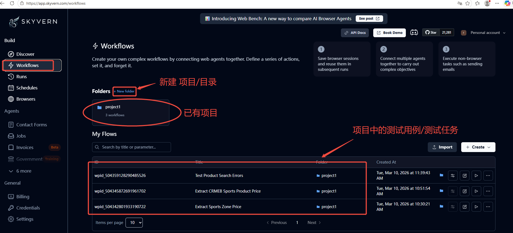

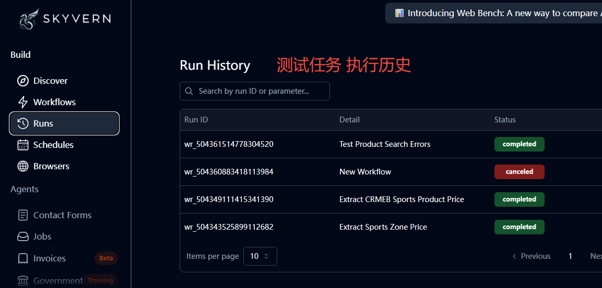

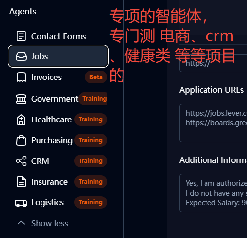

### 3.1 核心测试特性

| 特性                                 | 说明                                                         |
| ------------------------------------ | ------------------------------------------------------------ |
| **语义化断言（Semantic Assertion）** | 不需要写复杂的 `expect(locator).to_be_visible()` 或 `assert()`。可直接下达意图：“检查购物车里的商品价格是否与搜索页一致”，AI 会自主进行数据比对 |
| **视觉自愈（Visual Self-healing）**  | 传统平台最怕 UI 改版。Skyvern 通过多模态视觉（Vision）识别元素，即便前端代码重构，只要“长得像按钮”，测试就不会中断 |
| **黑盒路径探索**                     | 给定一个模糊目标（如“尝试在不登录的情况下购买商品”），它会自主寻找绕过登录的路径 |

### 3.2 Skyvern 与传统自动化平台对比

| 维度     | 传统自动化平台（如 Selenium/Playwright） | Skyvern（AI Agent 平台）           |
| -------- | ---------------------------------------- | ---------------------------------- |
| 驱动核心 | 确定性的脚本逻辑（If/Else）              | 不确定性的推理链（Thought/Action） |
| 定位方式 | DOM 元素（ID/XPath）                     | 视觉特征 + 语义上下文              |
| 维护成本 | 极高（随代码变动而崩溃）                 | 极低（随业务意图而变动）           |
| 测试范围 | 预设路径的回归测试                       | 未知路径的探索测试                 |
| 报错分析 | 抛出代码堆栈错误                         | 提供推理日志（解释为什么没点成功） |

### 3.3 Skyvern 测试实战

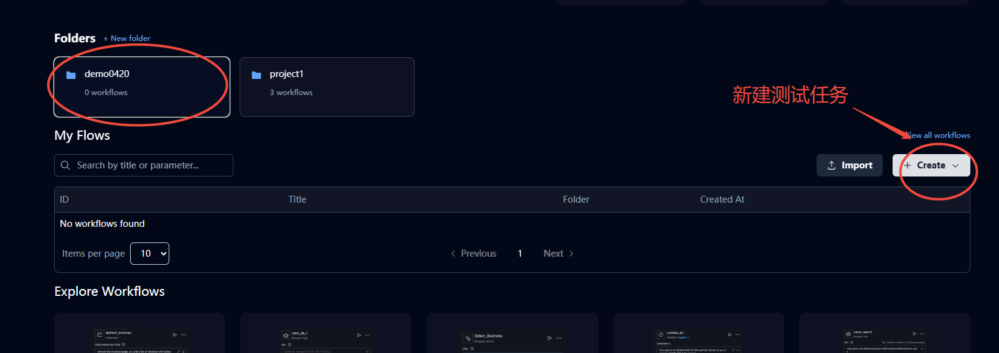

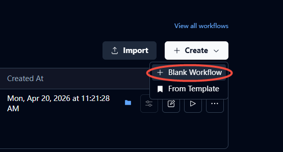

**示例 1：表单填写与提交**

```text
1. 访问 https://vanrevwk.mule.page/
2. 填写“用户名”（张三zhangsan）、“电子邮箱”（zhangsan@123.com）、“密码”（123456）、“手机号码”（13509870987）
3. 点击“提交表单”
4. 总结测试结果，填写表单，提交表单后，结果怎么样。
```

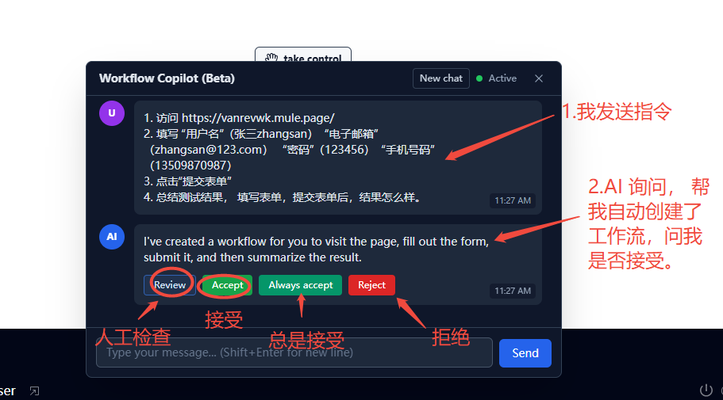

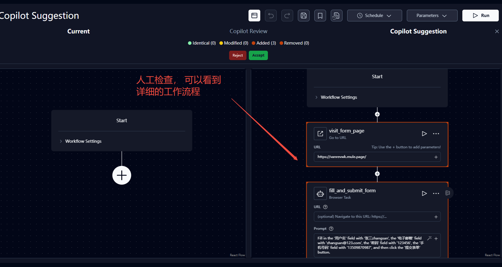

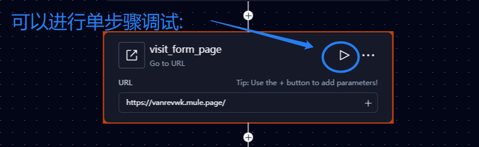

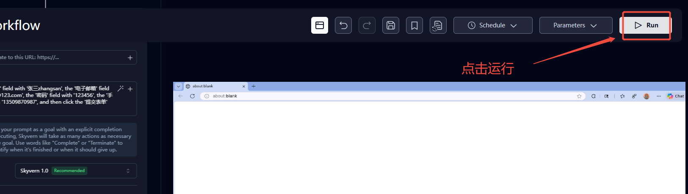

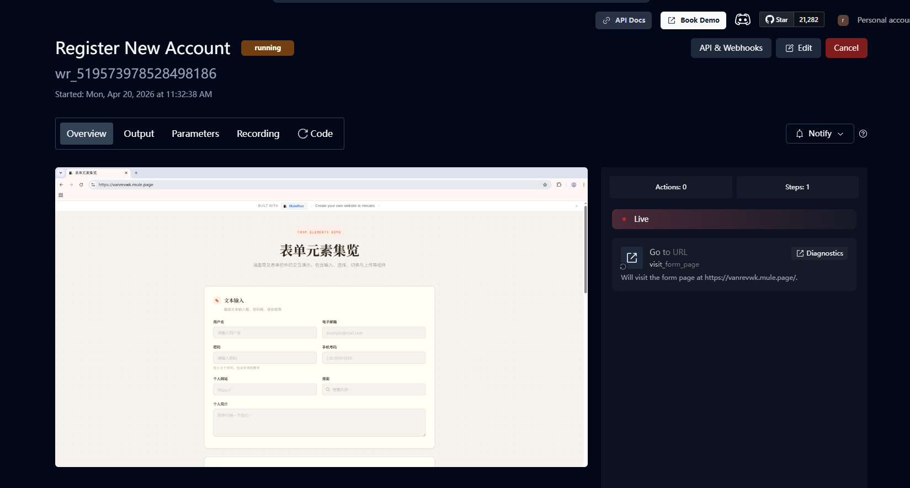

**最终结果**：

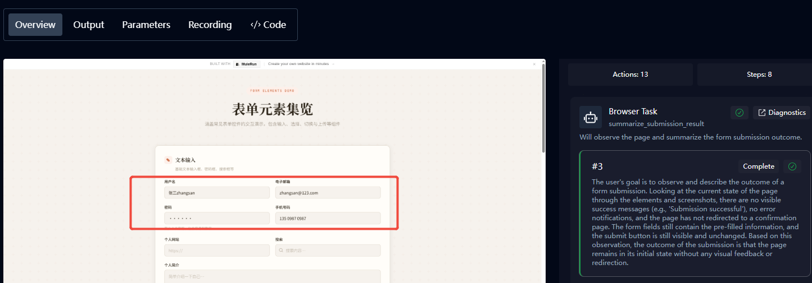

**示例 2：登录与断言（使用 Credentials 模块）**

为了不把密码暴露在指令中，可以在平台中的 Credentials 模块进行配置。

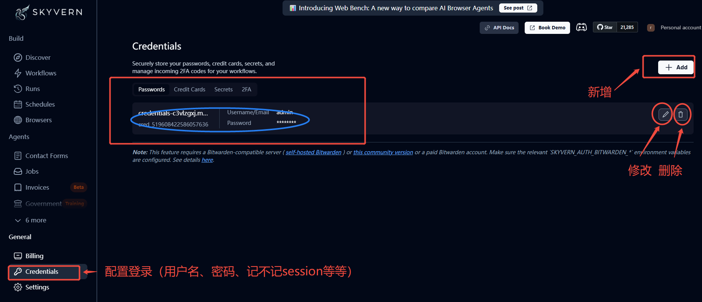

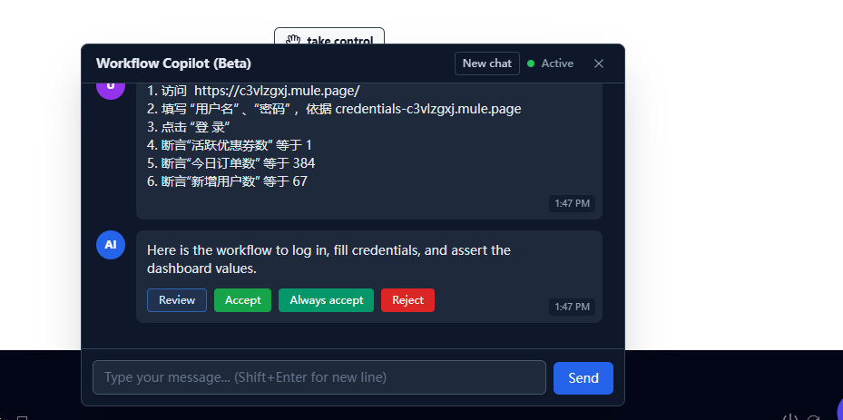

```text
1. 访问 https://c3vlzgxj.mule.page/
2. 填写“用户名”、“密码”，依据 credentials-c3vlzgxj.mule.page
3. 点击“登 录”
4. 断言“活跃优惠券数”等于 1
5. 断言“今日订单数”等于 384
6. 断言“新增用户数”等于 67
```

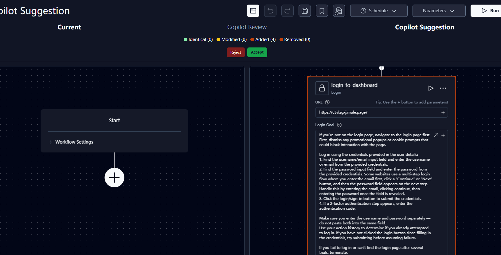

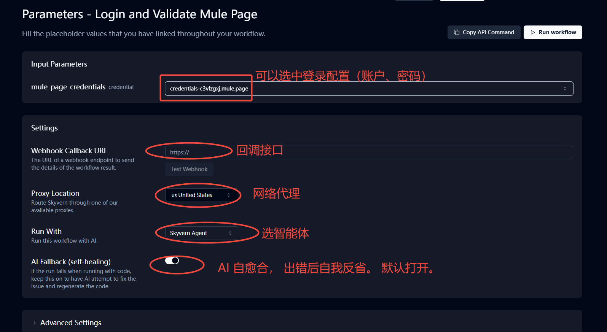

**示例 3：MagniTasks 任务管理应用测试**

MagniTasks 是一个任务管理应用，专门为演示和测试“AI 自动化 Agent”而生的标杆案例。

> 地址：[MagniTasks - Modern Task Management](https://www.magnitasks.com)

```text
1. 访问 https://www.magnitasks.com/tasks
2. 点击“New Task”，新建任务
3. 填写或选择 Title="task0420"，Description="task0420 的描述。"，Priority="High"，Project="Website Redesign"
4. 点 "Save Task" 保存
5. 修改任务，Status="In Progress"
6. 点击 "Update Task" 保存
7. 访问 https://www.magnitasks.com/
8. 断言 Total Tasks = 8，In Progress = 4
```

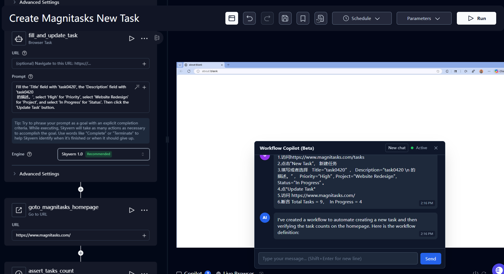

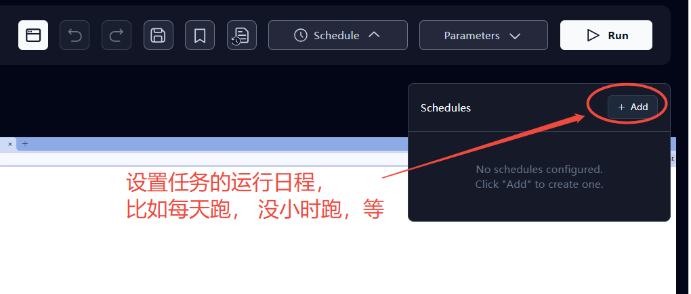

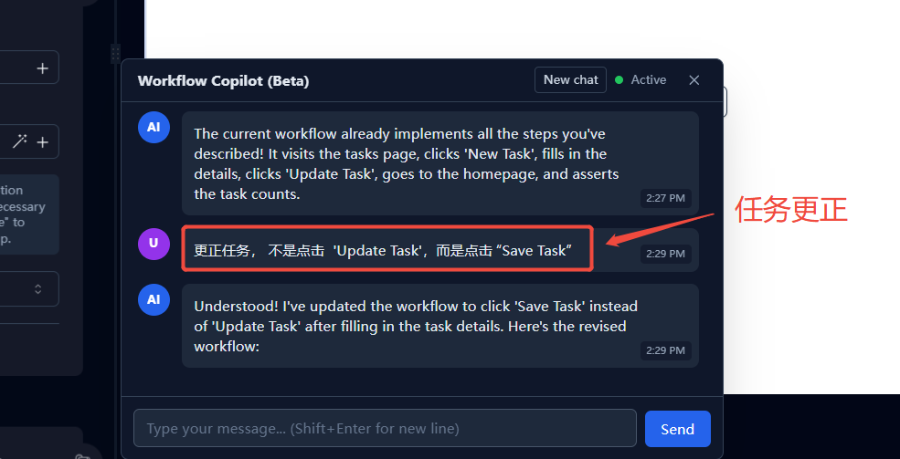

AI 填写内容都没有问题。

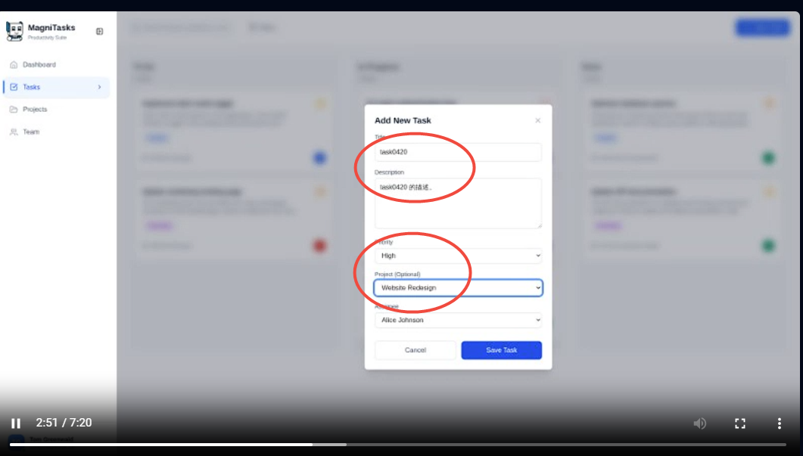

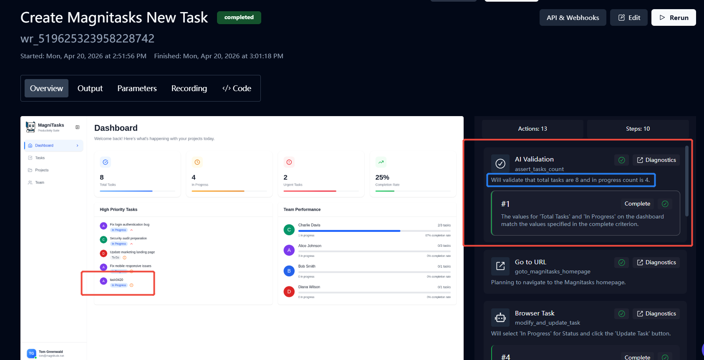


## 四、全场景 AI 智能体

### 4.1 定义

#### 什么是全场景 AI 智能体

**全场景 AI 智能体（AI Agent）** 是以大模型为“大脑”，集成感知、记忆、规划、工具调用、自主执行、反馈优化的完整自治系统。核心是目标驱动、自主闭环、跨场景端到端完成复杂任务。简单说：你给目标，它自己拆步骤、找工具、动手干、干到完，全程少干预。

**核心特征（全场景能力）** ：

| 特征                 | 说明                                                 |
| -------------------- | ---------------------------------------------------- |
| **目标导向**         | 不只是“你问我答”，而是围绕目标自主推进               |
| **任务拆解**         | 复杂工作自动拆成多步骤、按序执行                     |
| **工具调用（手脚）** | 能读文件、用浏览器、操作软件、调 API、控设备         |
| **持久记忆**         | 记住偏好、历史、上下文，长期连贯协作                 |
| **自主闭环**         | 思考→执行→检查→修正→再执行，直到完成                 |
| **跨场景覆盖**       | 办公、开发、测试、数据分析、自动化、RPA 等全领域适配 |

#### 对比普通 AI 的核心差异

| 对比维度 | 普通 AI（豆包、元宝等）                        | 全场景智能体                                          |
| -------- | ---------------------------------------------- | ----------------------------------------------------- |
| 定位     | 被动输出内容（文案、回答、代码），是“语言专家” | 主动完成任务（规划+执行+交付），是“数字员工/全能助理” |
| 交互方式 | 被动响应、单次交互                             | 主动推进、持续闭环                                    |
| 输出类型 | 只输出不执行                                   | 执行并交付结果                                        |
| 记忆能力 | 无记忆或有限                                   | 持久记忆、长期连贯                                    |
| 工具集成 | 无工具或有限                                   | 丰富的工具调用能力                                    |

### 4.2 Skills（技能）

（下节课讲解）


## 五、龙虾类产品介绍

**OpenClaw**（俗称“龙虾”）是一套开源、本地优先的 AI 智能体执行框架，能让 AI 直接操控电脑完成自动化任务。

### 5.1 OpenClaw 核心概念

- **定位**：开源 AI 智能体框架，为大模型提供“手脚”，实现系统级操作与任务自动化
- **核心能力**：本地部署、跨平台操控、自然语言指令、海量 Skills（技能）生态、数据隐私保护
- **应用场景**：办公自动化、文件处理、浏览器操作、定时任务、数据抓取等

### 5.2 OpenClaw 生态同类产品大全

| 产品名称                    | 类型                 | 部署方式                   | 核心优势                                                     | 适合人群                                   |
| --------------------------- | -------------------- | -------------------------- | ------------------------------------------------------------ | ------------------------------------------ |
| **OpenClaw 原版**           | 开源基座             | 本地部署                   | 全球生态底层核心框架，v2026.3.28 正式版发布；全面支持 GPT-5.4、Gemini 3.1 等最新模型；ClawHub 技能市场超 1.3 万预置技能；完全开源、高度可定制 | 开发者、技术极客、隐私敏感用户、二次开发者 |
| **OpenClaw 汉化版**         | 社区优化版           | 本地部署                   | 原生全中文界面与文档，国内高速镜像适配；新增官方安全审计技能库；完美兼容原版最新架构 | 中文用户、职场人、不想折腾环境的入门用户   |
| **QClaw（腾讯）**           | 个人轻量化版         | 本地部署                   | 微信/QQ 原生通道直连，聊天窗口可直接 @调用；新增配置迁移工具、国产 Skillhub 高速技能商店；扫码即用 | 微信/QQ 用户、个人办公用户、轻量化需求者   |
| **WorkBuddy（腾讯）**       | 办公协同型智能体     | 本地/云端双部署            | 内置 100+ 办公专用技能（文档处理、日程管理、邮件自动化）；支持飞书、钉钉、企业微信无缝联动；支持多 Agent 协同 | 企业办公人员、团队协作者、多平台办公的人   |
| **字节 ArkClaw**            | 企业 SaaS 版         | 云端部署                   | 飞书+微信生态双深度适配；7×24 小时云端托管运行；企业级安全管控与审计；兼容豆包、Kimi 等主流大模型 | 飞书企业用户、团队协作用户、企业           |
| **智谱 AutoClaw**           | 一键开箱版           | 本地部署                   | 支持一键安装、可视化界面操作，无需命令行；内置 50+ 预置技能；原生适配 GLM 全系列模型；支持无代码技能扩展 | 内容创作者、办公族、零基础入门用户         |
| **ZeroClaw**                | 高性能极简版         | 本地部署                   | Rust 全量重写，内存占用 <5MB、冷启动 <10ms；新增安全沙箱加固；完美兼容边缘设备 | 资源受限设备用户、性能敏感用户、边缘部署   |
| **KimiClaw**                | 浏览器轻量版         | 云端/浏览器插件            | 零安装开箱即用；Kimi 模型加持，超长上下文处理能力领先；新增微信生态适配 | 快速测试用户、轻量任务用户、长文档处理刚需 |
| **Zeelin-Claw**             | 政企定制版           | 私有化部署                 | 国产化环境全适配，等保 2.0 合规；企业级权限管控、审批流、全流程操作审计；数据全闭环不泄露 | 中大型企业、合规要求高的政企单位           |
| **CoPaw/QwenPaw（阿里云）** | 国产友好型开源智能体 | 本地/云端双部署            | 3 条命令极简部署，原生适配钉钉/飞书/QQ；端云协同隐私分层；支持无代码技能开发；冷启动 <200ms，内存占用仅 45MB | 国内职场人、中小企业、零基础用户           |
| **JVS Claw**                | 企业级定制智能体     | 私有化/云端双部署          | 国产化环境适配，等保 2.0 合规；企业级权限管控、操作审计、多租户管理；可对接企业内部 OA、CRM、ERP | 中大型企业、有定制化需求的单位             |
| **LobsterAI（有道龙虾）**   | 国产全场景开源智能体 | 本地部署（全平台）         | 国内首个全开源全场景智能体；GUI 图形化界面，零命令行操作；5000+ 开源技能生态；100% 本地私有化 | 国内普通职场人、中小企业、隐私保护用户     |
| **MaxClaw**                 | 云端轻量化智能体     | 云端部署                   | MiniMax M2.5 模型，10 秒内完成部署；20 万-100 万 Token 超长持久记忆；成本仅为 Claude 3.5 的 1/7-1/20 | 预算有限用户、复杂工作流需求、轻量化使用者 |
| **DuClaw（百度）**          | 轻量化尝鲜版         | 云端部署（浏览器直接使用） | 真正零部署、零配置，无需 API Key；中文指令理解深度优化；适配国内办公场景 | 零技术背景 AI 体验者、企业行政人员         |
| **StepClaw（阶跃龙虾）**    | 桌面端全场景智能体   | 本地部署（Windows/macOS）  | 一键安装、3 分钟上手；数据全本地存储；5000+ 技能插件；个人用户完全免费 | 普通职场人、办公用户、AI 入门者            |
| **EasyClaw**                | 企业级云端 AI 员工   | 云端部署                   | 7×24 小时云端托管；打通飞书、微信、Telegram 多平台；支持多 Agent 协作；按量计费 | 中小企业、运营人员、无技术团队的企业       |

### 5.3 选型建议

| 用户类型               | 推荐产品                                                     |
| ---------------------- | ------------------------------------------------------------ |
| **技术开发者**         | OpenClaw 原版（追求完全掌控与深度定制）                      |
| **普通职场人**         | QClaw、AutoClaw、LobsterAI（一键安装、中文友好、GUI 图形化操作） |
| **企业团队**           | ArkClaw、Zeelin-Claw（满足协作与合规需求）                   |
| **资源受限设备**       | ZeroClaw（极致性能与低资源占用）                             |
| **国内办公全平台适配** | CoPaw/QwenPaw（开源免费，支持本地+云端双部署）               |
| **高合规需求政企单位** | Zeelin-Claw、JVS Claw（国产化适配、等保 2.0 合规）           |
| **快速启用/轻量任务**  | KimiClaw、DuClaw（浏览器零安装即用）                         |
| **预算有限云端用户**   | MaxClaw（零配置快速部署，成本低于同类产品）                  |

### 5.4 实战演示

**有道龙虾**：

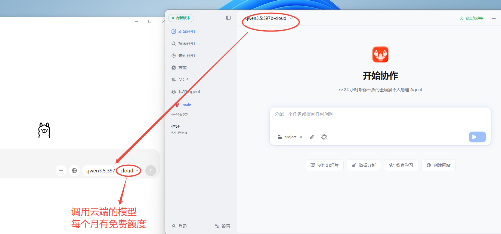

**QClaw**：


**利用龙虾测试页面**：

```text
打开浏览器访问 https://c3vlzgxj.mule.page/
填写“用户名”、“密码”，用户名=admin，密码=admin123
点击“登 录”
断言“活跃优惠券数”等于 1
断言“今日订单数”等于 384
断言“新增用户数”等于 67
测试完成后，写一份测试报告，放到我的桌面。
```

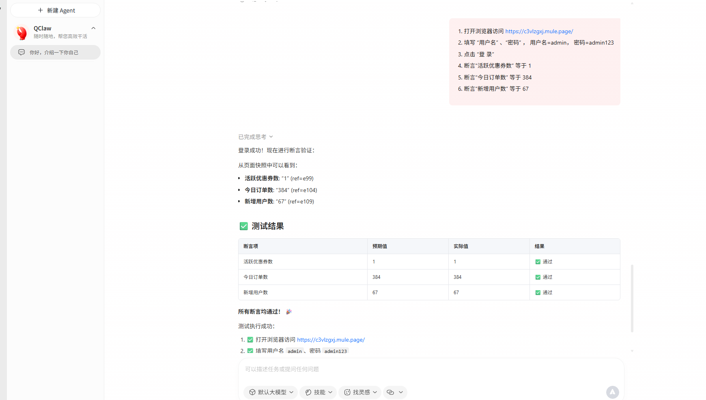

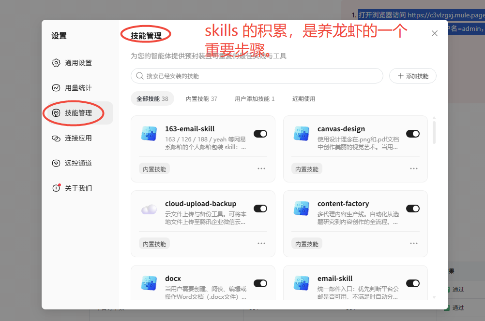

大模型可以切换：

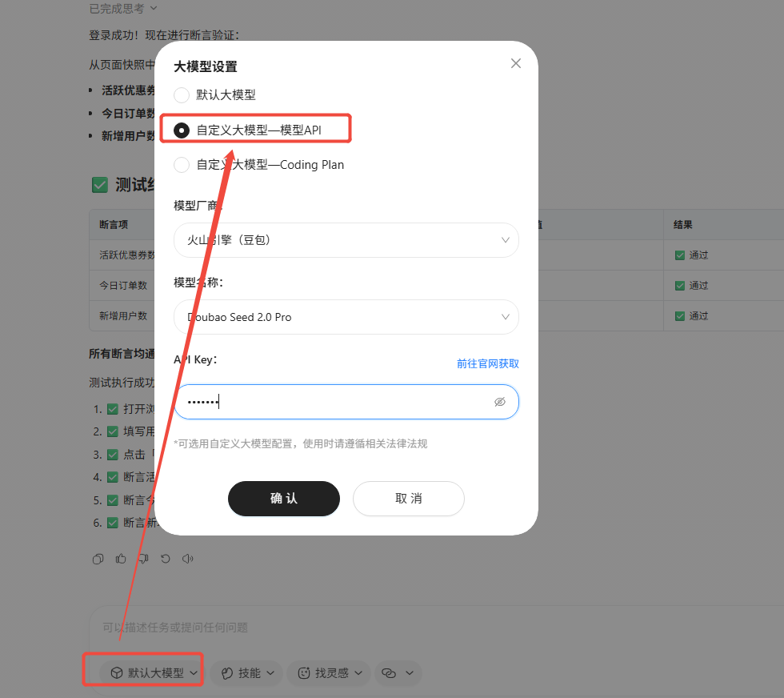


## 六、OpenClaw — Personal AI Assistant

### 6.1 安装

**系统要求**：

- Node.js ≥ 22.x（官方硬性要求，一键脚本会自动安装）
- 内存 ≥ 2GB（推荐 4GB+）
- 系统：macOS 12+、Windows 10/11、Linux（Ubuntu/Debian/Fedora）、WSL2（Windows 推荐）

#### （1）macOS / Linux / WSL2

```bash
# 一键安装（含 Node 检测+安装+新手引导）
curl -fsSL https://openclaw.ai/install.sh | bash

# 仅安装二进制，跳过新手引导（进阶）
curl -fsSL https://openclaw.ai/install.sh | bash -s -- --no-onboard
```

#### （2）Windows（PowerShell 管理员模式）

1. 以管理员身份打开 PowerShell（Win+X → 选择“Windows PowerShell（管理员）”）
2. 执行：

```powershell
# 官方脚本
iwr -useb https://openclaw.ai/install.ps1 | iex

# 国内镜像（备用）
iwr -useb https://clawd.org.cn/install.ps1 | iex
```

1. 若提示执行策略报错，先运行：

```powershell
Set-ExecutionPolicy -ExecutionPolicy RemoteSigned -Scope CurrentUser
```

#### （3）安装验证

```bash
# 验证版本
openclaw --version

# 检查环境
openclaw doctor

# 启动服务（默认端口 7979）
openclaw start
```

访问 `http://localhost:7979` 确认服务正常。

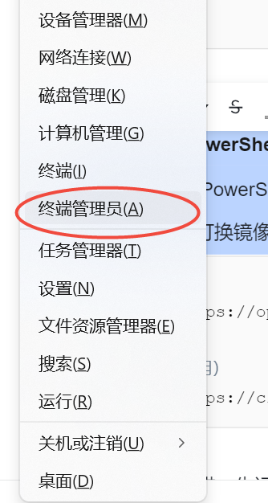

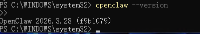

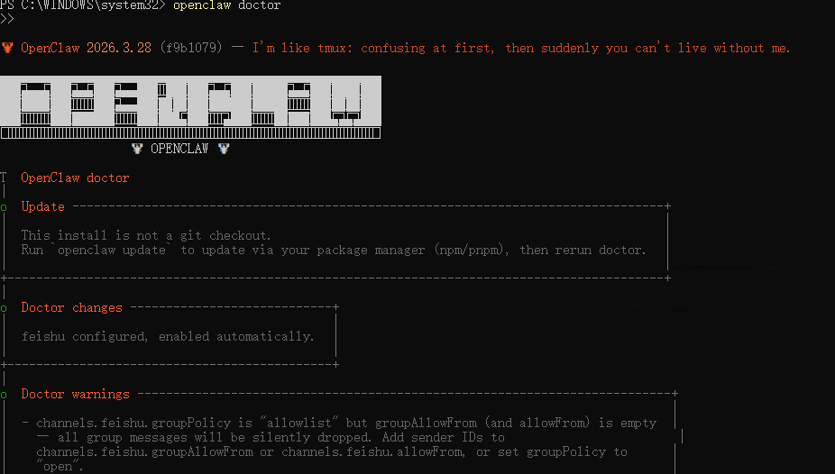


---

*共 28 页，提取图片 29 张。*
