# Skills 技能体系与 Hermes Agent 实战

> **来源**：`AI+测试：基于 AI 的自主化 Web 探索测试（day5）.pdf`（共 37 页）


## 一、全场景 AI 智能体

### 1.1 AI Agent 的基本组成

**AI Agent = LLM（大脑） + 规划（Planning） + 记忆（Memory） + 工具使用（Tool Use）**

| 类型                    | 定位               | 特点                                                         |
| ----------------------- | ------------------ | ------------------------------------------------------------ |
| **传统 AI 产品（LLM）** | “博学但瘫痪”的学者 | 能写出测试方案，但无法打开浏览器或改代码                     |
| **智能体（Agent）**     | “实习测试工程师”   | 懂理论，能根据目标自主拆解步骤，调用测试工具（Playwright、Postman、SQL 客户端）完成任务 |

> 我们日常用的 AI 产品，例如豆包、元宝等，本质上都是 Agent，具备上述能力。


## 二、AI Agent Skills

### 2.1 什么是 Skills

如果说 LLM（大脑）、Memory（记忆）、Tools（手脚）和 Planning（逻辑）构成了 AI Agent 的“生理机能”，那么 **Skills** 就是它在实战中淬炼出的“专家经验”与“肌肉记忆”。它不再是盲目的逻辑推理，而是将复杂的动作内化成了高效、精准的标准作业程序（SOP）。

### 2.2 Skills 的本质：提示词的打包管理

#### （1）Prompt——提示词

让 AI 干活，先要给指令。用户手动打字输入的提示词，一般称为 **User Prompt**。

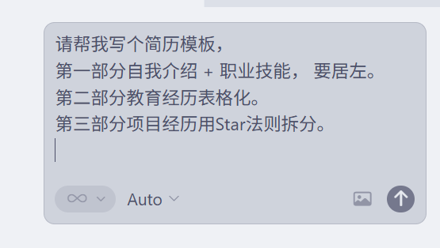

#### （2）Commands——指令/命令

因为想提高效率，把常用提示词固化成文件（如 `resume.md`）：

```text
请帮我写个简历模板，
第一部分 自我介绍 + 职业技能，要居左。
第二部分 教育经历表格化。
第三部分 项目经历用 Star 法则拆分。
```

需要时，用类似快捷键的方式唤出（如 `/resume`）。

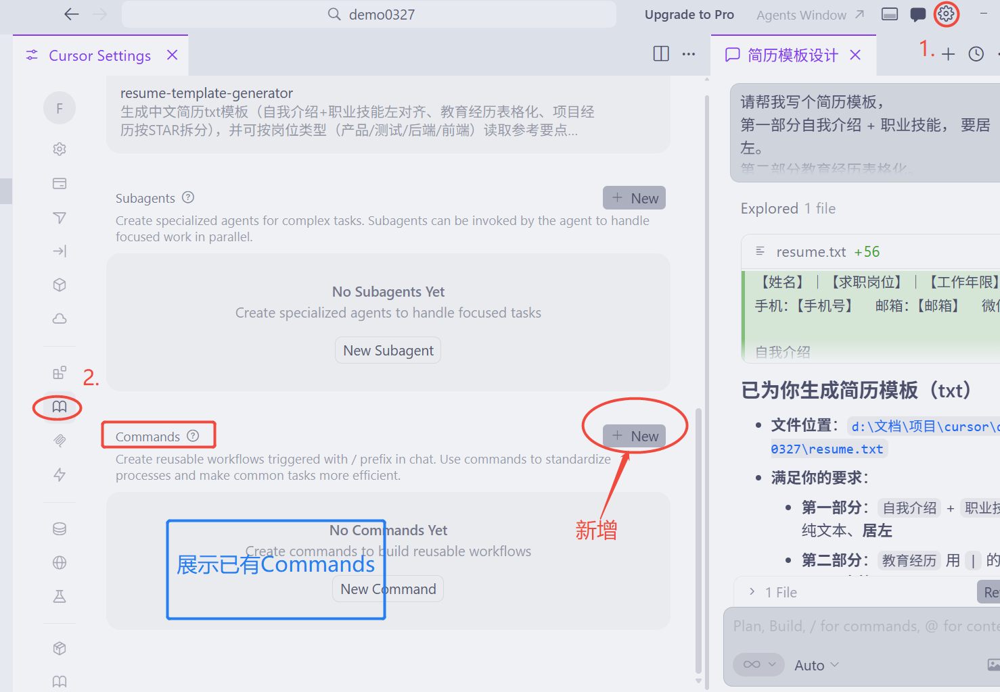

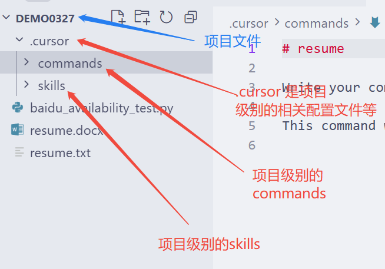

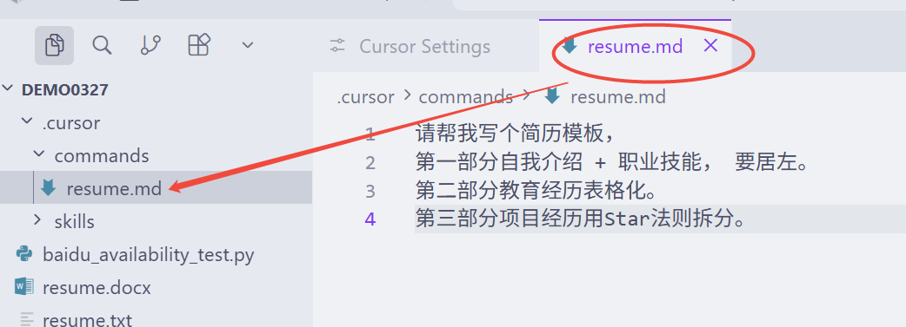

**使用方式**：

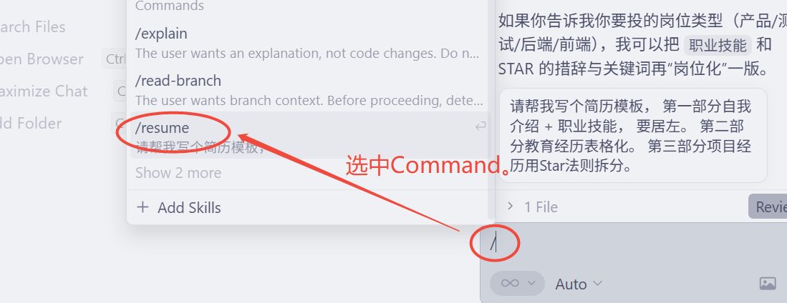


#### （3）System Prompt——系统提示词

提示词中的上下文背景，不用每次都说，AI 也能知道。System Prompt 的内容每次都会自动加入到 Prompt 中。

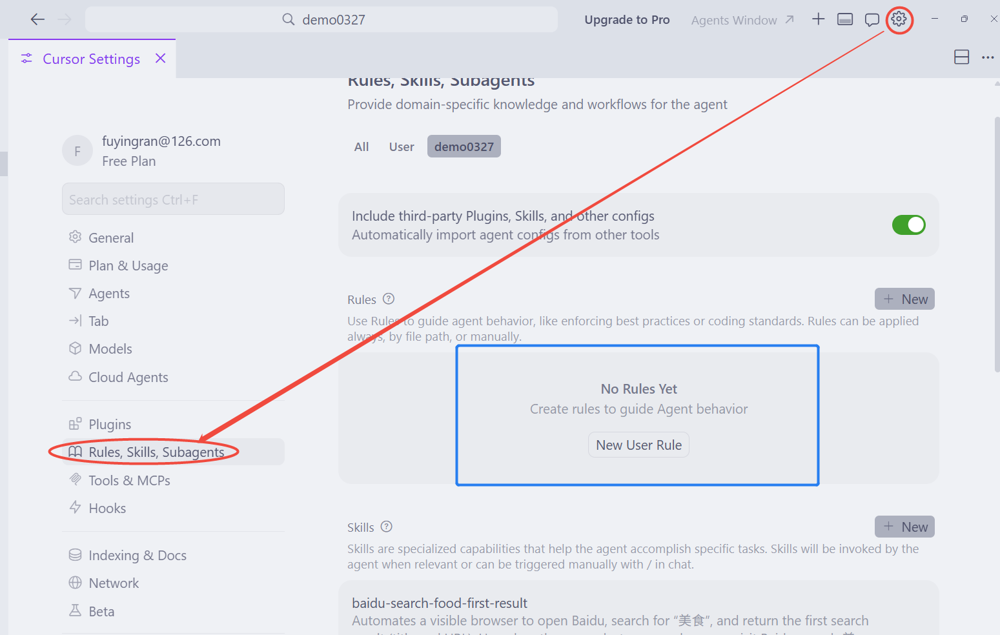

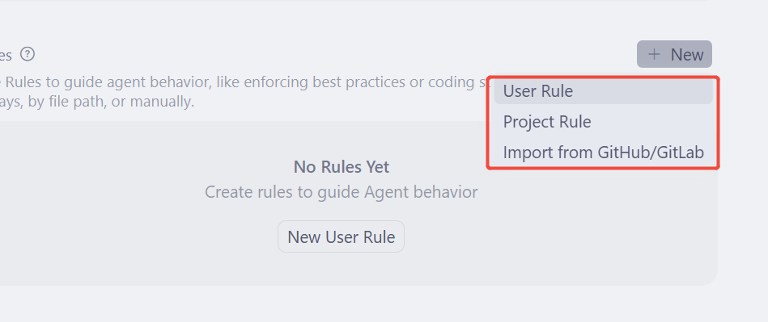

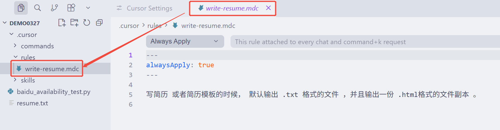

**Skills 的本质是提示词的打包管理**。

### 2.3 Skills 的优势

| 优势                         | 说明                                                         |
| ---------------------------- | ------------------------------------------------------------ |
| **从“随机性”到“确定性”**     | **动作（Action）** ：Agent 在 LLM 驱动下的一次“尝试”，可能成功也可能失败，具有随机性。<br>**技能（Skill）** ：经过验证的、沉淀在 Skill.md 里的成功模版。标志着 Agent 从“碰运气”进化到了“有把握” |
| **从“算力消耗”到“经验复用”** | 没有 Skill 的 Agent 每次都要消耗大量 Token 去思考“我该怎么点这个按钮”。<br>拥有 Skill 的 Agent 相当于加载了预设脚本，直接调用经验，响应更快、成本更低 |
| **从“通用能力”到“领域专家”** | 生理构造是通用的（如接入 GPT-4、Qwen3 等大模型，调用工具）。<br>Skills 有领域属性，学会了“游戏路径巡检”、“Web 弱网测试”、“SQL 注入探测”等 Skills，才真正成为“AI 测试专家” |

### 2.4 Skills 的来源

#### （1）植入“武林秘籍”——导入成熟 Skills

站在巨人的肩膀上，快速获取通用能力。从网上找到并导入成熟的 Skills。

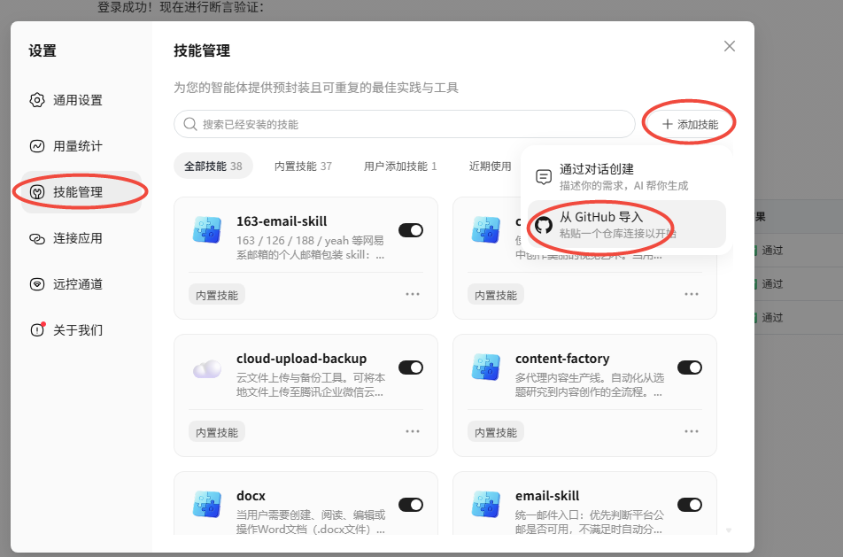

#### （2）用户自己配置——新增/修改 Skills

用户自己新增、修改 Skills。可以通过提示词要求智能体配置，也可以直接编写 Skill.md 文档进行配置（文档名称根据不同的 AI 产品有所不同）。

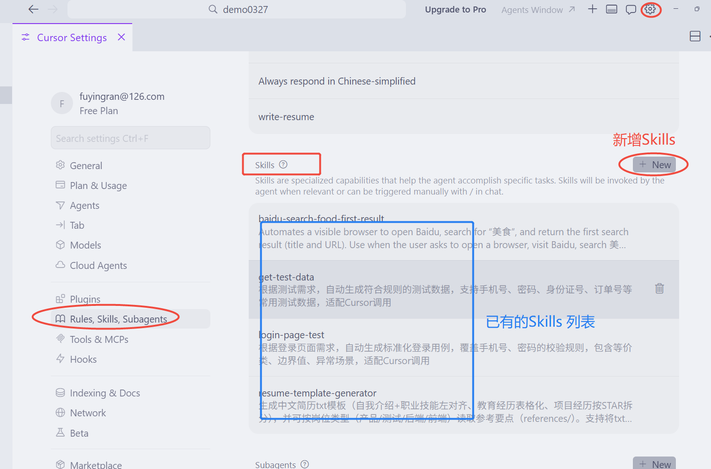

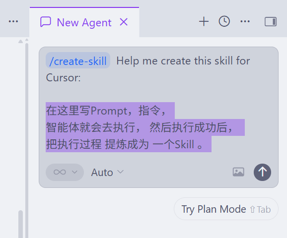

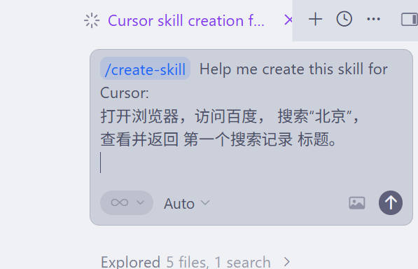

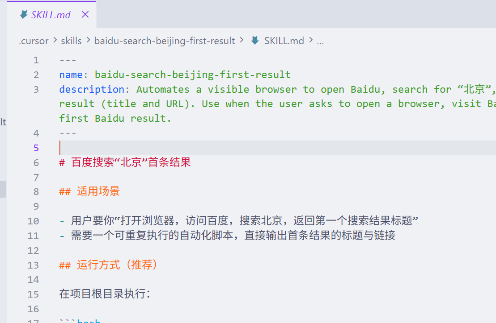

**写完技能后如何调用**：

1. 发出相关指令，让 AI Agent 去发现相关性，然后调用技能
2. 主动调用技能，利用 `/`

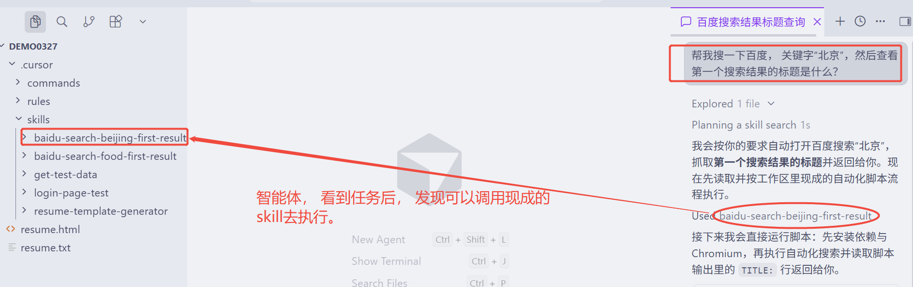

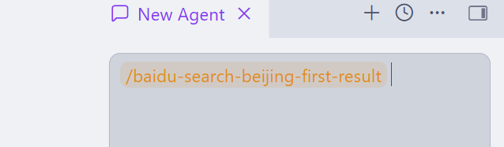

#### （3）Agent 自己在工作中总结——自主进化

例如在 **Hermes Agent** 这样的“自主进化”框架里：

1. 带它去跑真实的测试用例
2. 第一次失败，通过 Prompt 或 Human-feedback 纠正
3. 它会把正确的路径记在 Skill.md 里

**结论**：这个“进化”过程本质上是“知识内化”。通过不断的失败和反馈，把通用的逻辑（LLM）变成了特定的技能（Skills）。同时伴随一定风险，它可能会自己总结出错误的经验（幻觉）。

### 2.5 Skills 的渐进式披露——按需加载

Skills 采用三层加载机制：

| 层级               | 名称                  | 说明                                                         |
| ------------------ | --------------------- | ------------------------------------------------------------ |
| **始终加载**       | Metadata（元数据层）  | Skill 文件开头的简短描述（name、description），说明文件用途和适用场景。发送 Prompt 时，所有 Metadata 一并发送给 AI，让 AI 快速知道应该用哪个 Skill |
| **按需加载**       | Instruction（指令层） | Skill 文件中除元数据之外的内容                               |
| **更深层按需加载** | Resource（资源层）    | 包含 Reference + Script（高级用法）。AI 根据指令要求读取，需要用到哪个资源才去读取，而非一开始就全部加载 |

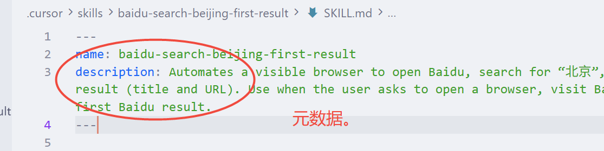

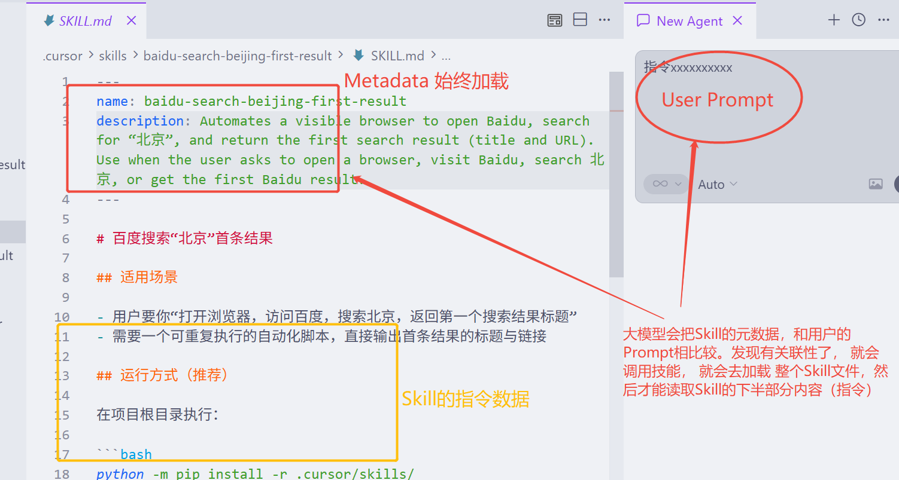

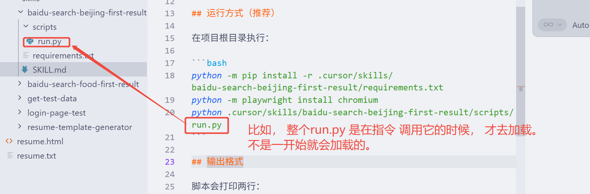

### 2.6 Skills 高级用法

| 类型                  | 说明                                                         |
| --------------------- | ------------------------------------------------------------ |
| **Reference（参考）** | 给 AI 一个参考内容，如某个标准、某个例子，让它输出统一、规范、符合企业要求的结果 |
| **Script（脚本）**    | AI 的操作脚本，必须按顺序执行，保证流程稳定不混乱            |

### 2.7 文件目录参考

```json
目录名称（XXX-Skill）（技能名称）
|
|--- Skill.md          （Metadata、入口路由）（指令信息）
|
|--- references         （参考资料）
|      |
|      |--- x.md        （要求 x）
|      |--- y.md        （要求 y）
|
|--- scripts            （运行脚本）
|
       |--- a.py
       |--- b.py
```

> 这是一个规范格式的参考。也可以不遵守，自由发挥起文件名、划分目录等。


## 三、Skills 实战（以 Cursor 编辑器为例）


### 3.1 指令 1：创建并运行一个测试 Skill

创建一个新的 Skill，用于封装 MagniTasks 的测试内容：

```text
打开浏览器，
进入 https://www.magnitasks.com/tasks
进行任务添加，
填写内容：
Title=demo0421
Description=demo0421的描述
Priority=High
点击 "Save Task" 进行保存。
进入 https://www.magnitasks.com/
查看 Total Tasks 的数量。
```

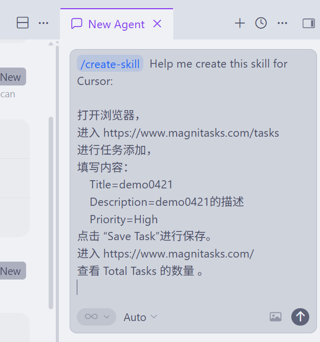

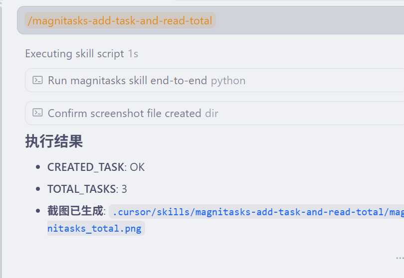

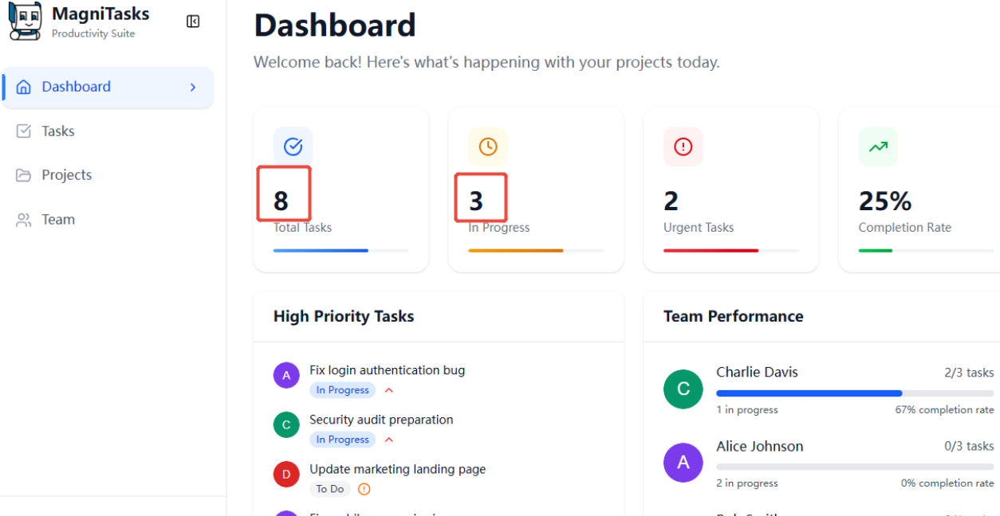

第一次执行有问题，修正后得到正确结果：

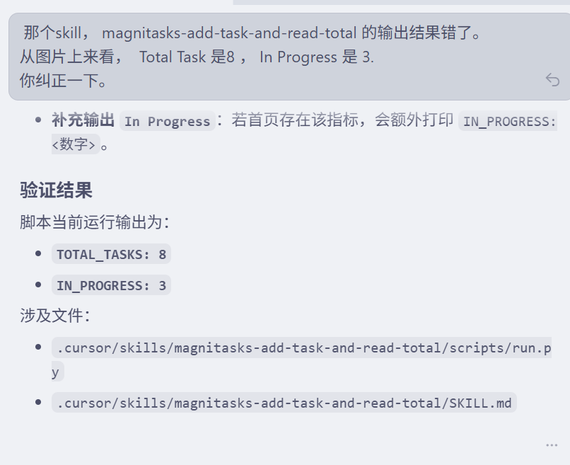

### 3.2 指令 2：简历生成 Skill

创建一个生成简历/简历模板的 Skill：

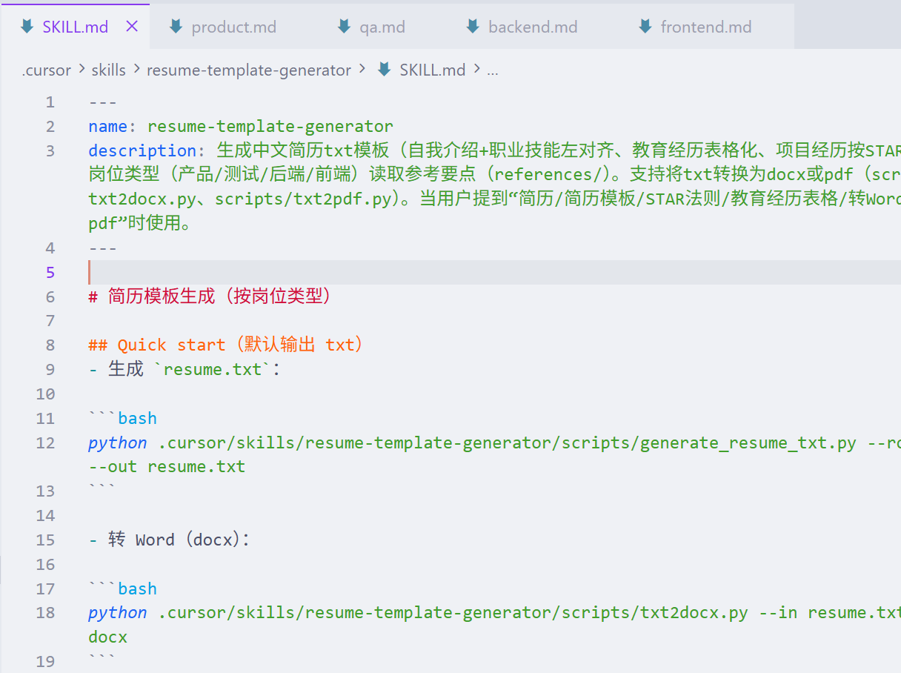

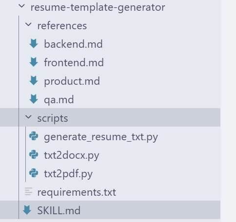

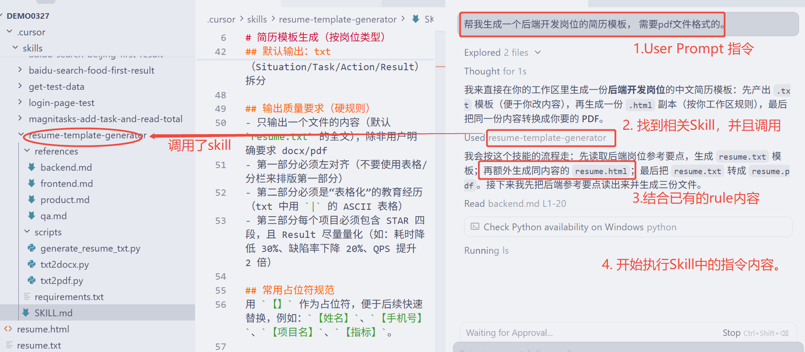

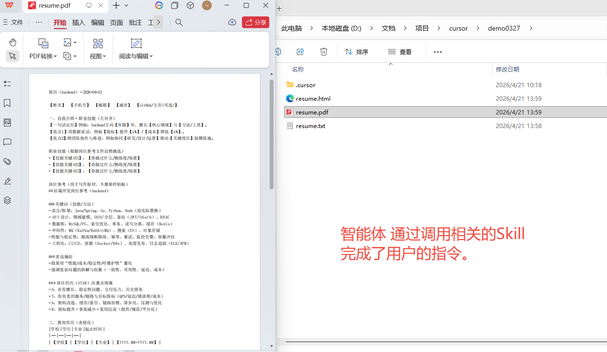

### 3.3 指令 3：Web 自动化测试 Skill

```text
进行自动化 web 测试：

打开页面 http://1.13.8.34:7000/login
输入 账号：s001
输入 密码：123456
输入 验证码：1357
点击"登 录"，并等待跳转到新页面。
点击"业务管理"，
点击下一层的"演员信息"，并等待跳转到新页面。
在"请输入演员姓名"这个输入框中输入"姜皓",
点击"搜索"按钮，
查看页面结果，断言页面上是否"共 1 条"结果数据。
最后，输出测试报告。
```

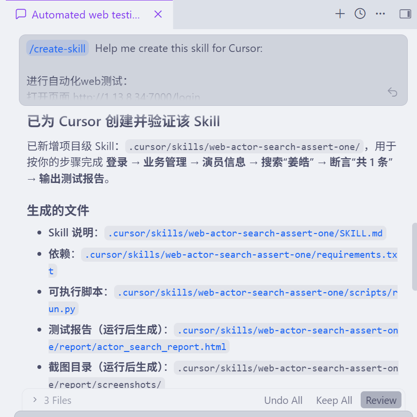

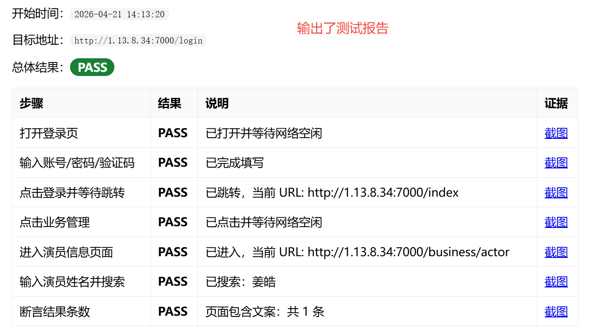


## 四、网上热门讨论——“蒸馏同事”

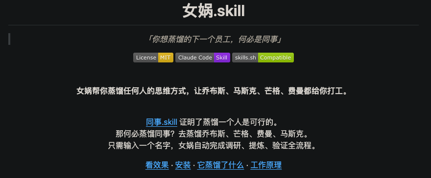

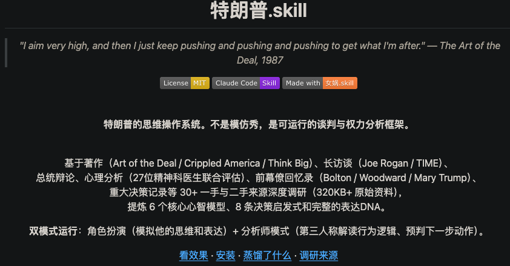

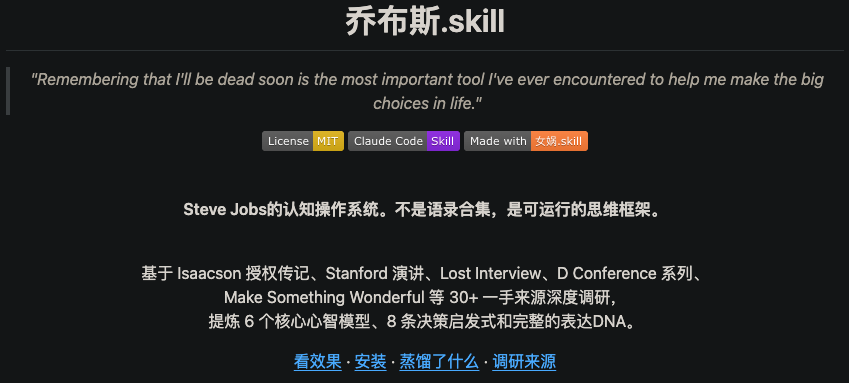

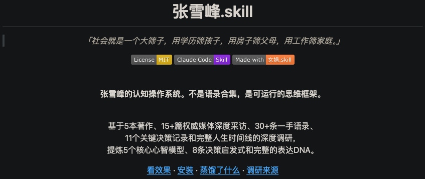

> GitHub：[alchaincyf/nuwa-skill](https://github.com/alchaincyf/nuwa-skill)

**核心思路**：把人物的信息、描述、所作所为全部喂给 AI，让 AI 提取 & 总结，最后生成 `XXX.SKILL.md`。


## 五、Hermes Agent

### 5.1 介绍

**Hermes Agent** 由知名开源大模型团队 Nous Research 发布，是一个专门为了解决 Agent“健忘”和“环境孤立”问题而设计的开源自主 Agent 框架。Hermes Agent 基于 Hermes 3 模型（Llama 3.1 的微调版），其核心理念是**“随你一起成长的助手”**。它不仅仅执行任务，还会从任务中学习并总结经验。

> 官网：[Hermes Agent — An Agent That Grows With You](https://www.nousresearch.com/hermes-agent)

### 5.2 核心组件：三层记忆体系

Hermes Agent 放弃了单一的上下文窗口，转而采用一种类似人类“程序性学习”的体系：

| 组件                            | 说明                                                         |
| ------------------------------- | ------------------------------------------------------------ |
| **USER.md（用户画像）**         | 存储用户的偏好、沟通风格和长期目标                           |
| **MEMORY.md（环境记忆）**       | 存储关于项目环境、事实和过去任务的教训                       |
| **Skill Documents（技能文档）** | 最亮眼的部分。Agent 完成复杂任务后，会将执行过程、依赖脚本和逻辑总结成 .md 技能文件（遵循 agentskills.io 标准）。下次遇到类似任务，直接通过检索调用该 Skill |

### 5.3 核心技术栈

- Python + 四层持久记忆（工作/情景/语义/用户画像）
- 自进化学习循环
- 内置工具（含浏览器自动化）
- MCP 协议
- SQLite（记忆存储）

**部署复杂度**：低（一键安装/手动部署，支持 Linux/macOS/WSL2，不支持 Windows 原生；需配置 LLM API Key，依赖 Python 3.11、Node.js v22 等）

**AI 核心逻辑**：闭环自进化 Agent——自主执行任务 → 自动复盘评估 → 沉淀 Skill.md 技能库 → 持续迭代优化，形成“学习-沉淀-进化”闭环。四层持久记忆实现跨会话上下文留存，模型无关设计兼容 200+ LLM（含国产大模型），内置浏览器自动化工具集。

**亮点**：

- 目前唯一原生自带自进化闭环，越用越强
- 全能型能力覆盖浏览器/代码/系统/协作，远超单一自动化工具
- 100% 私有化部署，数据完全可控
- 跨会话永久记忆，无需重复解释上下文
- 支持 15+ 消息平台集成，部署灵活


## 六、OpenClaw vs Hermes Agent 对比

| 维度                       | OpenClaw                                       | Hermes Agent                                                 |
| -------------------------- | ---------------------------------------------- | ------------------------------------------------------------ |
| **技能沉淀（Auto-Skill）** | 被动式。主要依赖 RAG 检索记录                  | **核心优势**。能自动将复杂的脚本执行逻辑写成 .md 格式的 Skill 文档，供下次直接调用 |
| **记忆提取**               | 辅助式。需要人工编写配置或复杂工具的调用       | **主动式**。Agent 自行决定哪些信息重要并更新到 `MEMORY.md`   |
| **认知深度（Depth）**      | 专为多平台、多用户调度设计，像个“Agent 路由器” | 专为长周期、复杂任务（如自主编写代码并测试）设计，有很强的逻辑闭环 |
| **成长方式**               | 你喂它高质量 Markdown                          | **自主式**。它自己总结 .md，自己存                           |
| **可控性**                 | **极高**：因为 Skill 都是你写的，它只执行      | **较低**：它可能会自己总结出错误的经验（幻觉）               |
| **适用场景**               | 适合企业级、需要高度确定性的自动化             | 适合高度模糊的任务、探索性任务                               |


## 七、Hermes Agent 安装

> **注意**：Hermes Agent 只能安装在 Linux / macOS / WSL2 环境，无法直接在 Windows 原生环境安装。

### 7.1 安装 WSL2（Windows 用户）

如果之前没安装过，以管理员身份打开 PowerShell / Windows 终端（Win + X）：

```powershell
wsl --install
```

等待下载（约几百 MB），完成后**重启电脑**。

如果下载有问题，可以考虑手动下载 WSL 发行版。

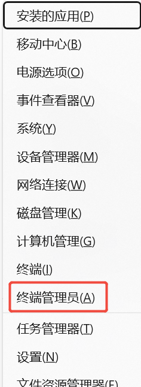

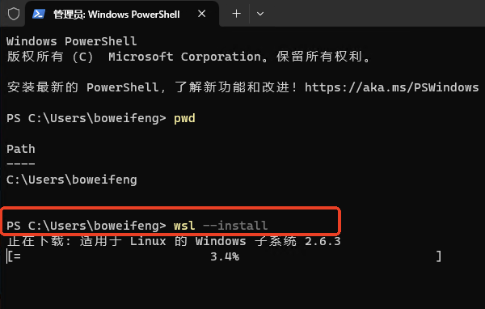

### 7.2 打开 WSL2

在 PowerShell / Windows 终端中，点右上角 `∨` → 选择 `Ubuntu`，或输入命令：

```bash
wsl
# 或
ubuntu   # 切换到 Ubuntu
```

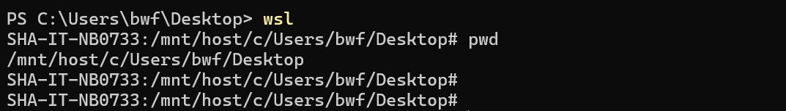

### 7.3 正式安装 Hermes Agent

```bash
curl -fsSL https://raw.githubusercontent.com/NousResearch/hermes-agent/main/scripts/install.sh | bash
```

### 7.4 配置大模型 API Key

**大模型平台建议选**：Alibaba Cloud / DashScope Coding，如 `qwen3-32b`

配置 API Key（示例）：`sk-35359547b8487c8xxxxxxxxxxxx`

- 访问阿里云百炼平台：[大模型服务平台百炼控制台](https://bailian.console.aliyun.com)
- 获取 API Key：[大模型服务平台百炼控制台](https://bailian.console.aliyun.com)
- 管理模型用量：[大模型服务平台百炼控制台](https://bailian.console.aliyun.com)
- **调用地址（base_url）** ：`https://dashscope.aliyuncs.com/compatible-mode/v1`

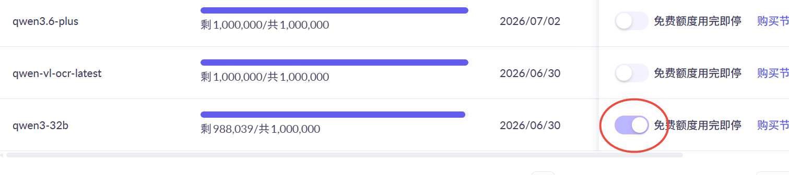

**配置文件**：

```bash
vim ~/.hermes/.env
vim ~/.hermes/config.yaml
```

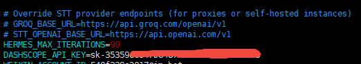

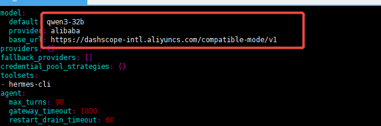

**安装完毕后，重新加载 shell 配置**：

```bash
source ~/.bashrc   # 或 source ~/.zshrc
```

### 7.5 常用命令

```bash
hermes --version      # 显示版本
hermes update         # 升级版本
hermes                # 开始聊天：下指令
hermes model          # 配置大模型
```

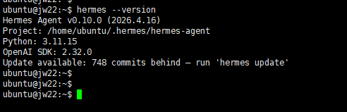

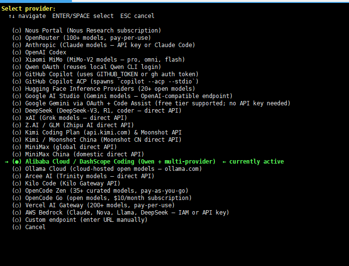

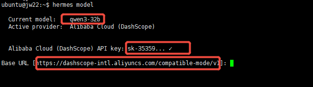

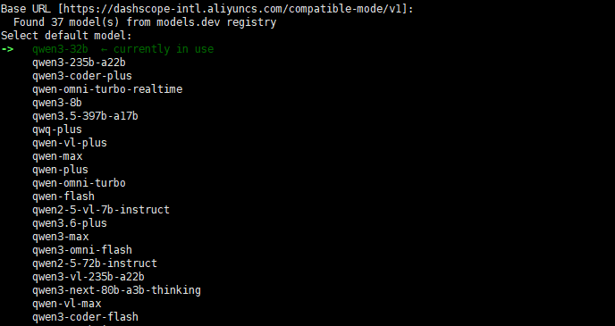

### 7.6 验证安装结果

```bash
hermes   # 开始聊天：下指令
```

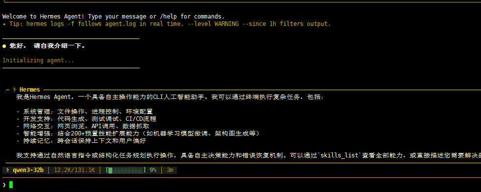

### 7.7 配置聊天工具接入

运行配置向导：

```bash
hermes gateway setup
```

选择 Weixin（个人微信）：

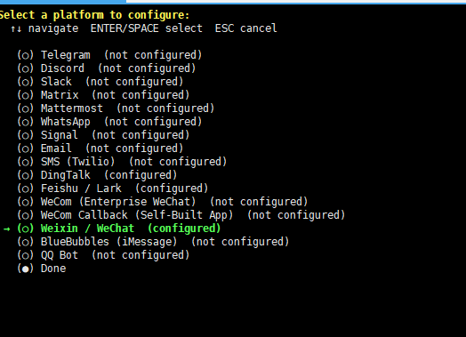

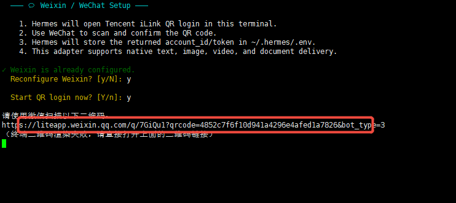

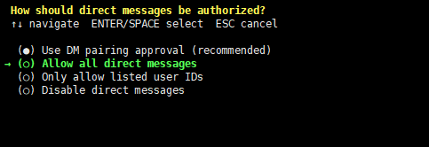

微信扫描后，即可与 ClawBot 聊天。

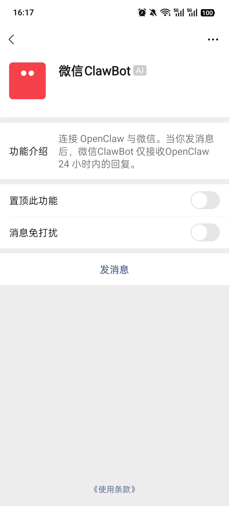

已配置的聊天渠道可在 env 文件中查看：

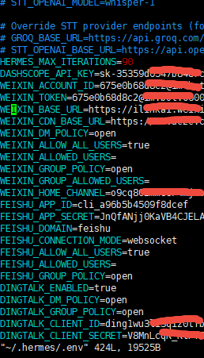


### 7.8 演示探索性测试

```text
对 https://vanrevwk.mule.page/ 页面做 UI/响应式探索：

- 测试：PC/平板/手机视图、缩放 100%–200%、横竖屏切换
- 检查：布局错乱、文字截断、按钮不可点、图片加载、滚动异常
- 输出：各分辨率截图 + UI 问题清单
```

发送到飞书：

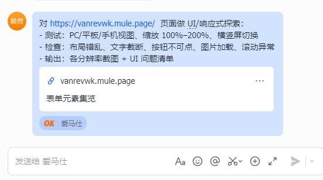


---

*共 37 页，提取图片 52 张。*
