# 图脚本与 AI 浏览器自动化

> **来源**：`AI+测试：基于 AI 的自主化 Web 探索测试（day3）.pdf`（共 42 页）


## 一、代理的自动化（Agentic Automation）

**核心**：语义意图驱动（Agentic / Intent-based），前沿方向，不够稳定。

**优点**：

- **真正零维护**：UI 改版（如按钮从左边挪到右边，或 ID 变了）对意图脚本无影响
- **适应性极强**：能处理复杂的逻辑跳转

**痛点**：

- **黑盒化**：报错时可能难以调试
- **成本/速度**：运行过程中需要频繁调用 LLM，慢（等半天）且贵（消耗 Token）


## 二、自动化意图脚本

### 2.1 定义

自动化意图脚本是一种**以目标为导向（Goal-oriented）** 的测试描述方式。它不再要求测试人员编写“如何做（How）”的具体步骤（如点击哪个 ID、等待多少秒），而是仅需声明“做什么（What）”的业务意图。

| 脚本类型 | 示例                                             | 关注点   |
| -------- | ------------------------------------------------ | -------- |
| 传统脚本 | `click("#login-btn")` → `type("#user", "admin")` | 实现细节 |
| 意图脚本 | `act("用管理员账号登录系统")`                    | 业务逻辑 |

**核心特征**：

1. **高度抽象**：脚本与底层 DOM 结构完全解耦
2. **动态感知**：在运行时由 AI 实时感知页面状态并生成操作路径
3. **自愈能力**：UI 的视觉变化或结构重构不会导致意图脚本失效

### 2.2 意图脚本工具介绍

| 工具名称        | 核心技术栈                                  | AI 核心逻辑                                                  | 部署复杂度                         | 最佳适用场景                                                 |
| --------------- | ------------------------------------------- | ------------------------------------------------------------ | ---------------------------------- | ------------------------------------------------------------ |
| **Browser-use** | Python + Playwright + ReAct Agent           | Agent 架构（ReAct 模式）：将浏览器作为交互环境，通过「视觉识别 + DOM 解析」双模态感知，持续循环“推理-执行-反馈”，自主拆解长任务步骤 | 极低（pip install）                | 跨网站/跨系统的长链条业务任务自动化。例：从 Excel 读取客户数据 → 自动登录 3 个后台系统完成录入 → 生成汇总报表 |
| **Stagehand**   | TypeScript + Playwright + 意图解析引擎      | 自然语言意图解析：聚焦「前端 DOM 语义化理解」，将自然语言指令翻译成高鲁棒性的 Playwright 指令，内置「元素定位自愈」（DOM 变化自动适配） | 低（npm install）                  | 现代前端框架（React/Vue/Next.js）的 UI 自动化测试。例：React 单页应用的按钮点击、表单提交、弹窗验证等用例 |
| **LaVague**     | Python + Selenium/Playwright + LlamaIndex   | Action Engine 端到端框架：将自然语言拆解为「操作原子 + 校验规则」，生成可执行代码段；支持本地大模型（Llama 3/通义千问）私有化部署，无数据外发 | 中等（pip install + 本地模型配置） | 数据安全敏感的企业级内部测试流程。例：银行/政务系统的 UI 自动化测试、私有化部署的内部平台测试 |
| **Skyvern**     | Python + Playwright + Computer Vision（CV） | 纯视觉驱动 Agent：脱离 DOM 依赖，通过 CV 模拟人眼识别网页元素（按钮/表单/输入框），结合 OCR 完成交互，不依赖前端代码规范 | 中等（Docker 部署）                | 非标准 DOM/反爬/老旧系统的自动化测试。例：政府老旧网站、外包定制系统、带反爬机制的第三方平台操作 |

### 2.3 自动化意图脚本测试（Browser-use）介绍

> GitHub：[browser-use/browser-use](https://github.com/browser-use/browser-use)

**直观特点**：能够理解视觉内容、操作鼠标键盘、处理多步骤复杂任务。

#### （1）基础定义

**Browser-use** 是开源、Python 优先、轻量级入门级 AI 浏览器自动化工具，底层基于 Playwright，主打**开箱即用、零门槛**，纯社区驱动。

#### （2）核心特性

- Python 原生（唯一主力语言，无其他语言负担）
- 零配置启动，直接运行代码
- 支持本地/云端浏览器
- 自动处理等待、重试、元素查找
- 轻量小巧，适合快速上手、演示
- 完全免费开源

#### （3）安装

```bash
pip install browser-use

# 提前准备好大模型的 API Key（如 OpenAI、Qwen 或 DeepSeek）
# 提前准备好 Browser Use API（可选）
# https://cloud.browser-use.com/settings?tab=api-keys
```

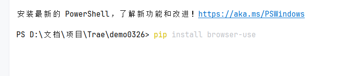

#### （4）Browser-use 代码示例

**示例 1：用 Browser-use 自己的大模型，统计 GitHub 项目星星数量**

必要前置条件：准备好 Browser Use API Key，并设置环境变量 `BROWSER_USE_API_KEY`。

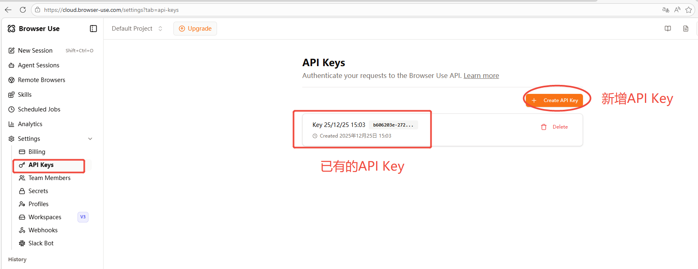

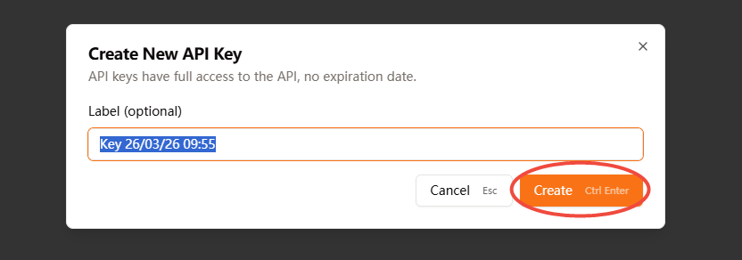

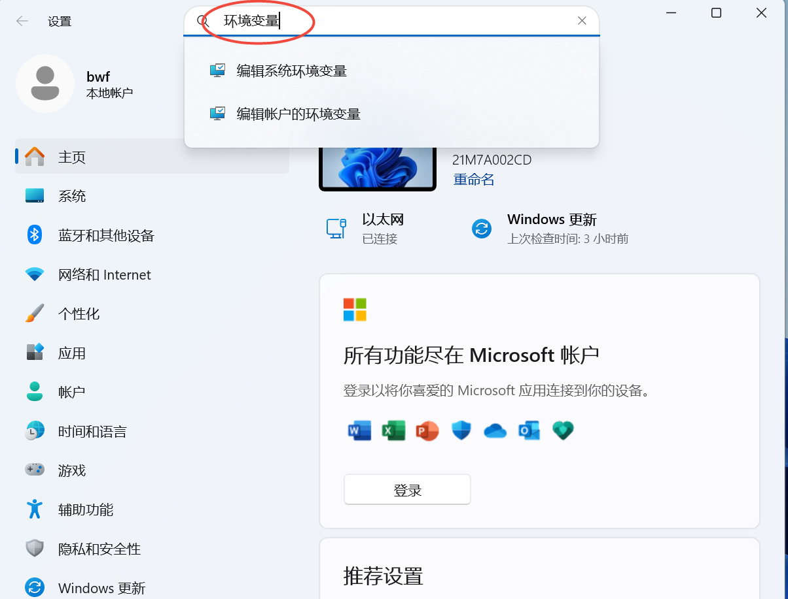

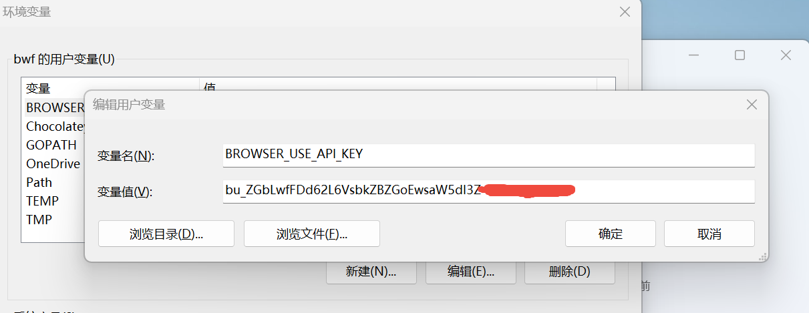

```python
from browser_use import Agent, Browser, ChatBrowserUse
import asyncio

task = "查看一下 browser-use repo 项目的星星数量"  # 我们的任务

async def main():
    browser = Browser(
        # use_cloud=True,  # Use a stealth browser on Browser Use Cloud
    )

    agent = Agent(
        task=task,
        llm=ChatBrowserUse(),
        browser=browser,
    )
    history = await agent.run()
    return history

if __name__ == "__main__":
    history = asyncio.run(main())
```

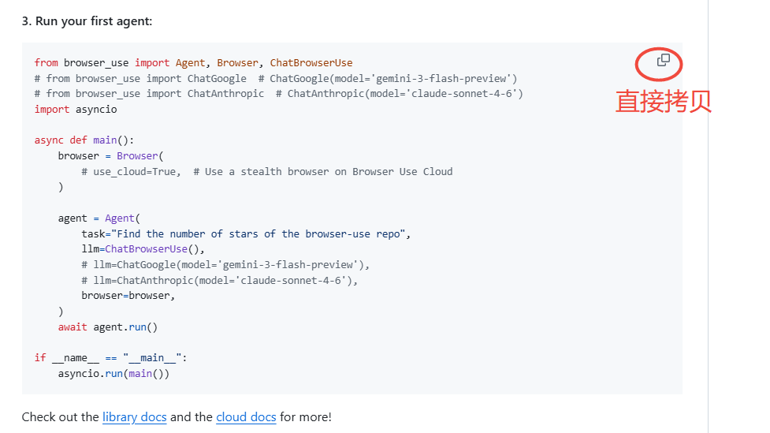

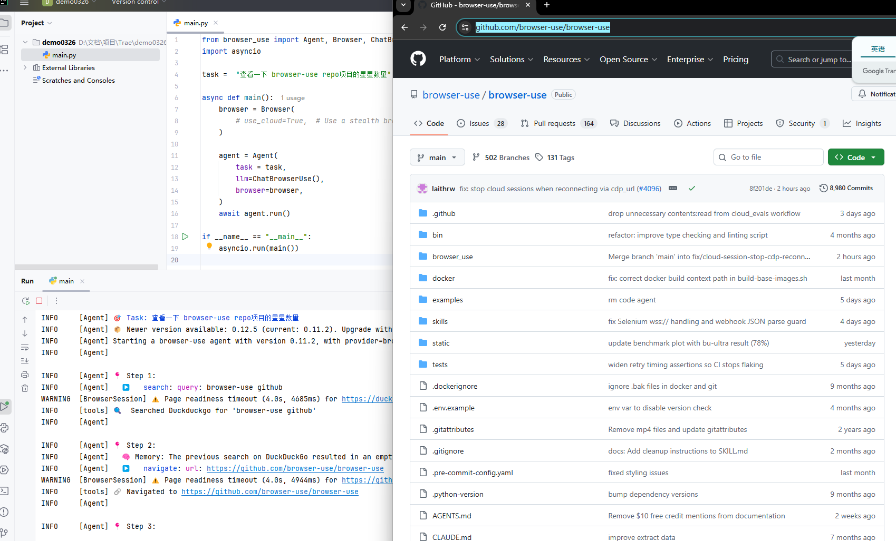

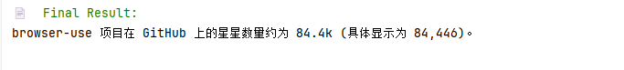

**示例 2：用 DeepSeek 大模型，登录 Gitee 并统计仓库数量**

必要前置条件：准备好大模型的 API Key。

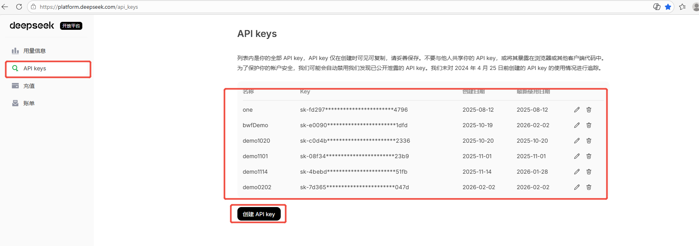

```python
from browser_use import Agent, Browser
import asyncio
from browser_use.llm import ChatDeepSeek

# 定义任务内容
task = """
1. 前往 https://c3vlzgxj.mule.page/
2. 请输入用户名"admin"
3. 请输入密码"admin123"
4. 点击"登录"
"""

async def main():
    # 1. 配置 DeepSeek API
    #    真实 Key 通过环境变量注入，不要硬编码/写进笔记
    DEEPSEEK_API_KEY = os.getenv("DEEPSEEK_API_KEY")  # 运行前: export DEEPSEEK_API_KEY=sk-你的key

    # 2. 初始化 DeepSeek 模型
    llm = ChatDeepSeek(
        model='deepseek-chat',
        api_key=DEEPSEEK_API_KEY,
        base_url='https://api.deepseek.com',
    )

    # 3. 初始化浏览器
    browser = Browser(
        # use_cloud=True,  # Use a stealth browser on Browser Use Cloud
    )

    agent = Agent(
        task=task,
        llm=llm,
        browser=browser,
    )
    history = await agent.run()
    return history

if __name__ == "__main__":
    history = asyncio.run(main())
```

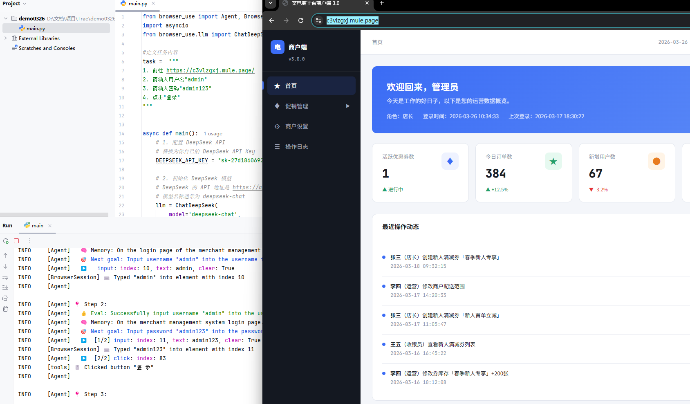

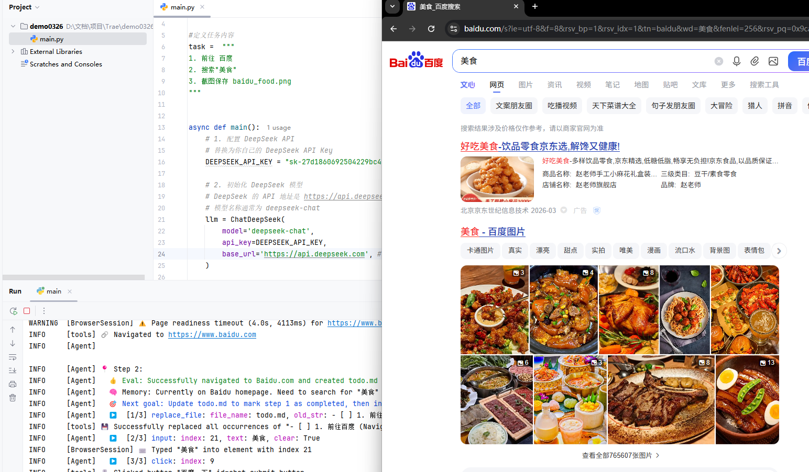

**示例 3：用 Ollama 指定大模型，登录 Gitee 并统计仓库**

必要前置条件：安装并启动 Ollama。

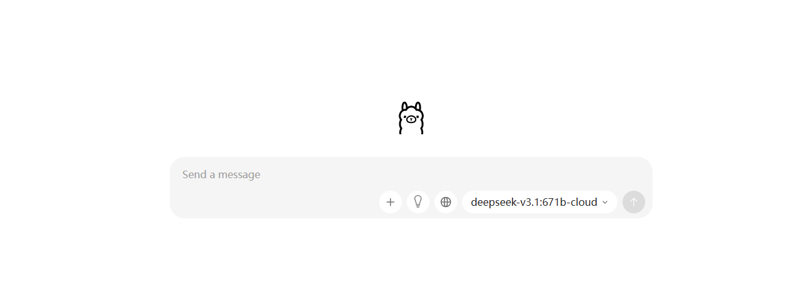

> 注意：选择的大模型要与代码中的模型名称相对应。


```python
from browser_use import Agent, Browser
import asyncio
from browser_use.llm import ChatOllama

# 定义任务内容
task_description = """
1. 前往 百度
2. 搜索 "美食"
3. 点击第一条结果
"""

async def main():
    llm = ChatOllama(
        model='gpt-oss:120b-cloud',
    )

    browser = Browser(
        # use_cloud=True,  # Use a stealth browser on Browser Use Cloud
    )

    agent = Agent(
        task=task_description,
        llm=llm,
        browser=browser,
    )

    print("正在使用大模型启动自动化任务...")

    history = await agent.run()

    print("\n任务结束")
    print("AI 的回复:", history.final_result())

if __name__ == "__main__":
    asyncio.run(main())
```

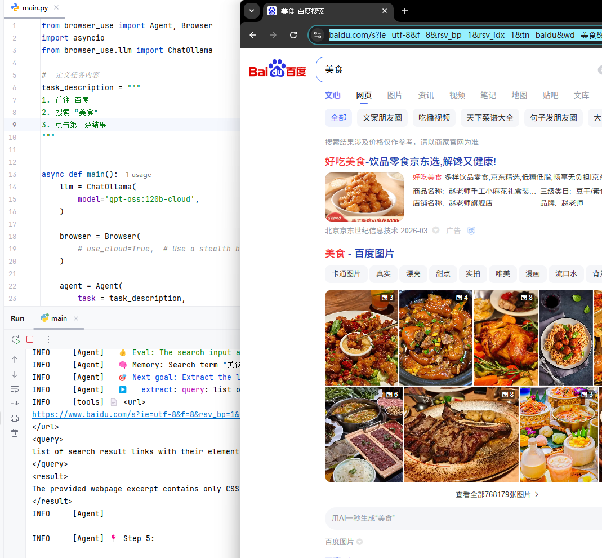

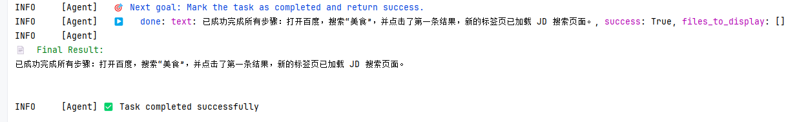

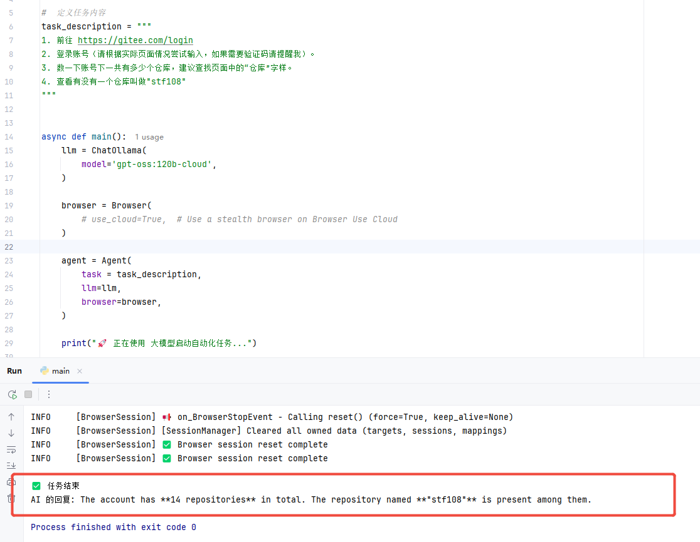

#### （5）代码结构改造——任务与代码解耦

**改造思路**：将任务描述独立存储在纯文本文件中，修改任务无需改动代码，降低维护成本。

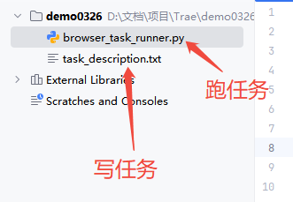

**文件 1：`browser_task_runner.py`（核心代码文件）**

```python
from browser_use import Agent, Browser, ChatOllama
import asyncio
import os

# 读取外部任务文件的函数
def read_task_from_file(file_path="task_description.txt"):
    """
    从纯文本文件中读取任务描述
    :param file_path: 任务文件路径
    :return: 任务描述字符串
    """
    # 检查文件是否存在
    if not os.path.exists(file_path):
        raise FileNotFoundError(f"任务文件 {file_path} 不存在，请确认路径！")

    # 读取文件内容（去除首尾空白字符）
    with open(file_path, "r", encoding="utf-8") as f:
        task = f.read().strip()

    if not task:
        raise ValueError("任务文件内容为空，请填写具体的测试任务！")

    return task

# 核心执行函数
async def run_browser_task():
    # 读取外部任务文件
    task = read_task_from_file()

    # 初始化浏览器
    browser = Browser()
    llm = ChatOllama(model='gpt-oss:120b-cloud')

    agent = Agent(
        task=task,
        llm=llm,
        browser=browser,
    )

    history = await agent.run()
    return history
```

**文件 2：`task_description.txt`（纯文本任务文件）**

```text
查看一下 browser-use repo 项目的星星数量
```

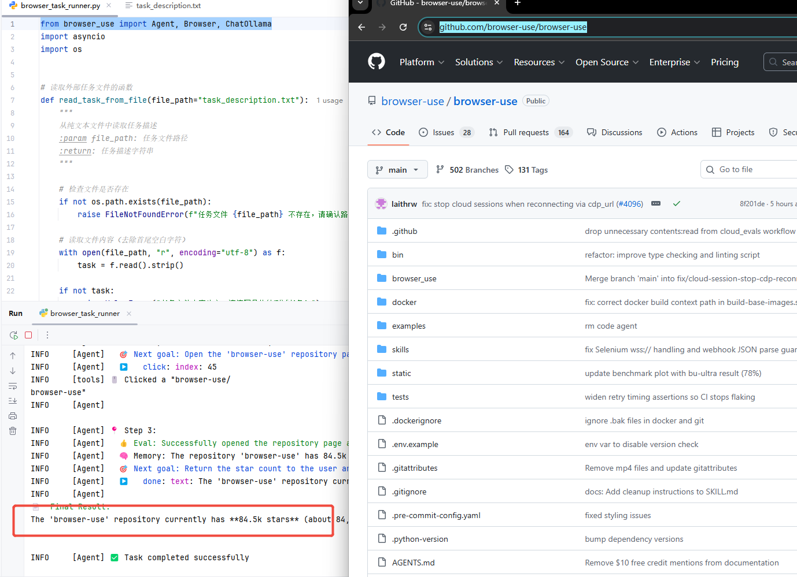

**核心拆分要点**：

1. **解耦任务与代码**：任务描述独立存储在纯文本文件，修改任务无需改动代码
2. **增强代码健壮性**：添加文件校验、异常捕获，避免文件缺失、空任务等问题
3. **保持核心逻辑**：原有功能逻辑完全保留，不受影响

**关键新增功能**：

- 自动检查任务文件是否存在，避免文件缺失导致的崩溃
- 去除任务文本首尾空白字符，避免格式问题影响执行
- 校验任务内容是否为空，防止空任务执行
- 捕获异常并给出清晰的错误提示，方便调试

**扩展优化方向**：

- 可将 `task_description.txt` 改为多行文本，循环读取每行作为独立任务
- 可新增参数指定任务文件路径，支持运行时动态选择不同任务文件

### 2.4 自动化意图脚本测试（Stagehand）介绍

> GitHub：[browserbase/stagehand](https://github.com/browserbase/stagehand)

#### （1）基础定义

**Stagehand** 是企业级、多语言、高稳定性 AI 浏览器自动化框架，底层同样基于 Playwright，主打**工程化、鲁棒性、解决复杂页面问题**（如自动化测试中经常遇到的：单选框隐藏、元素不可见超时）。

#### （2）核心特性

- Python + TypeScript 等多生态支持
- 定位更稳：专门优化了前端美化控件（单选框/复选框/隐藏元素）
- 支持任务编排、自定义工具、错误捕获
- 生产环境可用，适合企业测试
- 多模态理解，支持复杂业务流程

#### （3）跨语言支持

虽然核心逻辑（处理 AI 动作的“大脑”）依然是 TypeScript 写的，但 Browserbase 官方已推出 Python SDK：

| 语言             | 安装方式                               | 状态                                    |
| ---------------- | -------------------------------------- | --------------------------------------- |
| TypeScript       | `npm install @browserbasehq/stagehand` | 大本营，功能最全                        |
| Python           | `pip install stagehand`                | 非常成熟，支持 act/extract/observe 接口 |
| Go / Java / Ruby | -                                      | Alpha 版本                              |

#### （4）安装

**TypeScript 版本**：

```bash
# 1. 克隆仓库
git clone https://github.com/browserbase/stagehand.git
cd stagehand

# 2. 确认 Node 版本（需高于 v20）
node -v

# 3. 如果没有 pnpm，以管理员身份打开 PowerShell 启用
corepack enable
pnpm -v

# 4. 安装依赖
pnpm install

# 5. 构建
pnpm run build
```

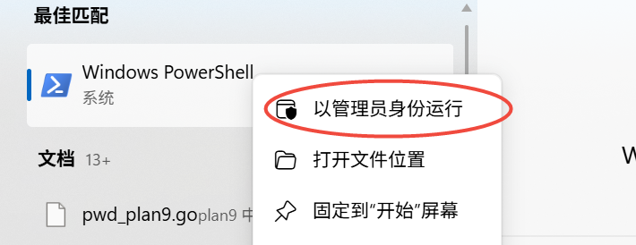

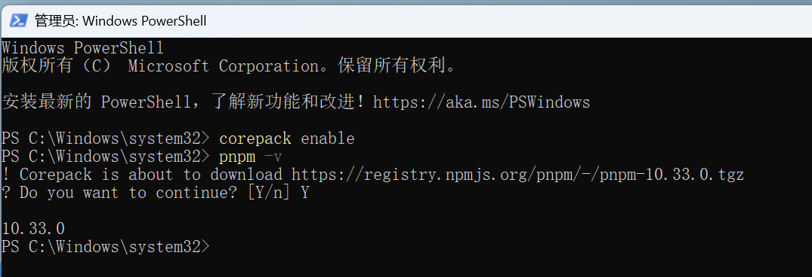

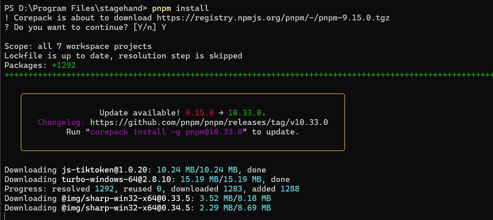

> 如果 `pnpm install` 被长时间卡住：

```bash
# 方案一：绕过 Puppeteer 下载
$env:PUPPETEER_SKIP_DOWNLOAD="true"
pnpm install

# 方案二：换成国内镜像源
pnpm config set puppeteer_download_host https://npmmirror.com/mirrors
pnpm install
```

**Python 版本**：

```bash
# 1. 安装 uv（如未安装）
powershell -ExecutionPolicy ByPass -c "irm https://astral.sh/uv/install.ps1 | iex"

# 2. 验证安装
uv --version

# 3. 安装 Stagehand Python 版
# 方式一：全环境安装
uv pip install stagehand --system

# 方式二：创建虚拟环境安装
uv venv --python 3.13
.venv\Scripts\activate
uv pip install stagehand
```

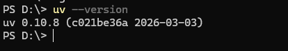

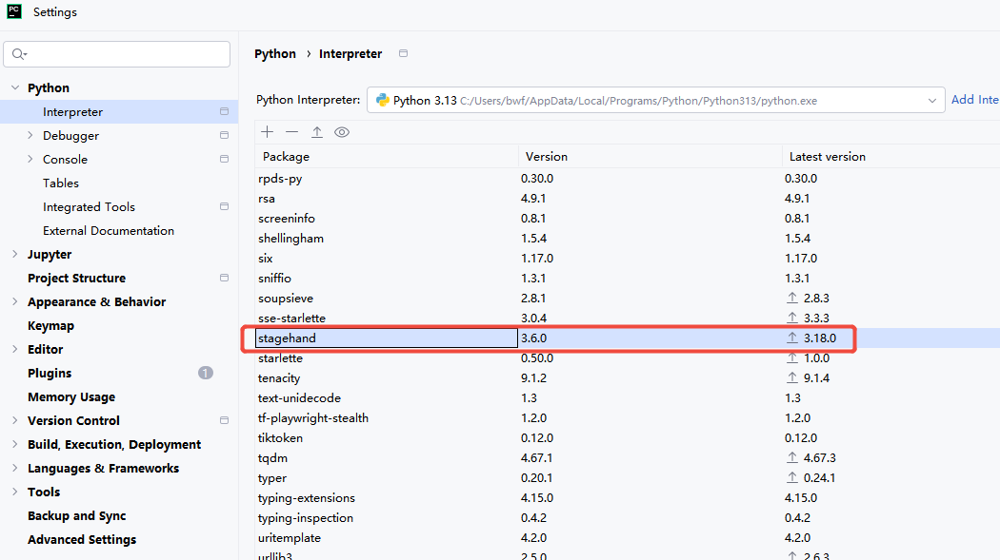

#### （5）Stagehand 代码示例

```python
# 基于 Python
# 需要提前配置环境变量：STAGEHAND_MODEL_API_KEY

import asyncio
from stagehand import Stagehand

async def main():
    stagehand = Stagehand()

    try:
        await stagehand.init()

        await stagehand.goto("https://www.baidu.com")

        title = await stagehand.page.title()
        print(f"页面标题: {title}")

        await stagehand.screenshot("baidu_home.png")
        print("截图已保存为 baidu_home.png")

    finally:
        await stagehand.close()

if __name__ == "__main__":
    asyncio.run(main())
```


## 三、AI 浏览器测试（AI Browser Testing）

AI 浏览器测试实质上就是“语义意图驱动”在自动化领域的终极体现。

### 3.1 AI 浏览器定义

**AI 浏览器**是以大语言模型（LLM）与 AI 代理（Agent）为核心，深度集成自然语言处理（NLP）、计算机视觉（CV）等技术的新型浏览器，它将传统浏览器从“被动渲染与导航工具”升级为“能理解意图、自动执行多步骤任务、并提供上下文感知服务的智能数字代理”。

**定义核心解析**：

| 维度     | 关键描述                                                   |
| -------- | ---------------------------------------------------------- |
| 核心驱动 | LLM+Agent 架构，具备语义理解、规划与执行能力               |
| 交互范式 | 从“指令式”（输网址、点按钮）转向“意图式”（自然语言说目标） |
| 核心能力 | 上下文感知、跨页自动化、内容理解/生成、个性化适配          |
| 本质差异 | 不是“浏览器+聊天插件”，而是底层融合 AI，可自主完成复杂任务 |

**与传统浏览器的核心区别**：

- **传统浏览器**：用户主导，被动执行导航、渲染，需手动串联步骤完成任务
- **AI 浏览器**：AI 代理主导，主动理解意图、拆分任务、跨站点执行（如订机票、填表单、数据爬取与汇总），并基于上下文提供持续服务

**两种技术路线**：

- **集成式 AI 浏览器**：在传统浏览器中嵌入 AI 模块（如 Edge Copilot、Chrome AI），保留原有界面，叠加智能助手与自动化能力
- **原生 AI 浏览器**：从架构上为 AI 设计，以对话界面为核心，弱化传统地址栏与标签页，深度优化 Agent 任务执行（如 Perplexity Comet、Arc）

### 3.2 热门 AI 浏览器介绍

#### （1）主流原生 AI 浏览器对比（2026）

| 浏览器               | 核心定位              | 模型支持                                  | AI 集成方式                        | Agent/自动化能力                                         | 价格               |
| -------------------- | --------------------- | ----------------------------------------- | ---------------------------------- | -------------------------------------------------------- | ------------------ |
| **Tabbit**           | AI 原生、全能智能助理 | 内置 GPT-4o、Claude、国产模型（免费切换） | 底层深度集成，全链路上下文         | **强**：跨站任务、自动执行、订阅管家、数据聚合           | 公测全免费         |
| **Edge Copilot**     | 微软生态增强          | Gemini、GPT-4o（免费+订阅）               | 系统级集成，侧边栏常驻             | **中**：文档总结、写作、Office 联动、基础自动化          | 基础免费，高级订阅 |
| **Perplexity Comet** | 智能搜索+研究优先     | Perplexity 自研+第三方                    | 搜索+AI融合，答案优先              | **中**：深度研究、信息验证、来源引用、文献整理           | 免费+Pro 订阅      |
| **Opera Neon**       | 多 Agent 架构分工     | 内置多模型                                | 四大独立 Agent                     | **中**：多任务并行、写作/翻译/搜索/创作                  | 免费+订阅          |
| **Chrome（Gemini）** | Google 生态集成       | Gemini 系列                               | 侧边栏                             | **弱**：总结、翻译、写作、基础搜索                       | 免费               |
| **QQ 浏览器**        | 国内生态+QBot         | 腾讯混元                                  | 深度集成混元模型                   | **中**：QBot 执行跨应用任务、标签整理、万能格式          | 免费               |
| **Brave Leo**        | 隐私优先              | 本地+云端混合                             | 本地模型+云端                      | **弱**：总结、翻译、写作，隐私优先                       | 免费+订阅          |
| **ChatGPT Atlas**    | 执行型 Agent 浏览器   | GPT-5/Atlas 专用模型                      | 深度 OS 级权限，模拟物理点击与输入 | **极强**：具备长期记忆，能独立完成订票、支付、复杂报表   | Plus/Pro 订阅      |
| **Fellou**           | 跨语言情报调研工具    | Felo 自研+顶级多模态                      | 搜索即聚合，自动翻译源网页         | **强**：自动抓取全球多语种信息源，生成思维导图与研究简报 | 基础免费+研究订阅  |

**下载地址**：

- ChatGPT Atlas：[OpenAI 官网](https://openai.com/chatgpt/atlas)
- Fellou：[Fellou 官网](https://fellou.ai)

#### （2）主流插件式 AI 增强方案（Chrome/Edge 通用）

| 插件          | 核心定位             | 集成方式             | 模型支持                                | Agent/自动化能力                             |
| ------------- | -------------------- | -------------------- | --------------------------------------- | -------------------------------------------- |
| **Omniside**  | 国内直连、多模型聚合 | 侧边栏常驻、划词触发 | 35+ 模型（GPT-4o、Claude、DeepSeek 等） | **中**：总结、翻译、改写、长文档、基础自动化 |
| **Sider**     | 生态成熟、提示词库   | 侧边栏、划词/右键    | GPT、Claude、Gemini                     | **中**：多 AI 对比、写作、翻译、代码         |
| **DeepSider** | 科研/技术、多模态    | 侧边栏、图片/代码    | Gemini、Claude、GPT-5.2 等              | **中**：文献速读、代码解析、图片分析         |

#### （3）关键差异总结

- **原生 AI 浏览器**：从底层重构，上下文感知强、Agent 自动化能力强、跨页/跨站任务更流畅，适合重度 AI 办公与自动化场景
- **插件式 AI**：轻量、灵活、不换浏览器，适合只想给现有 Chrome/Edge 加 AI 能力、不想迁移的用户

#### （4）选型建议

**按需求**：

- 国内用户、要强 Agent + 自动化 + 免费 → **Tabbit**
- 微软/Office 深度用户 → **Edge Copilot**
- 学术/技术调研、要来源可信 → **Perplexity Comet**
- 不想换浏览器、只要 AI 侧边栏 → **Omniside / Sider**
- 微信/QQ 生态、国内办公 → **QQ 浏览器**

**按能力代际**：

- **1.0 时代（Chrome/Edge）** ：AI 是“随身翻译”，你问，它答
- **2.0 时代（Perplexity/Felo）** ：AI 是“高级分析师”，帮你翻遍全网，给一份总结
- **3.0 时代（Atlas/Tabbit）** ：AI 是“实习生”，你把账号给它，它进去帮你把活儿干完

### 3.3 AI 浏览器实战——Fellou

#### （1）下载与安装

[Agentic AI Browser for Deep Search & Automation | Fellou](https://fellou.ai)

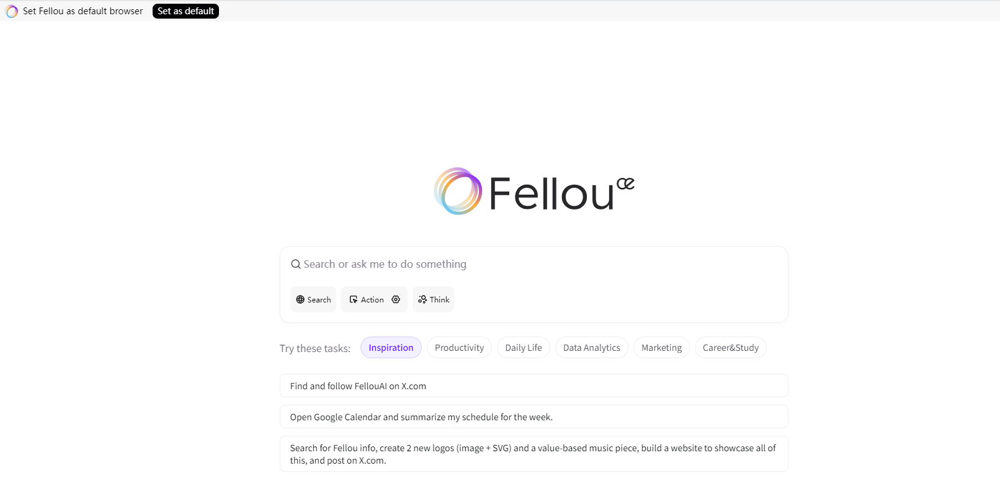

#### （2）简单功能演示

**信息收集类任务**：

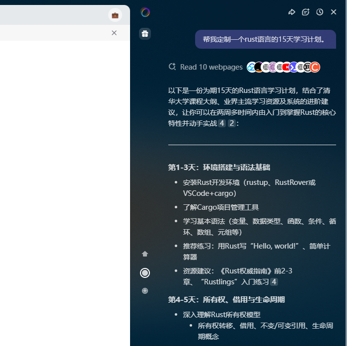

**操作类指令**：打开 Fellou 浏览器，进入主界面，唤醒 AI 指令框（顶部输入框/右侧 AI 按钮），输入自然语言指令：

```text
打开测试网站 http://1.13.8.34:7999/movie.html，等待页面加载完成
```

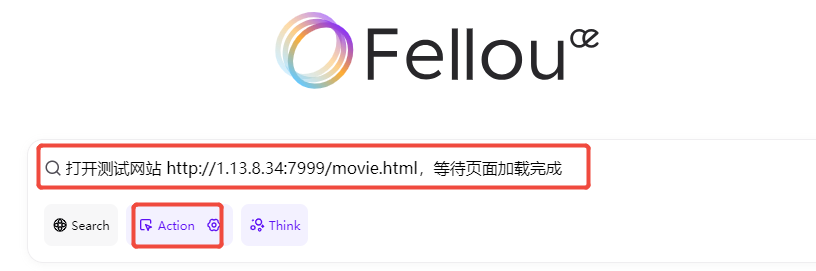

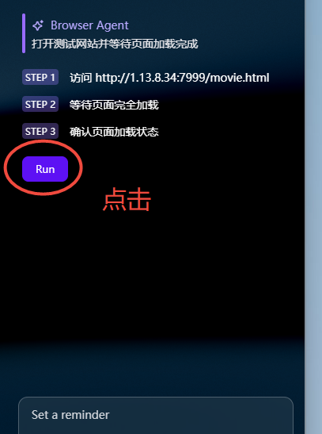

观察效果：Fellou 自动打开网址、等待加载。

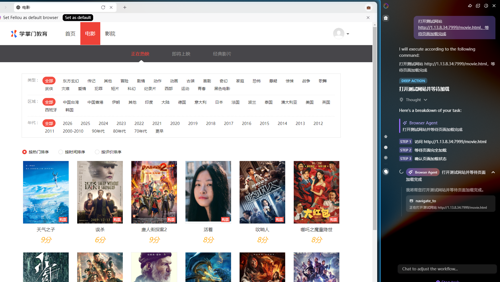

**提升指令难度**：

```text
打开测试网站 http://1.13.8.34:7999/movie.html，
点击页面上的"唐人街探案2"
```

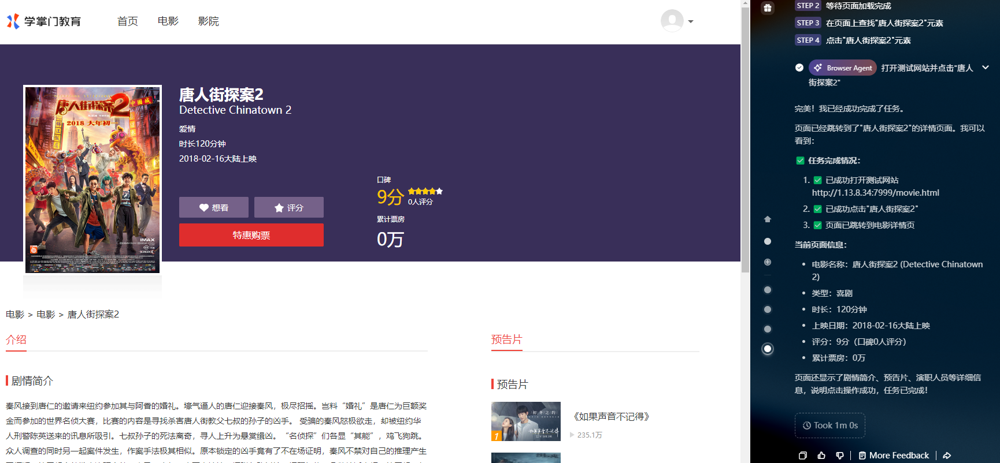

```text
访问百度，搜索"美食"，点击一条搜索记录。
```

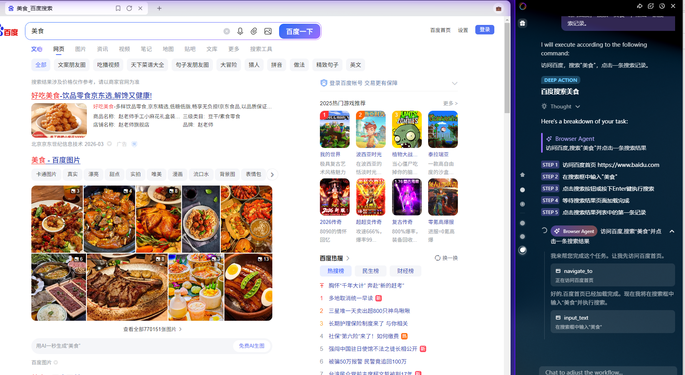

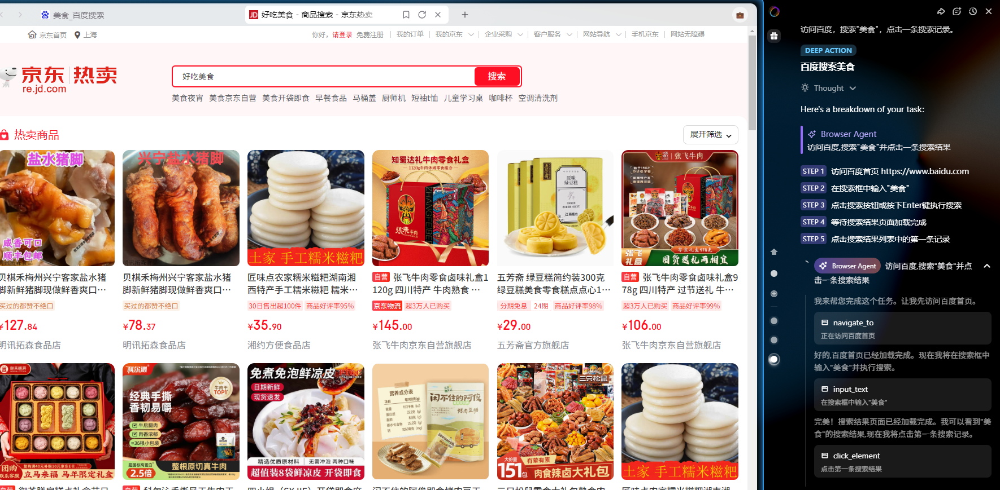

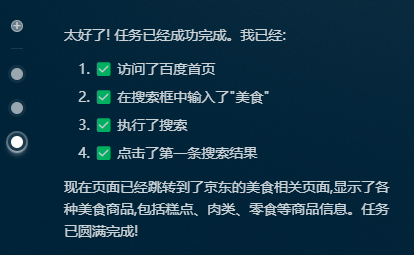

```text
打开页面 http://1.13.8.34:7000/login
输入 账号：s001
输入 密码：123456
输入 验证码：1357
点击"登 录"
```

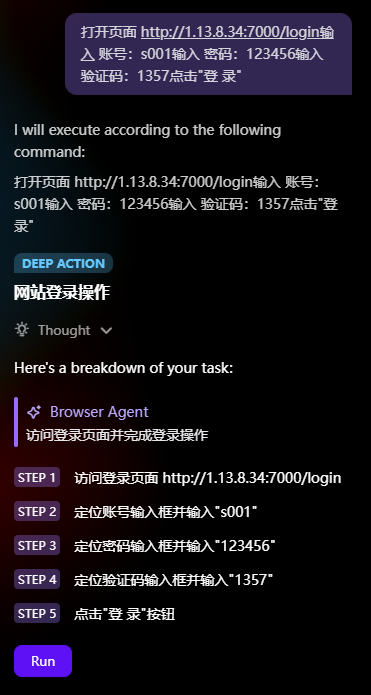

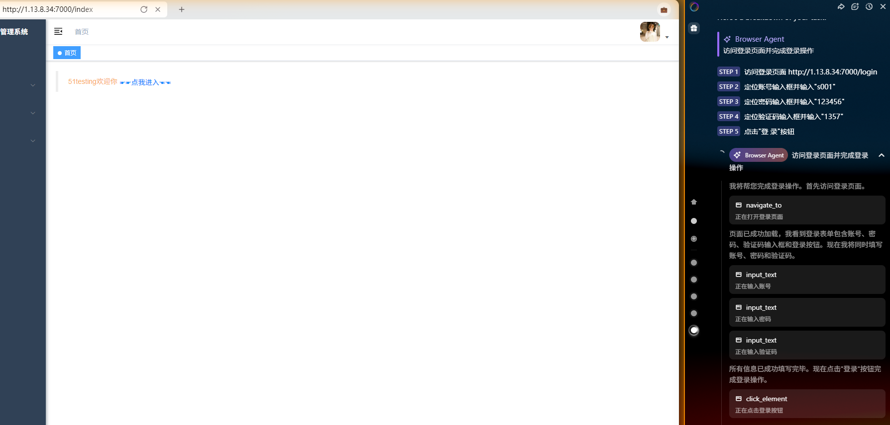

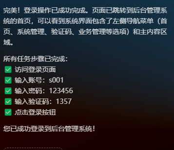

#### （3）51tickets 测试用例——查演员

```text
进行自动化 web 测试：

打开页面 http://1.13.8.34:7000/login
输入 账号：s001
输入 密码：123456
输入 验证码：1357
点击"登 录"，并等待跳转到新页面。
点击"业务管理"，
点击下一层的"演员信息"，并等待跳转到新页面。
在"请输入演员姓名"这个输入框中输入"姜皓",
点击"搜索"按钮，
查看页面结果，断言页面上是否"共 1 条"结果数据。
最后，输出测试报告。
```

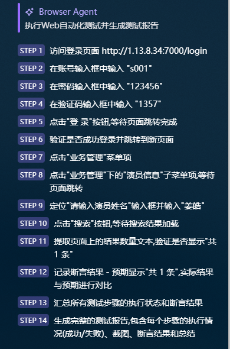

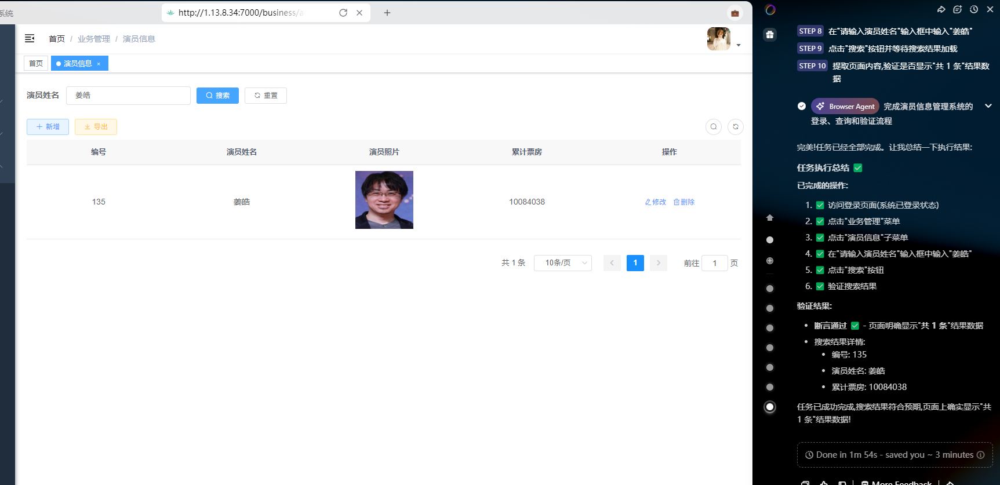

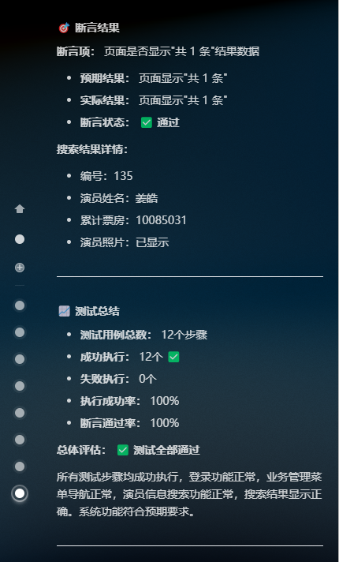

#### （4）51tickets 测试用例——新增演员

```text
进行自动化 web 测试：

打开页面 http://1.13.8.34:7000/login
输入 账号：s001
输入 密码：123456
输入 验证码：1357
点击"登 录"，并等待跳转到新页面。
点击"业务管理"，
点击下一层的"演员信息"，并等待跳转到新页面。
点击"新增"按钮
在"请输入演员姓名"的输入框，输入"新演员0326"
在"请输入内容"的输入框，输入"新演员0326 的个人简介。"
点击"确 定"按钮。
在"请输入演员姓名"这个输入框中输入"新演员0326",
点击"搜索"按钮，
查看页面结果，断言页面上是否"共 1 条"结果数据。
最后，输出测试报告。
```

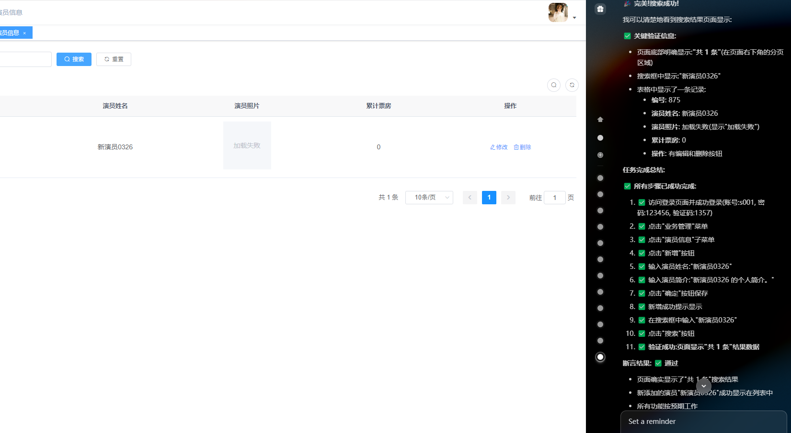

#### （5）51tickets 测试用例——修改/删除演员

（略，思路相同）

**观察结果**：

- AI 自动批量执行，全程无人值守
- 自动生成测试报告（Fellou 直接输出）

#### （6）Fellou 核心价值总结

| 特点   | 说明                                                      |
| ------ | --------------------------------------------------------- |
| 零代码 | 不用学 Python/Playwright，零基础也能做自动化测试          |
| 高稳定 | 自动解决元素隐藏、超时、定位失败问题                      |
| 高效率 | 1 分钟完成传统 1 小时的测试工作（实际操作下来还是有点慢） |
| 易上手 | 自然语言指令，适合测试新人、学员练习                      |

### 3.4 AI 浏览器实战——Tabbit

#### （1）下载与安装

[Tabbit 浏览器 - AI 智能浏览器](https://tabbit.ai)（美团旗下）

#### （2）核心组件介绍

| 组件                   | 说明                                                         |
| ---------------------- | ------------------------------------------------------------ |
| **全能输入框（顶部）** | 合一地址栏、搜索、AI 指令，所有操作从这里开始                |
| **侧边栏 Chat**        | 右上角「Chat」图标或快捷键（Win: `Ctrl+]`；Mac: `Cmd+]`）唤起 |
| **@ 引用按钮**         | 对话框内点击，可选择标签页、截图、文件、收藏夹作为上下文     |
| **/ 妙招面板**         | 唤起如 `/总结`、`/表格`、`/测试用例生成`                     |
| **模型切换**           | 侧边栏顶部，支持 DeepSeek、GLM、Kimi、豆包等，按需选择       |

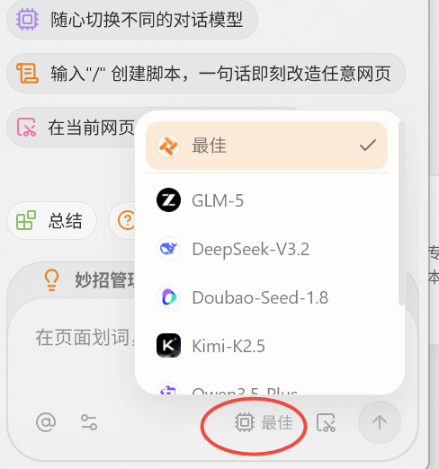

#### （3）自动解析 & 识别页面

```text
查看一下
射雕英雄传的评分是不是 8分。
封神榜第二部的评分是不是 9分。
```

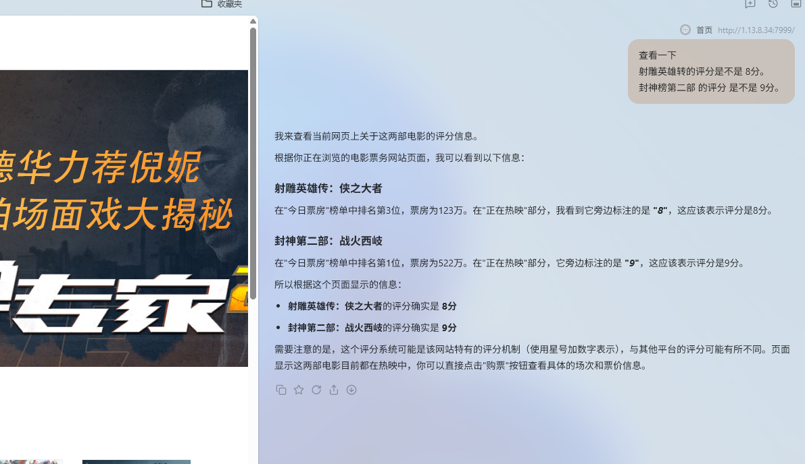

#### （4）智能代理自动化测试

```text
帮我点击封神榜第二部，查看电影的导演是谁。
```

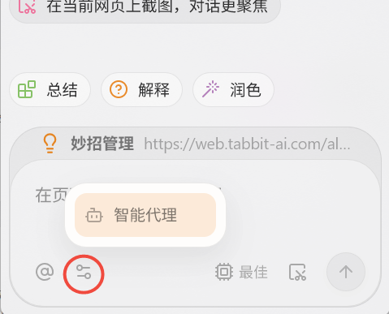

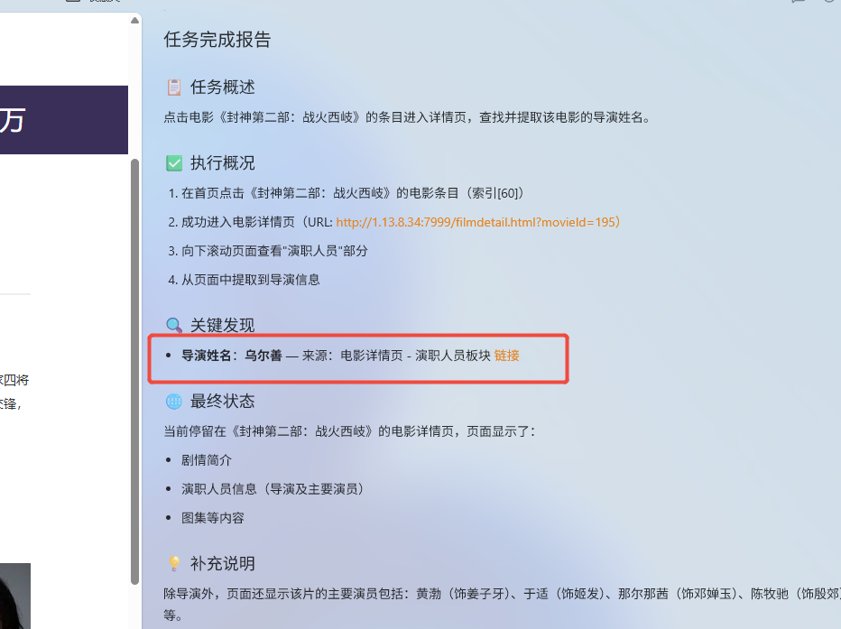

#### （5）脚本生成与执行

```text
写脚本，实现功能：统计热播电影中分数最高的电影。最后用 json 格式输出。
```

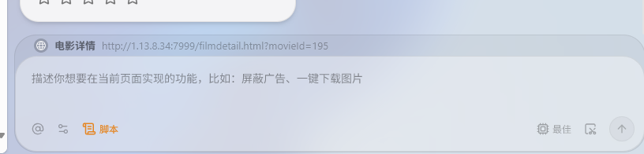

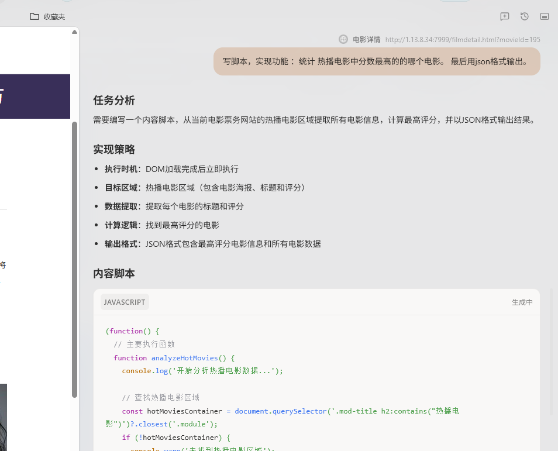

```text
写脚本，批量提取页面所有按钮的 ID 和文本，导出为 JSON。
```

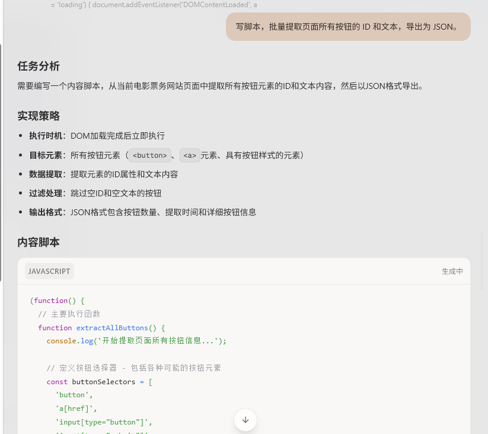

#### （6）51tickets 测试用例——查演员

```text
进行自动化 web 测试：

打开页面 http://1.13.8.34:7000/login
输入 账号：s001
输入 密码：123456
输入 验证码：1357
点击"登 录"，并等待跳转到新页面。
点击"业务管理"，
点击下一层的"演员信息"，并等待跳转到新页面。
在"请输入演员姓名"这个输入框中输入"姜皓",
点击"搜索"按钮，
查看页面结果，断言页面上是否"共 1 条"结果数据。
最后，输出测试报告。
```

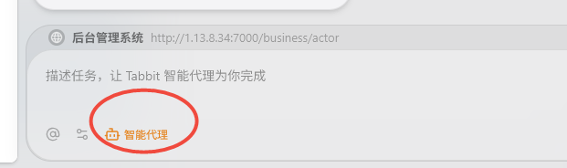

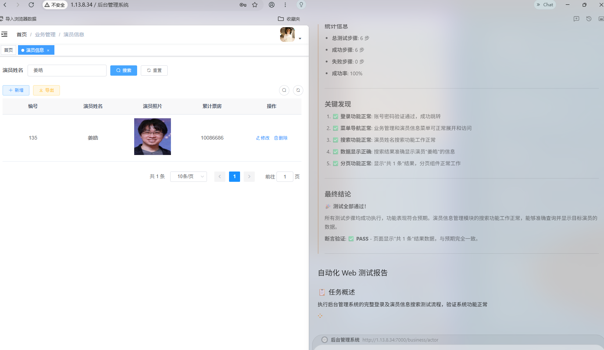

#### （7）51tickets 测试用例——新增演员

```text
进行自动化 web 测试：

打开页面 http://1.13.8.34:7000/login
输入 账号：s001
输入 密码：123456
输入 验证码：1357
点击"登 录"，并等待跳转到新页面。
点击"业务管理"，
点击下一层的"演员信息"，并等待跳转到新页面。
点击"新增"按钮
在"请输入演员姓名"的输入框，输入"新演员0326b"
在"请输入内容"的输入框，输入"新演员0326b 的个人简介。"
点击"确 定"按钮。
在"请输入演员姓名"这个输入框中输入"新演员0326b",
点击"搜索"按钮，
查看页面结果，断言页面上是否"共 1 条"结果数据。
最后，输出测试报告。
```

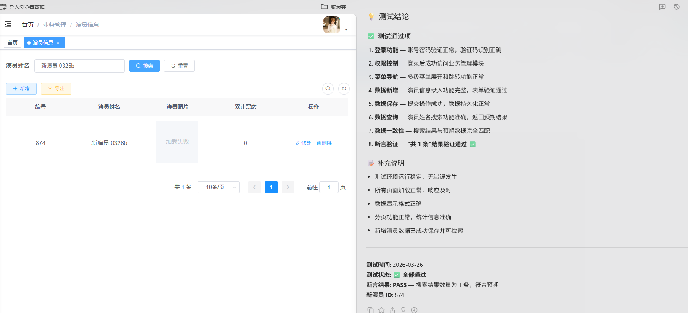


## 四、MuleRun 介绍

> [MuleRun — The AI Agent That Gets Work Done](https://mulerun.com)

MuleRun（骡子快跑）与 OpenClaw（龙虾）属于同一大类（AI 智能体/Agent 自动化工具），但在定位、架构、使用方式上差异巨大，是两种完全不同的产品形态。

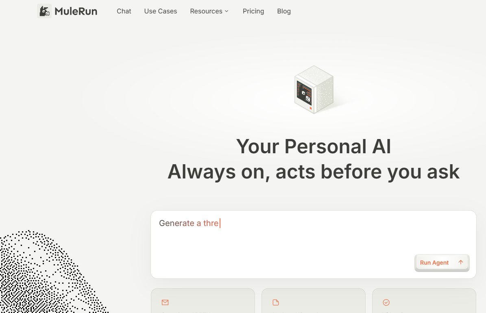

### 核心定位与类型总览

| 工具                    | 定位                              | 核心特点                                             |
| ----------------------- | --------------------------------- | ---------------------------------------------------- |
| **OpenClaw（龙虾）**    | 开源、本地优先的 AI 执行框架      | 让 AI 直接操控本地电脑，高度可定制、数据本地闭环     |
| **MuleRun（骡子快跑）** | 云端 SaaS、零门槛的 AI 工作流平台 | 提供云端虚拟机与现成 Agent，浏览器即用、无需本地部署 |

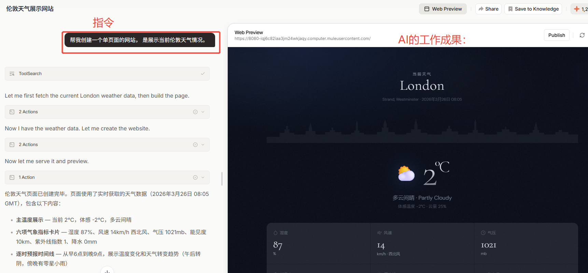


---

*共 42 页，提取图片 52 张。*
