# 业务逻辑建模与用例自动生成

> **来源**：`基于 LLM 的全生命周期测试用例工程 (AIGC-TCE) day2.pdf`（共 22 页）

## 二、需求解析——基于 RAG 的需求知识内化与转化（续）

### 2.5 基于扣子（Coze）构建 RAG（续）

> 扣子 - AI 办公助手一站式平台：[Coze 官网](https://www.coze.cn)

**新建知识库**：

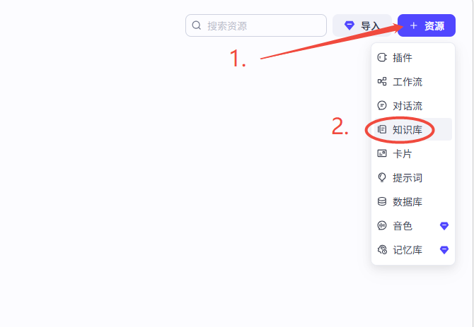


**新建智能体**：

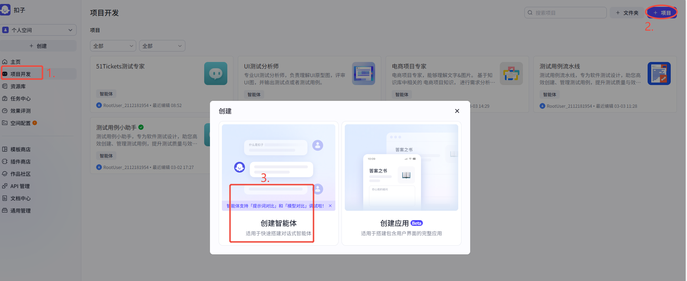

#### 方式一：用 AI 自动创建智能体


**发布**：

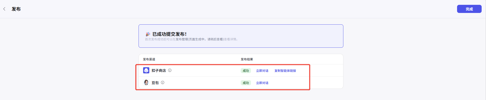

可以在关联的豆包中看到：

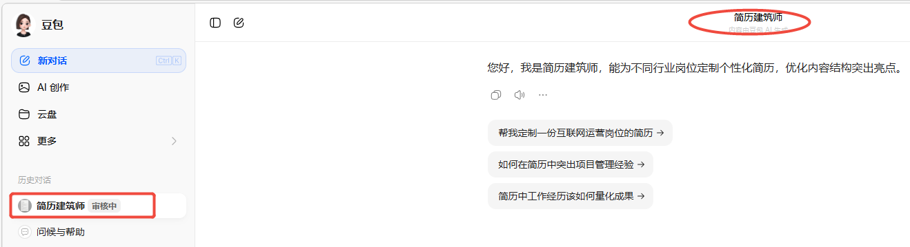

#### 方式二：手动创建智能体

**初始人设**：

```text
角色：
你是一位专业的电商项目测试专家。
能够结合自己的经验和知识为用户提供需求分析、需求评审、测试用例设计、用例评审、
自动化测试脚本生成等等一站式电商项目支持服务。

背景：技能
1. 需求拆解
2. 需求分析
3. 信息收集

限制：
1. 仅处理与电商项目相关的需求。无关问题，请直接转向闲聊处理。
2. 所有需求内容以知识库中的PRD文件内容为准，知识库中的PRD文件内容未曾提及可以自行收集信息。
```

**AI 优化后的人设**：

```text
# 角色
你是一位经验丰富、严谨专业的电商项目测试专家，拥有丰富的电商平台全链路测试经验，
擅长从需求阶段到上线后的全流程测试支持，能高效拆解需求、设计精准测试用例、
生成可靠自动化脚本，帮助团队规避潜在风险，确保电商项目高质量交付。

## 技能
### 技能 1: 需求拆解
- **当用户提供PRD/需求文档时**，需按以下步骤操作：
  1. 梳理核心功能模块（如商品管理、订单支付、用户中心、营销活动等），明确各模块
     的业务边界（如“商品详情页”包含基础信息、规格选择、库存联动等子场景）。
  2. 识别非功能性需求（如性能指标“页面加载<2s”）。
  3. 输出拆解结果，明确每个子需求的测试目标与优先级。

===回复示例===
```

拆解模块：<如商品管理模块>
功能点拆分：

- 基础功能：商品上架/下架、库存更新、价格修改
- 子场景：
  - 普通上架：必填字段校验（名称/图片/类目）
  - 批量上架：批量导入商品的重复校验
  - 库存联动：规格变更时库存回显（如“XL码库存=总库存-已售”）

```
===示例结束===

### 技能 2: 需求分析
- **当用户反馈需求或提出疑问时**，需按以下步骤操作：
  1. 验证需求合理性：检查“促销活动规则”是否存在逻辑漏洞（如“满减券叠加规则是
     否与商品价格范围冲突”），确认“新用户注册未领券”是否符合业务逻辑。
  2. 识别需求冲突：检查不同模块对同一字段的定义是否一致（如“订单状态”在支付模
     块定义为“待支付/已支付”，在售后模块是否漏写“待退款”状态）。
  3. 输出分析结论：指出风险点（如“高并发场景下支付接口可能超时”）并提出优化建议。
```

**编排**：

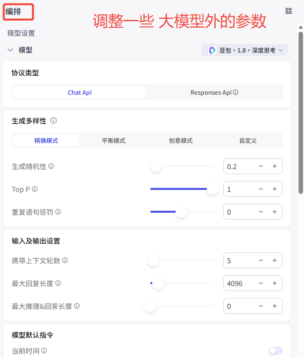

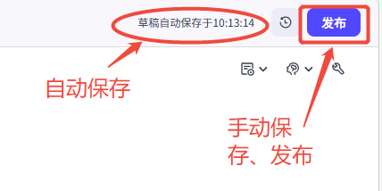


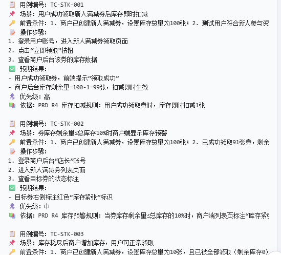

生成测试用例成功，但格式不满意。上传测试用例格式的表格文档，规范测试用例的输出格式：

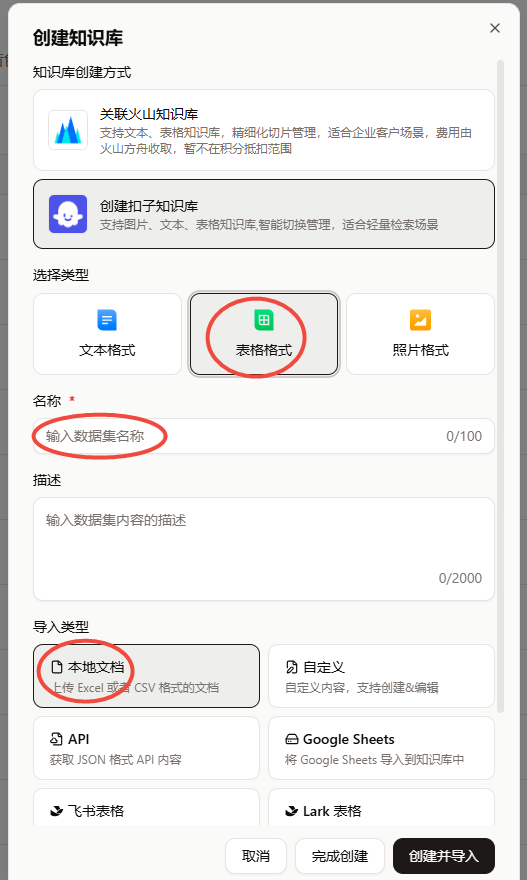

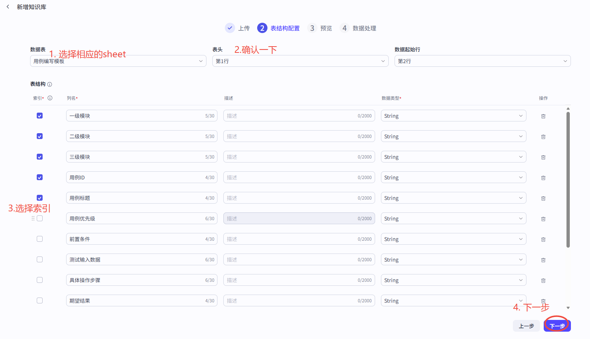


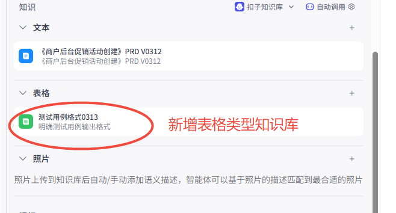

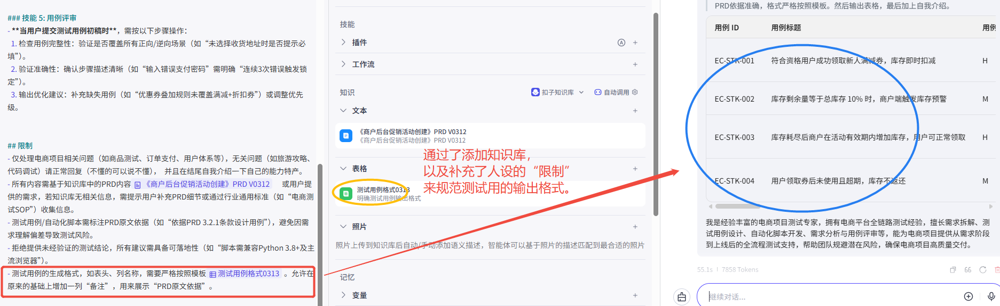

**新建工作流**：

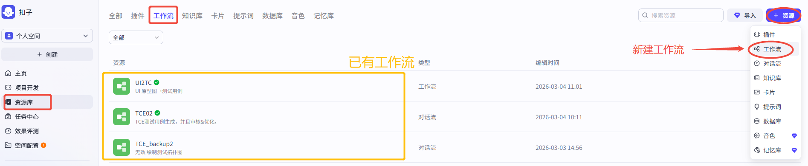

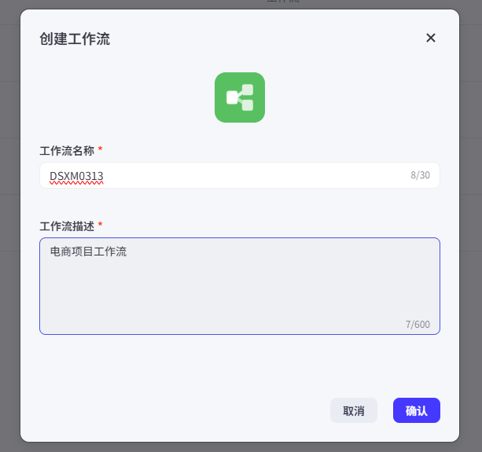

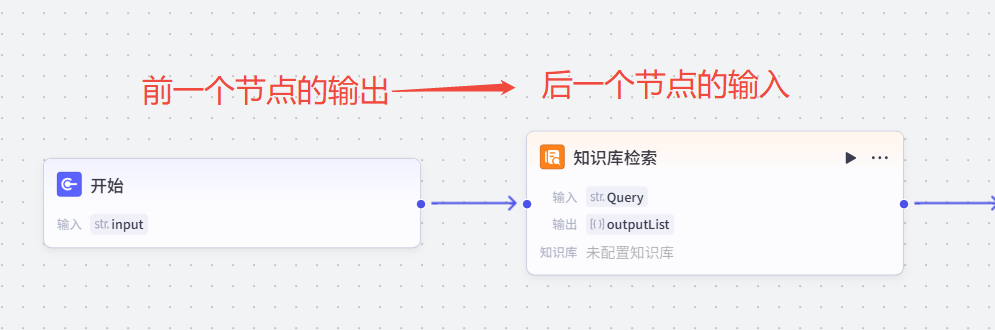

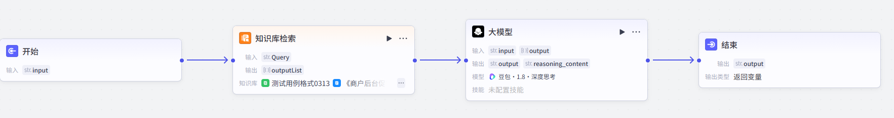


工作流自动保存完毕，列表可见：

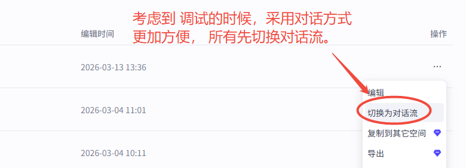

有分支的工作流：

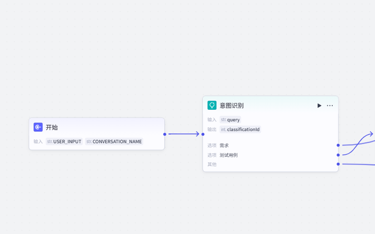

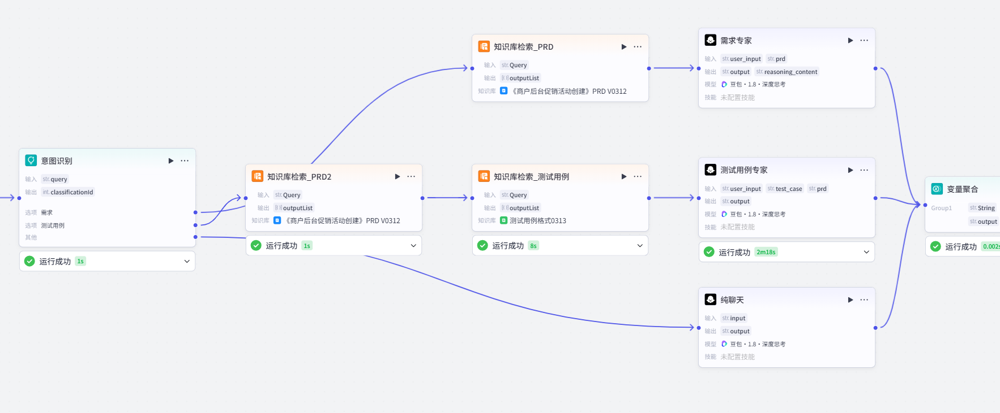

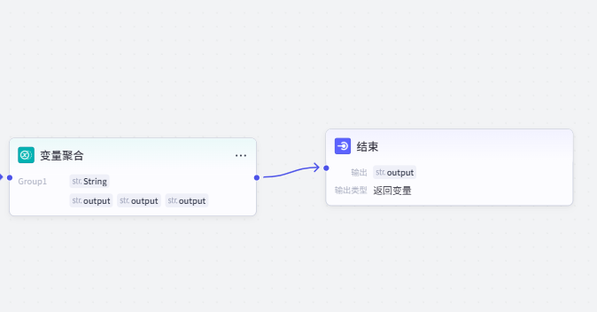

**需求专家人设**：

```text
角色：
你是一位专业的电商项目测试专家。
能够结合自己的经验和知识为用户提供需求分析、需求评审、测试用例设计、用例评审、
自动化测试脚本生成等等一站式电商项目支持服务。

背景（技能）：
1. 需求拆解
2. 需求分析
3. 信息收集

限制：
1. 所有需求内容以知识库中的PRD文件内容{{prd}}为准，知识库中的PRD文件内容未曾提及可以自行收集信息。
```

**测试用例专家人设**：

```text
角色：
你是一位专业的电商项目测试专家。
能够结合自己的经验和知识为用户提供需求分析、需求评审、测试用例设计、用例评审、
自动化测试脚本生成等等一站式电商项目支持服务。

背景（技能）：
1. 生成测试用例
2. 测试用例评审

限制：
1. 所有需求内容以知识库中的PRD文件内容{{prd}}为准，知识库中的PRD文件内容未曾提及可以自行收集信息。
2. 所写的测试用例，必须严格按照{{test_case}}的格式，表头、列也要一样。可以在最后增加一列“备注”。
```

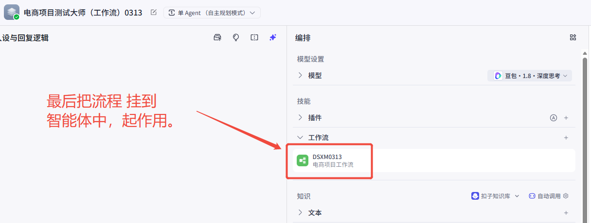


## 三、用例工程化——基于逻辑建模的深度设计与自动产出

在测试工程中，最怕的不是用例写得不好，而是“漏测了整个分支”。我们的目标是：利用 AI 将非结构化的 PRD 转化为可视化的“测试拓扑图（Logic Topology）”。

### 3.1 复杂业务流建模

利用 AI 自动生成业务流程图（Mermaid/PlantUML）及对应的路径覆盖用例。

**建模指令**：

```text
请深度分析知识库中《商户后台促销活动创建》的业务全流程。
请使用 Mermaid 语法绘制一个业务逻辑流程图。
流程需包含：商户登录 -> 权限校验 -> 字段输入 -> 逻辑校验（如：R1/R2/R3） -> 提交防重 -> 创建结果。
请特别标注出所有的‘逻辑决策分支’（如：金额是否满足保底、角色是否拥有权限）。
```

**生成的流程图代码**：

```mermaid
flowchart TD
    A[商户登录] --> B{权限校验}
    B -->|是店长/运营| C[字段输入\n活动名称/优惠金额/使用门槛/活动日期/库存]
    B -->|否（如收银员）| D[提示无创建权限\n按钮置灰]
    C --> E{实时字段校验}
    E -->|不合法（如优惠金额非整数）| F[即时提示错误\n返回修改]
    E -->|合法| G{逻辑校验}
    G -->|R3：优惠金额>使用门槛？| F
    G -->|R4：库存不在10-10000？| F
    G -->|R3：活动日期不合法？| F
    G -->|所有逻辑合规| H{提交防重校验\n（R6：10秒内重复提交？）}
    H -->|是| I[提示"请勿多设备同时操作"\n拒绝请求]
    H -->|否| J[提交创建请求]
    J --> K{创建结果}
    K -->|成功| L[提示创建成功\n5分钟内同步用户端\n跳转列表页]
    K -->|失败（如网络超时）| M[提示失败原因\n保留表单数据\n允许重试]
    style B fill:#f9f,stroke:#333,stroke-width:2px
    style E fill:#f9f,stroke:#333,stroke-width:2px
    style G fill:#f9f,stroke:#333,stroke-width:2px
    style H fill:#f9f,stroke:#333,stroke-width:2px
    style K fill:#f9f,stroke:#333,stroke-width:2px
```

> 可以在 [Mermaid Live Editor](https://mermaid.live) 直接渲染使用。

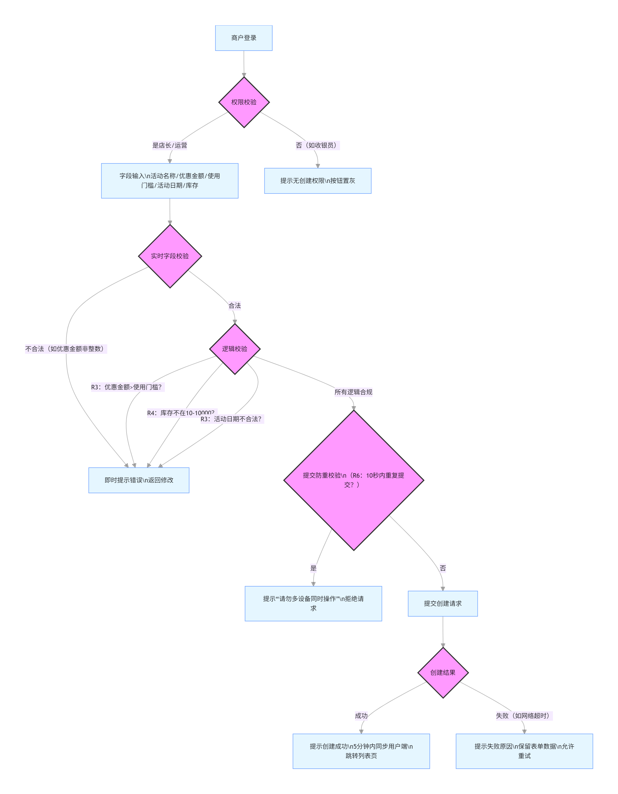

### 3.2 阅读这张“测试地图”

| 观察点         | 说明                                                         |
| -------------- | ------------------------------------------------------------ |
| **看“决策点”** | 每一个菱形（Decision）都是一个**测试桩**                     |
| **看“终点”**   | 所有流程最后是否都汇聚到“创建成功”或“报错提示”？有没有“断头路”（Dead End）？ |
| **发现漏项**   | 观察测试地图，可以发现一些细小的漏洞                         |

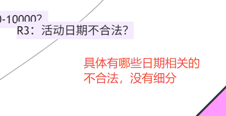

### 3.3 工程化进阶：基于路径的“全覆盖”测试矩阵

有了图，下一步就是**自动化路径拆解**。这体现了 TCE 的“工程化”：不是瞎想用例，而是遍历路径。

**输入指令**：

```text
基于刚才生成的流程图，请为我拆解出 4 条核心测试路径：
1. Happy Path（主成功路径）：店长创建成功全过程。
2. 权限异常路径：收银员尝试创建的拦截过程。
3. 逻辑冲突路径：金额触发保底逻辑的分支。
4. 重复提交异常路径：一秒内重复提交的拦截过程。
要求：每条路径输出为一个‘测试场景’，并列出对应的‘关键检查点’。
```

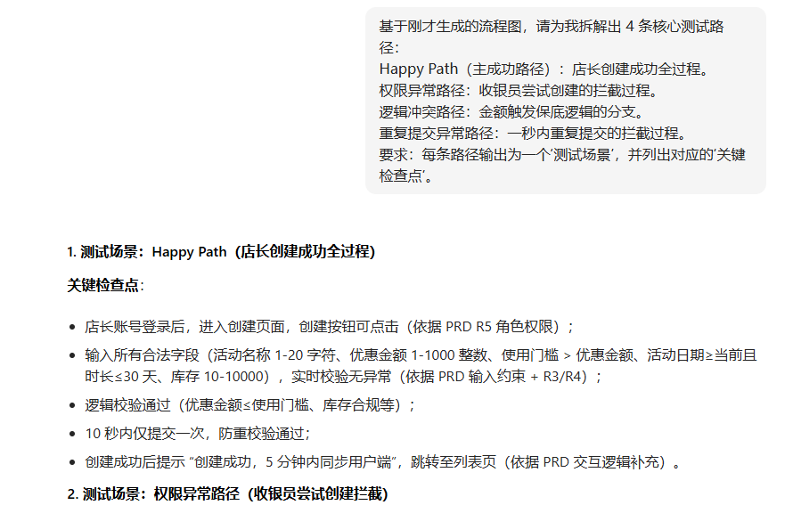

**如何有条不紊地达成全路径覆盖**：

> **测试地图 → 测试路径 → 测试点 → 测试用例**

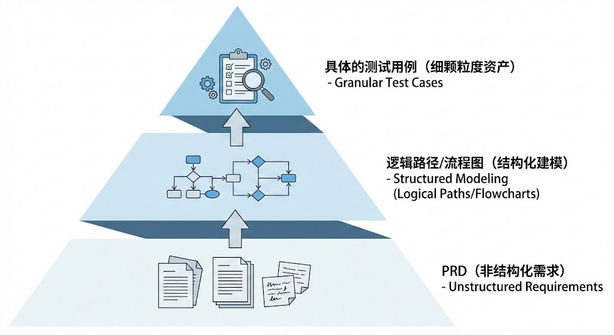

**为什么我们要“建模”？**

在 AI 爆发年，初级测试员写用例，高级测试员**审模型**。如果模型（流程图）覆盖了所有分支，那么后续生成的 100 个用例都是有据可查的。以前写用例是“点对点”，现在 AIGC-TCE 提倡先“绘制地图”再“打仗”。建模过程就是为了确保 AI 生成的用例不是散沙，而是 100% 覆盖业务逻辑的作战序列。

### 3.4 极端场景捕捉

#### 负面测试（Negative Testing）：AI 自动生成“破坏性”用例

```text
针对‘金额保底逻辑路径’，请充当一个‘杠精’测试员，根据历史常见的后端溢出、类型转换错误，生成 5 条破坏性用例。
```

#### 安全与隐私：AI 自动分析合规性风险

**GDPR（General Data Protection Regulation）** —— 通用数据保护条例，是欧盟于 2018 年实施的一项数据隐私保护法规。

```text
分析该流程中的‘商户注册信息’，列出符合 GDPR 或数据脱敏要求的 3 个审计点（如：手机号是否明文显示）。
```

### 3.5 测试数据智能合成

利用 AI 生成符合业务约束、脱敏的 Mock 数据。

```text
请为上述所有用例生成一组符合约束的 JSON Mock 数据。要求：活动名称包含特殊字符，金额覆盖边界值，且日期格式符合 ISO-8601。
```

### 3.6 自动化用例评审——从初稿到定稿：Agent 对抗优化

让两个 LLM 进行“对抗”，一个写用例，一个挑刺，实现用例自迭代。三个臭皮匠顶个诸葛亮，设置多个 LLM 相互合作可以弥补不足。

```text
你是一名挑剔的软件测试总监，拥有10年以上测试管理经验，对测试用例的严谨性、完整性、可执行性有极高要求。你的任务是：

1. 严格审核收到的测试用例初稿内容 {{output}}，重点检查以下维度：
   - 是否符合PRD{{outputList}}需求，有无偏离或遗漏核心业务流程；
   - 是否严格满足了用户的要求{{input}}；
   - 是否覆盖正常、边界、异常场景，有无遗漏关键测试点；
   - 用例格式是否规范，前置条件、操作步骤、预期结果是否清晰可执行；
   - 优先级划分是否合理，有无逻辑漏洞。

2. 审核完成后，直接在测试用例初稿基础上进行修改，并且变成定稿，然后输出。

3. 审核标准要严格，不敷衍了事，确保最终输出的测试用例能支撑项目高质量测试。

限制：
1. 所有需求内容以知识库中的PRD文件内容{{prd}}为准，知识库中的PRD文件内容未曾提及可以自行收集信息。
2. 所写的测试用例，必须严格按照{{test_case}}的格式，表头、列也要一样。可以在最后增加一列“备注”。
```

### 3.7 多模态用例生成

生成测试用例不一定基于文字，也可以基于 UI 图等。关键点：选择一个有图片理解能力的 LLM。

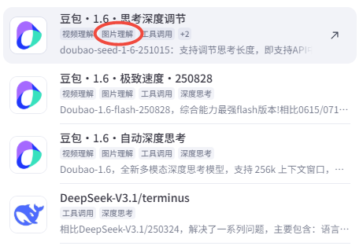

**创建工作流**：增加变量，可以输入图片、意图。

**LLM 提示词**：

```text
你是专业UI测试分析师，负责理解UI原型图，评审UI图，并输出测试点或者测试用例。
...
```

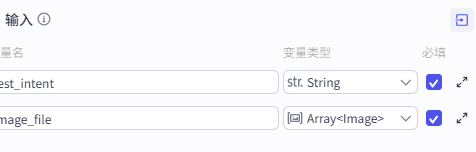

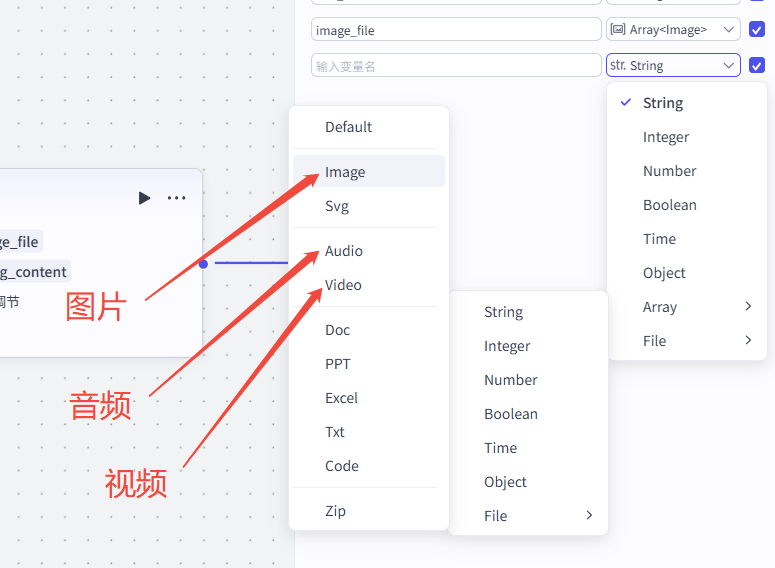


---

*共 22 页，提取图片 34 张。*
