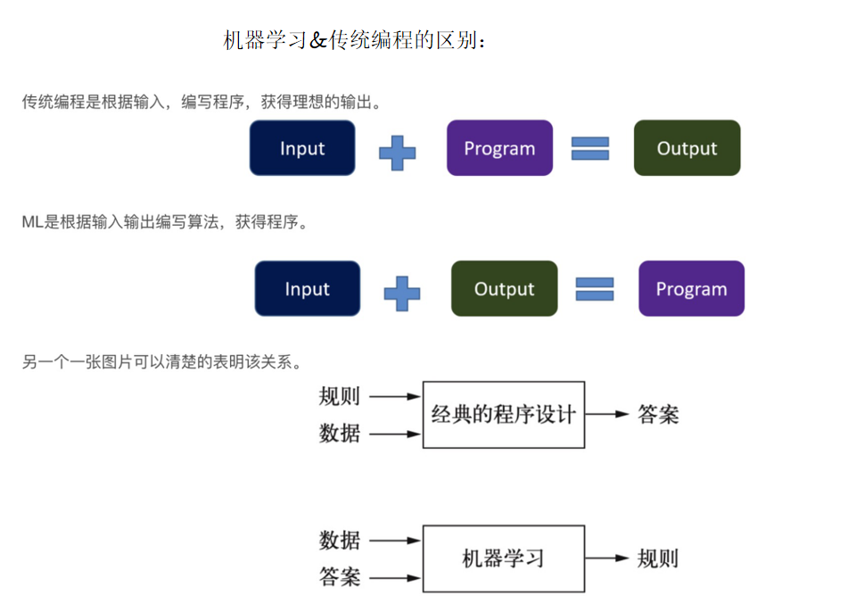
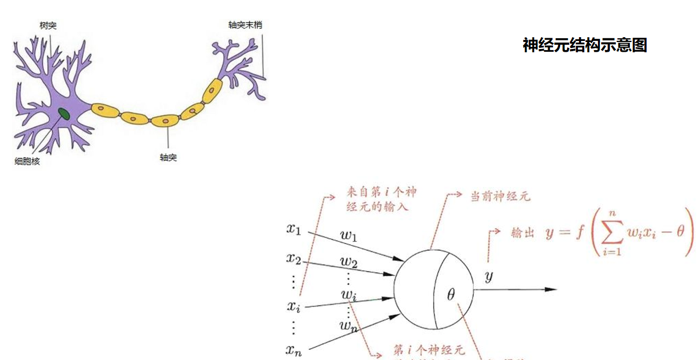

# AI 基础通识

> 本文为个人学习笔记，内容经客观化整理与联网核验（最近一次核验：2026-08）。
> 涉及具体模型版本、厂商数据的部分更新迅速，文中标注「截至 2026-08」之处请以官方最新信息为准。

---

## 一、定义

人工智能（Artificial Intelligence，简称 AI）是计算机科学的一个分支，旨在研究如何使机器模拟、延伸和扩展人类的智能行为，使机器能够执行通常需要人类智能才能完成的任务，如感知、推理、学习、语言理解、决策等。

核心目标是让机器从数据中自动学习规律并适应环境，而非依赖人类预先编写的固定规则。

### 1. 核心技术路径

- **机器学习（Machine Learning, ML）**：通过数据训练模型，让机器自动从数据中学习规律。按学习范式可分为：
  - 监督学习：使用带标签数据训练（如垃圾邮件分类、图像识别）。
  - 无监督学习：使用无标签数据发现内在结构（如客户分群、聚类）。
  - 强化学习：通过「试错 + 奖励」优化行为策略（如机器人学走路、AlphaGo 下棋）。
- **深度学习（Deep Learning, DL）**：基于多层神经网络（深层神经网络）的机器学习分支，擅长处理图像、语音、自然语言等复杂数据，是当前 AI 能力爆发的关键驱动力（如 ChatGPT、AlphaFold）。
- **强化学习（Reinforcement Learning, RL）**：如上所述，强调智能体与环境交互、以奖励信号驱动策略优化，常与深度学习结合（深度强化学习）。

### 2. 通俗比喻（帮助理解，非严格定义）

- **监督学习**：按菜谱做菜（有标准答案对照）。
- **无监督学习**：面对一堆食材自己搭配、找规律（无标准答案）。
- **强化学习**：通过试吃和评委打分不断调整烹饪（试错 + 奖励）。

### 3. AI 的分类：从「狭义」到「通用」

- **弱人工智能 / 狭义人工智能（ANI, Artificial Narrow Intelligence）**
  - 专注于单一任务，无法跨领域泛化。
  - 依赖特定数据与算法，擅长「专精」但缺乏通用智能。
  - 当前所有落地的 AI 系统（包括大语言模型在特定任务上的表现）都属于 ANI 范畴。
- **通用人工智能（AGI, Artificial General Intelligence）**
  - 假设中的 AI，能在任意认知任务上达到或超越人类水平，具备迁移、抽象、自我改进等能力。
  - 现状：仍处于研究阶段。业界尝试以「大模型 + Agent」逼近 AGI，但距离真正的 AGI 仍有较长距离。
- **超级人工智能（ASI, Artificial Superintelligence）**
  - 在几乎所有领域全面超越人类智能（含创造力、科学发现等）。
  - 目前仅存在于设想与讨论中，是 AI 研究的远期目标，也伴随安全风险讨论。

### 4. 概念层级比喻（以「烹饪」为喻，辅助理解）

- **AI** → 美食（终极目标：好吃的智能）
- **机器学习** → 烹饪（实现美食的核心手段）
- **深度学习** → 分子料理（更精细、依赖深层工艺的分支）
- **强化学习** → 反复试菜调味的迭代过程（可选补充理解）

### 5. 关于「AI 流派」的说法（非正式比喻，非权威分类）

业界常把不同的 AI 研究路线用一种**非正式比喻**来描述，需注意它并非严格的学术分类：

- **「飞机派」**：追求可解释、统一的理论框架（如 Yann LeCun 主张的世界模型 / 联合嵌入预测架构），类比「不模仿鸟、而是理解飞行原理来造飞机」。
- **「鸟派 / 训鸟派」**：通过大规模训练让模型「像生物一样」从数据中习得能力，类比训练鸟类完成任务。
- **「涌现派」**：主张依靠海量数据 + 巨大算力，让能力在规模扩大时自然「涌现」。

这一比喻有助于直觉理解路线分歧，但不应替代对具体技术（Transformer、扩散模型、RLHF 等）的客观认识。

---

## 二、AI、AGI、AIGC 与 LLM 等核心概念

### 1. 基础概念

- **AI（人工智能）**：计算机科学分支，旨在通过算法与技术模拟、延伸和扩展人类智能行为。其理论基础横跨数学（线性代数、概率统计、微积分、最优化）、计算机科学（算法、体系结构）、神经科学、认知心理学、语言学等。
- **AGI（通用人工智能）**：具备人类级别通用智能、能理解并学习处理任意认知任务的系统。当前主流探索路径为「大模型 + Agent」。
- **AIGC（AI 生成内容）**：利用 AI 技术生成文本、图像、音频、视频等内容。

### 2. 技术层级关系

- **AI ⊃ 机器学习 ⊃ 深度学习**：AI 是总体目标；机器学习是实现 AI 的核心手段；深度学习是机器学习中当前最重要、应用最广的技术分支。当前 AI 能力的爆发主要依赖机器学习（尤其是深度学习）。

### 3. LLM 工作原理（基础补充）

大语言模型（Large Language Model, LLM）是当下 AI 应用的核心载体，理解以下概念有助于看懂后续内容：

- **Transformer（2017）**：Google 在《Attention Is All You Need》中提出的架构，以「自注意力机制（Self-Attention）」替代循环结构，使模型可并行处理长序列，是现代大模型的基础。
- **Token**：模型处理文本的最小单位（一个词、子词或字符）。上下文窗口、价格、长度限制通常以 token 计（中文约 1–2 字 ≈ 1 token，不同分词器有差异）。
- **预训练（Pre-training）**：在海量无标注语料上训练，让模型学习通用语言表征与世界知识。
- **微调（Fine-tuning）与对齐**：用特定领域 / 任务数据进一步调整参数；结合人类反馈强化学习（RLHF）或 AI 反馈（RLAIF）使输出更符合人类期望、更安全可用。
- **推理（Inference）**：模型生成回答的阶段，通常采用自回归方式逐个生成 token；可通过温度（temperature）、top-p 等参数控制确定性 / 多样性。
- **Embedding（向量化）**：将文本映射为稠密向量，使语义相近的内容在向量空间中也相近，是语义检索（RAG）的基础。
- **幻觉（Hallucination）**：模型生成看似合理但事实错误或无依据内容的现象。RAG、对齐训练、工具调用可降低幻觉，但**不能彻底消除**。

### 4. RAG（检索增强生成，Retrieval-Augmented Generation）

一种结合检索与生成的优化方案：在大模型生成回答前，先从外部知识库（文档库、数据库、互联网）检索与问题相关的精准信息，将其作为「参考资料」拼入提示词，再由大模型基于这些资料生成回答。

> 通俗理解：RAG 就是给 LLM 配了一个「随时可查阅的图书馆」。

**核心工作流程：**

- **数据索引（Indexing）**：将文档切分为小块（Chunks），用 Embedding 模型转为向量，存入向量数据库（如 Milvus、Pinecone）。
- **检索（Retrieval）**：根据用户问题，在向量库中检索语义最相近的片段。
- **增强（Augmentation）**：将检索到的「干货」拼接到 Prompt 中。
- **生成（Generation）**：LLM 基于参考资料作答，可显著提升事实准确性、**显著降低幻觉**（注意：并非完全杜绝）。

> 测试场景示例：用户问「请针对『下单』模块生成测试用例」，系统先在向量库检索『下单』相关业务规则，再据此生成用例。

### 5. 大模型微调（Fine-Tuning）

在预训练大模型（如 GPT、LLaMA、GLM 等）基础上，使用特定领域 / 任务的数据集进一步训练，调整模型参数以适配具体场景。预训练模型如同「具备通用知识的基础人才」，微调则是针对具体岗位的「专项培训」。

### 6. Agent（智能体）

能够感知环境、自主决策并执行动作以实现目标的系统。核心是**自主性**与**行动力**。

- **核心组成**：Agent = LLM（大脑） + 规划（Planning） + 记忆（Memory） + 工具使用（Tool Use）。
- **与传统 LLM 的区别**：仅用 LLM 像「博学但瘫痪的学者」——能写方案却打不开浏览器、改不了代码；Agent 像「能动手的工程师」——可自主拆解目标、调用工具（如 Playwright、Postman、SQL 客户端）完成任务。

---

## 三、AI 发展史（已订正）

- **1943 年**：McCulloch 与 Pitts 提出人工神经元数学模型（《A Logical Calculus of the Ideas Immanent in Nervous Activity》），奠定神经网络理论基础。
- **1950 年**：图灵提出「图灵测试」（Computing Machinery and Intelligence），成为判断机器是否具有智能的经典思想实验。
- **1956 年**：达特茅斯会议正式提出「人工智能（Artificial Intelligence）」术语，标志学科诞生（John McCarthy 等人发起）。
- **1958 年**：Rosenblatt 提出**感知机（Perceptron）**，是首个可通过数据学习权重的**单层线性二分类**神经网络模型（只能解决线性可分问题，并非「从海量知识中学习」）。
- **1959 年**：Arthur Samuel 提出「机器学习（Machine Learning）」概念。
- **1969 年**：Minsky 与 Papert 出版《Perceptrons》，指出单层感知机无法解决线性不可分问题（如 XOR），引发第一次「AI 寒冬」。（注：此年与反向传播无关。）
- **1986 年**：Rumelhart、Hinton、Williams 在《Nature》发表反向传播（Backpropagation）算法论文，解决多层网络训练难题，开启神经网络复兴。（反向传播的思想根源更早，如 Werbos 1974、Linnainmaa 1970，但 1986 年论文使其成为现代深度学习的基石。）
- **1997 年**：IBM「深蓝」战胜国际象棋世界冠军卡斯帕罗夫。
- **2012 年**：AlexNet 在 ImageNet 竞赛夺冠，引爆深度学习浪潮。
- **2016 年**：AlphaGo 战胜围棋世界冠军李世石。
- **2017 年**：Google 提出 Transformer 架构（《Attention Is All You Need》），奠定大模型基础。
- **2022-11-30**：OpenAI 发布 **ChatGPT**（基于 GPT-3.5，训练数据截止 2021 年 9 月），引爆生成式 AI 热潮。知识截止问题可通过 **RAG**、**动态工具调用**、**模型微调**缓解。
- **2023 年**：OpenAI 发布 **GPT-4**（多模态）；Anthropic 发布 Claude；Meta 发布开源 Llama 2。
- **2024 年 11 月**：Anthropic 推出 **MCP（Model Context Protocol）**，统一大模型与外部工具 / 数据的连接标准。
- **2025 年**：AI Agent 加速落地，主流模型进入「推理增强」时代（OpenAI o 系列、Claude 4、Grok 4、Gemini 2.5、DeepSeek-R1、Qwen3、GLM-4.5、Kimi K2 等相继发布）。
- **2026 年**：开源桌面 Agent「**龙虾**」（OpenClaw / 网易有道「有道龙虾」LobsterAI）爆火——它是国内首个 100% 开源的桌面级办公助手 Agent，标志 AI 从「聊天」走向「动手干活」（记忆与规划能力强，可持续独立执行任务）。

### 重要奠基人

- **AI 之父：John McCarthy（约翰·麦卡锡，1927–2011）**：在 1955 年达特茅斯会议提案中首创「Artificial Intelligence」一词，并主持 1956 年达特茅斯会议，被公认为「人工智能之父」。
- **共同奠基人：Marvin Minsky（马文·明斯基，1927–2016）**：达特茅斯会议组织者之一，符号主义与连接主义研究先驱。
- **深度学习教父**：Geoffrey Hinton、Yoshua Bengio、Yann LeCun（三人共获 2018 年图灵奖），常被称为「深度学习三巨头」。

---

## 四、主流大模型介绍（截至 2026-08）

### 国际 AI 公司概览

#### 1. OpenAI（闭源派代表）

- **基础档案**：2015 年由 Elon Musk、Sam Altman 等联合创立，总部美国旧金山；使命是「确保通用人工智能（AGI）造福全人类」。
- **资本关系**：微软为最大投资方（战略投资约 130 亿美元），但双方为**利润分成 / 商业合作**安排，并非简单的「持股 40% 以上股权」，具体股权结构未公开。
- **主打产品**：
  - **GPT 系列**：GPT-4o（原生多模态）、以及 2025 年起演进的 GPT-5.x 代际；推理增强的 **o 系列**（o1/o3 等）专精复杂推理。
  - **ChatGPT**：2022-11-30 发布，引爆全球 AI 热潮。
  - **Sora**：文生视频。
  - **DALL·E**：文生图。

#### 2. Anthropic（安全派代表）

- **基础档案**：2021 年由多位 OpenAI 前核心成员（含 GPT-3 论文作者）创立，总部旧金山；专注可靠、可解释、可控的 AI。
- **主打产品**：
  - **Claude 系列**：2025 年 5 月发布 **Claude 4**（Opus 4 / Sonnet 4），上下文窗口 200K；后续 Sonnet 4 支持最长 **1M token** 上下文（测试版）。
  - **「宪法 AI」**：以一套原则性准则约束模型行为，提升安全性与可控性。

#### 3. xAI（马斯克创立）

- **基础档案**：2023 年由 Elon Musk 创立（其曾为 OpenAI 联合创始人，2018 年退出），总部美国帕洛阿尔托。
- **主打产品**：
  - **Grok 系列**：**Grok 4** 于 2025-07 发布，上下文窗口 256K，在 HLE（人类最后考试）等推理基准上处于领先，定位「敢说真话、带幽默」的 AI 助手，并深度集成 X 平台。

#### 4. Google（DeepMind）

- **基础档案**：AI 研究先行者，DeepMind（2014 被收购）与 Google Brain 于 2023 年合并为新 DeepMind。
- **主打产品**：
  - **Alpha 系列**：AlphaGo（2016 击败李世石）、AlphaFold（破解蛋白质折叠）。
  - **Gemini 系列**：**Gemini 2.5 Pro**（2025-03）上下文窗口 **1M token**（规划扩展至 2M），原生多模态，长文档与视频理解强。

#### 5. Meta（开源派代表）

- **基础档案**：原 Facebook，2021 年改名 Meta；以开源大模型著称。
- **主打产品**：
  - **Llama 系列**：**Llama 4**（2025-04）首批原生多模态 MoE 模型——Scout（17B 活跃参数，上下文窗口长达 **10M token**）、Maverick（400B 总参数）、Behemoth（约 2T 总参数，训练中）。

### 国际 AI 公司对比总览

| 公司 | 门派标签 | 核心产品 | 关键说明 |
| --- | --- | --- | --- |
| OpenAI | 闭源派盟主 | GPT 系列、ChatGPT、Sora、DALL·E | ChatGPT 引爆热潮；GPT-5.x + o 系列推理增强 |
| Anthropic | 安全派代表 | Claude 4 系列 | 安全可控、超长上下文（Sonnet 4 达 1M） |
| xAI | 自由派黑马 | Grok 4 | 马斯克创立，绑定 X，推理基准领先 |
| Google (DeepMind) | 技术派元老 | Alpha 系列、Gemini 2.5 | AlphaGo 封神；Gemini 1M+ 上下文 |
| Meta | 开源派领头羊 | Llama 4 | 开源 MoE，Scout 上下文长达 10M |

### 国内公司（截至 2026-08）

#### （1）字节跳动

- **AI 战略**：「豆包大模型 + 火山引擎 + 扣子（Coze）智能体平台」三位一体。
- **技术优势**：内容理解、多模态生成、大规模分布式训练。
- **代表人物**：吴永辉（Google DeepMind 前副总裁）。

#### （2）阿里巴巴

- **AI 战略**：以「通义千问」为核心，构建「模型 + 应用 + 生态」全链路。
- **通义千问系列**：
  - **Qwen3**（2025）：Apache 2.0 开源，原生上下文 **128K**（2507 版提升至 256K，可扩展至约 1M token），支持混合推理模式，是领先的开源模型家族之一。
  - **通义万相**：视频生成大模型（对标 Sora）。
  - **通义仁心**：医疗垂直领域大模型。

#### （3）百度

- **AI 战略**：「文心一言 + 飞桨 + 昆仑芯」三位一体。
- **核心产品**：文心一言（ERNIE Bot，知识 / 检索 / 对话增强）、飞桨（PaddlePaddle，国产深度学习框架）、昆仑芯（自研 AI 芯片）。

#### （4）华为

- **定位**：全栈自研的「AI 基础设施提供商」。
- **AI 战略**：「昇腾芯片 + MindSpore 框架 + 盘古大模型 + 行业应用」全栈布局。
- **盘古大模型**：分 NLP、CV、多模态、预测、科学计算五大类；盘古气象可秒级全球预报，盘古药物分子助力新药发现。

#### （5）腾讯

- **AI 战略**：「混元大模型 + 产业应用 + 生态开放」，与微信、QQ、游戏等业务结合。
- **核心产品**：混元大模型（多模态，与企业业务深度集成）。

#### （6）深度求索（DeepSeek）

- **定位**：技术 + 开源的「性能之王」。
- **核心产品**：
  - **DeepSeek-V3**（2024-12）：低成本、高性能 MoE 模型。
  - **DeepSeek-R1**（2025-01）：以强化学习激发推理能力，在 GSM8K 约 **97%**、MATH-500 约 **97.3%**、AIME 2024 约 **79.8%**，数学推理显著强于早期 GPT-4。

#### （7）智谱 AI

- **定位**：学术 + 产业的「国家队」，源自清华大学。
- **GLM 系列**：
  - **GLM-4.5**（2025-07）：355B 总参数 / 32B 活跃参数，128K 上下文，MIT 开源；12 项综合基准全球第三、开源模型第一。
  - **GLM-4-9B**：较早加入多模态能力的开源 GLM 模型。

#### （8）月之暗面（Moonshot AI）

- **定位**：长文本 + 推理的「黑马」。
- **Kimi 系列**：
  - **Kimi K2**（2025-07）：1T 总参数 / 32B 活跃参数，上下文窗口 **256K token**（约 20 万汉字），编程与 Agent 能力突出。
  - 数学推理模型（K0-math 类）在多项数学竞赛中表现优异。

### 国内 AI 公司对比总览

| 公司 | 门派标签 | 核心模型 / 产品 | 关键亮点 |
| --- | --- | --- | --- |
| 字节跳动 | 生态派 | 豆包、火山引擎、Coze | 三位一体，内容理解见长 |
| 阿里巴巴 | 全链路派 | 通义千问（Qwen3）、通义万相 | 开源领先，上下文可扩展至约 1M |
| 百度 | 技术深耕派 | 文心一言、飞桨、昆仑芯 | 模型 + 框架 + 芯片全栈 |
| 华为 | 全栈自研派 | 盘古、昇腾、MindSpore | 芯片 + 框架 + 模型 + 行业 |
| 腾讯 | 产业应用派 | 混元 | 与微信 / 游戏等业务结合 |
| 深度求索 | 开源性能派 | DeepSeek-V3、DeepSeek-R1 | 低成本高能力，R1 推理强 |
| 智谱 AI | 国家队 / 学院派 | GLM-4.5 | 清华系，开源综合第一 |
| 月之暗面 | 长文本黑马 | Kimi K2 | 256K 上下文，编程 / Agent 强 |

---

## 五、软件测试工程师类 Prompt 模板

### 模板 1：功能测试用例设计

**1. 角色**：[具体角色，如「资深功能测试工程师」]

**2. 任务**：[具体需求，如「为用户登录模块设计功能测试用例，被测系统为 Web 版电商平台」]

**3. 需求背景**：

- 登录方式：支持手机号 + 验证码、账号密码两种登录方式；
- 核心规则：密码错误 3 次锁定账号 1 小时，验证码有效期 5 分钟；
- 兼容要求：适配 Chrome、Edge、Firefox 最新版浏览器。

**4. 约束**：

- 用例需覆盖正向测试、反向测试、边界值测试、兼容性测试；
- 每个用例包含「用例 ID、模块、标题、前置条件、操作步骤、预期结果、优先级」7 个要素；
- 优先级分为 P0（核心）、P1（重要）、P2（一般）。

**5. 输出格式**：Markdown 表格，按优先级降序排列。

### 模板 2：Bug 报告撰写

**1. 角色**：[具体角色，如「软件测试工程师」]

**2. 任务**：[具体需求，如「针对电商平台商品结算页的『优惠券无法使用』问题撰写 Bug 报告」]

**3. Bug 实际情况**：

- **触发场景**：选择满 200 减 30 优惠券，结算金额 250 元时，点击「使用优惠券」无响应；
- **复现步骤**：① 登录账号 → ② 加入 250 元商品到购物车 → ③ 进入结算页 → ④ 选择满 200 减 30 优惠券 → ⑤ 点击「使用优惠券」按钮；
- **环境信息**：Chrome 120.0 版本、Windows 11 系统、账号：test123；
- **预期结果**：优惠券正常生效，结算金额扣除 30 元；
- **实际结果**：按钮点击无响应，优惠券未生效，控制台无报错。

**4. 约束**：

- 包含 Bug 等级（严重 / 高 / 中 / 低）、模块、环境、复现步骤、预期结果、实际结果、附件说明；
- Bug 等级判定：影响核心交易流程，标记为「高」等级；
- 输出格式：按「基本信息 - 复现步骤 - 预期 vs 实际结果 - 补充说明」结构呈现，语言简洁精准。

---

## 六、市场主流 AI IDE 与 Coding Agent 优缺点（截至 2026，含主观评价）

> 本节为产品对比与主观评价，**星级为 2026 年前后作者主观评分**，会随产品迭代变化，仅供参考。

AI 编程工具已从「代码补全（Copilot 类）」发展到「AI Agent 软件工程师模式」。当前竞争重点：能否理解整个项目、自主规划任务、修改多文件、运行测试与调试、完成完整开发流程。

市场主要分类：

| 类型 | 代表产品 | 核心定位 |
| --- | --- | --- |
| AI 原生 IDE | Cursor、Windsurf、Zed AI | AI 重构后的开发环境 |
| IDE AI 插件 | GitHub Copilot、JetBrains AI | 给传统 IDE 加 AI |
| Coding Agent | Claude Code、OpenAI Codex CLI、Aider | AI 软件工程师 |
| 企业 AI 编程平台 | Amazon Q、Tabnine | 企业安全和管理 |

### 一、AI IDE 与 Agent 的本质区别

- **AI Editor（编辑器助手）**：辅助开发者写代码（补全、解释、生成函数、重构建议）。
- **AI Agent（智能编程代理）**：作为一个初级程序员完成任务（分析项目、改多文件、跑测试、修错误）。

|  | AI Editor | AI Agent |
| --- | --- | --- |
| 目标 | 辅助写代码 | 完成任务 |
| 范围 | 单文件 | 整个项目 |
| 主动性 | 低 | 高 |
| 风险 | 低 | 高 |
| 适合 | 日常编码 | 复杂开发 |

### 二、主流产品总览

| 产品 | 类型 | 综合评价 | 最强能力 |
| --- | --- | --- | --- |
| Cursor | AI IDE | ⭐⭐⭐⭐⭐ | 全栈开发 |
| Claude Code | Agent | ⭐⭐⭐⭐⭐ | 复杂推理 |
| GitHub Copilot | 插件 | ⭐⭐⭐⭐ | 企业生态 |
| Windsurf | AI IDE | ⭐⭐⭐⭐ | 自动工作流 |
| JetBrains AI / Junie | IDE Agent | ⭐⭐⭐⭐ | Java 企业开发 |
| Aider | CLI Agent | ⭐⭐⭐⭐ | 开源灵活 |
| OpenAI Codex CLI | Agent | ⭐⭐⭐⭐ | 自动化开发 |

### 三、Cursor 深度分析

- **定位**：市场影响力最大的 AI 原生 IDE（VS Code + AI Agent + 项目级代码理解）。
- **适合**：React / Vue / Node.js / Python / Go / 全栈项目。
- **核心能力**：项目级理解、多文件 Agent 修改、规划任务与自动修复错误。
- **优点**：开发体验好、全栈效率高、Agent 成熟。
- **缺点**：大项目易改出隐藏 Bug、架构判断不稳定。
- **推荐**：独立开发者、创业团队、前端 / 全栈工程师。

### 四、Claude Code 深度分析

- **定位**：强推理型 Coding Agent（像高级工程师分析代码）。
- **优势**：复杂问题分析强、大型代码库理解好、Debug 能力强。
- **缺点**：IDE 体验弱（偏终端）、对新手门槛高。
- **推荐**：Senior Developer、架构师、后端工程师、大型项目维护。

### 五、GitHub Copilot 深度分析

- **定位**：企业级 AI 编程助手（依托 GitHub / VS Code / JetBrains 与企业权限体系）。
- **优点**：企业接受度高、代码补全优秀（尤其 Java / C# / Python）、稳定可靠。
- **缺点**：创造能力弱于 Cursor、复杂任务能力有限。
- **推荐**：大企业、Java / .NET 团队、传统软件公司。

### 六、Windsurf 深度分析

- **定位**：AI 工作流 IDE（Cascade Agent）。
- **优点**：连续上下文能力强、新手体验优秀。
- **缺点**：复杂工程能力略弱于 Claude Code。
- **推荐**：初学者、快速 Demo、小型项目。

### 七、JetBrains AI / Junie 深度分析

- **定位**：传统专业 IDE + AI Agent（IntelliJ IDEA / PyCharm / WebStorm / GoLand）。
- **优点**：代码结构理解最强（AST 分析、类型系统、重构引擎），Java / Kotlin 优势明显，企业开发体验佳。
- **缺点**：AI 创新速度相对慢。
- **推荐**：Java 开发、Android、企业后台。

### 八、Aider / Codex CLI 类 Agent

- **定位**：命令行 AI 工程师。
- **优点**：开源灵活、适合自动化（CI/CD 中自动修复 Bug 并生成 PR）。
- **缺点**：学习成本高、UI 体验弱。

### 九、核心能力对比（主观评分，2026）

| 能力 | Cursor | Claude Code | Copilot | Windsurf | JetBrains |
| --- | --- | --- | --- | --- | --- |
| 代码补全 | ★★★★★ | ★★★ | ★★★★★ | ★★★★ | ★★★★ |
| 项目理解 | ★★★★ | ★★★★★ | ★★★★ | ★★★★ | ★★★★★ |
| 多文件修改 | ★★★★★ | ★★★★★ | ★★★ | ★★★★★ | ★★★★ |
| Debug | ★★★★ | ★★★★★ | ★★★ | ★★★★ | ★★★★ |
| 架构分析 | ★★★★ | ★★★★★ | ★★★ | ★★★ | ★★★★ |
| 企业安全 | ★★★ | ★★★★ | ★★★★★ | ★★★★ | ★★★★★ |
| 易用性 | ★★★★★ | ★★★ | ★★★★★ | ★★★★★ | ★★★★ |

### 十、不同开发者最佳选择（主观建议）

- **前端 / 全栈**：Cursor + Claude Code（日常编码 + 复杂问题）。
- **Java 企业开发**：IntelliJ IDEA + GitHub Copilot + Claude Code（IDE 工程能力 + Agent 复杂任务）。
- **创业者**：Cursor（快速从想法到产品）。
- **架构师**：Claude Code + JetBrains。

### 十一、未来趋势

未来 IDE 不会消失，而是角色变化：从「开发者 → IDE → 代码」演变为「开发者 → AI Agent → IDE → 代码」，IDE 逐渐变成管理多个 AI 软件工程师的控制台。

### 十二、最终推荐排名（主观，2026）

| 排名 | 工具 | 定位 |
| --- | --- | --- |
| 🥇 | Cursor | 最佳 AI IDE |
| 🥈 | Claude Code | 最佳 Coding Agent |
| 🥉 | GitHub Copilot | 最佳企业助手 |
| 4 | JetBrains AI | 最佳专业 IDE |
| 5 | Windsurf | 最佳新人体验 |
| 6 | Aider | 最佳开源 Agent |

**总结**：Cursor 最像未来 IDE；Claude Code 最像真正程序员；Copilot 最适合企业生产环境；JetBrains AI 最适合 Java 专业开发；Windsurf 最适合快速上手；Aider / Codex CLI 最适合自动化工程流程。

高效组合通常是 **Cursor（日常编码）+ Claude Code（复杂任务）+ GitHub Copilot（企业协作）**，这也是当前 AI Native Developer 接近「10 倍效率」的主流工作方式。
