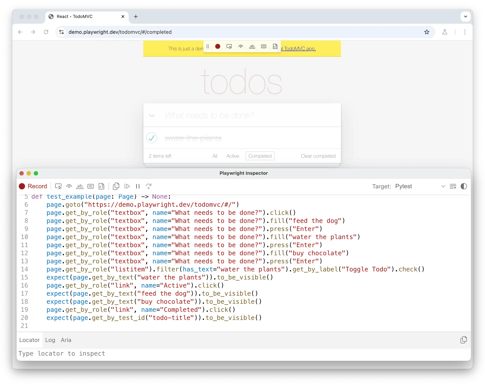
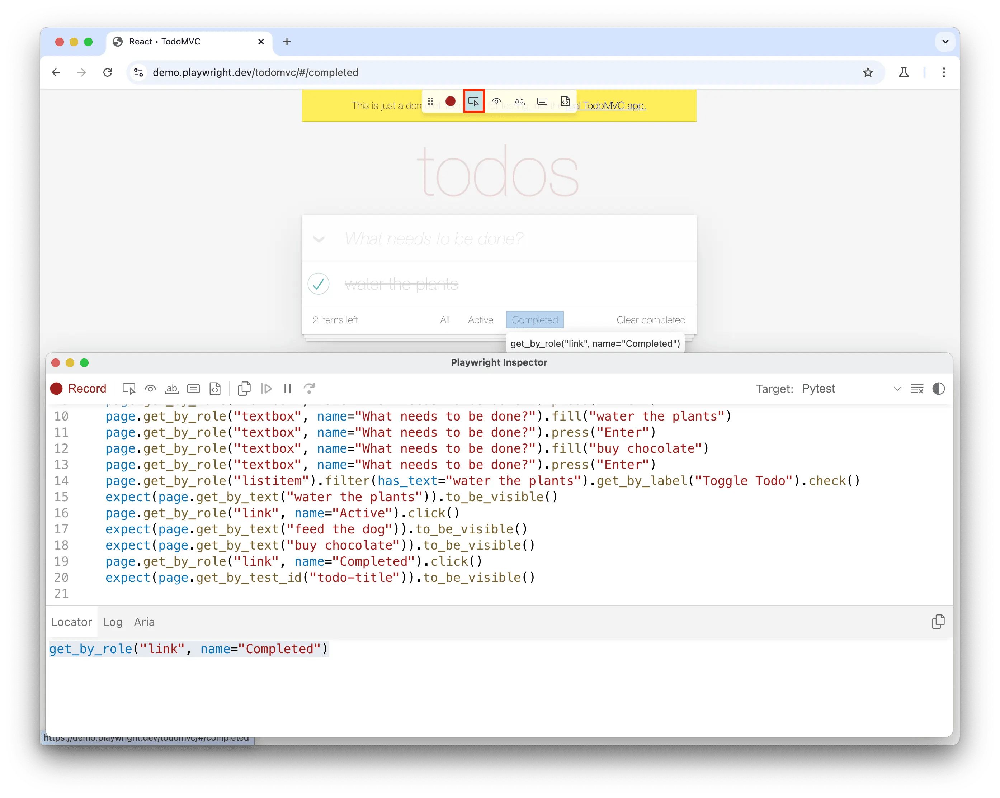

## 简介

Playwright 可以自动生成测试，提供了一种快速开始测试的方法。Codegen 会打开一个浏览器窗口进行交互，并打开 Playwright Inspector 来记录、复制和管理您生成的测试。

**您将学到**

- [如何记录测试](https://playwright.cn/python/docs/codegen#recording-a-test)
- [如何生成定位器](https://playwright.cn/python/docs/codegen#generating-locators)

## 运行 Codegen

使用 `codegen` 命令运行测试生成器，后跟要为其生成测试的网站 URL。URL 是可选的，如果省略，可以直接在浏览器窗口中添加。

```bash
playwright codegen demo.playwright.dev/todomvc
```

### 录制测试

运行 `codegen` 并在浏览器中执行操作。Playwright 会自动为您的交互生成代码。Codegen 分析渲染的页面，并推荐最佳定位器，优先使用角色、文本和测试 ID 定位器。当多个元素匹配一个定位器时，生成器会改进它以唯一标识目标元素，从而减少测试失败和不稳定性。

使用测试生成器，您可以记录

- 通过与页面交互执行的点击或填充等操作
- 通过点击工具栏图标，然后点击页面元素进行断言。您可以选择
  - `'断言可见性'` 以断言元素可见
  - `'断言文本'` 以断言元素包含特定文本
  - `'断言值'` 以断言元素具有特定值





完成与页面的交互后，按 `'record'` 按钮停止录制，并使用 `'copy'` 按钮将生成的代码复制到您的编辑器中。

使用 `'clear'` 按钮清除代码并重新开始录制。完成后，关闭 Playwright Inspector 窗口或停止终端命令。

要了解有关生成测试的更多信息，请查看我们关于 [Codegen](https://playwright.cn/python/docs/codegen) 的详细指南。

### 生成定位器

您可以使用测试生成器生成 [定位器](https://playwright.cn/python/docs/locators)。

- 按 `'Record'` 按钮停止录制，然后会出现 `'Pick Locator'` 按钮
- 点击 `'Pick Locator'` 按钮，然后将鼠标悬停在浏览器窗口中的元素上，以查看每个元素下方突出显示的定位器
- 点击要定位的元素，该定位器的代码将出现在 Pick Locator 按钮旁边的定位器游乐场中
- 在定位器游乐场中编辑定位器以进行微调，并查看浏览器窗口中突出显示的匹配元素
- 使用复制按钮复制定位器并将其粘贴到您的代码中




### 仿真

您可以使用针对特定视口、设备、配色方案、地理位置、语言或时区的模拟功能来生成测试。测试生成器还可以保留身份验证状态。查看 [测试生成器](https://playwright.cn/python/docs/codegen#emulation) 指南以了解更多信息。
