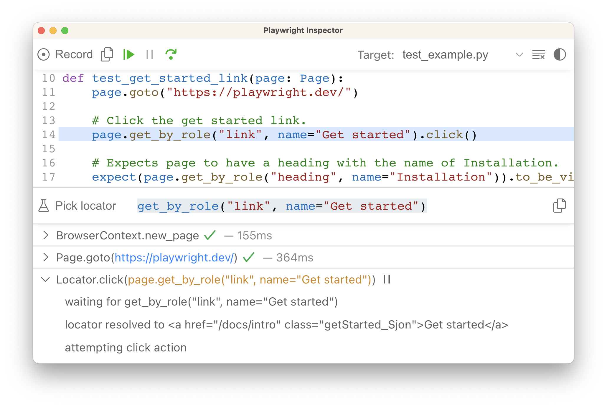

## 简介

你可以运行单个测试、一组测试或所有测试。通过使用 `--browser` 标志，测试可以在单个浏览器或多个浏览器上运行。默认情况下，测试以无头（headless）模式运行，这意味着在运行测试时不会打开浏览器窗口，并且结果将在终端中显示。如果你愿意，可以使用 `--headed` 命令行参数以有头（headed）模式运行测试。

**您将学到**

- [如何从命令行运行测试](https://playwright.cn/python/docs/running-tests#command-line)
- [如何调试测试](https://playwright.cn/python/docs/running-tests#debugging-tests)

## 运行测试

### 命令行

要运行测试，请使用 `pytest` 命令。这默认会在 Chromium 浏览器上运行你的测试。测试默认以无头模式运行，这意味着在运行测试时不会打开浏览器窗口，并且结果将在终端中显示。

```bash
pytest
```

### 以有头模式运行测试

要以有头模式运行测试，请使用 `--headed` 标志。这将在运行测试时打开一个浏览器窗口，测试结束后浏览器窗口将关闭。

```bash
pytest --headed
```

### 在不同浏览器上运行测试

要指定运行测试的浏览器，请使用 `--browser` 标志后跟浏览器名称。

```bash
pytest --browser webkit
```

要指定多个浏览器来运行测试，请多次使用 `--browser` 标志，并每次跟上浏览器的名称。

```bash
pytest --browser webkit --browser firefox
```

### 运行特定测试

要运行单个测试文件，请传入要运行的测试文件的名称。

```bash
pytest test_login.py
```

要运行一组测试文件，请传入要运行的测试文件的名称。

```bash
pytest tests/test_todo_page.py tests/test_landing_page.py
```

要运行特定的测试，请传入要运行的测试的函数名。

```bash
pytest -k test_add_a_todo_item
```

### 并行运行测试

要并行运行测试，请使用 `--numprocesses` 标志，后跟要运行测试的进程数。我们建议设置为逻辑 CPU 核心数的一半。

```bash
pytest --numprocesses 2
```

（这假设已安装 `pytest-xdist`。有关更多信息，请参阅[此处](https://playwright.cn/python/docs/test-runners#parallelism-running-multiple-tests-at-once)。）

有关更多信息，请参阅 [Playwright Pytest 用法](https://playwright.cn/python/docs/test-runners)或 Pytest 文档中的[常规 CLI 用法](https://pytest.cn/en/stable/usage.html)。

## 调试测试

由于 Playwright 在 Python 中运行，你可以使用你选择的调试器进行调试，例如 Visual Studio Code 中的 [Python 扩展](https://vscode.js.cn/docs/python/python-tutorial)。Playwright 自带 Playwright Inspector，它允许你单步执行 Playwright API 调用、查看其调试日志并探索[定位器](https://playwright.cn/python/docs/locators)。

要调试所有测试，请运行以下命令。

- Bash
- PowerShell
- 批处理

```bash
PWDEBUG=1 pytest -s
```

要调试一个测试文件，请运行该命令并后跟要调试的测试文件的名称。

- Bash
- PowerShell
- 批处理

```bash
PWDEBUG=1 pytest -s test_example.py
```

要调试特定的测试，请添加 `-k`，后跟要调试的测试的名称。

- Bash
- PowerShell
- 批处理

```bash
PWDEBUG=1 pytest -s -k test_get_started_link
```

此命令将打开一个浏览器窗口以及 Playwright Inspector。你可以使用 inspector 顶部的跨过按钮来单步调试你的测试。或者按播放按钮从头到尾运行你的测试。测试完成后，浏览器窗口将关闭。

在调试时，你可以使用“选择定位器”按钮来选择页面上的元素，并查看 Playwright 用于查找该元素的定位器。你还可以编辑定位器，并在浏览器窗口中实时查看其高亮显示。使用“复制定位器”按钮将定位器复制到剪贴板，然后将其粘贴到你的测试中。



查看我们的[调试指南](https://playwright.cn/python/docs/debug)以了解有关 [Playwright Inspector](https://playwright.cn/python/docs/debug#playwright-inspector) 以及使用[浏览器开发者工具](https://playwright.cn/python/docs/debug#browser-developer-tools)进行调试的更多信息。
