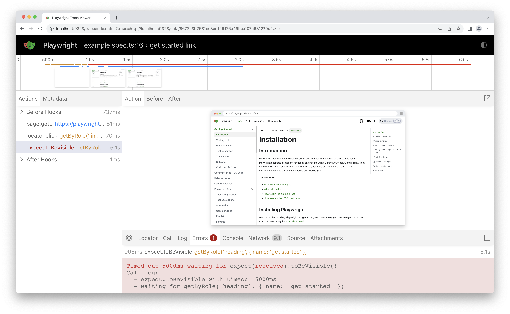

## 简介

Playwright 追踪查看器是一个图形用户界面工具，可让您探索录制的 Playwright 测试追踪，这意味着您可以逐个动作地回溯和前进您的测试，并直观地查看每个动作期间发生了什么。

**您将学到**

- 如何录制跟踪
- 如何打开追踪查看器

## 录制 Trace

可以通过在运行测试时带上 `--tracing` 参数来录制 Trace。

```bash
pytest --tracing on
```

Trace 的选项包括：

- `on`：为每个测试录制 Trace
- `off`：不录制 Trace。（默认）
- `retain-on-failure`：为每个测试录制 Trace，但删除所有成功的测试运行的 Trace。

这会录制 Trace 并将其保存到 `test-results` 目录下一个名为 `trace.zip` 的文件中。

> 如果你没有使用 Pytest，请点击此处了解如何录制 Trace。
>
> ### 同步
>
> ```python
> browser = chromium.launch()
> context = browser.new_context()
> 
> # Start tracing before creating / navigating a page.
> context.tracing.start(screenshots=True, snapshots=True, sources=True)
> 
> page = context.new_page()
> page.goto("https://playwright.cn")
> 
> # Stop tracing and export it into a zip archive.
> context.tracing.stop(path = "trace.zip")
> ```
>
> 

## 打开追踪记录

你可以使用 Playwright CLI 或在浏览器中访问 [`trace.playwright.dev`](https://trace.playwright.dev/) 来打开已保存的追踪文件。请确保提供追踪 zip 文件所在的完整路径。打开后，你可以点击每个操作，或使用时间轴查看每个操作前后页面的状态。你还可以检查测试每一步的日志、源代码和网络请求。Trace viewer 会创建 DOM 快照，以便你与其进行完全交互、打开开发人员工具等。

```bash
playwright show-trace trace.zip
```

###### 



要了解更多信息，请查看我们关于 [Trace 查看器](https://playwright.cn/python/docs/trace-viewer)的详细指南。