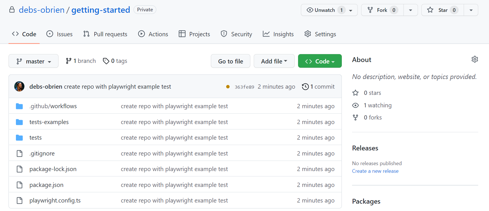
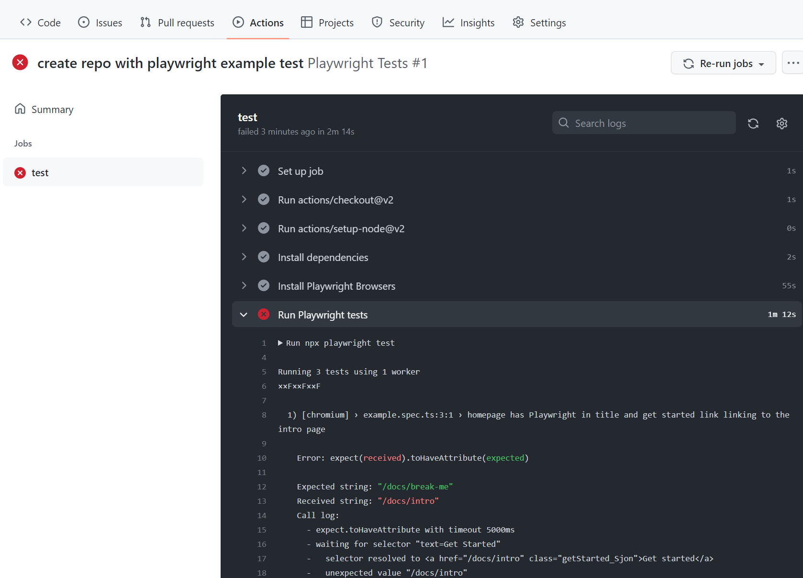
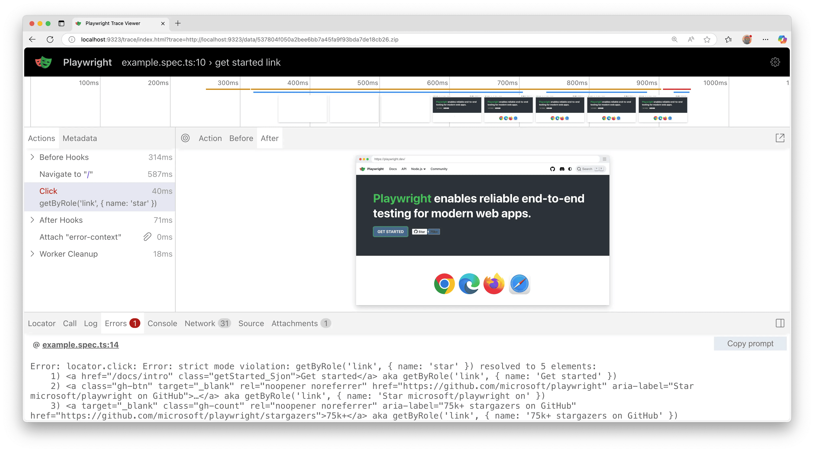

## 简介

Playwright 测试可以在任何 CI 提供商上运行。本节介绍如何使用 GitHub Actions 在 GitHub 上运行测试。如果您想了解如何配置其他 CI 提供商，请查看我们详细的 [持续集成文档](https://playwright.cn/python/docs/ci)。

#### 你将学到什么

- [如何设置 GitHub Actions](https://playwright.cn/python/docs/ci-intro#setting-up-github-actions)
- [如何查看测试日志](https://playwright.cn/python/docs/ci-intro#viewing-test-logs)
- [如何查看跟踪](https://playwright.cn/python/docs/ci-intro#viewing-the-trace)

## 设置 GitHub Actions

要添加 [GitHub Actions](https://githubdocs.cn/en/actions) 文件，请首先创建 `.github/workflows` 文件夹，并在其中添加一个 `playwright.yml` 文件，内容包含下方的示例代码，这样您的测试就会在每次向 main/master 分支推送代码或发起拉取请求时自动运行。

.github/workflows/playwright.yml

```yml
# CI 工作流：Playwright 自动化测试

# 该 GitHub Actions 工作流使用 pytest 运行 Playwright 测试。
# 当代码推送（push）或创建 Pull Request 到 main/master 分支时触发。
# 工作流会完成以下任务：
# 1. 拉取代码
# 2. 配置 Python 环境
# 3. 安装项目依赖
# 4. 安装 Playwright 浏览器
# 5. 执行自动化测试
# 6. 上传测试失败时生成的 trace 文件，方便排查问题

name: Playwright Tests

# 工作流触发条件
on:
  # 当代码推送到指定分支时运行
  push:
    branches: [ main, master ]
  # 当 Pull Request 目标分支为指定分支时运行
  pull_request:
    branches: [ main, master ]
    
jobs:
  # 定义一个名为 test 的任务
  test:
    # 设置任务最长运行时间（分钟）
    timeout-minutes: 60
    # 使用 GitHub 提供的 Ubuntu 环境运行
    runs-on: ubuntu-latest
    steps:
      # 拉取代码仓库，使工作流可以访问项目文件
      - uses: actions/checkout@v6
      # 配置 Python 运行环境
      - name: Set up Python
        uses: actions/setup-python@v6
        with:
          # 指定安装的 Python 版本
          python-version: '3.13'
      # 安装项目依赖
      - name: Install dependencies
        run: |
          # 首先升级 pip，避免依赖安装兼容问题
          python -m pip install --upgrade pip
          # 根据 requirements.txt 安装测试所需依赖
          pip install -r requirements.txt
      # 安装 Playwright 浏览器环境
      # 包括 Chromium、Firefox、WebKit
      - name: Ensure browsers are installed
        run: python -m playwright install --with-deps
      # 执行自动化测试
      - name: Run your tests
        run: pytest --tracing=retain-on-failure
        # --tracing=retain-on-failure：
        # 测试失败时保留 Playwright trace 文件，
        # 方便后续查看失败原因。
      # 上传测试产物（例如 Playwright trace 文件）
      # 如果任务没有被取消，则执行上传
      - uses: actions/upload-artifact@v4
        if: ${{ !cancelled() }}
        with:
          # 上传文件在 GitHub Actions 页面显示的名称
          name: playwright-traces
          # 指定需要上传的文件路径
          path: test-results/
# 工作流文件结束
```

要了解更多相关信息，请参阅 [“了解 GitHub Actions”](https://githubdocs.cn/en/actions/learn-github-actions/understanding-github-actions)。

查看 `jobs.test.steps` 中的步骤列表，你可以看到工作流执行了以下步骤：

1. 克隆你的仓库
2. 安装语言依赖项
3. 安装项目依赖项并构建
4. 安装 Playwright 浏览器
5. 运行测试

## 创建仓库并推送到 GitHub

一旦完成了 [GitHub Actions 工作流](https://playwright.cn/python/docs/ci-intro#setting-up-github-actions)的设置，您只需要 [在 GitHub 上创建一个仓库](https://githubdocs.cn/en/get-started/quickstart/create-a-repo) 或者将代码推送到现有仓库即可。按照 GitHub 上的说明操作，别忘了使用 `git init` 命令[初始化 git 仓库](https://github.com/git-guides/git-init)，以便您可以 [添加 (add)](https://github.com/git-guides/git-add)、[提交 (commit)](https://github.com/git-guides/git-commit) 和 [推送 (push)](https://github.com/git-guides/git-push) 您的代码。

###### 



## 打开工作流

点击 **Actions** 选项卡查看工作流。在这里你可以看到你的测试是否通过或失败。

###### 



## 查看测试日志

点击工作流运行会显示 GitHub 执行的所有操作，点击**运行 Playwright 测试**会显示错误消息、预期结果和实际结果以及调用日志。

###### 


## 查看跟踪 (Trace)

[trace.playwright.dev](https://trace.playwright.dev/) 是 Trace Viewer 的静态托管版本。您可以通过拖放上传跟踪文件。



## 正确处理密钥 (Secrets)

像跟踪文件或控制台日志这样的构件包含有关您的测试执行的信息。它们可能包含敏感数据，如测试用户的用户凭据、暂存后端的访问令牌、测试源代码，有时甚至包含您的应用程序源代码。请像对待这些敏感数据一样谨慎处理这些文件。如果您将报告和跟踪作为 CI 工作流的一部分上传，请确保您只将它们上传到受信任的构件存储，或者在上传前加密文件。与团队成员共享构件也是如此：使用受信任的文件共享，或在共享前加密文件。