# 前言

大家平时测试过程中，总是离不开接口。本篇就带大家一起学习下fiddler的基础到高阶的使用。
通过本篇你将学会：

- Fiddler基础功能使用
- Android/ios手机进行抓包
- Fiddler高级功能使用（如：设置断点、数据篡改、弱网测试等等）

[回到顶部](https://www.cnblogs.com/upstudy/p/15871042.html#_labelTop)

# 基础-Fiddler安装使用


## Fiddler简介

Fiddler是强大的抓包工具，能够记录所有客户端和服务器的http和https请求，允许监视、设置断点，查看所有的“进出”Fiddler的数据（指[[cookie]]，HTML，js，CSS等文件）。


## 工作原理

Fiddler 是以代理web服务器的形式工作的。它通过接收客户端发送的请求，然后处理之后发送给服务器，等到服务器返回结果给Fiddler后，再由Fiddler把相应的数据返回给客户端。它使用代理地址:127.0.0.1，默认端口为:8888
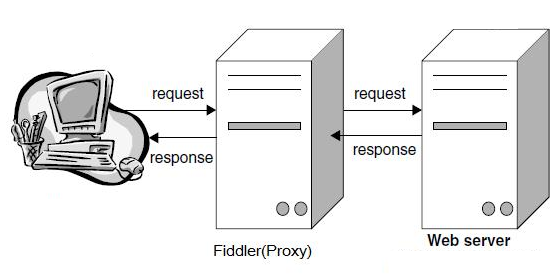

> 注意：当Fiddler开启的时候电脑意外重启或者是Fiddler开启情况下关机再启动时，电脑启动后无法正 常访问网络？---直接重启Fiddler就可以了。


## Fiddler下载与安装

官网下载地址：<https://www.telerik.com/download/fiddler/fiddler4>
安装完成后，启动Fiddler：

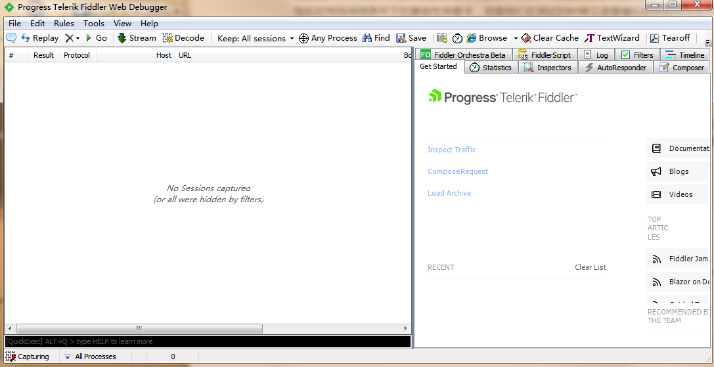


## 设置fiddler

鼠标选中**Tools--->Options**

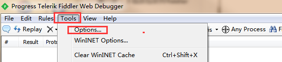

1. 选中Connections，默认监听端口：8888
2. 勾选Allow remote computers to connect，表示允许远程连接（别的机器把HTTP/HTTPS请求发送到Fiddler上来）

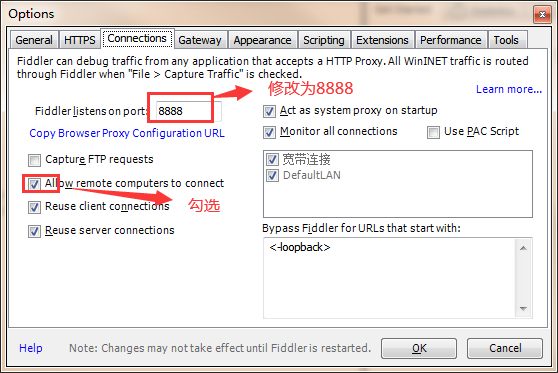

1. 设置抓取https请求

   HTTPS中选中`Decrypt HTTPS traffi`，弹框提示证书及安全提示，均点击同意即可。

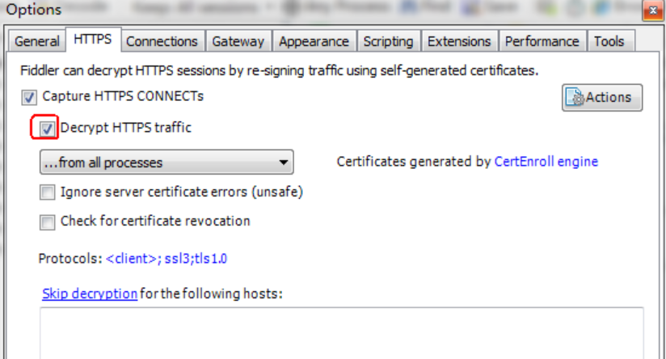

1. 配置完成后，进行重启Fiddler，可以正常抓包啦。

[回到顶部](https://www.cnblogs.com/upstudy/p/15871042.html#_labelTop)

# 常用功能


## 工具功能概要

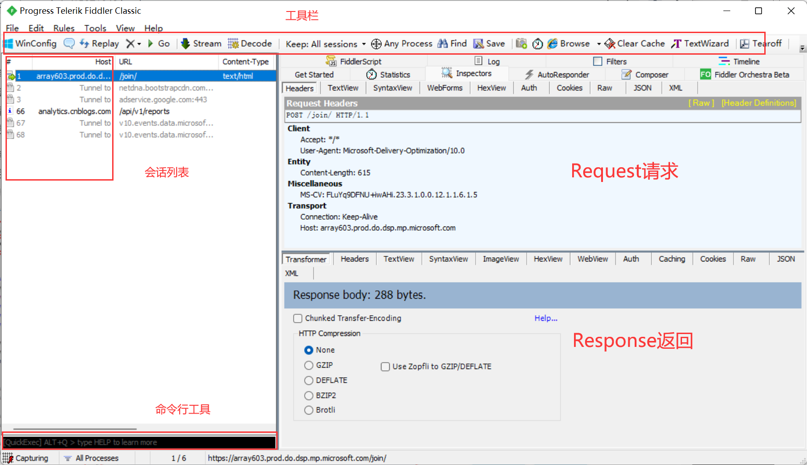


## 清除会话列表--->命令行`clear`;快捷键`ctrl+x`


## 过滤请求hosts，只查看填写的host请求


需要过滤多个时，使用`；`来分割

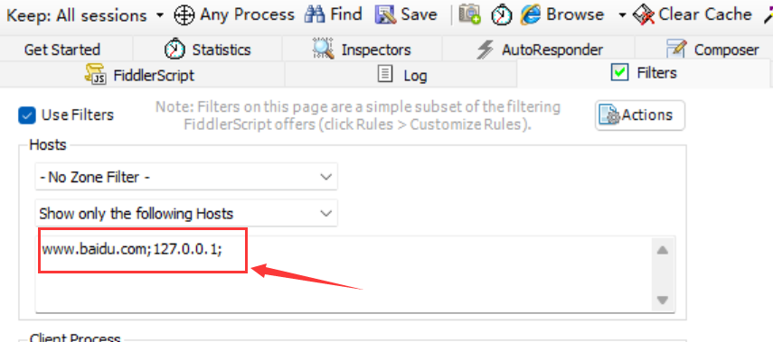


## 请求与响应


1. Request是客户端发出去的数据，Response是服务端返回过来的数据，这两块区域功能差不多
2. headers:请求头，这里包含client、cookies、transport等
3. webfroms：请求参数信息表格展示，更直观。可以直接该区域的参数
4. Auth:授权相关，如果显示如下两行，说明不需要授权，可以不用关注
   （这个目前很少见了）
   No Proxy-Authorization Header is present.
   No Authorization Header is present.
5. cookies:查看cookie详情
6. raw:查看一个完整请求的内容，可以直接复制
7. [[json]]:查看json数据
8. xml:查看xml文件的信息


## decode解码

1.如果response的TextView区域出现乱码情况，可以直接点下方黄色区域解码

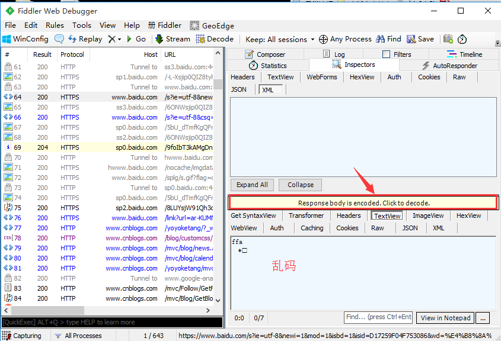

2.也可以选中上方快捷菜单decode，这样后面的请求都会自动解码了


## 部分解释说明

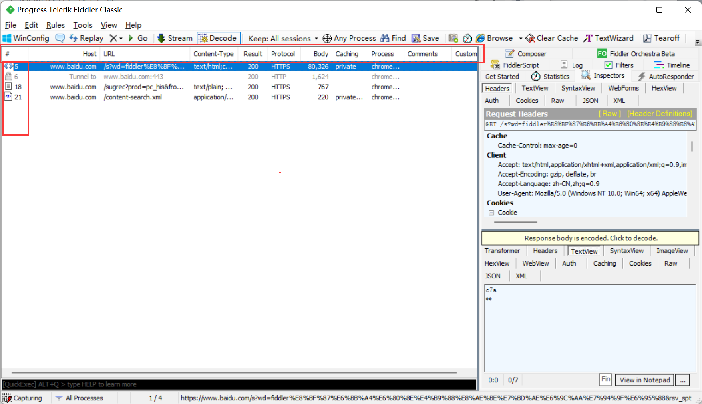

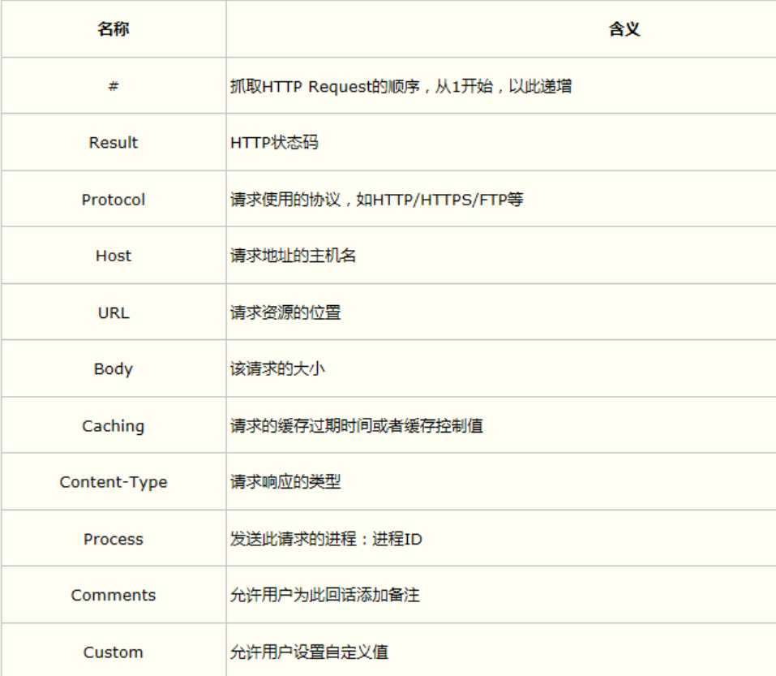


[回到顶部](https://www.cnblogs.com/upstudy/p/15871042.html#_labelTop)

# 手机抓包

打开我们的手机，进入wifi设置，这里要注意的是安卓设备连接的wifi必须和我们的PC是同一个网络才能设置成功。大部分的安卓设备都可以在wifi设置里面设置代理，但是不排除有少部分设备是系统有限制的。在设置代理之前我们需要知道PC的ip地址，可以通过系统cmd命令，然后ipconfig获取，如下：

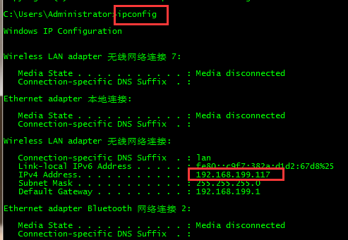

然后就可以再手机里面设置代理了，这是我的手机的wifi设置代理的界面：

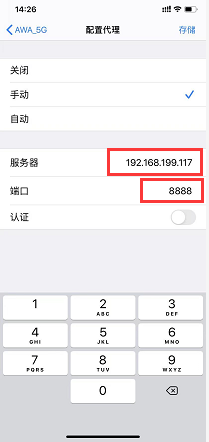

**手机安装证书**

打开浏览器，输入电脑ip:8888，即：192.168.0.38:8888

如果打不开，关闭代理服务器（fiddler），再重新打开


设置-通用中安装描述文件

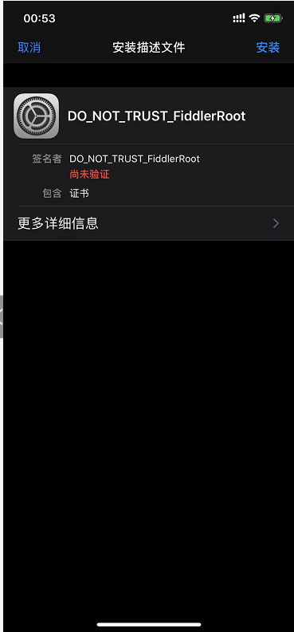

通用-关于-证书信任中设置开启


设置后之后，手机上所有的网络请求都会代理到Fiddler然后可以查看了:

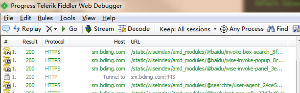

[回到顶部](https://www.cnblogs.com/upstudy/p/15871042.html#_labelTop)

# 进阶用法


## Fiddler模拟http请求


## 会话保存

　　为什么要保存会话呢？举个很简单的场景，你在上海测试某个功能接口的时候，发现了一个BUG，而开发这个接口的开发人员是北京的一家合作公司。你这时候给对方开发提bug，如何显得专业一点，能让对方心服口服的接受这个BUG呢？如果只是截图的话，不是很方便，因为要截好几个地方还描述不清楚，不如简单粗暴一点把整个会话保存起来，发给对方。

**一、保存为文本**
1.以博客园登录为例，抓到登录的请求会话
2.点左上角File>Save>Selected Sessions>as Text，保存到电脑上就是文本格式的


3.文本格式的可以直接打开，结果如下图

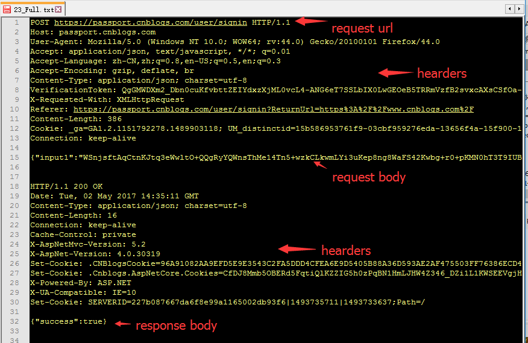

**二、几种保存方式**

1. save-All Sessions :保存所有的会话，saz文件
2. save-Selected Session:保存选中的会话
   --in ArchiveZIP ：保存为saz文件
   --as Text ：以txt文件形式保存整个会话包括Request和Response
   --as Text (Headers only) ：仅保存头部
3. Request：保存请求
   --Entir Request:保存整个请求信息（headers和body）
   --Request Body:只保存请求body部分
4. Response：保存返回
   --Entir Response:保存整个返回信息（headers和body）
   --Response Body:只保存返回body部分
   --and Open as Local File：保存Response信息，并打开文件

**三、保存与导入全部会话**

1. 我们可以打开fiddler，操作完博客园后，选中save>All Sessions,保存全部会话
2. 保存后，在fiddler打开也很方便，直接把刚才保存的会话按住拽进来就可以了

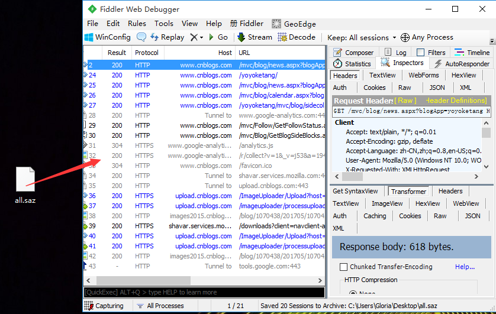

1. 也可以选择File>Load Archive导入这个文件


## Repaly

1. 导入请求后，可以选中某个请求，点击Repaly按钮，重新发请求
2. 也可以ctrl+a全部选中后，点Repaly按钮，一次性批量请求
   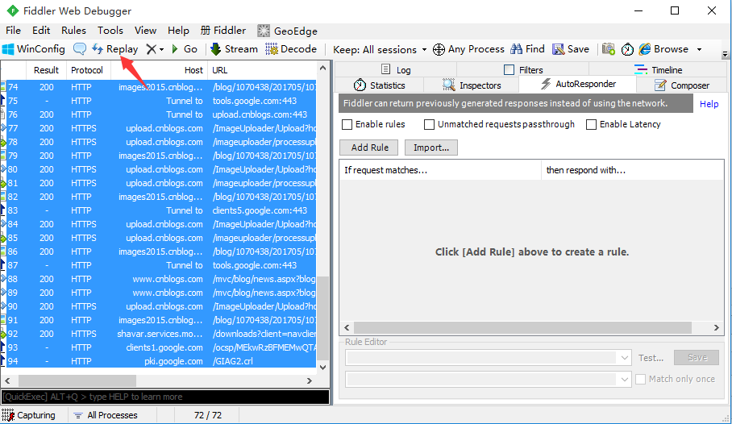

这样保存会话和replay功能其实就是相当于录制和回放了


## 自定义会话框

**一、添加会话框菜单**

1. 点会话框菜单（箭头位置），右键弹出选项菜单


1. 选择Customize columns选项，Collection选项选择Miscellaneous

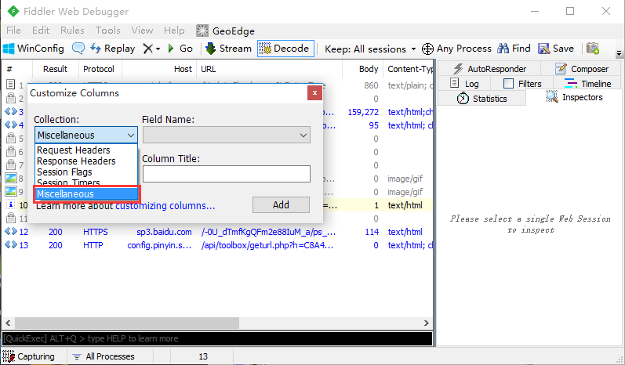

1. Field Name选择：RequestMethod

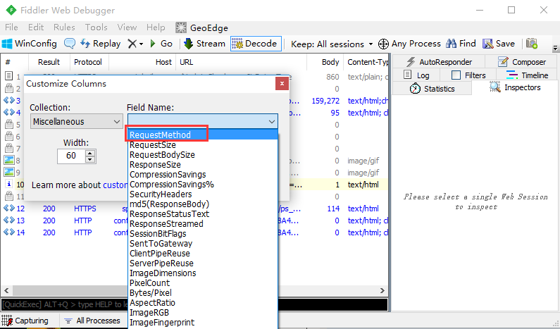


1. 点Add按钮即可添加成功


**二、隐藏会话菜单**

1. 选择需要隐藏的菜单，右键。选择Hide this column

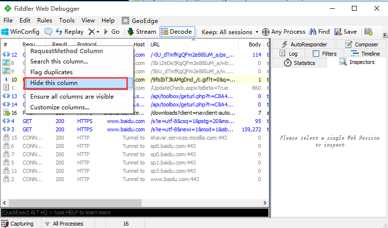

1. 隐藏后也可以让隐藏的菜单显示出来：Ensure all columns are visble


**三、调整会话框菜单顺序**

1. 如果需要调整会话框菜单顺序，如：Content-Type菜单按住后往前移动，就能调整了


**四、会话排序**

1. 点击会话框上的菜单，就能对会话列表排序了，如点body菜单


1. 点完后上面有个上箭头（正序），或者下箭头（倒叙）。但是不能取消，取消的话关掉fiddler后重新打开就行了。


## 断点（bpu）

　　这个功能本来不打算分享给大家的，但是这个功能的确是一个强大的功能，用的好你就可以走上人生巅峰，迎娶白富美，用的不好，很容易成为黑客或者会有更加严重的后果！但是后面想了一下，你想成为什么，谁都拦不住，反而想学知识的人，会觉得这个功能是神器！话扯得有点远，言归正传。什么是断点？还有断点有什么用呢？我们一一为大家揭晓！

**一. 断点**

1. 断点的作用
   举个例子，以登录中的账号为例，限制了必须用手机号注册，这样登录自动限制了登录账号为11位，同时前端和后端同时判断输入的账号是不是为11位，如果我们要测试后端有没有对大于11位或者小于11位做出判断，很显然，前端只能输入等于11位的。如果输入超过11位或者少于11位，前端就不发送请求去请求后端。所以我们需要抓到接口，修改请求参数，绕过前端验证，发送一个大于或小于11位的数给后端，验证后端功能是否OK。
2. fidder中断点的体现
   - Fiddler设置断点，可以修改HTTP请求头信息，如修改Cookie，User-Agent等
   - 可以修改请求数据，突破表单限制，提交任意数字，如充值最大100,可以修改成10000
   - 拦截响应数据，修改响应体，如修改服务端返回的页面数据

**二、断点的两种方式**

1. before response：这个是打在request请求的时候，未到达服务器之前

　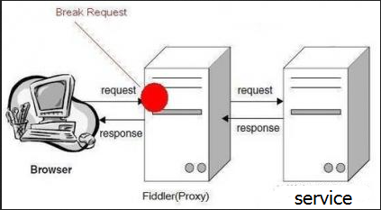

1. after response：也就是服务器响应之后，在Fiddler将响应传回给客户端之前


**三、全局断点**

1. 全局断点就是中断fiddler捕获的所有请求，先设置下，点击rules-> automatic breakpoint ->before requests


1. 选中before requests选项后，打开博客园首页： <http://www.cnblogs.com/yoyoketang/> ，看到如下T的标识，说明断点成功


1. 打完断点后，会发现所有的请求都无法发出去了，这时候，点下Go按钮，就能走下一步了


1. 找到需要修改的请求后，选中该条会话，右侧打开WebFroms,这时候里面的参数都是可以修改的了


1. 修改之后点Run to Completion就能提交了，于是就成功修改了请求参数了
2. 打全局断点的话，是无法正常上网的，需要清除断点：rules-> automatic breakpoint ->disabled

**四、单个断点**

已经知道了某个接口的请求地址，这时候只需要针对这一条请求打断点调试，在命令行中输入指令就可以了
请求前断点（before response)： bpu

1. 论坛登录接口：<https://passport.cnblogs.com/user/signin>
2. 命令行输入：bpu <https://passport.cnblogs.com/user/signin> 回车


3.请求登录接口的时候，就会只拦截登录这个接口了，此时可以修改任意请求参数

4.取消断点，在命令行输入： bpu 回车就可以了

**响应后断点（after requests）： bpafter**

1. 论坛登录接口：<https://passport.cnblogs.com/user/signin>
2. 在命令行输入：bpafter <https://passport.cnblogs.com/user/signin> 回车
3. 登录博客园，会发现已经拦截到登录后服务器返回的数据了，此时可以修改任意返回数据
4. 取消断点，在命令行输入： bpafter 回车就可以了

**五、拦截来自某个网站所有请求**

1. 在命令行输入：bpu <www.cnblogs.com>
2. 打开博客园任意网页，发现都被拦截到了
3. 打开博客园其他网站，其它网站可以正常请求
4. 说明只拦截了来自部落论坛（www.cnblogs.com）的请求
5. 清除输入bpu回车即可


## 设置网络限制（弱网测试）

回到我们的fiddler中来，在工具栏中找到Rules，从名字很显而易见这个功能是用来干嘛的了。再到Rules列表中找到Customize Rules，这个时候会弹出一个类似于文本编辑器的东西：

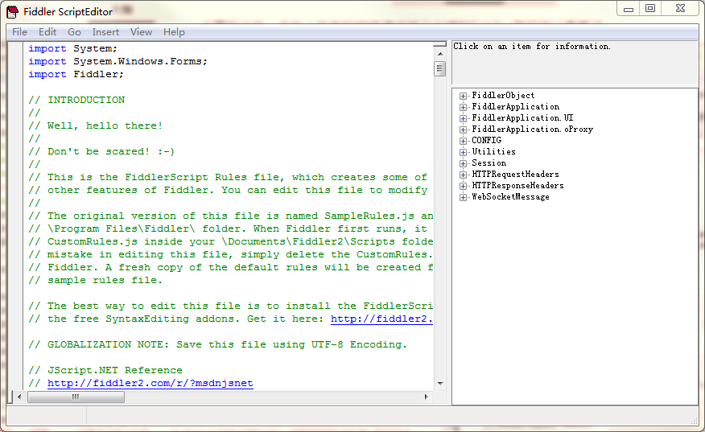

在这个文本编辑器中使用Ctrl+F使用搜索功能搜索关键字：simulate，可以找到如下代码段：

```cpp
if (m_SimulateModem) {
    // Delay sends by 300ms per KB uploaded.
    oSession["request-trickle-delay"] = "300";
    // Delay receives by 150ms per KB downloaded.
    oSession["response-trickle-delay"] = "150";
}
```

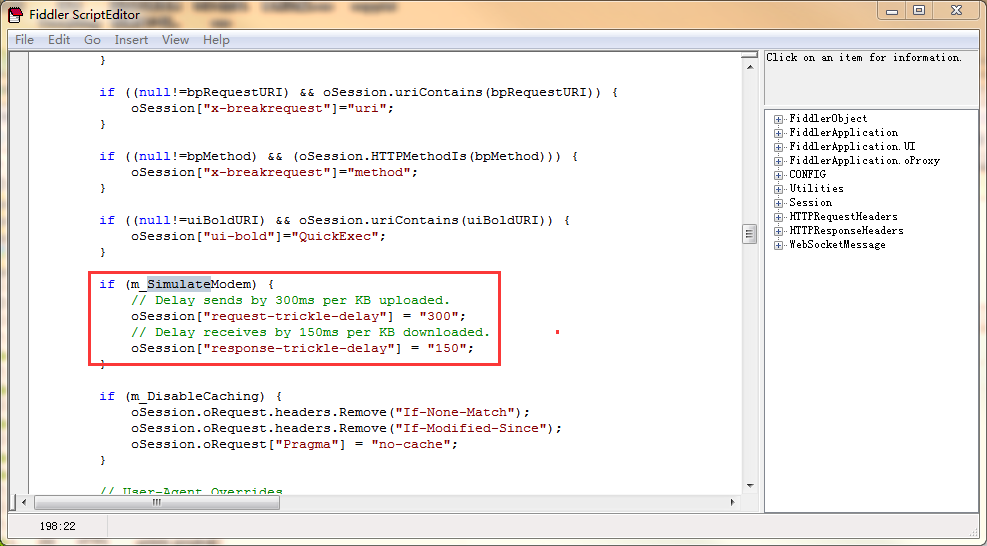

这段代码其余的都不用管，你只需要知道request-trickle-delay代表的是你网络请求的延迟时间，response-trickle-delay代表的是网络响应的延迟时间，单位都是毫秒，这里默认给的是300毫秒和150毫秒，所以，只需要修改这2个值即可模拟网络延迟和弱网络环境了，比如可以修改上述2个值为：2000和2000，代表网络请求延迟2秒，网络响应延迟2秒：

```cpp
if (m_SimulateModem) {
    // Delay sends by 300ms per KB uploaded.
    oSession["request-trickle-delay"] = "2000";
    // Delay receives by 150ms per KB downloaded.
    oSession["response-trickle-delay"] = "2000";
}
```

改完之后记得按Ctrl+S保存。

**开启网络延迟**
接下来就可以开启网络延迟了，还是我们的Rules功能中，找到Performance，然后在子选项中可以看到一个Simulate Modems Speeds，选中它，大功告成，网络延迟已经开启，如果需要关闭网络延迟，再次点击即可。

**扩展弱网络规则**
可能我们在测试中不会想要一个一直虚弱的网络环境，而是随机强弱的网络，这样比较贴切我们的真是情况，那么我们可以修改上述代码为：

```javascript
static function randInt(min, max) {
    return Math.round(Math.random()*(max-min)+min);
}
if (m_SimulateModem) {
    // Delay sends by 300ms per KB uploaded.
    oSession["request-trickle-delay"] = ""+randInt(1,2000);
    // Delay receives by 150ms per KB downloaded.
    oSession["response-trickle-delay"] = ""+randInt(1,2000);
}
```

这里的randInt(1,2000)应该很好理解，代表1-2000中的一个随机整数，这样就会出现偶尔有延迟偶尔网络又良好的情况


## 相关笔记
- 2026-07-09
- [[Web协议和测试]]
- [[移动APP测试]]
- [[练习计划]]
