# Web 开发调试工具

Chrome 开发者工具是谷歌浏览器 Chrome 内置的一套 Web 开发和调试工具，可用于对网站进行迭代、调试和分析。

可通过三种方式打开 Chrome 开发者工具：

- 在 Chrome 菜单中选择***\*更多工具\**** > ***\*开发者工具\****
- 在页面元素上右键点击，选择 “检查”
- 使用快捷键 Ctrl+Shift+I（Windows）或 Cmd+Opt+I（Mac）

本文将总结介绍 Chrome 开发者工具的一些前端实用功能。

## 查看元素伪类 CSS 样式

例如我想查看元素触发 `hover` 时的 CSS 样式。先选中该元素，然后按下图操作：

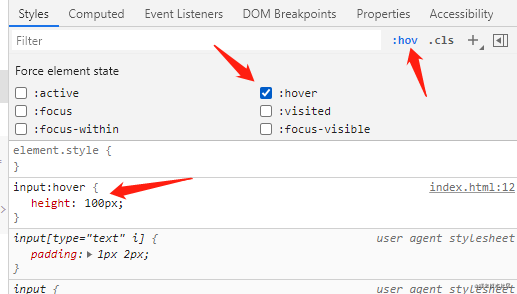

## 临时增删元素 class

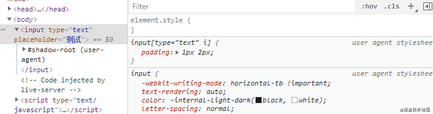

## `document.body.contentEditable="true"`

在控制台输入 `document.body.contentEditable="true"`，就可以对页面直接进行编辑。

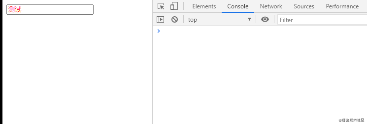

## 查看 placeholder 样式

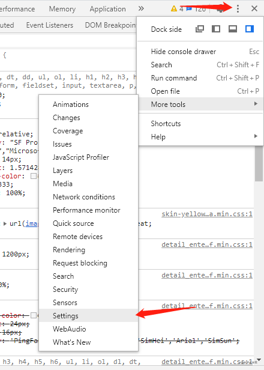

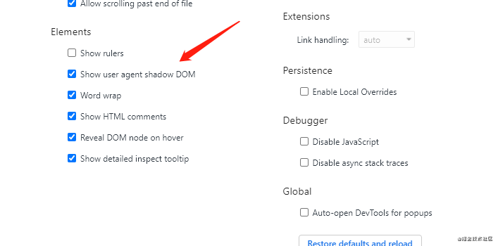

现在可以查看元素的 placeholder 样式了：

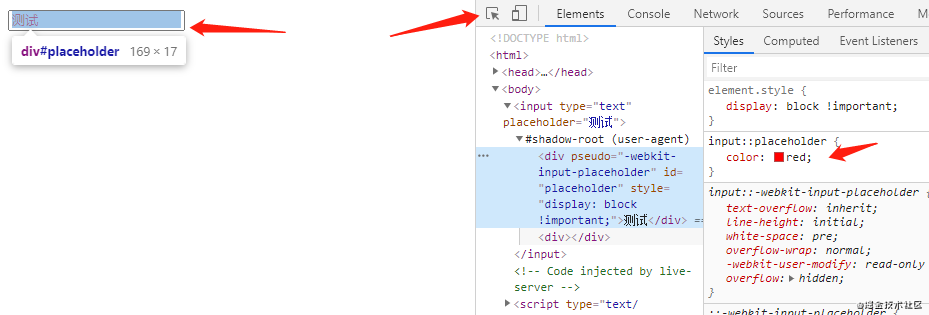

## 测试页面性能和 SEO

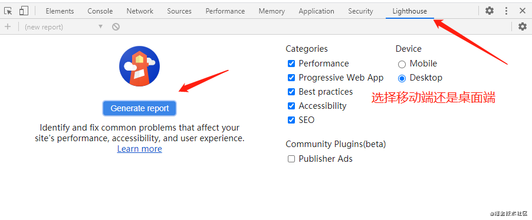

下面是测试报告：

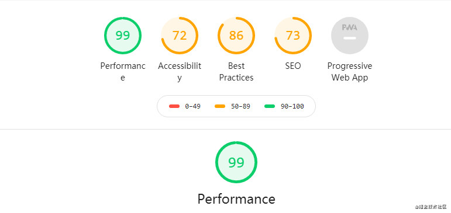

参考资料：

- [使用 Lighthouse 审查网络应用](https://developers.google.com/web/tools/lighthouse)

## Network 显示资源的其他信息

一般 Network 会显示加载资源的详细信息，但它默认只显示部分信息。如果我想查询网页资源是通过 HTTP1.1 还是 HTTP2 加载的，要怎么做呢？

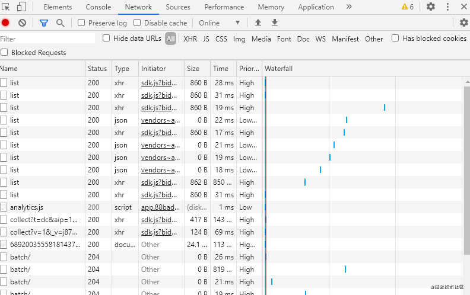

从 GIF 中可以看出，除了 HTTP 协议版本外，还可以查看其他信息，例如 HTTP 请求的方法、域名等等。

## 查看元素绑定事件

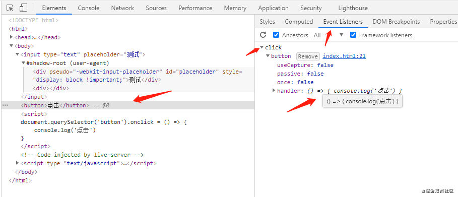

鼠标移到 `handler` 上，可查看具体的函数代码。

## 全局搜索代码

打开开发者工具，点击 `Console` 标签，按 ESC 弹出，点击左边竖形排列的三个小点，选择 `Search`：

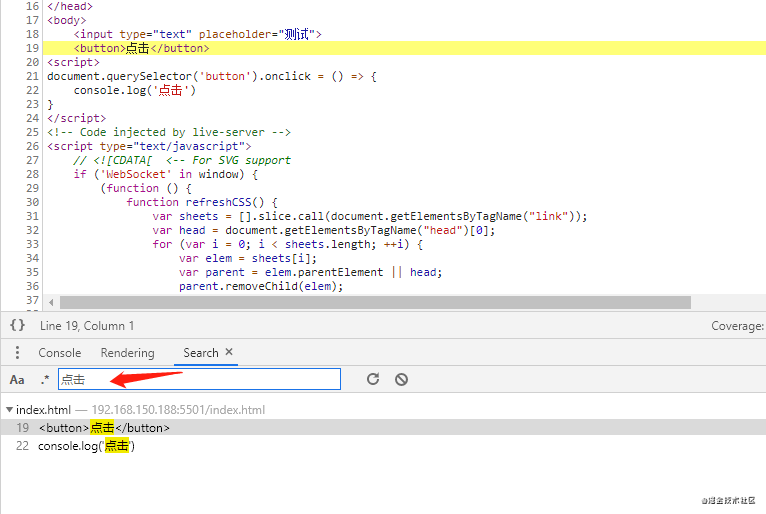

点击搜索结果，会跳到具体的源码文件。它会搜索该网页下所有引入的文件。

## 利用 Performance 检查运行时性能

打开开发者工具，点击 `Performance` 标签：

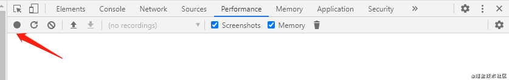

点击左上角的 `Record` 按钮开始记录，然后你模拟正常用户使用网页。测试完毕后，点击 `Stop`。

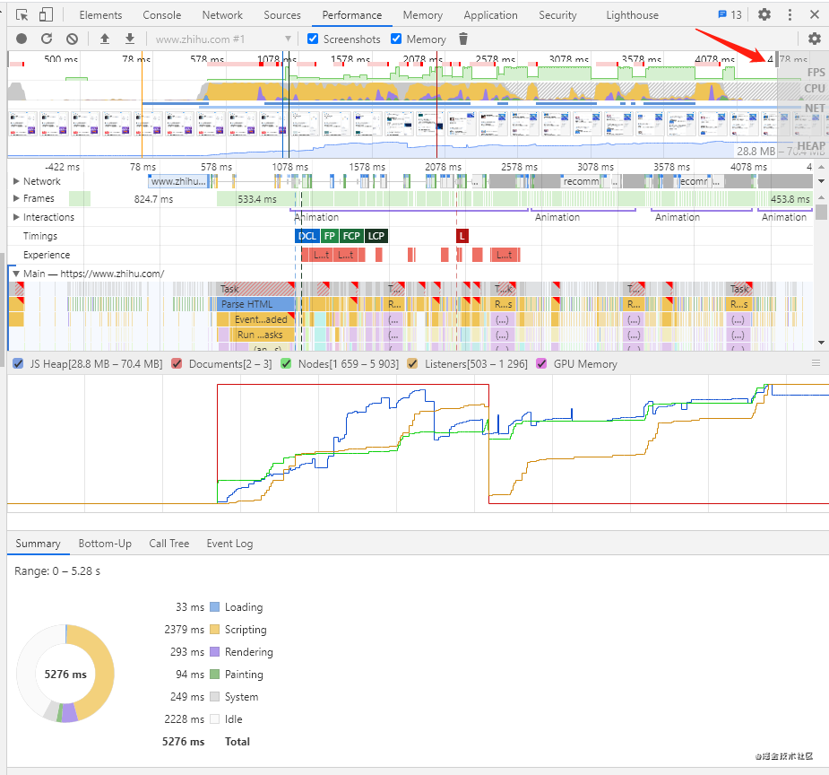

可以看到右上角分别有 FPS、CPU、NET、HEAP：

1. FPS 对应的是帧率，红色代表帧率低，可能会降低用户体验；绿色代表帧率正常，绿色条越高，FPS 越高。
2. CPU 部分上有黄色、紫色等色块，它们的释义请看图的左下角。谁的占比高，说明 CPU 主要的时间花在哪里。
3. HEAP 就是堆内存占用。

NET 最好点击下面的 Network 查看，可以看到具体的加载资源等。

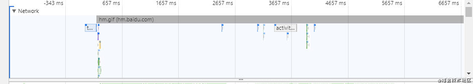

一般根据这些信息就能判断出网页性能问题出在哪。

如果想了解更多，请查看下面的参考资料，需要翻 qiang。或者用搜索引擎搜索 chrome performance，也有很多讲解使用方法的文章。

参考资料

- [Get Started With Analyzing Runtime Performance](https://developers.google.com/web/tools/chrome-devtools/evaluate-performance)

## Rendering 实时检测网页变化

打开开发者工具，点击 `Console` 标签，按 ESC 弹出：

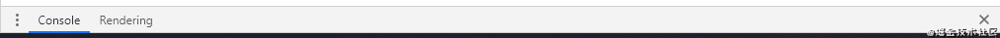

点击左边竖形排列的三个小点，选择 `Rendering`：

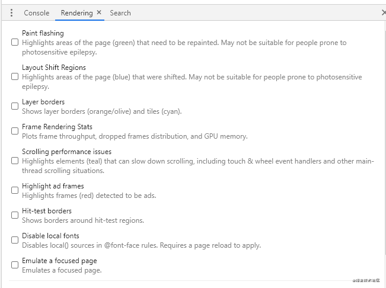

下面是比较实用的功能：

1. Paint flashing，实时高亮重绘区域（绿色）。
2. Layout Shift Regions，实时高亮重排（重新布局）区域（蓝色）。
3. Layer borders，将合成层用边框标出来（橙色、橄榄色、青色）。
4. Frame Rendering Stats，显示 GPU 的信息，旧版本还有实时 FPS 显示，但新版本不知道为何没有（chrome 86）。

## Application 查看应用信息

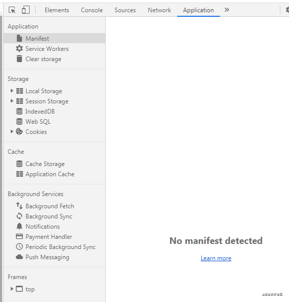

从图中看到，在 `Application` 标签下可以查到本页面很多信息。拿 `localStorage` 举例，现在我执行代码 `localStorage.setItem('token', '123')`，然后打开 `Application`：

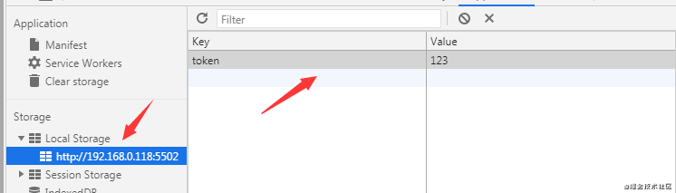

不出意外，能看到新增的 `localStorage` 信息。

## 相关笔记
- 2026-07-09
