# 性能测试简介

## 性能测试定义

软件测试的一个分支：通过自动化工具模拟多种**正常、峰值、异常**负载条件，对系统的各项性能指标进行度量，评估系统在不同负载下的行为，并发现性能瓶颈。

## 性能测试关注点

主要针对效率特性中的**时间特性、资源特性、容量特性**，以及可靠性中的**成熟性**。

通常关注的指标有：响应时间、负载、失败率、资源占用率等。

## 性能测试分类

- **按平台分**：前端性能测试、后端性能测试。常说的"性能测试"专指后端性能测试。
- **按关注点分**：基准测试、负载测试、压力测试、容量测试、配置测试、可靠性测试。

## 常用性能测试工具和对比

LoadRunner、JMeter、Locust。

## jmeter 常规设置

JMeter 5.6 依赖 **Java 8 或更高版本**（JDK 8/11/17 均可运行），需先安装对应 JDK。

JMeter 是免安装软件，解压到**非中文、无特殊字符**的目录下即可使用。

首次使用通常修改 `jmeter` 目录下 `bin/jmeter.properties`：

```properties
# 设置中文界面（取消原 #language=en 的注释并修改）
language=zh_CN

# 关闭 RMI 的 SSL（分布式测试时执行机/控制机都需要）
server.rmi.ssl.disable=true
```

> 提示：不同 JMeter 版本里这两行的行号会变，建议用搜索定位 `language=` 和 `server.rmi.ssl.disable`，不要死记行号。修改后双击 `jmeter.bat` 以图形化方式打开。

# 性能测试过程

## 明确性能测试需求

**性能测试的功能范围。** 通常软件上线前的性能测试，针对主业务流程的功能实施；若是针对性能瓶颈优化的测试，通常只测被优化的功能。

**性能指标。** 通常有：并发量、响应时间、吞吐率、成功率。

- **并发量**：同时访问服务器端的客户端（用户）数量。内网系统并发量通常 10~100；公网系统常见 100~500，大型系统 2000~20000，纯文字类网站可能更高。
- 并发量设定要考虑用户数、操作习惯（操作间隔），由"单位时间请求数"换算为"无等待时的等价并发数"；也可分析后台日志取瞬时用户数、参考同行系统、或通过多轮负载测试反推。
- **响应时间**：后端性能测试指**后端**响应时间（多在 1000ms 以内）；用户感受到的"前端响应时间"更长，多因网络传输延迟。通常关注 **90% 响应时长（90th percentile）**。
- **吞吐率**：① 请求/响应的发送速度（KB/s）；② 交易速度（个/分或个/秒）。
- **成功率**：请求返回成功的比例，通常要求 95% 以上（95%、98%、99.5%、99.99% 等）。

## 制订性能测试计划

通常描述本次测试的目的、范围、时间、人员职责、环境要求、工具选择、技术标准，以及任务安排、用例设计。例如对 ecshop 的 App 端接口服务器做性能测试：

- **目的**：为 ecshop 接口服务器性能测试编写文档，明确测试要求，规划人员、时间、准备。
- **背景**：ecshop 是 xxx 的项目。
- **时间**：2024-10-23 开始，2024-10-31 前完成。
- **人员**：xxx 共 3 人。
- **需求范围**：App 主业务流程涉及的所有接口——首页、登录、搜索商品、商品详情、添加购物车、查看购物车、结算、可能需要的添加收货地址、提交订单，共涉及 xx 个接口。
- **性能指标**：
  - 并发量设定 100
  - 响应时间要求 90% 不超过 2100ms
  - 交易吞吐率 ≥ 300 个/分
  - 成功率 ≥ 98%
- **工具选择**：本次测试使用 JMeter 5.6。
- **环境要求**：服务器端拆分一路组建网络，测试机房搭建网络，需交换机 xx 台、测试电脑 xx 台，网线标准 xxx。
- **测试数据**：编写存储过程构造 100 个用户数据。
- **测试执行**：本次测试执行 10 分钟。

制订计划后还需编写测试用例。

**测试标题**：ecshop 接口服务器系统上线前的主流程性能测试
**预置条件**：单机测试环境已搭建；100 个用户数据已构造完成

**测试步骤**：

1. 配置 JMeter 脚本，线程组设置 100 个并发，启动用时 10 秒，使用调度器执行 600 秒。
2. 线程组下配置循环控制器。
3. 循环控制器下配置"首页分类、首页促销"2 个并行请求，以及登录、搜索商品、商品详情、添加购物车、购物车列表、结算、提交订单、订单列表请求；并在结算请求后配置 If 控制器（结算失败则添加收货地址）。
4. 登录请求断言登录是否成功，并提取 `sid`、`uid`。
5. 搜索商品请求提取商品编号。
6. 商品详情请求提取所有属性编号，并计算联合变量。
7. 查看购物车断言是否存在商品。
8. 结算提取 `succeed` 节点值，提取不到则写 0。
9. 线程组下配置 CSV 参数文件（100 个用户的用户名、密码、商品名称）。
10. 所有请求都断言响应状态码 200；除结算外，其余都断言 `status` 下的 `succeed` 节点值是否 = 1。
11. 命令行执行脚本，检查测试报告。

**预期结果**：每个请求的 90% 响应时间 ≤ 2100ms，每个请求成功率 ≥ 98%，提交订单交易吞吐率 ≥ 300 个/分。

## 搭建测试环境

- 并发量小、单机执行：只在服务器机房内接线连接测试机。
- 并发量大、需分布式：将服务器机房中的服务器分出一路与其他服务器隔离，并在机房旁用网线、交换机、测试机搭建测试环境。

## 准备测试数据

在 ecshop 库中新建存储过程：

```sql
CREATE PROCEDURE `proc_add_user`(fname char(32), begin_no int, end_no int, passwd char(20))
BEGIN
  declare x int default begin_no;
  while x <= end_no do
    insert into ecs_users(email,user_name,password,question,answer,last_ip,alias,msn,
      qq,office_phone,home_phone,mobile_phone,credit_line) values
      (concat(fname,'_',x,'@ecshop.com'),concat(fname,'_',x),md5(passwd),'','',
       '','','','','','',0);
    set x = x+1;
  end while;
END;
```

创建后执行：

```sql
call proc_add_user('user',1,200,'12345678');
```

## 编写并调试测试脚本

JMeter 是 Apache 基于 Java 开发的性能测试工具，本质是一个"发包工具"：代替真实客户端向服务器发送请求并接收响应，记录响应时长、是否成功等数据，最终生成测试报告，反馈性能指标是否达标。

### jmeter 常用元件

JMeter 通过配置和编写"元件"来开发脚本。

#### 线程组

代表模拟的一组用户，这组用户执行相同操作。一个脚本内至少有 1 个线程组。例如 ecshop 脚本内含 2 个线程组：线程组 1 是一组 Web 用户发送页面请求，线程组 2 是一组 App 用户发送接口调用。

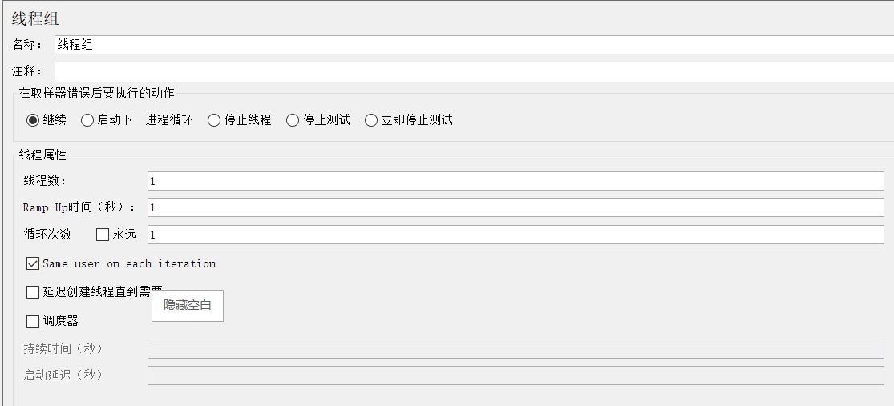

- **线程数**：该线程组下的虚拟用户数，即并发量。
- **Ramp-Up**：从启动到所有线程都开始执行所用的时间。例如线程数 200、Ramp-Up 100，表示每秒启动 2 个线程，100 秒完成全部启动。
- **循环次数**：默认 1 次；勾选"永远"则需配合调度器设置持续时长。启用调度器时，循环次数需勾选"永远"。
- **调度器**：持续时间 = 线程组连续运行时长；启动延迟 = 每次循环后的等待时间。

#### 控制器

添加在线程组下，用于控制其下取样器的执行。常用：循环控制器、简单控制器、If 控制器、仅一次控制器、事务控制器。

#### 取样器

真正执行测试的元件，负责发送请求、接收响应。通常添加在线程组或控制器下。常用：HTTP 请求（内部配置 http 协议请求）、调试取样器（用于调试查看变量，不发送请求）、JDBC 请求（内部配置 SQL 语句）。

#### 后置处理器

类似 Postman 中"测试"里编写提取并保存变量的代码，用于从响应中提取值保存为变量。常用：JSON 提取器、正则表达式提取器、CSS 提取器、XPath2 提取器、JSR223 提取器。

- 响应 body 中 JSON 数据的节点值 → **JSON 提取器**
- 响应 body 中 HTML 文字 → **正则表达式提取器** 或 **CSS 提取器**
- 响应 body 中 XML 数据节点 → **XPath2 提取器**
- 响应头部的头部值、Cookie 值、响应状态码、URL 中特定文字 → **正则表达式提取器**（需把"检查的响应字段"从主体改为信息头或对应内容）

#### 前置处理器

类似 Postman 中"预请求脚本"里保存变量的代码，用于构造本请求所用参数值。常用 JSR223 预处理程序。

#### 断言

判断结果是否正确，因此 JMeter 也可用于接口测试。常用：JSON 断言、响应断言、大小断言、XPath 断言、JSR223 断言。

- 响应 body 中 JSON 节点值 → **JSON 断言**
- 响应 body 中 HTML 文字 → **响应断言**
- 响应 body 中 XML 节点 → **XPath2 断言**
- 响应头部的头部值、Cookie 值、状态码、URL 中特定文字 → **响应断言**（"检查的响应字段"改为信息头或对应内容，匹配规则多选"包括"，测试模式多用精确文字或正则）

#### 定时器

实现等待。常用：固定定时器、统一随机定时器、同步定时器、常数吞吐量定时器。

#### 各种杂项

CSV 文件、用户定义变量、头部管理器、Cookie 管理器、缓存管理器、JDBC 配置等。

#### 调试用元件

- **查看结果树**：查看每个请求的响应信息，调试各种响应处理技术，也可看性能测试报告。
- **聚合报告**：查看性能测试统计结果。

#### 元件的作用域

元件的作用域 = 辅助类元件对哪些取样器起作用。

- 逻辑控制器只能管理其下的取样器。
- 其它辅助类元件通常作用于**上级取样器**，或上级元件下所有层级的取样器；前置/后置处理器等也可选择作用域。
- 前置、后置处理器、断言、定时器通常配置在取样器下（针对某取样器）；用户定义变量、CSV 参数文件、信息头管理器、Cookie 管理器等通常配置在逻辑控制器下（针对该控制器下所有取样器）。

### 脚本错误时的调试方法

查看结果树发现错误时的排查顺序：

1. 先看响应是否正确；响应正确但结果错误 → 断言配置有误。
2. 响应错误 → 看请求里的网址和传参哪里错（传参可用百度"搜索 URL 解码"网站解码核对）。
3. 若请求中某变量无值 → 核对调试取样器中该变量是否被提取到；没提取到则检查对应 HTTP 请求及其下提取器配置。
4. 调试取样器中有值但仍错 → 一定是请求配置错误，修改该 HTTP 请求。

### 开发脚本 1：ecmobile 接口服务器性能测试脚本

1. 测试计划 → 右键 → 添加 → 线程(用户) → 线程组。
2. 线程组 → 右键 → 添加 → 逻辑控制器 → 循环控制器。
3. 循环控制器 → 右键 → 添加 → 取样器 → HTTP 请求，每个接口一个：首页商品分类、首页促销、用户登录、商品搜索、商品详情、添加购物车、购物车列表、收货地址列表、添加收货地址、订单检查、提交订单、订单列表，共 12 个。因使用了"HTTP 请求默认值"，每个请求中的协议和主机名无需配置。

   各请求配置（POST，请求体为 JSON）：

   ```json
   // 首页商品分类
   "ecmobile/?url=/home/category"

   // 首页促销
   "ecmobile/?url=/home/data"

   // 用户登录
   { "name": "ecshop", "password": "ecshop" }

   // 商品搜索
   { "filter": { "keywords": "P806", "sort_by": "price_asc" } }

   // 商品详情（goods_id 来自商品搜索的 JSON 提取器）
   { "goods_id": "${goods_id}" }

   // 添加购物车（spec_ALL / uid / sid 均为上游提取的变量）
   { "spec": [${spec_ALL}], "session": { "uid": "${uid}", "sid": "${sid}" }, "goods_id": ${goods_id}, "number": 1 }

   // 购物车列表
   { "session": { "uid": "${uid}", "sid": "${sid}" } }

   // 收货地址列表
   { "session": { "uid": "${uid}", "sid": "${sid}" } }

   // 添加收货地址
   { "session": { "uid": "${uid}", "sid": "${sid}" },
     "address": { "consignee": "张三", "email": "zhangsan@ecshop.com", "country": "1",
                  "province": "25", "city": "321", "district": "2713", "addresss": "六合大厦",
                  "zipcode": "200000", "tel": "13988888888", "mobile": "13988888888",
                  "sign_building": "人民广场", "best_time": "", "default_address": "1" } }

   // 订单检查
   { "session": { "uid": "${uid}", "sid": "${sid}" } }

   // 提交订单
   { "shipping_id": "3", "session": { "uid": "${uid}", "sid": "${sid}" }, "pay_id": "3" }

   // 订单列表
   { "session": { "uid": "${uid}", "sid": "${sid}" }, "type": "await_ship",
     "pagination": { "count": 10, "page": 1 } }
   ```

4. 循环控制器 → 右键 → 添加 → 逻辑控制器 → 事务控制器，改名"首页"，拖到循环控制器下第一个；再把"首页商品分类""首页促销"拖入"首页"下。事务控制器作用与取样器相同，会统计响应时长等数据。
5. 线程组 → 右键 → 添加 → 监听器 → 查看结果树。
6. 线程组 → 右键 → 添加 → 取样器 → Debug Sampler（调试取样器）。
7. 线程组 → 右键 → 添加 → 配置元件 → HTTP 请求默认值，配置协议 `http`、服务器名称 `localhost`，则所有 HTTP 请求无需再配协议和主机。
8. 上游接口提取数据，供下游参数使用：

   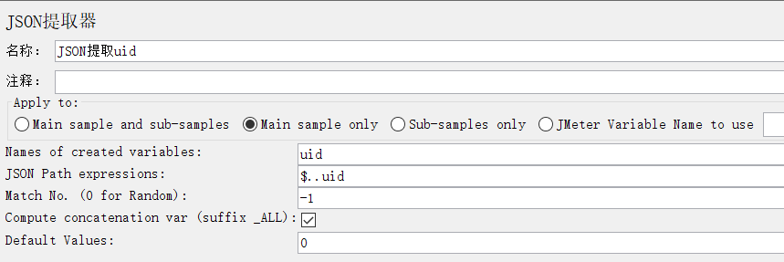

   - **Names of created variables**：保存的变量名
   - **JSON Path exression**：JSONPath 表达式
   - **Match No.**：匹配数字。表达式提取到多个值时，保存第几个：0=随机，1=第 1 个，n=第 n 个，-1=全部。
   - **Compute concatenation var**：是否联合保存变量（仅 Match No. = -1 时可能用到）。勾选后会创建 `原变量名_ALL` 的新变量，值为所有提取值逗号连接。例如 `uid` 提取到 1、2，则 `uid_ALL` = `1,2`，且**不存在** `uid` 这个变量，只存在 `uid_ALL`（不勾选则存在 `uid_1`、`uid_2`）。
   - **Default value**：JSONPath 未提取到值时保存的默认值。
   - 下游请求引用变量的统一语法：**`${变量名}`**

   具体提取器配置：

   ```text
   用户登录 → JSON 提取 uid ： $.uid                ，Match No. = 1
   用户登录 → JSON 提取 sid ： $.data.session.sid   ，Match No. = 1
   商品搜索 → JSON 提取 goods_id ： $.data[?(@.name=="P806")].goods_id ，Match No. = 1
   商品详情 → JSON 提取 spec ： $.data.specification[?(@.attr_type==1)].value[0].id ，Match No. = -1，勾选联合保存
   收货地址列表 → JSON 提取 address_id ： $.data[?(@.default_address==1)].id ，Match No. = 1，默认值 -1
   ```

9. 需要检查响应结果时添加断言；响应为 JSON 用 JSON 断言。

   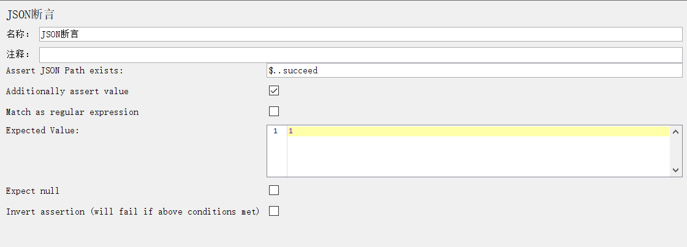

   - **Assert JSON Path exists**：断言 JSONPath 路径存在（填 JSONPath）。
   - **Additionally assert value**：还要断言值。只要求路径存在则不必勾选；既要路径存在又要值满足要求则勾选。
   - **Match as regular expression**：正则模糊匹配。仅当选中"还要断言值"时启用，默认选中。选中则 Expected Value 写正则；取消则写精确期望值。
   - **Expected Value**：期望结果。
   - **Expect Null**：期望为空。JSONPath 期望不存在或期望空字符串时勾选，且期望值不填。
   - **Invert assertion**：取反。

   配置示例：用户登录 → 断言 → JSON 断言，JSONPath 写 `$.succeed`，勾选"还要断言值"，取消正则匹配，期望值写 `1`。复制该断言，粘贴到"添加购物车"和"提交订单"。

10. 循环控制器 → 右键 → 添加 → 逻辑控制器 → If 控制器，拖到"添加收货地址"上方，再把"添加收货地址"拖入其内。If 控制器条件为真时其下取样器才执行。

    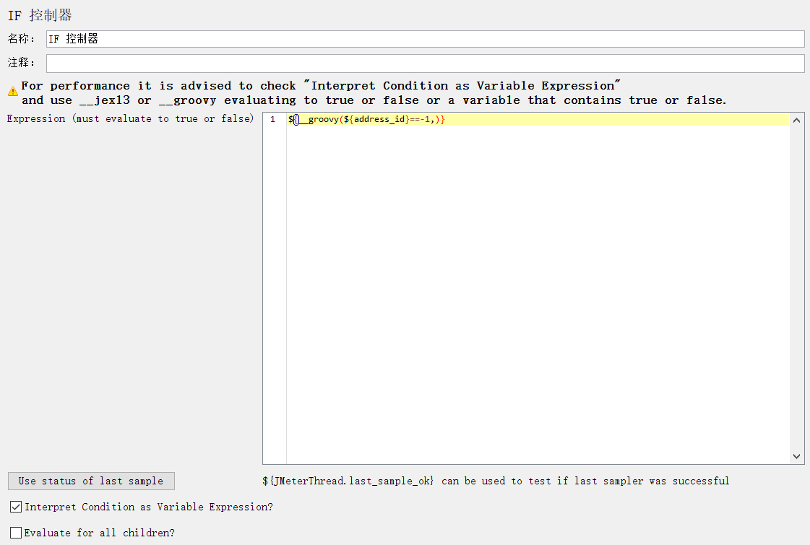

    - **Expression**：条件表达式，通常用 `__groovy` 函数。
    - 通过菜单"工具 → 函数助手"，函数列表选 `groovy`，在"表达式评估"中写 Groovy 条件，点"生成"复制到剪贴板。此处条件为 `${address_id}==-1`。

    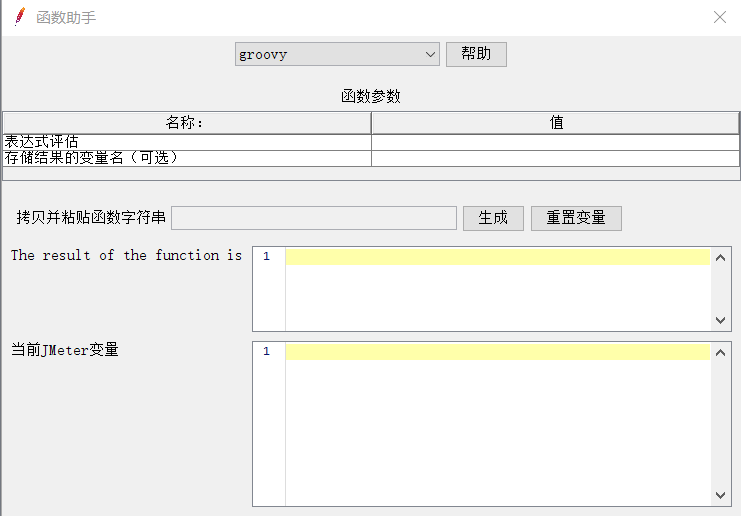

11. 线程组 → 右键 → 添加 → 配置元件 → CSV Data Set Config，实现参数化。CSV 有几行数据，线程组就能配几个线程，每线程独享一组数据。

    预先编写 `ecmobiledata.csv`：3 列，首行 `用户名,密码,商品名称`，第 2~201 行为 200 个用户数据。

    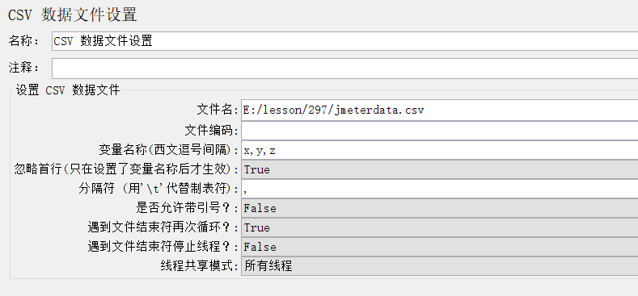

    - 变量名称：`x,y,z`（x=用户名，y=密码，z=商品名称）
    - 忽略首行：`True`

    引入变量后修改多处配置：

    ```json
    用户登录 JSON  → { "name": "${x}", "password": "${y}" }
    商品搜索 JSON  → { "filter": { "keywords": "${z}", "sort_by": "price_asc" } }
    商品搜索下 JSON 提取器表达式 → $.data[?(@.name=="${z}")].goods_id
    ```

12. 添加 4 个定时器实现等待：

    - 商品搜索 → 同步定时器（Synchronizing Timer），用户组数量 25，超时 20000；
    - 添加购物车 → 固定定时器，等待 3000；
    - 购物车列表 → 统一随机定时器，最大延迟 5000，固定延迟至少 1000；
    - 提交订单 → 常数吞吐量定时器（Constant Throughput Timer），每分钟样本数 3，基于计算吞吐量选"只有此线程"。

### 开发脚本 2：ecshop 数据库 SQL 语句性能测试脚本

对某用户查询其所有订单明细的 SQL 做性能测试，检查执行效率：先从 `ecs_users` 按 `user_name` 查 `user_id`，再到 `ecs_order_info`、`ecs_order_goods`、`ecs_goods` 查订单明细。

1. 添加线程组；线程组下添加"配置元件 → JDBC 连接配置"和"逻辑控制器 → 简单控制器"。
2. 添加 JDBC 连接配置：

   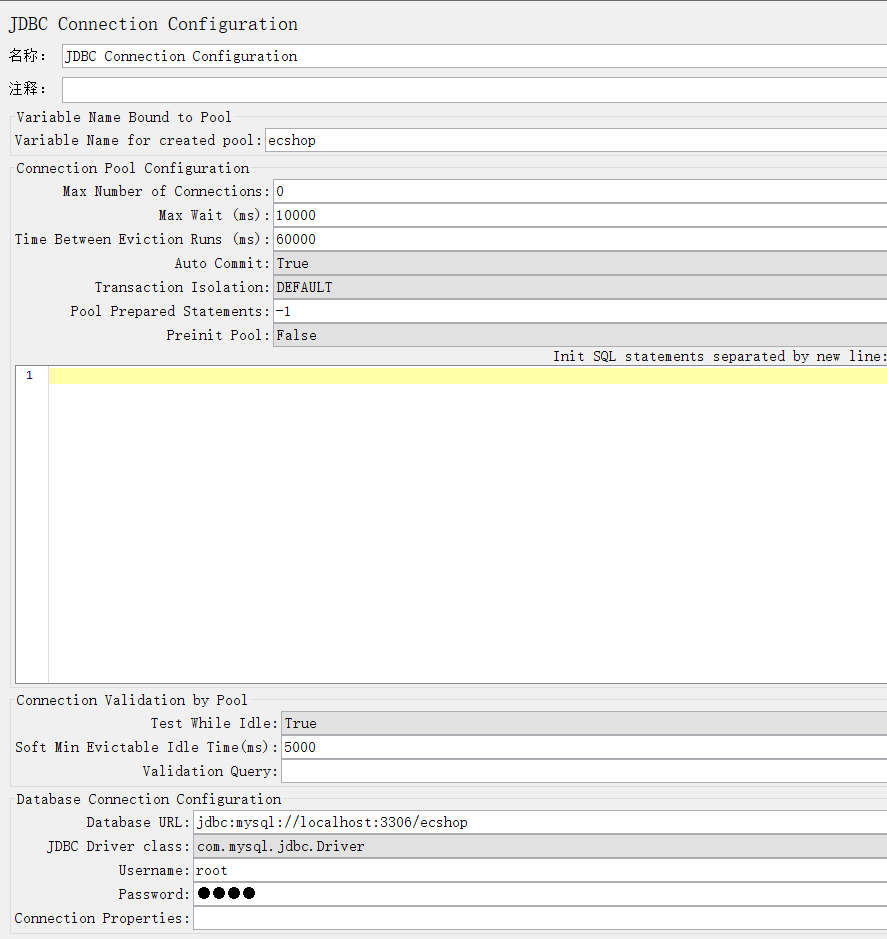

   - **Variable Name for Created Pool**：连接池名称，自定义；JDBC 请求中用此名称指定运行库。
   - **Database URL**：MySQL 格式 `jdbc:mysql://IP:端口/数据库名`
   - **JDBC Driver Class**：MySQL 5.x 用 `com.mysql.jdbc.Driver`；MySQL 6+ 用 `com.mysql.cj.jdbc.Driver`。需把 `mysql-connector-j-8.2.0.jar` 放到 JMeter 目录的 `lib/ext` 下（放入后重启 JMeter）。
   - 本例配置：连接名 `ecshop`；URL `jdbc:mysql://127.0.0.1:3306/ecshop`；用户名 `root`；密码 `123456`。

3. CSV 数据文件设置（同脚本 1）。
4. 简单控制器下添加取样器 → JDBC 请求：

   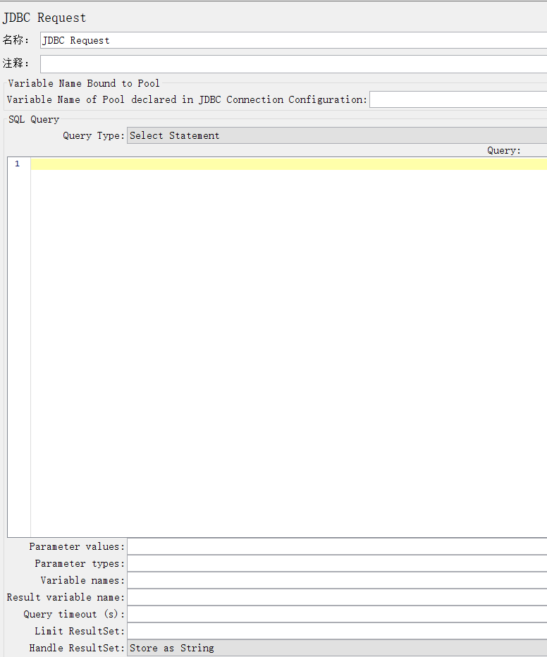

   - **Variable Name of Pool**：JDBC 连接配置中定义的连接名。
   - **Query Type**：Select 用于查询；Update 用于 create/drop/alter/insert/update/delete；带参数选 Prepared 语句，不带参数选非 Prepared。
   - **Query**：SQL 语句，参数一律用 `?` 代替（不考虑数据类型）。

   ```sql
   -- 不带参数
   Select user_id from users where username='zhangsan' and password='123456' and org_id=10;

   -- 带参数（Prepared）
   Select user_id from users where username=? and password=? and org_id=?;
   ```

   - **Parameter values**：`?` 对应的参数值，通常写变量引用，逗号隔开，如 `${username},${password},${org_id}`。
   - **Parameter Type**：参数数据类型，逗号隔开，如 `Varchar,varchar,int`。
   - **Variable Names**：select 字段若要保存为变量供下游用，如 `user_id`。

   JDBC 请求 1：连接名 `ecshop`；类型 `Prepared Select Statement`；SQL `select user_id from ecs_users where user_name=?`；参数值 `${x}`；参数类型 `varchar`；变量名 `user_id`。
   JDBC 请求 2：连接名 `ecshop`；类型 `Prepared Select Statement`；SQL `select i.order_id, g.goods_id, g.goods_name, d.goods_number from ecs_order_info i, ecs_order_goods d, ecs_goods g where i.order_id=d.order_id and d.goods_id=g.goods_id and user_id=?`；参数值 `${user_id_1}`；参数类型 `integer`。

5. 添加调试取样器。
6. 添加查看结果树。

### 开发脚本 3：ecshop Web 服务性能测试脚本

1. 用 Badboy 录制 Web 端订购主流程，导出 JMeter 脚本；把每个请求名称改为中文。
2. 修改"用户定义的变量"，删原有变量，增加 `host` = `localhost`。
3. 把所有 HTTP 请求的服务器名称改为 `${host}`。
4. 线程组添加 CSV 数据文件设置、调试取样器、查看结果树（CSV 配置同前）。
5. 登录请求 `username` → `${x}`，`password` → `${y}`。
6. 登录请求添加"响应断言"，测试模式加"登录成功"。
7. 搜索商品 `keywords` → `${z}`。
8. 商品详情 `id` → `${goods_id}`。
9. 获取商品价格请求（录制时未保存协议和主机）：协议 `http`，服务器名称 `${host}`；`id` → `${goods_id}`，`attr` → `${spec_ALL}`。
10. 加入购物车 `goods` → `{"quick":1, "spec":[${spec_ALL}], "goods_id":${goods_id}, "number":"1", "parent":0}`。
11. 订单详情 `order_id` → `${order_id}`。
12. 函数助手：

    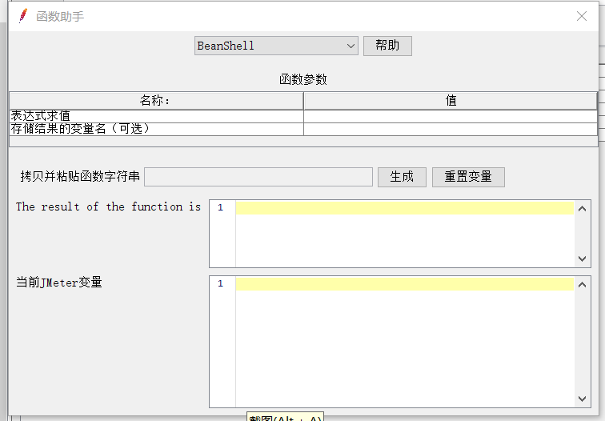

    菜单"工具 → 函数助手"，选函数、配参数，最后一个参数可保存结果变量。点"生成"后完整代码已复制，到目标处 Ctrl+V 粘贴。提交订单 `x` 用 `Random`（最小 1、最大 100）生成，`y` 用 `Random`（最小 1、最大 40）生成。

13. 正则表达式提取器：从 HTML 源码按特定文字提取值时多用它。

    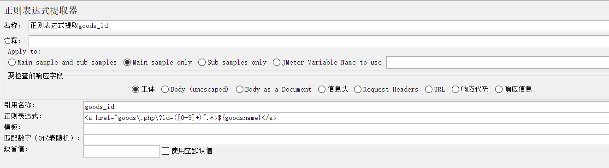

    - **模板**：`$数字$`，表示第几个 `()` 捕获。`$1$`=第 1 个括号，`$2$`=第 2 个，`$0$`=整个正则匹配内容。
    - **匹配数字**：正则全文中的第几处。1=第 1 处，2=第 2 处，0=随机，-1=全部。
    - 通常做法：先在查看结果树以 Text 显示找到目标文字，复制到正则表达式框，再切到 RegExp Tester 反复测试。

    示例 1（搜索商品提取商品 id=24）：

    ```text
    源 HTML： <a href="goods.php?id=24" title="">P806</a>
    正则：    <a href="goods\.php\?id=([0-9]+)".*>P806</a>
    名称：goods_id   模板：$1$   匹配数字：1
    ```

    示例 2（我的订单提取 order_id=265）：

    ```text
    源 HTML： <a href="user.php?act=order_detail&order_id=265" title="">20240115234</a>
    正则：    <a href="user\.php\?act=order_detail&order_id=([0-9]+)".*?>${order_sn}</a>
    名称：order_id   模板：$1$   匹配数字：1
    ```

14. CSS / jQuery 提取器：从 HTML 按标签和属性提取值或文字时多用它。

    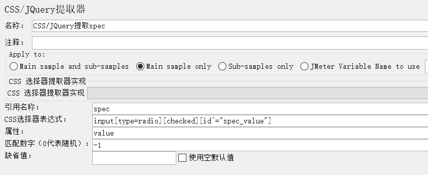

    - **引用名称**：变量名
    - **CSS 选择器表达式**：样式表选择器
    - **属性**：提取双标签间文字则留空；提取标签内某属性值则写属性名
    - **匹配数字**：同正则的匹配数字含义

    示例：

    ```css
    /* 商品详情：提取所有选中规格值 */
    引用名称：spec
    CSS：input[type=radio][checked][id^="spec_value"]
    属性：value   匹配数字：-1

    /* 提交订单：提取订单号 */
    引用名称：order_sn
    CSS：h6>font   匹配数字：1
    ```

15. 响应断言：可对状态码、头部值、body 文字断言，是 JMeter 最重要的断言工具。

    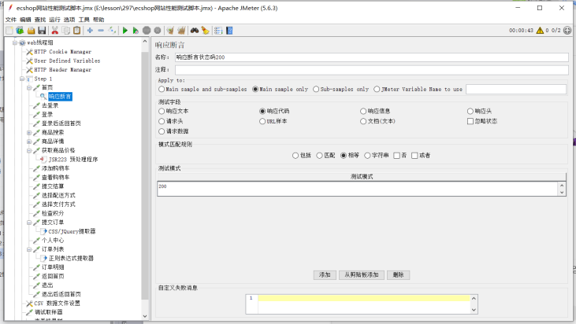

    上图对响应状态码断言等于 200。

16. JSR223 预处理程序：

    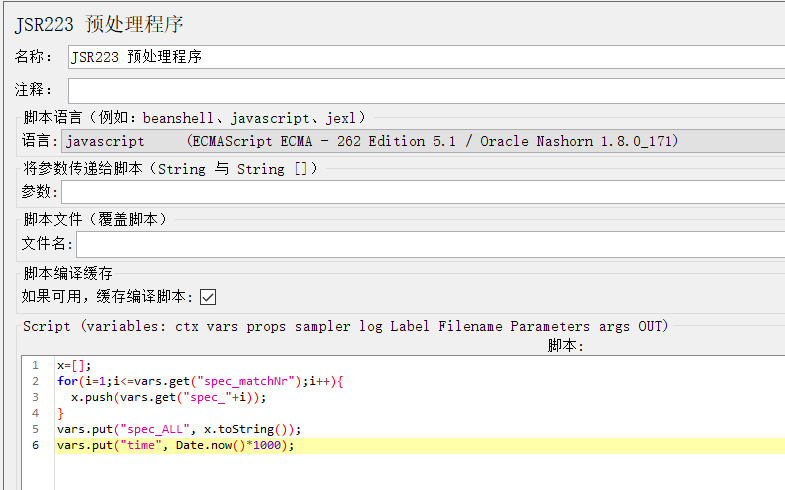

    获取商品价格 → 右键 → 前置处理器 → JSR223 预处理程序，语言切为 JavaScript，脚本：

    ```javascript
    x = [];  // 定义空数组，存放所有 spec 值（该请求 attr 参数是逗号隔开的 spec 值）
    for (i = 1; i <= vars.get("spec_matchNr"); i++) {  // spec_matchNr 保存 spec 值个数
      x.push(vars.get("spec_" + i));  // 把每个 spec 值插入数组
    }
    vars.put("spec_ALL", x.toString());  // 数组转字符串，保存为 spec_ALL
    vars.put("time", Date.now() * 1000);  // 构造微秒级时间戳
    ```

## 执行测试

JMeter 执行测试有 2 种方式：① CLI 命令行模式；② 分布式。

### 1. CLI 命令行模式

并发量低、单机可执行时，用一台测试机在 `cmd` 中执行 JMeter 命令（需先进入 JMeter 的 `bin` 目录）：

```bash
jmeter [选项]
```

常用选项：

- `-n`：非图形化（命令行）模式运行
- `-t 脚本.jmx`：指定要执行的脚本
- `-l 结果.csv`：保存所有取样器记录到结果文件（文件需不存在）；要生成报告则必须用此选项
- `-e`：测试后生成报告
- `-o 空目录`：报告输出目录（不存在则创建，目录内不能有内容）
- `-g 结果.csv`：不执行测试，仅加载已有结果文件导出报告

常用执行命令：

```bash
jmeter -n -t 测试脚本.jmx -l 结果.csv -e -o 报告目录
```

### 2. 分布式

JMeter 提供分布式配置：1 台控制机（Master）+ 若干执行机（Slave）。控制机图形化打开，执行机用 `jmeter-server` 命令行启动；控制机通过"运行 → 远程启动所有"让所有执行机同时测试，结果汇总到控制机（常用聚合报告显示）。**脚本无需放在每台执行机**（控制机自动下发），但**各执行机的相同目录下需存放不同数据的相同 CSV 文件**。

要求控制机与执行机 Java 版本、JMeter 版本相同。

**配置执行机**：修改 `bin/jmeter.properties`：

```properties
# 约第 272 行注释去掉 # ，端口举例 1099（未被占用的端口）
server_port=1099
# 关闭 RMI SSL（约第 345 行注释去 # 并改 false 为 true）
server.rmi.ssl.disable=true
```

双击 `jmeter-server.bat` 启动命令行执行端。

**配置控制机**：修改同名文件：

```properties
# 改为执行机 IP:端口；多台用逗号分隔
remote_hosts=127.0.0.1:1099
# 同样关闭 RMI SSL
server.rmi.ssl.disable=true
```

## 分析结果并定位性能瓶颈

结果不达标（响应时间过长、成功率过低）需与开发配合定位瓶颈。常见原因：

1. 硬件设备性能不够；
2. `select` 语句性能不高、查询慢，导致界面响应长；
3. `insert/update/delete` 引发锁表机制不合理（锁过多、锁太久），导致处理时间长；
4. 连接服务后打开却不及时关闭，后续连接需等待超时，导致等待过长；
5. 算法不够优化，冗余循环过多；
6. 过多异常处理，大量并发的异常处理消耗过多资源；
7. 多线程处理同一文件，某线程处理时其它线程必须等待；
8. 过长同步操作，某步慢则整体慢。

其中 select 语句不够优化最易解释。定位 SQL 瓶颈的最简方法：把模块所有 SQL 单独做性能测试，检验执行效率。常见优化方式：

1. 谨慎巧妙地添加索引（index）；
2. 把复杂多表查询、子查询拆分为多个简单查询；
3. 调整 `where` 中各条件的写法和顺序。

## 性能优化

由开发人员实施性能优化。

## 性能回归测试

开发优化完成后，测试人员再次回归，直到通过，结束测试并提交测试报告。

## 性能测试收尾

用 SQL 对测试中产生的数据进行回收、删除，拆除测试环境、还原系统运行环境。

# jsonpath 语法

JSON（JavaScript Object Notation）是一种数据标记语言。基本格式：一对花括号引用若干逗号隔开的键值对；键是双引号字符串，值是 JS 数据类型（字符串 String、数字 Number、数组 Array、JSON 对象）。数组用方括号引用若干逗号隔开的元素。键也称 node（节点），值称节点值。

```json
{
  "student": [
    {"id": 1, "name": "张三", "score": [90, 85, 100]},
    {"id": 2, "name": "李四", "score": [70, 65, 80]}
  ],
  "teacher": "王老师",
  "status": {"style": 1, "error_message": ""}
}
```

"王老师"的位置：根节点下的 `teacher` 节点——这就是 JSON 中的路径。JSONPath 即 JSON 节点路径。

语法：

1. `$` 表示根节点，所有表达式都从 `$` 开始。
2. 子节点用 `.` 连接：`$.teacher`。
3. 不限路径的某子节点用 `..`：`$.status.style` 也可写作 `$..style`。
4. 数组取第几个：`$.node[索引]`（索引从 0 开始）。`$.student[0].score[1]` = 85。
5. 数组元素过滤：`$.node[?(@.子节点条件)].子节点`。例如从 `student` 中找 `id=1` 的元素取 `name`：

   ```text
   $.student[?(@.id==1)].name
   ```

# xpath 语法

XPath（XML Node Path）是 XML 文件中定位节点文字的字符串表达式。

XML（eXtensible Markup Language）可自定义标签名与属性名；HTML 的标签/属性名有固定语义。两者均为树状结构。

标签语法：

- 单标签：`<标签名 属性名="属性值" />`
- 双标签：`<标签名 属性名="属性值">内部文字或子标签</同名标签名>`

XML 示例：

```xml
<class name="310">
  <student>
    <name id="1">张三</name>
    <telephone>13812345678</telephone>
    <scores>
      <lesson name="语文" score="80" />
      <lesson name="数学" score="90" />
      <lesson name="英语" score="85" />
    </scores>
  </student>
  <student>
    <name id="2">李四</name>
    <telephone>13912345678</telephone>
    <scores>
      <lesson name="语文" score="70" />
      <lesson name="数学" score="80" />
      <lesson name="英语" score="75" />
    </scores>
  </student>
</class>
```

xpath 描述节点的语法：

- 单个节点：`/`（根节点，类 `$`）、标签名、`@属性名`、`text()`（所有文字节点）、`*`（任意节点通配符）。
- 节点间用 `/` 连接：默认父/子关系。
  - `/class/student`：父/子
  - `/class/@name`：标签与属性
  - `/class/student/telephone/text()` 与 `/class/student/telephone` 等价
- `//` 表示不限路径：`//telephone`、`/class/student//lesson`。
- 完整节点语法：`轴::节点[谓语]`
  - 谓语 1（索引，从 1 开始）：`/class/student[2]`
  - 谓语 2（匹配条件）：`//name[@id="2"]`、`//name[text()="张三"]`、`//student[telephone="13912345678"]`
- 轴（本节点与前节点的关系，默认子节点）：
  - `child::`（可省略）：`/class/student` = `/child::class/child::student`
  - `parent::`：`//lesson[@name="语文"][@score="70"]/parent::scores`
  - `ancestor::`：祖先
  - `descendant::`：后代
  - `following-sibling::`：后续兄弟
  - `preceding-sibling::`：前序兄弟
- 其他：`..` 表示上级节点（等价 `parent::`）。
- 模糊定位（对应 CSS）：
  - 包含：`//input[contains(@name, "user")]`
  - 打头：`//input[starts-with(@name, "user")]`
  - 结尾：XPath 1.0 无 `ends-with`，需变通：`//input[substring(@name, string-length(@name)-string-length("user")+1)="user"]`

# mysql 存储过程

创建存储过程通常在客户端软件中"新建"创建；若用 SQL 编辑器直接写，需在前后加 `DELIMITER` 切换语句结束符。

语法：

```sql
DELIMITER $$

CREATE PROCEDURE 存储过程名(参数名 数据类型(长度), 参数名 数据类型(长度))
BEGIN
  # 存储过程主体
END $$

DELIMITER ;
```

变量：① 必须定义；② 赋值；③ 引用。

- 定义：`declare 变量名 数据类型(长度);`
- 定义时初始赋值：`declare 变量名 数据类型(长度) default 初始值;`
- `set` 赋值：`set 变量名=值;`
- `select into` 赋值：`select 字段1,字段2 into 变量1,变量2 from 表...;`（必须只查一条记录）

条件判断：

```mysql
IF 条件1 THEN
  -- 条件1为真
ELSEIF 条件2 THEN
  -- 条件1假、条件2真
ELSE
  -- 都假
END IF;
```

条件用 `a=b` 判断，用 `and`/`or` 逻辑运算，语法同 `where`。

循环：

```mysql
WHILE 条件 DO
  -- 条件真则循环，假则退出
  -- 变量迭代赋值
END WHILE;
```

游标（cursor）：一条 `select` 的结果集，可针对每一条记录分别处理。

- 定义：`declare 游标名 cursor for select语句;`
- 退出机制：`declare continue handler for not found set 退出变量=true;`
- 打开：`open 游标名;`
- 循环提取处理：

  ```sql
  A: loop
    fetch 游标名 into 变量名, 变量名;
    if 退出变量 then
      leave A;
    end if;
    -- insert/update/delete 等
  end loop;
  ```

- 关闭：`close 游标名;`

调用：`call 存储过程名(参数值, 参数值);`

# 正则表达式语法

正则表达式是具有模糊匹配功能的特殊字符串（类似 SQL `like` 的 `%`/`_`，但能力强得多）。包含以下几类字符：

1. **普通字符**：精确匹配。中英数字、部分符号、`\` 转义字符都是普通字符。如 `.` 是特殊字符，精确匹配小数点用 `\.`；`\t` 缩进、`\n` 换行。
2. **模糊匹配一个字符**：
   - `.`：任意字符（除 `\n`）
   - `[abc]`：a/b/c 之一；`[0-9]` 一个数字；`[a-zA-Z0-9_-]` 一个字母数字或 `_`/`-`
   - `[^0-9]`：任意非数字字符
3. **重复次数**：
   - `*`：0 到多次（`.*` 任意长度任意字符）
   - `+`：1 到多次
   - `*?` / `+?`：懒惰模式（尽量少匹配）；默认 `*`/`+` 为贪婪模式
     - 原文 `<a href="xxxx"><font color="red">xxx</font></a>`
     - `<a href=".*">` → 贪婪匹配到 `<a href="xxxx"><font color="red">`（`.*` 尽量多）
     - `<a href=".*?">` → 懒惰匹配到 `<a href="xxxx">`
   - `?`：0 或 1 次
   - `{3,10}`：3~10 次；`{3,}`：至少 3 次；`{,10}`：最多 10 次；`{6}`：恰好 6 次
4. **位置**：
   - `^[0-9]{6}[a-zA-Z]{18}`：整行以 6 数字 + 18 字母打头
   - `^[0-9]{12}$`：整行仅 12 个数字
5. **分组**：
   - `(abc)`：整体成组；`(021)?[0-9]{8}` 中 021 可有可无
   - `()` 还有捕获功能：`id="([0-9]+)"` 匹配 `<div id="123">` 可捕获 123
   - `()` 与 `|` 组合表逻辑或：`(ab|00)` 匹配 ab 或 00

# 样式表选择器

W3C 定义的 HTML 元素定位技术标准（CSS Selector）。

## 1. 一般选择器

1. **标签名选择器**：`input` → 定位 `<input>` 标签
2. **id 选择器**：`#a1` → 定位 `id="a1"` 的标签
3. **class 选择器**：`.a2` 定位 class 含 `a2` 的标签；`.a1.a2` 仅定位同时含 `a1` 和 `a2` 的标签
4. **其它属性选择器**：
   - `[checked]`：拥有该属性的标签
   - `[name="username"]`：属性值匹配（引号可省）
   - `[name*="_name_"]`：属性值包含指定串
   - `[name^="name_"]`：属性值以指定串打头
   - `[name$="_name"]`：属性值以指定串结尾

   组合顺序固定：**标签名#id.class[其它属性]**，如 `input[checked][name^="spec"]`。

## 2. 派生选择器

1. **父子**：`父 > 子`，如 `#a2>input`
2. **祖先后代**：`祖先 后代`，如 `div#a1 input`
3. **兄弟**：`长兄 + 相邻幼弟`，如 `div#a1+input+input`

## 3. 伪类（子元素索引）

- `:first-child` / `:last-child`：父下第一/最后一个子标签
- `:nth-child(n)`：父下第 n 个子标签
- `:nth-of-type(n)`：父下该类型第 n 个子标签

```html
<div id="a1">
  <input type="text">
  <br>
  <input type="text">
  <br>
  <input type="text">
</div>
```

- `div#a1>input:first-child`：id=a1 的 div 下第一个子标签是 input
- `div#a1>input:nth-child(3)`：第 3 个子标签是 input（即第 2 个 input）；等价 `div#a1>input:nth-of-type(2)`

# JSR223

JSR223 是 Java 支持多脚本语言的后处理技术标准。JMeter 中各类 JSR223 元件通过脚本语言编写并运行，实现代码层提取、构造参数、断言，用于仅靠提取器/断言元件无法实现的功能。

JMeter 5.x 中 JSR223 **默认使用 Groovy**；也支持 BeanShell（Java 语言），BeanShell 系列可视为 JSR223 的一种实现。本课程以 JavaScript 为例。

元件：JSR223 预处理程序、JSR223 提取器、JSR223 定时器、JSR223 断言。

- **参数**：向上游变量传值，脚本内用 `args[索引]` 获取（0 为第一个）。
- **文件名**：引用外部脚本，会覆盖"脚本"处代码。
- **脚本**：编写代码处。

无论脚本文件还是脚本，均可使用以下内置对象：

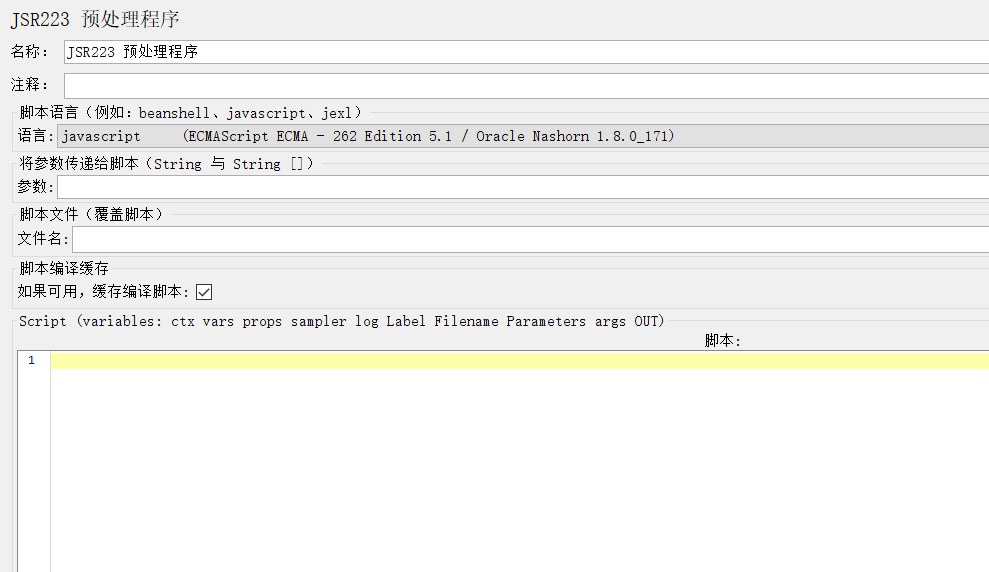

- **vars**：私有变量对象。JMeter 有 3 类变量：
  1. 私有变量：每线程各自持有（前置处理器的用户参数、各提取器变量、CSV 变量、`vars` 写入的变量）。
  2. 受控变量：线程组内公用（用户定义变量；若 `vars` 写入已定义的用户变量，仍属线程组内公用，优先于私有）。
  3. 全局变量：所有线程组所有线程共享，`props` 写入的即全局变量。
- **props**：等价于 `jmeter.properties` 中的配置，全局公用。

```javascript
vars.get("变量名");   props.get("变量名");   // 获取
vars.put("变量名", 值); props.put("变量名", 值); // 写入
```

- **log**：写日志。`log.info("消息")`、`log.error("错误")`。
- **AssertionResult**（JSR223 断言中）：`AssertionResult.setFailure(true)` 表断言失败，`setFailureMessage("报错")` 设消息。
- **prev**（后置/断言中，表示当前取样器）：
  - `prev.getResponseCode()`：响应状态码
  - `prev.getResponseHeader("头部名")`：指定头部值
  - `prev.getResponseDataAsString()`：响应 body
