# 知识库入口

- 返回总索引：[[00-知识地图]]
- 关联主题：[[软件测试基本常识]]、[[web/Web协议和测试|Web 协议和测试]]、[[01-环境搭建|Selenium 自动化]]、[[jmeter性能测试|JMeter 性能测试]]

# Python 基础

## 标识符

- 第一个字符必须以字母（a-z, A-Z）或下划线 **_** 。
- 标识符的其他的部分由字母、数字和下划线组成。
- 标识符对大小写敏感，count 和 Count 是不同的标识符。
- 标识符对长度无硬性限制，但建议保持简洁（一般不超过 20 个字符）。
- 禁止使用保留关键字，如 if、for、class 等不能作为标识符。

## Python 保留关键字

保留字即关键字，我们不能把它们用作任何标识符名称。Python 的标准库提供了一个 keyword 模块，可以输出当前版本的所有关键字：

| **类别**   | **关键字**    | **说明**              |
| -------- | ---------- | ------------------- |
| **逻辑值**  | `True`     | 布尔真值                |
|          | `False`    | 布尔假值                |
|          | `None`     | 表示空值或无值             |
| **逻辑运算** | `and`      | 逻辑与运算               |
|          | `or`       | 逻辑或运算               |
|          | `not`      | 逻辑非运算               |
| **条件控制** | `if`       | 条件判断语句              |
|          | `elif`     | 否则如果（else if 的缩写）   |
|          | `else`     | 否则分支                |
| **循环控制** | `for`      | 迭代循环                |
|          | `while`    | 条件循环                |
|          | `break`    | 跳出循环                |
|          | `continue` | 跳过当前循环的剩余部分，进入下一次迭代 |
| **异常处理** | `try`      | 尝试执行代码块             |
|          | `except`   | 捕获异常                |
|          | `finally`  | 无论是否发生异常都会执行的代码块    |
|          | `raise`    | 抛出异常                |
| **函数定义** | `def`      | 定义函数                |
|          | `return`   | 从函数返回值              |
|          | `lambda`   | 创建匿名函数              |
| **类与对象** | `class`    | 定义类                 |
|          | `del`      | 删除对象引用              |
| **模块导入** | `import`   | 导入模块                |
|          | `from`     | 从模块导入特定部分           |
|          | `as`       | 为导入的模块或对象创建别名       |
| **作用域**  | `global`   | 声明全局变量              |
|          | `nonlocal` | 声明非局部变量（用于嵌套函数）     |
| **异步编程** | `async`    | 声明异步函数              |
|          | `await`    | 等待异步操作完成            |
| **其他**   | `assert`   | 断言，用于测试条件是否为真       |
|          | `in`       | 检查成员关系              |
|          | `is`       | 检查对象身份（是否是同一个对象）    |
|          | `pass`     | 空语句，用于占位            |
|          | `with`     | 上下文管理器，用于资源管理       |
|          | `yield`    | 从生成器函数返回值           |

## 注释

- Python 中单行注释以 **#** 开头
- 多行注释可以用多个 **#** 号，还有 **'''  '''** 和 **"" "  " ""**：

## 行与缩进

Python 最具特色的就是使用缩进来表示代码块，不需要使用大括号 **{}** 。

缩进的空格数是可变的，但是同一个代码块的语句必须包含相同的缩进空格数。

## 多行语句

- Python 通常是一行写完一条语句，但如果语句很长，我们可以使用反斜杠来实现 **多行语句**
- 在 [], {}, 或 () 中的多行语句，不需要使用反斜杠

## 数字(Number)类型

Python 中数字有四种类型：整数、布尔型、浮点数和复数。

- **int** (整数), 如 1, 只有一种整数类型 int，表示为长整型，没有 python2 中的 Long。
- **bool** (布尔), 如 True。
- **float** (浮点数), 如 1.23、3E-2
- **complex** (复数) - 复数由实部和虚部组成，形式为 a + bj，其中 a 是实部，b 是虚部，j 表示虚数单位。如 1 + 2j、 1.1 + 2.2j

------

## 字符串(String)

- Python 中单引号 **'** 和双引号 **"** 使用完全相同。
- 使用三引号(**'''** 或 **"" "**)可以指定一个多行字符串。
- 转义符 **\\**。
- 反斜杠可以用来转义，使用 **r** 可以让反斜杠不发生转义。 如 **r "this is a line with \n"** 则 **\n** 会显示，并不是换行。
- 按字面意义级联字符串，如 **"this " "is " "string"** 会被自动转换为 **this is string**。
- 字符串可以用 **+** 运算符连接在一起，用 ***** 运算符重复。
- Python 中的字符串有两种索引方式，从左往右以 **0** 开始，从右往左以 **-1** 开始。
- Python 中的字符串不能改变。
- Python 没有单独的字符类型，一个字符就是长度为 1 的字符串。
- 字符串切片 **str [start: end]**，其中 start（包含）是切片开始的索引，end（不包含）是切片结束的索引。
- 字符串的切片可以加上步长参数 step，语法格式如下：**str [start:end:step]**

```python
#!/usr/bin/python3

str = '123456789'

print(str)  # 输出字符串 123456789
print(str[0:-1])  # 输出第一个到倒数第二个的所有字符 12345678
print(str[0])  # 输出字符串第一个字符 1
 print(str[2:5])  # 输出从第三个开始到第六个的字符（不包含） 345
print(str[2:])  # 输出从第三个开始后的所有字符 3456789
print(str[1:5:2])  # 输出从第二个开始到第五个且每隔一个的字符（步长为 2） 24
print(str * 2)  # 输出字符串两次 123456789123456789
print(str + '你好')  # 连接字符串 123456789 你好
print('------------------------------')
print('hello\nrunoob')  # 使用反斜杠(\)+n 转义特殊字符
print(r'hello\nrunoob')  # 在字符串前面添加一个 r，表示原始字符串，不会发生转义
```

## 空行

函数之间或类的方法之间用空行分隔，表示一段新的代码的开始。类和函数入口之间也用一行空行分隔，以突出函数入口的开始。

空行与代码缩进不同，空行并不是 Python 语法的一部分。书写时不插入空行，Python 解释器运行也不会出错。但是空行的作用在于分隔两段不同功能或含义的代码，便于日后代码的维护或重构。

**记住：** 空行也是程序代码的一部分。

## 等待用户输入

执行下面的程序在按回车键后就会等待用户输入：

```python
#!/usr/bin/python3

input("\n\n按下 enter 键后退出。")
```

以上代码中 ，**\n\n** 在结果输出前会输出两个新的空行。一旦用户按下 **enter** 键时，程序将退出。

## 同一行显示多条语句

Python 可以在同一行中使用多条语句，语句之间使用分号 **;**

## print 输出

**print** 默认输出是换行的，如果要实现不换行需要在变量末尾加上 **end = ""**：

## import 与 from...import

在 Python 用 **import** 或者 **from...import** 来导入相应的模块。

将整个模块(somemodule)导入，格式为： **import somemodule**

从某个模块中导入某个函数, 格式为： **from somemodule import somefunction**

从某个模块中导入多个函数, 格式为： **from somemodule import firstfunc, secondfunc, thirdfunc**

将某个模块中的全部函数导入，格式为： **from somemodule import ***

# 基本数据类型

## 变量赋值

Python 中的变量不需要声明。每个变量在使用前都必须赋值，变量赋值以后该变量才会被创建。

在 Python 中，变量就是变量，它没有类型，我们所说的 **类型** 是变量所指的内存中对象的类型。

等号 **=** 用来给变量赋值。等号左边是变量名，右边是存储在变量中的值。

## 多个变量赋值

Python 允许你同时为多个变量赋值。

```python
a = b = c = 1

# 变量定义
x = 10           # 整数
y = 3.14         # 浮点数
name = "Alice"   # 字符串
is_active = True # 布尔值

# 多变量赋值
a, b, c = 1, 2, "three"

# 查看数据类型
print(type(x))         # <class 'int'>
print(type(y))         # <class 'float'>
print(type(name))      # <class 'str'>
print(type(is_active)) # <class 'bool'>
```

## 标准数据类型

Python3 中有 6 种标准数据类型，以及 bool 布尔类型（bool 是 int 的子类，有时单独列出）：

- Number（数字）
- String（字符串）
- bool（布尔类型）
- List（列表）
- Tuple（元组）
- Set（[[9-集合]]）
- Dictionary（字典）

按是否可变，可以分为以下两类：

- **不可变数据（4 个）：** Number（数字）、String（字符串）、bool（布尔）、Tuple（元组）
- **可变数据（3 个）：** List（列表）、Dictionary（字典）、Set（集合）

此外还有一些高级的数据类型，如字节数组类型 bytes

## Number（数字）

Python3 支持 **int、float、bool、complex（复数）**。

在 Python 3 里，只有一种整数类型 int，表示为长整型，没有 Python 2 中的 Long。

内置的 `type()` 函数可以用来查询变量所指的对象类型。

`isinstance` 和 `type` 的区别在于：

- `type()` 不会认为子类是一种父类类型。
- `isinstance()` 会认为子类是一种父类类型。

```python
class A:
    pass
class B(A):
    pass

result1 = isinstance(A(), A)        # True
result2 = type(A()) == A            # True
result3 = isinstance(B(), A)        # True
result4 = type(B()) == A            # False

# 打印结果
print(f"isinstance(A(), A) = {result1}")
print(f"type(A()) == A = {result2}")
print(f"isinstance(B(), A) = {result3}")
print(f"type(B()) == A = {result4}")

>>>
C:\Users\17867\Desktop\Projects\Python\.venv\Scripts\python.exe "C:\Users\17867\Desktop\Projects\Python\51-test\Python Basics\Temp_main.py"
isinstance(A(), A) = True
type(A()) == A = True
isinstance(B(), A) = True
type(B()) == A = False

进程已结束，退出代码为 0
```

> **注意：** Python3 中，bool 是 int 的子类，True 和 False 可以和数字相加，**True = 1、False = 0** *会返回* **True**，但可以通过 **is** 来判断对象身份。

Python 检测到你在用 `is` 比较一个字面量整数（如 1）和 True，这通常是代码错误——因为 `is` 比较的是对象身份（是否同一个对象），而不是值是否相等。Python 建议使用 `==` 来比较值，除非你确实需要检查是否是同一个对象。

在 Python 2 中是没有布尔型的，它用数字 0 表示 False，用 1 表示 True。

**注意：**

- Python 可以同时为多个变量赋值，如 `a, b = 1, 2`。
- 一个变量可以通过赋值指向不同类型的对象。
- [[数值]]的除法包含两个运算符：**/** 返回一个浮点数，**//** 返回一个整数（向下取整）。
- 在混合计算时，Python 会把整型自动转换为浮点数。

### 数值类型实例

| int    | float      | complex    |
| ------ | ---------- | ---------- |
| 10     | 0.0        | 3.14j      |
| 100    | 15.20      | 45.j       |
| -786   | -21.9      | 9.322e-36j |
| 0o17   | 32.3e+18   | .876j      |
| -0o112 | -90.       | -.6545+0J  |
| -0x260 | -32.54e100 | 3e+26J     |
| 0x69   | 70.2E-12   | 4.53e-7j   |

> 注意：Python 3 中整数字面量不允许前导零（如 `080`），八进制数必须使用 `0o` 前缀（如 `0o17`），十六进制使用 `0x` 前缀（如 `0x69`），二进制使用 `0b` 前缀。

## String（字符串）

Python 中的字符串用单引号 **'** 或双引号 **"** 括起来，同时使用反斜杠 **** 转义特殊字符。

字符串截取的语法格式如下：

索引值以 0 为开始值，-1 为从末尾开始的位置。

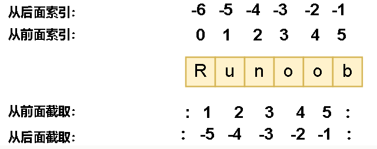

加号 **+** 是字符串的连接符，星号 ***** 表示复制当前字符串，与之结合的数字为复制的次数。实例如下：

```python
#!/usr/bin/python3

my_str = 'Runoob'       # 定义一个字符串变量（避免使用 str 作为变量名，会覆盖内置类型）

print(my_str)           # 打印整个字符串：Runoob
print(my_str[0:-1])     # 打印索引 0 到倒数第二个字符（不含最后一个）：Runoo
print(my_str[0])        # 打印第一个字符：R
print(my_str[2:5])      # 打印索引 2、3、4 的字符（不含索引 5）：noo
print(my_str[2:])       # 打印从索引 2 开始到末尾：noob
print(my_str * 2)       # 重复打印两次：RunoobRunoob
print(my_str + "TEST")  # 字符串拼接：RunoobTEST
```

- Python 使用反斜杠 **\\** 转义特殊字符，如果你不想让反斜杠发生转义，可以在字符串前面添加一个 **r**
- 另外，反斜杠（\）可以作为续行符，表示下一行是上一行的延续。也可以使用 **"" "..." ""** 或者 **'''...'''** 跨越多行。

  注意，Python 没有单独的字符类型，一个字符就是长度为 1 的字符串。

```py
>>> print('Ru\noob')
Ru
oob
>>> print(r'Ru\noob')
Ru\noob

>>> word = 'Python'
>>> print(word[0], word[5])
P n
>>> print(word[-1], word[-6])
n P
```

==**Python 字符串不能被改变**==。向一个索引位置赋值，比如 **word [0] = 'm'** 会导致错误。

**注意：**

- 反斜杠可以用来转义，使用 `r` 前缀可以让反斜杠不发生转义（原始字符串）。
- 字符串可以用 `+` 运算符连接，用 `*` 运算符重复。
- Python 中的字符串有两种索引方式：从左往右以 0 开始，从右往左以 -1 开始。
- Python 中的字符串不能改变，字符串是不可变类型。

## bool（布尔类型）

布尔类型即 True 或 False。在 Python 中，True 和 False 都是关键字，表示布尔值。

布尔类型可以用来控制程序的流程，比如判断某个条件是否成立，或者在某个条件满足时执行某段代码。

布尔类型特点：

- 布尔类型只有两个值：True 和 False。
- bool 是 int 的子类，因此布尔值可以被看作整数来使用，其中 True 等价于 1，False 等价于 0。
- 布尔类型可以和其他数据类型进行比较，比如数字、字符串等。在比较时，Python 会将 True 视为 1，False 视为 0。
- 布尔类型可以和逻辑运算符一起使用，包括 `and`、`or` 和 `not`，用来组合多个布尔表达式。
- 布尔类型也可以被转换成其他数据类型，比如整数、浮点数和字符串。在转换时，True 会被转换成 1，False 会被转换成 0。
- 可以使用 `bool()` 函数将其他类型的值转换为布尔值。以下值转换为布尔值时为 `False`：`None`、`False`、零（`0`、`0.0`、`0j`）、空序列（如 `''`、`()`、`[]`）和空映射（如 `{}`）。其他所有值转换为布尔值时均为 `True`。

```python
# 布尔类型的值和类型
a = True
b = False
print(type(a))  # <class 'bool'>
print(type(b))  # <class 'bool'>

# 布尔类型的整数表现
print(int(True))   # 1
print(int(False))  # 0

# 使用 bool() 函数进行转换
print(bool(0))          # False
print(bool(42))         # True
print(bool(''))         # False
print(bool('Python'))   # True
print(bool([]))         # False
print(bool([1, 2, 3]))  # True

# 布尔逻辑运算
print(True and False)  # False
print(True or False)   # True
print(not True)        # False

# 布尔比较运算
print(5 > 3)   # True
print(2 == 2)  # True
print(7 < 4)   # False

# 布尔值在控制流中的应用
if True:
    print("This will always print")

if not False:
    print("This will also always print")

x = 10
if x:
    print("x 是非零值，在布尔上下文中为 True")
```

## List（列表）

List（列表）是 Python 中使用最频繁的数据类型。

列表可以完成大多数集合类的数据结构实现。列表中元素的类型可以不相同，它支持数字、字符串，甚至可以包含列表（即嵌套列表）。

列表写在方括号 **[]** 之间，用逗号分隔开的元素列表。

和字符串一样，列表同样可以被索引和截取，列表被截取后返回一个包含所需元素的新列表。

列表截取的语法格式如下：

索引值以 **0** 为开始值，**-1** 为从末尾的开始位置。


加号 **+** 是列表连接运算符，星号 ***** 是重复操作。如下实例：

```python
#!/usr/bin/python3

my_list = ['abcd', 786, 2.23, 'runoob', 70.2]  # 避免使用 list 作为变量名，会覆盖内置类型
tinylist = [123, 'runoob']

print(my_list)             # 打印整个列表：['abcd', 786, 2.23, 'runoob', 70.2]
print(my_list[0])          # 打印第一个元素（索引 0）：abcd
print(my_list[1:3])        # 打印索引 1 和 2 的元素（不含索引 3）：[786, 2.23]
print(my_list[2:])         # 打印从索引 2 开始到末尾的所有元素：[2.23, 'runoob', 70.2]
print(tinylist * 2)        # 重复打印 tinylist 两次：[123, 'runoob', 123, 'runoob']
print(my_list + tinylist)  # 拼接两个列表

<<<
['abcd', 786, 2.23, 'runoob', 70.2]
abcd
[786, 2.23]
[2.23, 'runoob', 70.2]
[123, 'runoob', 123, 'runoob']
['abcd', 786, 2.23, 'runoob', 70.2, 123, 'runoob']
```

与 Python 字符串不一样的是，**列表中的元素是可以改变** 的：

List 内置了有很多方法，例如 `append()`、`pop()` 等等，这在后面会讲到。

**注意：**

- 列表写在方括号之间，元素用逗号隔开。
- 和字符串一样，列表可以被索引和切片。
- 列表可以使用 **+** 操作符进行拼接。
- 列表中的元素是可以改变的（可变类型）。

Python 列表截取可以接收第三个参数，参数作用是截取的步长，以下实例在索引 1 到索引 4 的位置设置步长为 2（每隔一个位置取一个元素）来截取列表：

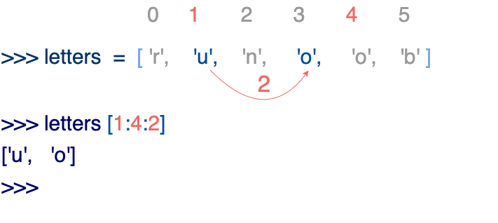

如果第三个参数为负数表示逆向读取，以下实例用于翻转字符串中的单词顺序：

def reverseWords([[input]]):

```python
# 通过空格将字符串分隔，把各个单词分隔为列表
inputWords = input.split(" ")

# inputWords [-1::-1] 三个参数说明：
# 第一个参数 -1 表示从最后一个元素开始
# 第二个参数为空，表示移动到列表开头
# 第三个参数 -1 表示逆向步进（每次向左移动一个位置）
inputWords = inputWords[-1::-1]

# 重新用空格拼接单词
output = ' '.join(inputWords)

return output

if `__name__` == "`__main__`":
    input = 'I like runoob'
    rw = reverseWords(input)
    print(rw)

<<<
runoob like I
```

## Tuple（元组）

元组（tuple）与列表类似，不同之处在于元组的元素不能修改。元组写在小括号 **()** 里，元素之间用逗号隔开。

元组中的元素类型也可以不相同：

```python
#!/usr/bin/python3

my_tuple = ('abcd', 786, 2.23, 'runoob', 70.2)  # 避免使用 tuple 作为变量名
tinytuple = (123, 'runoob')

print(my_tuple)               # 输出完整元组
print(my_tuple[0])            # 输出第一个元素：abcd
print(my_tuple[1:3])          # 输出索引 1 和 2 的元素：(786, 2.23)
print(my_tuple[2:])           # 输出从索引 2 开始的所有元素
print(tinytuple * 2)          # 输出两次 tinytuple
print(my_tuple + tinytuple)   # 连接两个元组

<<<
('abcd', 786, 2.23, 'runoob', 70.2)
abcd
(786, 2.23)
(2.23, 'runoob', 70.2)
(123, 'runoob', 123, 'runoob')
('abcd', 786, 2.23, 'runoob', 70.2, 123, 'runoob')
```

- 元组与字符串类似，可以被索引且下标从 0 开始，-1 为从末尾开始的位置，也可以进行截取。

- 元组的元素不可改变，但它可以包含可变的对象，比如 list 列表。

- 构造包含 0 个或 1 个元素的元组比较特殊，有一些额外的语法规则：

  ```python
  tup1 = ()    # 空元组
  tup2 = (20,) # 一个元素，需要在元素后添加逗号
  not_a_tuple = (42)  # 这是整数 42，不是元组
  ```

**注意：**

- 与字符串一样，元组的元素不能修改（不可变类型）。
- 元组也可以被索引和切片，方法与列表相同。
- 注意构造包含 0 或 1 个元素的元组的特殊语法规则。
- 元组也可以使用 **+** 操作符进行拼接。

## Set（集合）

Python 中的集合（Set）是一种无序、可变的数据类型，用于存储唯一的元素。集合中的元素不会重复，并且可以进行交集、并集、差集等常见的集合操作。

在 Python 中，集合使用大括号 **{}** 表示，元素之间用逗号 **,** 分隔。也可以使用 **set()** 函数创建集合。

> **注意：** 创建一个空集合必须用 **set()** 而不是 **{}**，因为 **{}** 创建的是一个空字典。

## Dictionary（字典）

字典（dictionary）是 Python 中另一个非常有用的内置数据类型。

字典是一种映射类型，用 **{}** 标识，它是一个 **键(key) : 值(value)** 的集合。键(key) 必须使用不可变类型，且在同一个字典中键必须是唯一的。

> **注意：** Python 3.7 起，字典会保持元素的 **插入顺序**，不再是无序的。如果需要有序字典的特性，直接使用普通 `dict` 即可。

字典类型也有一些内置的函数，例如 `clear()`、`keys()`、`values()` 等。

**注意：**

- 字典是一种映射类型，它的元素是键值对。
- 字典的键必须为不可变类型，且不能重复。
- 创建空字典使用 **{}**。
- Python 3.7 起字典保持插入顺序。

## bytes 类型

在 Python3 中，bytes 类型表示的是不可变的二进制序列（byte sequence）。与字符串类型不同的是，bytes 类型中的元素是整数值（0 到 255 之间的整数），而不是 Unicode 字符。

bytes 类型通常用于处理二进制数据，比如图像文件、音频文件、视频文件等。在[[13-网络编程]]中，也经常使用 bytes 类型来传输二进制数据。

创建 bytes 对象最常见的方式是使用 **b** 前缀：

```python
x = b"hello"           # 使用 b 前缀创建 bytes 对象
print(x)               # b'hello'
print(type(x))         # <class 'bytes'>
print(x[0])            # 104（'h' 的 ASCII 值，bytes 元素是整数）
```

也可以使用 `bytes()` 函数将其他类型的对象转换为 bytes 类型，第二个参数指定编码方式：

```python
x = bytes("hello", encoding="utf-8")
```

与字符串类型类似，bytes 类型也支持切片、拼接、查找、替换等操作。由于 bytes 类型是不可变的，修改操作需要创建一个新的 bytes 对象：

# Python 数据类型转换

Python 数据类型转换可以分为两种：

- 隐式类型转换 - 自动完成
- 显式类型转换 - 需要使用类型函数来转换

## 隐式类型转换

- 在隐式类型转换中，Python 会自动将一种数据类型转换为另一种数据类型，不需要我们去干预。
- Python 会将较小的数据类型转换为较大的数据类型，以避免数据丢失。
- 整型和字符串类型运算结果会报错，输出 TypeError。 Python 在这种情况下无法使用隐式转换。

## 显式类型转换

在显式类型转换中，用户将对象的数据类型转换为所需的数据类型。 我们使用 int()、float()、str() 等预定义函数来执行显式类型转换。

| 原类型       | 可转成           | 不能转成                 |
| ------------ | ---------------- | ------------------------ |
| 整数 int     | float、str、bool | —                        |
| 浮点数 float | int、str、bool   | —                        |
| 字符串 str   | str（万能）      | 非数字字符串 → int/float |
| 布尔 bool    | int、float、str  | —                        |

1. **显式转换** = 手动调用 `int()`/`float()`/`str()`/`bool()`
2. 数字 ↔ 字符串：**必须是纯数字格式** 才能转
3. 转布尔值：**空 / 0 → False，非空 / 非 0 → True**
4. 转换失败会报错，注意格式合法性

在 **浮点数 ↔ 整数**、**浮点数运算 / 转换** 时，极容易出现 **精度丢失** 问题 —— 这不是代码错了，是 Python 存储浮点数的机制导致的。

### 精度丢失

1. **float → int**：小数直接砍掉，数值丢失
2. **浮点数运算**：0.1+0.2≠0.3，天生不精确
3. **大整数 → float**：超出精度范围，尾数丢失

### 避免精度丢失

#### 1. 需要四舍五入：用 round ()

不想直接砍掉小数，就用 **四舍五入**：

```python
print(round(9.99))   # 10
print(round(0.99))   # 1
```

#### 2. 精确小数计算：用 decimal 模块

金融、金额计算必须用这个，**完全避免浮点数精度问题**。

```python
from decimal import Decimal

a = Decimal("0.1")
b = Decimal("0.2")
print(a + b)  # 0.3  精确！
```

#### 3. 整数运算尽量不用 float

能算整数就别转浮点数，从根源避免精度问题。

### 内置数据类型转换函数

| 分类              | 转换函数                 | 功能说明                | 数据丢失 / 精度问题                                          | 示例                             |
| ----------------- | ------------------------ | ----------------------- | ------------------------------------------------------------ | -------------------------------- |
| **数值转换**      | int(x, [base])           | 转为整型，base 设置进制 | float 转 int 直接截断小数；超大整数转 float 再转回 int 失真  | int(5.9)= 5、int('101',2)= 5     |
|                   | float(x)                 | 转为浮点型              | 十进制小数二进制存储有精度误差；大数丢失末尾数值             | float(8)= 8.0                    |
|                   | complex(real [, imag])   | 转为复数类型            | 无                                                           | complex(2,4)= 2+4j               |
| **布尔转换**      | bool(x)                  | 转为布尔值              | 无数据丢失，仅规则判定                                       | bool(0)= False、bool(5)= True    |
| **字符串 & 字节** | str(x)                   | 任意对象转字符串        | 无                                                           | str(123)= "123"                  |
|                   | bytes (字符串，编码)     | 字符串转不可变字节      | 如果编码无法处理字符串中的某些字符（如用 ASCII 编码中文），会抛出 `UnicodeEncodeError`，需要改用支持该字符的编码（如 UTF-8） | bytes("a",'utf-8')               |
|                   | bytearray (字符串，编码) | 字符串转可变字节数组    | 如果编码无法处理字符串中的某些字符（如用 ASCII 编码中文），会抛出 `UnicodeEncodeError`，需要改用支持该字符的编码（如 UTF-8） | bytearray("1",'utf-8')           |
| **容器转换**      | list (可迭代对象)        | 转为列表                | set 转列表顺序无序                                           | list({1,2})= [1,2]               |
|                   | tuple (可迭代对象)       | 转为元组                | 无                                                           | tuple([1,2])=(1,2)               |
|                   | set (可迭代对象)         | 转为集合                | 自动去重，重复元素丢失                                       | set([1,1,2])={1,2}               |
|                   | dict (可迭代对象)        | 转为字典                | 重复 key 覆盖原值                                            | dict([('a',1),('a',2)])={'a': 2} |

# 注 释

在 Python 中，注释不会影响程序的执行，但是会使代码更易于阅读和理解。

Python 中的注释有 **单行注释** 和 **多行注释**。

------

## 单行注释

Python 中单行注释以 **#** 开头，`#` 符号后面的所有文本都被视为注释，不会被解释器执行

### 1、使用三个单引号

### 2、使用三个双引号

> **注意**：虽然多行字符串在这里被当作多行注释使用，但它实际上是一个字符串，我们只要不使用它，它不会影响程序的运行。
>
> 这些字符串在代码中可以被放置在一些位置，而不引起实际的执行，从而达到注释的效果。

### 多行注释注意事项

在 Python 中，多行注释是由三个单引号 **'''** 或三个双引号 **"" "** 来定义的， 这种注释方式不能嵌套使用。

当你开始一个多行注释块时，Python 会一直将后续的行都当作注释，直到遇到另一组三个单引号或三个双引号。

**嵌套多行注释会导致语法错误：**

## Docstring 文档字符串

Python 的 Docstring（文档字符串）是一种特殊的注释，用于为函数、类、模块等添加文档说明。它类似于 Java 的 Javadoc，但更加强大和灵活。

与普通注释不同，**Docstring 可以通过 `__doc__` 属性直接访问**，也可以使用 `help()` 函数查看。

### 基本语法

Docstring 使用三个双引号 `"""` 或三个单引号 `'''` 包围，放在函数、类、模块的开头。

### 使用 help() 查看文档

```python
def add(a, b):
    """返回两数之和"""
    return a + b

# 通过 __doc__ 属性访问
print(add.__doc__)  # 输出: 返回两数之和

>>>
def add(a, b):
    """返回两数之和"""
    return a + b

# 使用 help() 函数
help(add)
```

### 使用 inspect 模块提取文档

```python
def add(a, b):
    """返回两数之和"""
    return a + b

# 使用 help() 函数
help(add)

>>>
Help on function add in module `__main__`:

add(a, b)
    返回两数之和
```

### 多行 Docstring

对于复杂的函数，可以使用多行 Docstring：

```python
def calculate(a, b, operation="add"):
    """
    执行数学运算

    参数:
        a: 第一个数字
        b: 第二个数字
        operation: 操作类型，可选 "add", "subtract", "multiply"

    返回:
        计算结果
    """
    if operation == "add":
        return a + b
    elif operation == "subtract":
        return a - b
    elif operation == "multiply":
        return a * b
    else:
        raise ValueError("不支持的操作")

# 查看完整文档
help(calculate)

>>>
Help on function calculate in module `__main__`:

calculate(a, b, operation='add')
    执行数学运算

    参数:
        a: 第一个数字
        b: 第二个数字
        operation: 操作类型，可选 "add", "subtract", "multiply"

    返回:
        计算结果
```

### Docstring 规范

Python 中有多种 Docstring 风格，常用的有：

- **Google 风格**：使用空格缩进，参数和返回值有明确的标签。

  ```python
  def add(a: int, b: int) -> int:
      """计算两个整数的和
  
      参数:
          a: 第一个整数
          b: 第二个整数
  
      返回:
          两个数相加的结果
  
      示例:
          >>> add(2, 3)
          5
      """
      return a + b
  ```

- **Sphinx/reST 风格**：使用冒号开头，如 `:param name:`。

  ```python
  def greet(name):
      """向用户打招呼
  
      :param name: 用户名
      :type name: str
      :return: 问候语
      :rtype: str
      """
      return f"Hello, {name}!"
  ```

- **NumPy 风格**：与 Google 风格类似，但格式略有不同。

  ```python
  def multiply(x, y):
      """
      计算两个数的乘积
  
      Parameters
      ----------
      x : float
          输入数值1
      y : float
          输入数值2
  
      Returns
      -------
      float
          乘积结果
      """
      return x * y
  ```

# Python 算术运算符

以下假设变量 **a = 10**，变量 **b = 21**：

| 运算符 | 描述                                            | 实例                      |
| ------ | ----------------------------------------------- | ------------------------- |
| +      | 加 - 两个对象相加                               | a + b 输出结果 31         |
| -      | 减 - 得到负数或是一个数减去另一个数             | a - b 输出结果 -11        |
| *      | 乘 - 两个数相乘或是返回一个被重复若干次的字符串 | a * b 输出结果 210        |
| /      | 除 - x 除以 y                                   | b / a 输出结果 2.1        |
| %      | 取模 - 返回除法的余数                           | b % a 输出结果 1          |
| **     | 幂 - 返回 x 的 y 次幂                           | a** b 为 10 的 21 次方    |
| //     | 取整除 - 往小的方向取整数                       | `>>> 9//2 4 >>> -9//2 -5` |

## 比较运算符

以下假设变量 a 为 10，变量 b 为 20：

| 运算符 | 描述                                                         | 实例                  |
| ------ | ------------------------------------------------------------ | --------------------- |
| ==     | 等于 - 比较对象是否相等                                      | (a == b) 返回 False。 |
| !=     | 不等于 - 比较两个对象是否不相等                              | (a != b) 返回 True。  |
|        | 大于 - 返回 x 是否大于 y                                     | (a > b) 返回 False。  |
| <      | 小于 - 返回 x 是否小于 y。所有比较运算符返回 1 表示真，返回 0 表示假。这分别与特殊的变量 True 和 False 等价。注意，这些变量名的大写。 | (a < b) 返回 True。   |
| =      | 大于等于 - 返回 x 是否大于等于 y。                           | (a >= b) 返回 False。 |
| <=     | 小于等于 - 返回 x 是否小于等于 y。                           | (a <= b) 返回 True。  |

## 赋值运算符

以下假设变量 a 为 10，变量 b 为 20：

| 运算符 | 描述                                                         | 实例                                                         |
| ------ | ------------------------------------------------------------ | ------------------------------------------------------------ |
| =      | 简单的赋值运算符                                             | c = a + b 将 a + b 的运算结果赋值为 c                        |
| +=     | 加法赋值运算符                                               | c += a 等效于 c = c + a                                      |
| -=     | 减法赋值运算符                                               | c -= a 等效于 c = c - a                                      |
| *=     | 乘法赋值运算符                                               | c *= a 等效于 c = c* a                                       |
| /=     | 除法赋值运算符                                               | c /= a 等效于 c = c / a                                      |
| %=     | 取模赋值运算符                                               | c %= a 等效于 c = c % a                                      |
| **=    | 幂赋值运算符                                                 | c **= a 等效于 c = c** a                                     |
| //=    | 取整除赋值运算符                                             | c //= a 等效于 c = c // a                                    |
| :=     | 海象运算符，**在表达式中同时完成赋值和返回值**。可以在需要值的地方（如条件判断、循环条件）直接给变量赋值，并立即使用这个值。**Python3.8 版本新增运算符**。 | 在这个示例中，赋值表达式可以避免调用 len() 两次: `if (n := len(a)) > 10: print(f"List is too long ({n} elements, expected <= 10)")` |

## 位运算符

| 运算符 | 描述                                                         | 实例                                                         |
| ------ | ------------------------------------------------------------ | ------------------------------------------------------------ |
| &      | 按位与运算符：参与运算的两个值, 如果两个相应位都为 1, 则该位的结果为 1, 否则为 0 | (a & b) 输出结果 12 ，二进制解释： 0000 1100                 |
| \|     | 按位或运算符：只要对应的二个二进位有一个为 1 时，结果位就为 1。 | (a \| b) 输出结果 61 ，二进制解释： 0011 1101                |
| ^      | 按位异或运算符：当两对应的二进位相异时，结果为 1             | (a ^ b) 输出结果 49 ，二进制解释： 0011 0001                 |
| ~      | 按位取反运算符：对数据的每个二进制位取反, 即把 1 变为 0, 把 0 变为 1。**~x** 类似于 **-x-1** | (~a ) 输出结果 -61 ，二进制解释： 1100 0011， 在一个有符号二进制数的补码形式。 |
| <<     | 左移动运算符：运算数的各二进位全部左移若干位，由 "<<" 右边的数指定移动的位数，高位丢弃，低位补 0。 | a << 2 输出结果 240 ，二进制解释： 1111 0000                 |
| >>     | 右移动运算符：把 ">>" 左边的运算数的各二进位全部右移若干位，">>" 右边的数指定移动的位数 | a >> 2 输出结果 15 ，二进制解释： 0000 1111                  |

## 逻辑运算符

| 运算符 | 含义 | 示例             | 结果    |
| ------ | ---- | ---------------- | ------- |
| `and`  | 与   | `True and False` | `False` |
| `or`   | 或   | `True or False`  | `True`  |
| `not`  | 非   | `not True`       | `False` |

### 关键特性

**短路运算：**

- `and`：左边为 `False` 则直接返回左边，不计算右边
- `or`：左边为 `True` 则直接返回左边，不计算右边

### 核心规则

- **`and`**：返回 **第一个假值**，若全真则返回 **最后一个值**
- **`or`**：返回 **第一个真值**，若全假则返回 **最后一个值**

## 成员运算符

除了以上的一些运算符之外，Python 还支持成员运算符，测试实例中包含了一系列的成员，包括字符串，列表或元组。

| 运算符   | 描述                                                    | 实例                                              |
| -------- | ------------------------------------------------------- | ------------------------------------------------- |
| `in`     | 如果在指定的序列中找到值返回 True，否则返回 False。     | x 在 y 序列中 , 如果 x 在 y 序列中返回 True。     |
| `not in` | 如果在指定的序列中没有找到值返回 True，否则返回 False。 | x 不在 y 序列中 , 如果 x 不在 y 序列中返回 True。 |

## 身份运算符

身份运算符用于比较两个对象的存储单元

| 运算符   | 描述                                        | 实例                                                         |
| -------- | ------------------------------------------- | ------------------------------------------------------------ |
| `is`     | is 是判断两个标识符是不是引用自一个对象     | **x is y**, 类似 **id(x) == id(y)** , 如果引用的是同一个对象则返回 True，否则返回 False |
| `is not` | is not 是判断两个标识符是不是引用自不同对象 | **x is not y** ， 类似 **id(x) != id(y)**。如果引用的不是同一个对象则返回结果 True，否则返回 False。 |

- is 与 == 区别：
- is 用于判断两个变量引用对象是否为同一个， == 用于判断引用变量的值是否相等。

## Python 运算符优先级

这是 Python **官方定义** 的运算符优先级排序（**从上到下，优先级从高到低**），同一行的运算符优先级相同，按 **从左到右** 结合计算。

### 完整优先级表

| 优先级 | 运算符                      | 描述                       | 结合方向         |        |
| ------ | --------------------------- | -------------------------- | ---------------- | ------ |
| 最高   | `()`                        | 小括号（分组，最高优先级） | 括号内优先       |        |
|        | `**`                        | 幂运算                     | 右结合           |        |
|        | `~` `+` `-`                 | 按位取反、正号、负号       | 右结合           |        |
|        | `*` `/` `%` `//`            | 乘、除、取模、整除         | 左结合           |        |
|        | `+` `-`                     | 加、减                     | 左结合           |        |
|        | `<<` `>>`                   | 左移位、右移位             | 左结合           |        |
|        | `&`                         | 按位与                     | 左结合           |        |
|        | `^` `                       | `                          | 按位异或、按位或 | 左结合 |
|        | `<` `<=` `>` `>=` `!=` `==` | 比较运算符                 | 左结合           |        |
|        | `=` `+=` `-=` 等            | 赋值运算符                 | 右结合           |        |
|        | `is` `is not`               | 身份运算符                 | 左结合           |        |
|        | `in` `not in`               | 成员运算符                 | 左结合           |        |
|        | `not`                       | 逻辑非                     | 右结合           |        |
|        | `and`                       | 逻辑与                     | 左结合           |        |
| 最低   | `or`                        | 逻辑或                     | 左结合           |        |

------

### 记忆口诀

1. **括号最优先**：`()` 可以强制改变运算顺序
2. **先乘除后加减**
3. **先比较，再逻辑**：`> < ==` 优先级高于 `and/or/not`
4. **逻辑顺序**：`not` > `and` > `or`

# 数值函数

## 数学函数

| 函数            | 返回值 ( 描述 )                                              |
| --------------- | ------------------------------------------------------------ |
| abs(x)          | 返回数字的绝对值，如 abs(-10) 返回 10                        |
| ceil(x)         | 返回数字的上入整数，如 math.ceil(4.1) 返回 5                 |
| cmp(x, y)       | 如果 x < y 返回 -1, 如果 x == y 返回 0, 如果 x > y 返回 1。 **Python 3 已废弃，使用 (x > y)-(x < y) 替换**。 |
| exp(x)          | 返回 e 的 x 次幂(ex), 如 math.exp(1) 返回 2.718281828459045  |
| fabs(x)         | 以浮点数形式返回数字的绝对值，如 math.fabs(-10) 返回 10.0    |
| floor(x)        | 返回数字的下舍整数，如 math.floor(4.9)返回 4                 |
| log(x)          | 如 math.log(math.e)返回 1.0, math.log(100,10)返回 2.0        |
| log10(x)        | 返回以 10 为基数的 x 的对数，如 math.log10(100)返回 2.0      |
| max(x1, x2,...) | 返回给定参数的最大值，参数可以为序列。                       |
| min(x1, x2,...) | 返回给定参数的最小值，参数可以为序列。                       |
| modf(x)         | 返回 x 的整数部分与小数部分，两部分的数值符号与 x 相同，整数部分以浮点型表示。 |
| pow(x, y)       | x**y 运算后的值。                                            |
| round(x , n)    | 返回浮点数 x 的四舍五入值，如给出 n 值，则代表舍入到小数点后的位数。**其实准确的说是保留值将保留到离上一位更近的一端。** |
| sqrt(x)         | 返回数字 x 的平方根。                                        |

## 随机数函数

随机数可以用于数学，游戏，安全等领域中，还经常被嵌入到算法中，用以提高算法效率，并提高程序的安全性。

Python 包含以下常用随机数函数：

| 函数                                | 描述                                                         |
| ----------------------------------- | ------------------------------------------------------------ |
| choice(seq)                         | 从序列的元素中随机挑选一个元素，比如 random.choice(range(10))，从 0 到 9 中随机挑选一个整数。 |
| randrange ([start,\] stop [, step]) | 从指定范围内，按指定基数递增的集合中获取一个随机数，基数默认值为 1 |
| random()                            | 随机生成下一个实数，它在[0,1)范围内。                        |
| seed([x\])                          | 改变随机数生成器的种子 seed。如果你不了解其原理，你不必特别去设定 seed，Python 会帮你选择 seed。 |
| shuffle(lst)                        | 将序列的所有元素随机排序                                     |
| uniform(x, y)                       | 随机生成下一个实数，它在 [x, y] 范围内。                     |

## 数学常量

| 常量 | 描述                                   |
| ---- | -------------------------------------- |
| pi   | 数学常量 pi（圆周率，一般以 π 来表示） |
| e    | 数学常量 e，e 即自然常数（自然常数）。 |

# 字符串

字符串是 Python 中最常用的数据类型。我们可以使用引号( **'** 或 **"** )来创建字符串。

## 转义字符

在需要在字符中使用特殊字符时，Python 用反斜杠 \ 转义字符。如下表：

| 转义字符 | 作用                   | 示例效果         |
| -------- | ---------------------- | ---------------- |
| `\n`     | **换行**               | 换到下一行       |
| `\t`     | **制表符（Tab）**      | 缩进 4 个空格    |
| `\\`     | 输出一个反斜杠 `\`     | 显示 `\`         |
| `\'`     | 输出单引号 `'`         | 字符串里用 `'`   |
| `\"`     | 输出双引号 `"`         | 字符串里用 `"`   |
| `\b`     | 退格（删除前一个字符） | 删掉左边一个字   |
| `\r`     | 回车（回到行首）       | 覆盖本行前面内容 |

## 字符串运算符

| +      | 字符串连接                                                   | a + b 输出结果： HelloPython    |
| ------ | ------------------------------------------------------------ | ------------------------------- |
| *      | 重复输出字符串                                               | a* 2 输出结果：HelloHello       |
| []     | 通过索引获取字符串中字符                                     | a [1] 输出结果 **e**            |
| [ : ]  | 截取字符串中的一部分，遵循 **左闭右开** 原则，str [0:2] 是不包含第 3 个字符的。 | a [1:4] 输出结果 **ell**        |
| in     | 成员运算符 - 如果字符串中包含给定的字符返回 True             | **'H' in a** 输出结果 True      |
| not in | 成员运算符 - 如果字符串中不包含给定的字符返回 True           | **'M' not in a** 输出结果 True  |
| r/R    | 原始字符串 - 原始字符串：所有的字符串都是直接按照字面的意思来使用，没有转义特殊或不能打印的字符。 原始字符串除在字符串的第一个引号前加上字母 **r**（可以大小写）以外，与普通字符串有着几乎完全相同的语法。 | `print( r'\n' ) print( R'\n' )` |
| %      | 格式字符串                                                   |                                 |

## 字符串格式化

Python 支持格式化字符串的输出 。尽管这样可能会用到非常复杂的表达式，但最基本的用法是将一个值插入到一个有字符串格式符 %s 的字符串中。

| 符 号 | 描述                                 |
| ----- | ------------------------------------ |
| `%c`  | 格式化字符及其 ASCII 码              |
| `%s`  | 格式化字符串                         |
| `%d`  | 格式化整数                           |
| `%u`  | 格式化无符号整型                     |
| `%o`  | 格式化无符号八进制数                 |
| `%x`  | 格式化无符号十六进制数               |
| `%f`  | 格式化浮点数字，可指定小数点后的精度 |
| `%e`  | 用科学计数法格式化浮点数             |
| `%p`  | 用十六进制数格式化变量的地址         |

```python
# 定义测试数据
ch = 'A'
s = "hello"
num = 65
u_num = 100
f = 3.14159

# %c 字符
print("%%c = %c" % ch)
# %d 十进制整数
print("%%d = %d" % num)
# %u 无符号整数
print("%%u = %u" % u_num)
# %o 八进制
print("%%o = %o" % num)
# %x 十六进制小写
print("%%x = %x" % num)
# %f 浮点数
print("%%f = %f" % f)
# %e 科学计数法
print("%%e = %e" % f)
# %s 字符串
print("%%s = %s" % s)
# Python 获取变量地址用 id()，等价C的%p
print("模拟%%p 地址 = %x" % id(num))

>>>
%c = A
%d = 65
%u = 100
%o = 101
%x = 41
%f = 3.141590
%e = 3.141590e+00
%s = hello
模拟%p 地址 = 7ffac590cc78

进程已结束，退出代码为 0

```


格式化操作符辅助指令:

| 符号  | 功能                                                         |
| ----- | ------------------------------------------------------------ |
| *     | 定义宽度或者小数点精度                                       |
| -     | 用做左对齐                                                   |
| +     | 在正数前面显示加号( + )                                      |
| <sp>  | 在正数前面显示空格                                           |
| #     | 在八进制数前面显示零('0')，在十六进制前面显示'0x'或者'0X'(取决于用的是'x'还是'X') |
| 0     | 显示的数字前面填充'0'而不是默认的空格                        |
| %     | '%%'输出一个单一的'%'                                        |
| (var) | 映射变量(字典参数)                                           |
| m.n.  | m 是显示的最小总宽度, n 是小数点后的位数(如果可用的话)       |

### f-string

（格式化字符串字面值）是 Python 3.6 引入的一种字符串格式化语法，它以 `f` 或 `F` 作为前缀，允许在字符串中直接嵌入表达式。

### 常用特性

#### 嵌入表达式

```python
name = "Alice"
age = 30
print(f"姓名：{name}，年龄：{age}")
# 输出：姓名：Alice，年龄：30
```

### 格式化数字

```py
pi = 3.1415926
print(f"{pi:.2f}")        # 3.14（保留 2 位小数）
print(f"{pi:.0f}")        # 3（取整）

num = 1234567
print(f"{num:,}")         # 1,234,567（千位分隔符）
print(f"{num:.2e}")       # 1.23e+06（科学计数法）
```

### 对齐和填充

```python
name = "Tom"
print(f"{name:>10}")   # 右对齐，宽度 10：'       Tom'
print(f"{name:<10}")   # 左对齐：'Tom       '
print(f"{name:^10}")   # 居中对齐：'   Tom    '
print(f"{name:*^10}")  # 填充 *：'* **Tom****'
```

### 调用方法

```python
text = "hello"
print(f"{text.upper()}")     # HELLO
print(f"{len(text)}")        # 5
```

### 字典和对象访问

```python
person = {"name": "Bob", "age": 25}
print(f"姓名：{person['name']}，年龄：{person['age']}")

class User:
    def __init__(self, name):
        self.name = name
user = User("Alice")
print(f"用户名：{user.name}")
```

### 注意事项

- **不能包含反斜杠**：`f"{'\n'}"` 会报错，应改为 `f"{chr(10)}"`
- **表达式不能过于复杂**：建议保持简洁，复杂逻辑提前计算
- **Python 3.6+ 可用**：更低版本需使用 `.format()` 或 `%` 格式化

> **在 Python3 中，所有的字符串都是 Unicode 字符串。**

### Python 常用字符串函数一览表

| 函数                  | 说明                           | 示例                       | 结果              |
| --------------------- | ------------------------------ | -------------------------- | ----------------- |
| **大小写转换**        |                                |                            |                   |
| `upper()`             | 全部转大写                     | `"hello".upper()`          | `'HELLO'`         |
| `lower()`             | 全部转小写                     | `"HELLO".lower()`          | `'hello'`         |
| `capitalize()`        | 首字母大写                     | `"hello".capitalize()`     | `'Hello'`         |
| `title()`             | 每个单词首字母大写             | `"hello world".title()`    | `'Hello World'`   |
| `swapcase()`          | 大小写互换                     | `"Hello".swapcase()`       | `'hELLO'`         |
| **查找与替换**        |                                |                            |                   |
| `find(sub)`           | 返回子串首次索引，找不到返回-1 | `"hello".find("l")`        | `2`               |
| `rfind(sub)`          | 返回子串最后索引               | `"hello".rfind("l")`       | `3`               |
| `index(sub)`          | 类似 find，找不到抛出异常      | `"hello".index("l")`       | `2`               |
| `count(sub)`          | 统计子串出现次数               | `"hello".count("l")`       | `2`               |
| `replace(old, new)`   | 替换子串                       | `"hello".replace("l","x")` | `'hexxo'`         |
| **去除空白**          |                                |                            |                   |
| `strip()`             | 去除两端空白字符               | `" hi ".strip()`           | `'hi'`            |
| `lstrip()`            | 去除左侧空白                   | `" hi ".lstrip()`          | `'hi '`           |
| `rstrip()`            | 去除右侧空白                   | `" hi ".rstrip()`          | `' hi'`           |
| **拆分与连接**        |                                |                            |                   |
| `split(sep)`          | 按分隔符拆分为列表             | `"a,b,c".split(",")`       | `['a','b','c']`   |
| `rsplit(sep)`         | 从右开始拆分                   | `"a,b,c".rsplit(",",1)`    | `['a,b','c']`     |
| `splitlines()`        | 按行拆分                       | `"a\nb".splitlines()`      | `['a','b']`       |
| `join(iterable)`      | 将序列元素连接成字符串         | `"-".join(['a','b'])`      | `'a-b'`           |
| **判断类型**          |                                |                            |                   |
| `isalpha()`           | 是否全为字母                   | `"abc".isalpha()`          | `True`            |
| `isdigit()`           | 是否全为数字                   | `"123".isdigit()`          | `True`            |
| `isalnum()`           | 是否全为字母或数字             | `"abc123".isalnum()`       | `True`            |
| `isspace()`           | 是否全为空白字符               | `" ".isspace()`            | `True`            |
| `isupper()`           | 是否全大写                     | `"HELLO".isupper()`        | `True`            |
| `islower()`           | 是否全小写                     | `"hello".islower()`        | `True`            |
| `istitle()`           | 是否每个单词首字母大写         | `"Hello World".istitle()`  | `True`            |
| **填充与对齐**        |                                |                            |                   |
| `center(width, fill)` | 居中对齐                       | `"hi".center(5,"*")`       | `'**hi*'`         |
| `ljust(width, fill)`  | 左对齐                         | `"hi".ljust(4,"*")`        | `'hi**'`          |
| `rjust(width, fill)`  | 右对齐                         | `"hi".rjust(4,"*")`        | `'**hi'`          |
| `zfill(width)`        | 右对齐，左侧补 0               | `"42".zfill(5)`            | `'00042'`         |
| **前缀后缀**          |                                |                            |                   |
| `startswith(prefix)`  | 是否以指定前缀开头             | `"hello".startswith("he")` | `True`            |
| `endswith(suffix)`    | 是否以指定后缀结尾             | `"hello".endswith("lo")`   | `True`            |
| **编码与解码**        |                                |                            |                   |
| `encode(encoding)`    | 编码为字节串                   | `"中".encode("utf-8")`     | `b'\xe4\xb8\xad'` |
| `decode(encoding)`    | 解码为字符串（bytes 对象方法） | `b'\xe4\xb8\xad'.decode()` | `'中'`            |
| **其他常用**          |                                |                            |                   |
| `len(s)`              | 返回字符串长度（内置函数）     | `len("hello")`             | `5`               |
| `format(*args)`       | 格式化字符串                   | `"{}岁".format(18)`        | `'18岁'`          |

> **提示**：字符串是不可变对象，所有函数都返回 ==新字符串==，原字符串不变。

# 循环

---

## for 循环


### 基本语法

```python
for 变量 in 可迭代对象:
    循环体
```

可遍历的对象：字符串、列表、元组、集合、字典、range、文件对象、生成器等。

---

### range(start, stop, step)

生成整数序列，常与 for 配合使用。

```python
for i in range(0, 10, 2):
    print(i, end=" ")
# 输出: 0 2 4 6 8
```

| 参数  | 含义           | 默认值 |
| ----- | -------------- | ------ |
| start | 起始值（含）   | 0      |
| stop  | 结束值（不含） | 必填   |
| step  | 步长           | 1      |

---

### enumerate(seq)

同时获取索引和值。

```python
fruits = ["apple", "banana", "cherry"]
for idx, fruit in enumerate(fruits):
    print(f"[{idx}] {fruit}")
# 输出: [0] apple  [1] banana  [2] cherry
```

可指定起始索引：`enumerate(fruits, start=1)` 让索引从 1 开始。

---

### zip(a, b, ...)

并行遍历多个可迭代对象。

```python
names = ["张三", "李四", "王五"]
scores = [92, 85, 78]
for name, score in zip(names, scores):
    print(f"{name} — {score}分")
# 输出: 张三 — 92分  李四 — 85分  王五 — 78分
```

按最短序列截齐，多余元素被忽略。支持两个以上：`zip(a, b, c)`。

---

### reversed(seq)

反向遍历，不改变原序列。

```python
for ch in reversed("Hello"):
    print(ch, end=" ")
# 输出: o l l e H
```

适用于字符串、列表、元组等序列类型。

---

### sorted(seq)

排序后遍历，不改变原序列。

```python
nums = [7, 2, 9, 1, 5]
for n in sorted(nums):
    print(n, end=" ")
# 输出: 1 2 5 7 9
```

降序：`sorted(nums, reverse=True)`。可传 `key` 自定义排序规则。

---

### 字典遍历

```python
data = {"学科": "数学", "分数": 95}

for k in data:            # 遍历键（等同于 keys()）
for v in data.values():   # 遍历值
for k, v in data.items(): # 同时遍历键和值
```

`for k in data` 等价于 `for k in data.keys()`，可省略 `keys()`。

---

## while 循环

### 基本语法

```python
while 条件:
    循环体
```

条件为 True 时一直执行，直到条件变为 False 或遇到 break。

```python
count = 0
while count < 3:
    print(count)
    count += 1
# 输出: 0  1  2
```

### 无限循环

```python
while True:
    user_input = input("输入 q 退出: ")
    if user_input == "q":
        break
```

常用于服务器监听、游戏主循环等，必须配合 break 退出。

---

## 循环控制语句

### break — 终止整个循环

```python
for i in range(10):
    if i == 3:
        break
    print(i, end=" ")
# 输出: 0 1 2
```

### continue — 跳过本轮，进入下一次

```python
for i in range(5):
    if i == 2:
        continue
    print(i, end=" ")
# 输出: 0 1 3 4
```

### else — 循环正常结束时执行

```python
for i in range(3):
    print(i)
else:
    print("循环正常结束")
# 输出: 0 1 2 循环正常结束
```

**注意**：被 break 中断时 else 不会执行。

```python
for i in range(5):
    if i == 3:
        break
    print(i)
else:
    print("不会执行")
# 输出: 0 1 2（else 被跳过）
```

### pass — 占位，什么都不做

```python
for i in range(3):
    if i == 1:
        pass   # 占位，后续再补逻辑
    print(i)
```

---

## 嵌套循环

外层循环每执行一次，内层循环完整执行一轮。

```python
for i in range(1, 4):
    for j in range(1, 4):
        print(f"({i},{j})", end=" ")
    print()
# 输出:
# (1,1) (1,2) (1,3)
# (2,1) (2,2) (2,3)
# (3,1) (3,2) (3,3)
```

**九乘九乘法表**：

```python
for i in range(1, 10):
    for j in range(1, i + 1):
        print(f"{j}×{i}={i*j}", end="\t")
    print()
```

**嵌套循环中的 break 和 continue**：只作用于当前所在的那一层循环，不影响外层。

---

## for vs while 选择

| 场景               | 推荐               |
| ------------------ | ------------------ |
| 遍历已知序列       | for                |
| 次数确定           | for + range        |
| 依赖条件退出       | while              |
| 无限循环           | while True + break |
| 需同时处理索引和值 | for + enumerate    |
| 多序列并行         | for + zip          |

---

## 常见陷阱

**遍历时修改列表**

```python
nums = [1, 2, 3, 4]
for n in nums:
    if n % 2 == 0:
        nums.remove(n)   # 错误：跳过元素
print(nums)  # [1, 3] 而非预期的 [1, 3]
```

正确做法：遍历副本或用列表推导式。

```python
nums = [1, 2, 3, 4]
nums = [n for n in nums if n % 2 != 0]
```

**无限 while 忘记递增**

```python
count = 0
while count < 5:
    print(count)
    # 忘记 count += 1 → 死循环
```

**多层嵌套 break 只能跳出当前层**

需要跳出多层时，用标志变量或封装为函数用 return。


# match...case

Python 3.10 增加了 **match...case** 的条件判断，不需要再使用一连串的 **if-else** 来判断了。

match 后的对象会依次与 case 后的内容进行匹配，如果匹配成功，则执行匹配到的表达式，否则直接跳过，**_** 可以匹配一切。

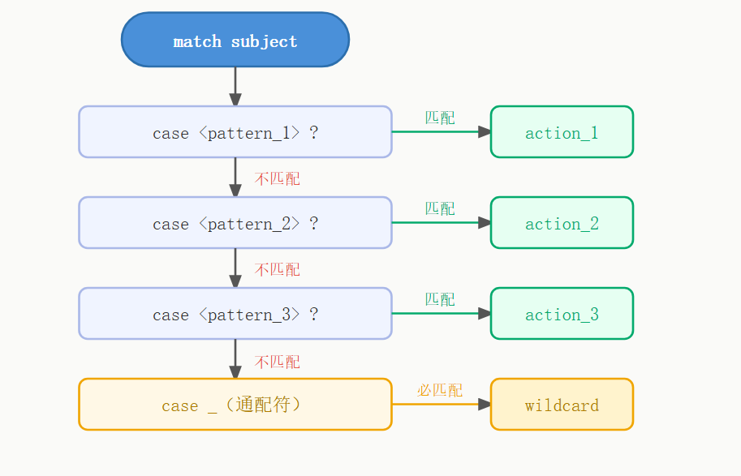

语法格式如下：

```python
match subject:
    case <pattern_1>:
        <action_1>
    case <pattern_2>:
        <action_2>
    case <pattern_3>:
        <action_3>
    case _:
        <action_wildcard>
```

**case _:** 类似于 C 和 Java 中的 **default:**，当其他 case 都无法匹配时，匹配这条，保证永远会匹配成功。

**实例:**

```python
def http_error(status):
    match status:
        case 400:
            return "Bad request"
        case 404:
            return "Not found"
        case 418:
            return "I'm a teapot"
        case _:
            return "Something's wrong with the internet"

print(http_error(400))
print(http_error(404))
print(http_error(418))
print(http_error(500))
```

以上是一个输出 HTTP 状态码的实例，多个状态码的输出结果为：

```python
Bad request
Not found
I'm a teapot
Something's wrong with the internet
```

一个 case 也可以设置多个匹配条件，条件使用 **|** 隔开，例如：

```python
...
    case 401|403|404:
        return "Not allowed"
```

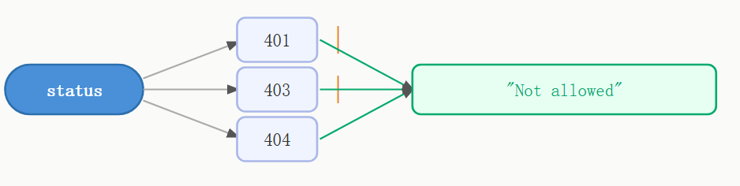

**实例:**

```python
def check_permission(status):
    match status:
        case 200:
            return "OK - 请求成功"
        case 301 | 302:
            return "Redirect - 重定向"
        case 401 | 403 | 404:
            return "Not allowed - 无权限或未找到"
        case 500 | 502 | 503:
            return "Server Error - 服务器错误"
        case _:
            return "Unknown status - 未知状态码"

for code in [200, 301, 403, 500, 418]:
    print(f"状态码 {code}: {check_permission(code)}")
```


# 列表推导式

**列表推导式**：快速、简洁创建 / 处理列表的语法，替代简单 `for + append` 循环。

## 基础语法

```python
# 格式
[表达式 for 变量 in 可迭代对象]
```

### 简单示例：生成 0~9 列表

```python
# 普通循环
lst = []
for i in range(10):
    lst.append(i)

# 列表推导式（等价）
lst = [i for i in range(10)]
print(lst)  # [0, 1, 2, 3, 4, 5, 6, 7, 8, 9]
```

### 表达式运算

对每个元素做计算：

```python
# 每个数 * 2
res = [x * 2 for x in range(5)]
print(res)  # [0, 2, 4, 6, 8]

# 平方
res = [x**2 for x in range(1, 6)]
print(res)  # [1, 4, 9, 16, 25]
```

### 列表推导式

```python
# [表达式 for 变量 in 可迭代对象 if 条件]
squares = [x**2 for x in range(5)]
# [0, 1, 4, 9, 16]

evens = [x for x in range(10) if x % 2 == 0]
# [0, 2, 4, 6, 8]
```

### 字典推导式

```python
square_dict = {x: x**2 for x in range(5)}
# {0: 0, 1: 1, 2: 4, 3: 9, 4: 16}
```

### 集合推导式

```python
unique = {len(word) for word in ["cat", "dog", "elephant"]}
# {3, 8}
```

------

## 带条件筛选（if）

### 语法

```python
[表达式 for 变量 in 可迭代对象 if 条件]
```

### 示例

```python
# 取出 0~9 偶数
even = [x for x in range(10) if x % 2 == 0]
print(even)  # [0, 2, 4, 6, 8]

# 筛选大于 5 的数
gt5 = [x for x in range(10) if x > 5]
print(gt5)   # [6, 7, 8, 9]
```

------

## 多循环（嵌套循环）

语法

```python
[表达式 for 变量1 in 序列1 for 变量2 in 序列2]
```

### 示例：二维转一维 / 笛卡尔积

```python
# 组合两个列表
a = [1, 2]
b = ['x', 'y']
res = [(i, j) for i in a for j in b]
print(res)  # [(1, 'x'), (1, 'y'), (2, 'x'), (2, 'y')]

# 二维列表扁平化
matrix = [[1,2], [3,4], [5,6]]
flat = [num for row in matrix for num in row]
print(flat)  # [1, 2, 3, 4, 5, 6]
```

------

## if-else 结构（条件在前）

**注意**：`if else` 同时存在时，写在 **表达式位置**

```python
# 偶数不变，奇数变 -1
res = [x if x % 2 == 0 else -1 for x in range(6)]
print(res)  # [0, -1, 2, -1, 4, -1]
```

------

## 常用实战小案例

**字符串列表转大写**

```python
words = ["apple", "banana"]
upper_words = [w.upper() for w in words]
# ['APPLE', 'BANANA']
```

**过滤空字符串**

```python
data = ["hi", "", "python", ""]
new = [s for s in data if s]
# ['hi', 'python']
```

**提取列表中数字**

```python
mix = [1, "a", 3, "b", 5]
nums = [x for x in mix if isinstance(x, int)]
# [1, 3, 5]
```

# 迭代器与生成器迭代器

## 迭代器

迭代是 Python 最强大的功能之一，是访问集合元素的一种方式。

迭代器是一个可以记住遍历的位置的对象。

迭代器对象从集合的第一个元素开始访问，直到所有的元素被访问完结束。迭代器只能往前不会后退。

迭代器有两个基本的方法：**iter()** 和 **next()**。

字符串，列表或元组对象都可用于创建迭代器：

```python
list = [1, 2, 3, 4]
it = iter(list)  # 创建迭代器对象
for x in it:
    print(x, end=" ")
for x in list:
    print(x, end=" ")
```

### 迭代器和 for 循环区别

| 特性           | `for x in it` (迭代器)                   | `for x in list` (列表) |
| -------------- | ---------------------------------------- | ---------------------- |
| **可重复遍历** | 只能遍历一次，遍历完后迭代器就 "耗尽" 了 | 可以重复遍历任意次数   |
| **内存使用**   | 惰性求值，每次只生成一个元素，内存效率高 | 所有元素都在内存中     |
| **遍历状态**   | 有内部状态，会记住当前位置               | 无状态，每次从头开始   |

### 创建一个迭代器

把一个类作为一个迭代器使用需要在类中实现两个方法 **iter**() 与 **next**() 。

如果你已经了解的[[5-面向对象]]编程，就知道类都有一个构造函数，Python 的构造函数为 **init**(), 它会在对象初始化的时候执行。

**iter**() 方法返回一个特殊的迭代器对象， 这个迭代器对象实现了 **next**() 方法并通过 StopIteration 异常标识迭代的完成。

**next**() 方法（Python 2 里是 next()）会返回下一个迭代器对象。

创建一个返回数字的迭代器，初始值为 1，逐步递增 1：

```python
class MyNumbers:
  def __iter__(self):
    self.a = 1
    return self

  def __next__(self):
    x = self.a
    self.a += 1
    return x

myclass = MyNumbers()
myiter = iter(myclass)

print(next(myiter))
print(next(myiter))
print(next(myiter))
print(next(myiter))
print(next(myiter))
```

## 生成器

在 Python 中，使用了 **yield** 的函数被称为生成器（[[generator]]）。

**yield** 是一个关键字，用于定义生成器函数，生成器函数是一种特殊的函数，可以在迭代过程中逐步产生值，而不是一次性返回所有结果。

跟普通函数不同的是，生成器是一个返回迭代器的函数，只能用于迭代操作，更简单点理解生成器就是一个迭代器。

当在生成器函数中使用 **yield** 语句时，函数的执行将会暂停，并将 **yield** 后面的表达式作为当前迭代的值返回。

然后，每次调用生成器的 **next()** 方法或使用 **for** 循环进行迭代时，函数会从上次暂停的地方继续执行，直到再次遇到 **yield** 语句。这样，生成器函数可以逐步产生值，而不需要一次性计算并返回所有结果。

调用一个生成器函数，返回的是一个迭代器对象。

```python
def countdown(n):
    while n > 0:
        yield n
        n -= 1

# 创建生成器对象
generator = countdown(5)  # 创建生成器对象，函数体不执行

print(next(generator))  # 执行到 yield，返回 5，暂停
print(next(generator))  # 从暂停处继续，返回 4，暂停
print(next(generator))  # 返回 3
print(next(generator))  # 返回 2
print(next(generator))  # 返回 1
print(next(generator))  # 抛出 StopIteration 异常
```

### 与普通函数的区别

| 普通函数                 | 生成器函数                       |
| ------------------------ | -------------------------------- |
| 使用 `return` 返回值     | 使用 `yield` 返回值              |
| 调用时立即执行并返回结果 | 调用时创建生成器对象，不立即执行 |
| 一次性返回所有结果       | 按需逐个返回结果                 |
| 不保留执行状态           | 保留执行状态，可暂停/恢复        |

# with 关键字

在 Python 编程中，资源管理是一个重要但容易被忽视的环节。`with` 关键字为我们提供了一种优雅的方式来处理文件操作、[[16-数据库]]连接等需要明确释放资源的场景。

with 是 Python 中的一个关键字，用于上下文管理协议（Context Management Protocol）。它简化了资源管理代码，特别是那些需要明确释放或清理的资源（如文件、网络连接、数据库连接等）。

## 为什么需要 with 语句？

```python
file = open('example.txt', 'r')
try:
    content = file.read()
    # 处理文件内容
finally:
    file.close()
```

这种写法存在几个问题：

1. **容易忘记关闭资源**：如果没有 `try-finally` 块，可能会忘记调用 `close()`
2. **代码冗长**：简单的文件操作需要多行代码
3. **异常处理复杂**：需要手动处理可能出现的异常

### with 语句的优势

`with` 语句通过上下文管理协议（Context Management Protocol）解决了这些问题：

1. **自动资源释放**：确保资源在使用后被正确关闭
2. **代码简洁**：减少样板代码
3. **异常安全**：即使在代码块中发生异常，资源也会被正确释放
4. **可读性强**：明确标识资源的作用域

## with 语句的基本语法

### 基础用法

`with` 语句的基本形式如下：

```python
with expression [as variable]:
    # 代码块
```

- `expression` 返回一个支持上下文管理协议的对象
- `as variable` 是可选的，用于将表达式结果赋值给变量
- 代码块执行完毕后，自动调用清理方法

### 文件操作示例

最常见的 `with` 语句应用是文件操作：

## 实例

```python
with open('example.txt', 'r') as file:
  content = file.read()
  print(content)
# 文件已自动关闭
```

这段代码等价于前面的 `try-finally` 实现，但更加简洁明了。

------

## with 语句的工作原理

### 上下文管理协议

`with` 语句背后是 Python 的上下文管理协议，该协议要求对象实现两个方法：

1. `__enter__()`：进入上下文时调用，返回值赋给 `as` 后的变量
2. `__exit__()`：退出上下文时调用，处理清理工作

### 执行流程

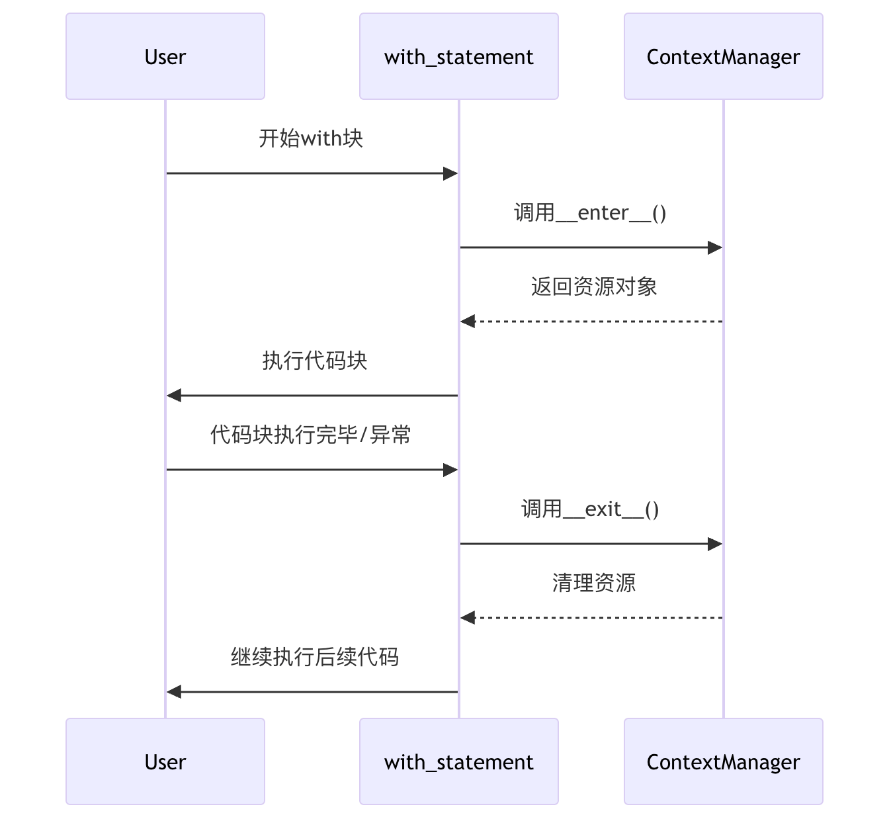

### 异常处理机制

`__exit__()` 方法接收三个参数：

- `exc_type`：[[12-异常]]类型
- `exc_val`：异常值
- `exc_tb`：异常追踪信息

如果 `__exit__()` 返回 `True`，则表示异常已被处理，不会继续传播；返回 `False` 或 `None`，异常会继续向外传播。

------

## 实际应用场景

### 1. 文件操作

```python
# 同时打开多个文件
with open('input.txt', 'r') as infile, open('output.txt', 'w') as outfile:
    content = infile.read()
    outfile.write(content.upper())
```

### 2. 数据库连接

```python
import sqlite3

with sqlite3.connect('database.db') as conn:
    cursor = conn.cursor()
    cursor.execute('SELECT * FROM users')
    results = cursor.fetchall()
# 连接自动关闭
```

### 3. 线程锁

```python
import threading

lock = threading.Lock()

with lock:
    # 临界区代码
    print("这段代码是线程安全的")
```

### 4. 临时修改系统状态

```python
import decimal

with decimal.localcontext() as ctx:
    ctx.prec = 42  # 临时设置高精度
    # 执行高精度计算
# 精度恢复原设置
```

------

## 创建自定义的上下文管理器

### 类实现方式

我们可以通过实现 `__enter__` 和 `__exit__` 方法创建自定义的上下文管理器：

```python
class Timer:
    def __enter__(self):
        import time
        self.start = time.time()
        return self

    def __exit__(self, exc_type, exc_val, exc_tb):
        import time
        self.end = time.time()
        print(f"耗时: {self.end - self.start:.2f}秒")
        return False

# 使用示例
with Timer() as t:
    # 执行一些耗时操作
    sum(range(1000000))
```

### 使用 contextlib 模块

Python 的 `contextlib` 模块提供了更简单的方式来创建上下文管理器：

```python
from contextlib import contextmanager

@contextmanager
def tag(name):
    print(f"<{name}>")
    yield
    print(f"</{name}>")

# 使用示例
with tag("h1"):
    print("这是一个标题")
```

------

## 常见问题与最佳实践

### 常见错误

**1、错误地认为 with 只能用于文件**：

```python
# 错误：认为只有文件需要 with
conn = sqlite3.connect('db.sqlite')
# 应该使用 with 语句
```

**2、忽略__exit__的返回值**：

```python
class MyContext:
    def __exit__(self, exc_type, exc_val, exc_tb):
        # 忘记返回 True/False 可能导致异常处理不符合预期
        pass
```

### 最佳实践

1. **优先使用 with 管理资源**：对于文件、网络连接、锁等资源，总是优先考虑使用 `with` 语句
2. **保持上下文简洁**：`with` 块中的代码应该只包含与资源相关的操作
3. **合理处理异常**：在自定义上下文管理器中，根据需求决定是否抑制异常
4. **利用多个上下文**：Python 允许在单个 `with` 语句中管理多个资源

------

## 总结要点

| 关键点       | 说明                                             |
| ------------ | ------------------------------------------------ |
| 自动资源管理 | `with` 语句确保资源被正确释放                    |
| 上下文协议   | 需要实现 `__enter__` 和 `__exit__` 方法          |
| 异常安全     | 即使代码块中出现异常，资源也会被释放             |
| 常见应用     | 文件操作、数据库连接、线程锁等                   |
| 自定义实现   | 可以通过类或 `contextlib` 创建自定义上下文管理器 |

`with` 语句是 Python 中一项强大的特性，它不仅能简化代码，还能提高程序的健壮性。掌握 `with` 语句的使用和原理，将帮助你写出更专业、更可靠的 Python 代码。

# 函数

## 定义一个函数

你可以定义一个由自己想要功能的函数，以下是简单的规则：

- 函数代码块以 **def** 关键词开头，后接函数标识符名称和圆括号 **()**。
- 任何传入参数和自变量必须放在圆括号中间，圆括号之间可以用于定义参数。
- 函数的第一行语句可以选择性地使用文档字符串—用于存放函数说明。
- 函数内容以冒号 **:** 起始，并且缩进。
- **return [表达式]** 结束函数，选择性地返回一个值给调用方，不带表达式的 return 相当于返回 None。

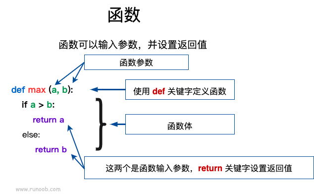

## 函数调用

定义一个函数：给了函数一个名称，指定了函数里包含的参数，和代码块结构。

这个函数的基本结构完成以后，你可以通过另一个函数调用执行，也可以直接从 Python 命令提示符执行。

如下实例调用了 **printme()** 函数：

```python
# 定义函数
def printme( str ):
   # 打印任何传入的字符串
   print (str)
   return

# 调用函数
printme("我要调用用户自定义函数!")
printme("再次调用同一函数")
```

## 参数传递

在 Python 中，类型属于对象，对象有不同类型的区分，变量是没有类型的：

### 可更改(mutable)与不可更改(immutable)对象

在 Python 中，strings, tuples, 和 numbers 是不可更改的对象，而 list, dict 等则是可以修改的对象。

- **不可变类型：** 变量赋值 **a = 5** 后再赋值 **a = 10**，这里实际是新生成一个 int 值对象 10，再让 a 指向它，而 5 被丢弃，不是改变 a 的值，相当于新生成了 a。
- **可变类型：** 变量赋值 **la = [1,2,3,4]** 后再赋值 **la [2] = 5** 则是将 list la 的第三个元素值更改，本身 la 没有动，只是其内部的一部分值被修改了。

Python 函数的参数传递：

- **不可变类型：** 类似 C++ 的值传递，如整数、字符串、元组。如 fun(a)，传递的只是 a 的值，没有影响 a 对象本身。如果在 fun(a) 内部修改 a 的值，则是新生成一个 a 的对象。
- **可变类型：** 类似 C++ 的引用传递，如 列表，字典。如 fun(la)，则是将 la 真正的传过去，修改后 fun 外部的 la 也会受影响

Python 中一切都是对象，严格意义我们不能说值传递还是引用传递，我们应该说传 `不可变对象` 和传 `可变对象。`

### Python 传不可变对象实例

通过 **id()** 函数来查看内存地址变化：

```python
def change(a):
    print(id(a))   # 指向的是同一个对象
    a=10
    print(id(a))   # 一个新对象

a=1
print(id(a))
change(a)

>>> 可以看见在调用函数前后，形参和实参指向的是同一个对象（对象 id 相同），在函数内部修改形参后，形参指向的是不同的 id。
4379369136
4379369136
4379369424
```

### 传可变对象实例

```python
# 可写函数说明
def changeme( mylist ):
   "修改传入的列表"
   mylist.append([1,2,3,4])
   print ("函数内取值: ", mylist)
   return

# 调用 changeme 函数
mylist = [10,20,30]
changeme( mylist )
print ("函数外取值: ", mylist)

>>> 传入函数的和在末尾添加新内容的对象用的是同一个引用。
函数内取值:  [10, 20, 30, [1, 2, 3, 4]]
函数外取值:  [10, 20, 30, [1, 2, 3, 4]]
```

## 参数

以下是调用函数时可使用的正式参数类型：

- 必需参数
- 关键字参数
- 默认参数
- 不定长参数

### 必需参数

必需参数须以正确的顺序传入函数。调用时的数量必须和声明时的一样。

调用 printme() 函数，你必须传入一个参数，不然会出现语法错误：

函数参数的使用不需要使用指定顺序：

```python
#可写函数说明
def printinfo( name, age ):
   # "打印任何传入的字符串"
   print ("名字: ", name)
   print ("年龄: ", age)
   return

#调用 printinfo 函数
printinfo( age=50, name="runoob" )
```

### 默认参数

调用函数时，如果没有传递参数，则会使用默认参数。以下实例中如果没有传入 age 参数，则使用默认值：

```python
#可写函数说明
def printinfo( name, age = 35 ):
   "打印任何传入的字符串"
   print ("名字: ", name)
   print ("年龄: ", age)
   return

#调用 printinfo 函数
printinfo( age=50, name="runoob" )
print ("------------------------")
printinfo( name="runoob" )

>>>
名字:  runoob
年龄:  50
------------------------
名字:  runoob
年龄:  35
```

### 不定长参数

你可能需要一个函数能处理比当初声明时更多的参数。这些参数叫做不定长参数，和上述 2 种参数不同，声明时不会命名。基本语法如下：

```python
def functionname([formal_args,] *var_args_tuple ):
   "函数_文档字符串"
   function_suite
   return [expression]
```

加了星号 ***** 的参数会以元组(tuple)的形式导入，存放所有未命名的变量参数。

```python
# 可写函数说明
def printinfo( arg1, *vartuple ):
   "打印任何传入的参数"
   print ("输出: ")
   print (arg1)
   print (vartuple)

# 调用 printinfo 函数
printinfo( 70, 60, 50 )
```

还有一种就是参数带两个星号 ******基本语法如下：

```python
def printinfo( arg1, **vardict ):
   "打印任何传入的参数"
   print ("输出: ")
   print (arg1)
   print (vardict)

# 调用 printinfo 函数
printinfo(1, a=2,b=3)
```

如果单独出现星号 **** *，则星号* **** 后的参数必须用关键字传入：

```python
def f(a,b,*,c):
    return a+b+c
print(f(1,2, 12,3,3,4,c=3))
```

## 匿名函数

Python 使用 **lambda** 来创建匿名函数。

所谓匿名，意即不再使用 **def** 语句这样标准的形式定义一个函数。

- **lambda** 只是一个表达式，函数体比 **def** 简单很多。
- lambda 的主体是一个表达式，而不是一个代码块。仅仅能在 lambda 表达式中封装有限的逻辑进去。
- lambda 函数拥有自己的命名空间，且不能访问自己参数列表之外或全局命名空间里的参数。
- 虽然 lambda 函数看起来只能写一行，却不等同于 C 或 C++ 的内联函数，内联函数的目的是调用小函数时不占用栈内存从而减少函数调用的开销，提高代码的执行速度。

### 语法

lambda 函数的语法只包含一个语句：**lambda [arg1 [, arg2,.....argn]]: expression**

将匿名函数封装在一个函数内，这样可以使用同样的代码来创建多个匿名函数。

```python
def myfunc(n):
  return lambda a : a * n

mydoubler = myfunc(2)
mytripler = myfunc(3)

print(mydoubler(11))
print(mytripler(11))
```

## return 语句

**return [表达式]** 语句用于退出函数，选择性地向调用方返回一个表达式。不带参数值的 return 语句返回 None。

## 强制位置参数

Python3.8 新增了一个函数形参语法 / 用来指明函数形参必须使用指定位置参数，不能使用关键字参数的形式。

在以下的例子中，形参 a 和 b 必须使用指定位置参数，c 或 d 可以是位置形参或关键字形参，而 e 和 f 要求为关键字形参:

```python
def f(a, b, /, c, d, *, e, f):
    print(a, b, c, d, e, f)
```

以下使用方法是正确的:

```python
f(10, 20, 30, d=40, e=50, f=60)
```

以下使用方法会发生错误:

```python
f(10, b=20, c=30, d=40, e=50, f=60)   # b 不能使用关键字参数的形式
f(10, 20, 30, 40, 50, f=60)           # e 必须使用关键字参数的形式
```

# lambda（匿名函数）

lambda 函数是一种小型、匿名的、内联函数，它可以具有任意数量的参数，但只能有一个表达式。

匿名函数不需要使用 **def** 关键字定义完整函数。

lambda 函数通常用于编写简单的、单行的函数，通常在需要函数作为参数传递的情况下使用，例如在 map()、filter()、reduce() 等函数中。

**lambda 函数特点：**

- lambda 函数是匿名的，它们没有函数名称，只能通过赋值给变量或作为参数传递给其他函数来使用。
- lambda 函数通常只包含一行代码，这使得它们适用于编写简单的函数。

**lambda 语法格式：**

```python
lambda arguments: expression
```

- `lambda` 是 Python 的关键字，用于定义 lambda 函数。
- `arguments` 是参数列表，可以包含零个或多个参数，但必须在冒号(`:`)前指定。
- `expression` 是一个表达式，用于计算并返回函数的结果。

lambda 函数没有参数：

```python
f = lambda: "Hello, world!"
print(f())  # 输出: Hello, world!
```

设置一个函数参数 a，函数计算参数 a 加 10，并返回结果：

```python
x = lambda a : a + 10
print(x(5))
```

lambda 创建匿名函数，函数参数 a 与 b 相乘，并返回结果：

```python
x = lambda a, b : a * b
print(x(5, 6))
```

lambda 函数通常与内置函数如 map()、filter() 和 reduce() 一起使用，以便在集合上执行操作。例如：

```python
numbers = [1, 2, 3, 4, 5]
squared = list(map(lambda x: x**2, numbers))
print(squared)  # 输出: [1, 4, 9, 16, 25]
```

# 装饰器

装饰器（decorator）是 Python 中的一种高级功能，用于**在不修改原函数代码的前提下，动态扩展函数或类的功能**。

本质上，装饰器是一个函数：它接收一个函数作为参数，并返回一个新的函数（通常是对原函数的增强版本）。

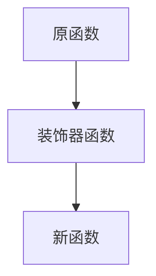

装饰器通过 **@decorator_name** 语法应用在函数或方法定义之前。

Python 还提供了一些内置装饰器，例如 **@staticmethod** 和 **@classmethod**。

**常见应用场景：**

- **日志记录：**记录函数调用信息、参数和返回值
- **性能统计：**统计函数执行时间
- **权限控制：**限制函数访问权限
- **缓存：**缓存函数结果，提高性能

## 基本语法

装饰器的核心思想是：**用一个函数"包装"另一个函数**。

```python
def decorator_function(original_function):
    def wrapper(*args, **kwargs):
        # 调用前
        print("执行前")
        result = original_function(*args, **kwargs)
        # 调用后
        print("执行后")
        return result
    return wrapper

@decorator_function
def target_function():
    print("原函数执行")

if `__name__` == '`__main__`':
    target_function()

```

**解析：**

- `decorator_function`：装饰器函数（接收原函数）
- `wrapper`：包装函数（真正被执行）
- `@decorator_function`：等价于函数替换

**等价写法：**

```python
target_function = decorator_function(target_function)
```

调用 `target_function()` 时，实际上执行的是 `wrapper()`

## 使用装饰器

装饰器通过 **@** 语法糖应用在函数定义前：

```python
@time_logger
def target_function():
    pass
```

等价于：

```python
def target_function():
    pass

target_function = time_logger(target_function)
```

这种机制使我们可以在不修改原函数的情况下，统一添加功能（如日志、权限等）。

## 印日志

```python
def my_decorator(func):
    def wrapper():
        print("函数执行前")
        func()
        print("函数执行后")
    return wrapper

@my_decorator
def say_hello():
    print("Hello!")

say_hello()
```

- `my_decorator` 接收 `say_hello`
- `@my_decorator` 替换原函数

------

## 带参数的装饰器

如果原函数有参数，需要在 `wrapper` 中使用 `*args, **kwargs`：

```python
def my_decorator(func):
    def wrapper(*args, **kwargs):
        print("执行前")
        func(*args, **kwargs)
        print("执行后")
    return wrapper

@my_decorator
def greet(name):
    print(f"Hello, {name}!")

greet("Alice")
```

**说明：**使用 `*args, **kwargs` 可以兼容任意参数函数。

## 带参数的装饰器（进阶）

```python
def repeat(num_times):
    def decorator(func):
        def wrapper(*args, **kwargs):
            for _ in range(num_times):
                func(*args, **kwargs)
        return wrapper
    return decorator

@repeat(3)
def say_hello():
    print("Hello!")

say_hello()
```

**说明：**这是"装饰器工厂"，外层函数用于接收参数。

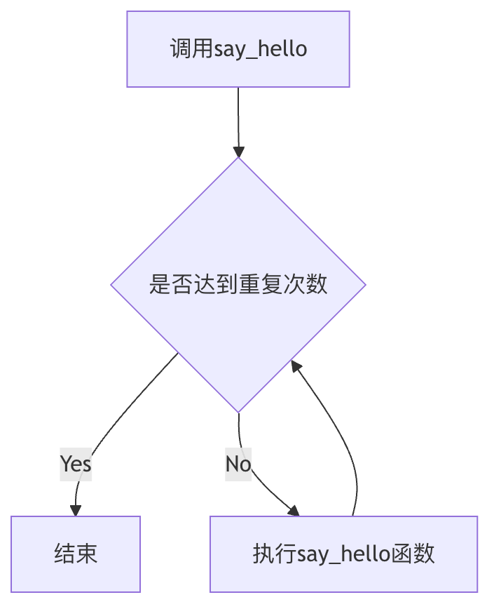

## 类装饰器

除了函数，装饰器也可以作用于类。

类装饰器接收一个类，并返回修改后的类或包装类。

- 增强类方法
- 控制实例化过程
- 实现单例、日志等功能

------

## 函数形式的类装饰器

```python
def log_class(cls):
    class Wrapper:
        def __init__(self, *args, **kwargs):
            self.wrapped = cls(*args, **kwargs)

        def __getattr__(self, name):
            return getattr(self.wrapped, name)

        def display(self):
            print("调用前")
            self.wrapped.display()
            print("调用后")

    return Wrapper

@log_class
class MyClass:
    def display(self):
        print("原方法")

obj = MyClass()
obj.display()
```

## 类形式的类装饰器

## 实例：单例模式

```python
class SingletonDecorator:
    def __init__(self, cls):
        self.cls = cls
        self.instance = None

    def __call__(self, *args, **kwargs):
        if self.instance is None:
            self.instance = self.cls(*args, **kwargs)
        return self.instance

@SingletonDecorator
class Database:
    def __init__(self):
        print("初始化")

db1 = Database()
db2 = Database()
print(db1 is db2)
```

## 内置装饰器

常用内置装饰器：

1. **@staticmethod**：定义静态方法
2. **@classmethod**：定义类方法
3. **@property**：将方法变为属性

```python
class MyClass:
    @staticmethod
    def static_method():
        print("静态方法")

    @classmethod
    def class_method(cls):
        print(cls.`__name__`)

    @property
    def name(self):
        return self._name

    @name.setter
    def name(self, value):
        self._name = value
```

## 多个装饰器的堆叠

多个装饰器在**定义阶段从下到上依次包裹函数**，**调用阶段从上到下依次执行**：

```python
def decorator1(func):
    def wrapper():
        print("Decorator 1")
        func()
    return wrapper

def decorator2(func):
    def wrapper():
        print("Decorator 2")
        func()
    return wrapper

@decorator1
@decorator2
def say_hello():
    print("Hello!")

say_hello()
```

## 核心总结

> 装饰器 = 函数包装函数 + 不修改原代码扩展功能

- @ 语法本质是函数替换
- wrapper 才是真正执行的函数
- 推荐使用 *args, **kwargs 提高通用性
- 支持函数、类、甚至带参数的装饰器

# 数据结构

本章节我们主要结合前面所学的知识点来介绍Python数据结构。

------

## 列表

Python中列表是可变的，这是它区别于字符串和元组的最重要的特点，一句话概括即：列表可以修改，而字符串和元组不能。

以下是 Python 中列表的方法：

| 方法              | 描述                                                         |
| :---------------- | :----------------------------------------------------------- |
| list.append(x)    | 把一个元素添加到列表的结尾，相当于 a[len(a):] = [x]。        |
| list.extend(L)    | 通过添加指定列表的所有元素来扩充列表，相当于 a[len(a):] = L。 |
| list.insert(i, x) | 在指定位置插入一个元素。第一个参数是准备插入到其前面的那个元素的索引，例如 a.insert(0, x) 会插入到整个列表之前，而 a.insert(len(a), x) 相当于 a.append(x) 。 |
| list.remove(x)    | 删除列表中值为 x 的第一个元素。如果没有这样的元素，就会返回一个错误。 |
| list.pop([i])     | 从列表的指定位置移除元素，并将其返回。如果没有指定索引，a.pop()返回最后一个元素。元素随即从列表中被移除。（方法中 i 两边的方括号表示这个参数是可选的，而不是要求你输入一对方括号，你会经常在 Python 库参考手册中遇到这样的标记。） |
| list.clear()      | 移除列表中的所有项，等于del a[:]。                           |
| list.index(x)     | 返回列表中第一个值为 x 的元素的索引。如果没有匹配的元素就会返回一个错误。 |
| list.count(x)     | 返回 x 在列表中出现的次数。                                  |
| list.sort()       | 对列表中的元素进行排序。                                     |
| list.reverse()    | 倒排列表中的元素。                                           |
| list.copy()       | 返回列表的浅复制，等于a[:]。                                 |

下面示例演示了列表的大部分方法：

注意：类似 insert, remove 或 sort 等修改列表的方法没有返回值。

------

## 将列表当做栈使用

在 Python 中，可以使用列表（list）来实现栈的功能。栈是一种后进先出（LIFO, Last-In-First-Out）数据结构，意味着最后添加的元素最先被移除。列表提供了一些方法，使其非常适合用于栈操作，特别是 **append()** 和 **pop()** 方法。

用 append() 方法可以把一个元素添加到栈顶，用不指定索引的 pop() 方法可以把一个元素从栈顶释放出来。

### 栈操作

- **压入（Push）**: 将一个元素添加到栈的顶端。
- **弹出（Pop）**: 移除并返回栈顶元素。
- **查看栈顶元素（Peek/Top）**: 返回栈顶元素而不移除它。
- **检查是否为空（IsEmpty）**: 检查栈是否为空。
- **获取栈的大小（Size）**: 获取栈中元素的数量。

## 将列表当作队列使用

在 Python 中，列表（list）可以用作队列（queue），但由于列表的特点，直接使用列表来实现队列并不是最优的选择。

队列是一种先进先出（FIFO, First-In-First-Out）的数据结构，意味着最早添加的元素最先被移除。

使用列表时，如果频繁地在列表的开头插入或删除元素，性能会受到影响，因为这些操作的时间复杂度是 O(n)。为了解决这个问题，Python 提供了 collections.deque，它是双端队列，可以在两端高效地添加和删除元素。

### 使用 collections.deque 实现队列

collections.deque 是 Python 标准库的一部分，非常适合用于实现队列。

## 列表推导式

列表推导式提供了从序列创建列表的简单途径。通常应用程序将一些操作应用于某个序列的每个元素，用其获得的结果作为生成新列表的元素，或者根据确定的判定条件创建子序列。

每个列表推导式都在 for 之后跟一个表达式，然后有零到多个 for 或 if 子句。返回结果是一个根据表达从其后的 for 和 if 上下文环境中生成出来的列表。如果希望表达式推导出一个元组，就必须使用括号。

## del 语句

使用 del 语句可以从一个列表中根据索引来删除一个元素，而不是值来删除元素。这与使用 pop() 返回一个值不同。可以用 del 语句从列表中删除一个切割，或清空整个列表（我们以前介绍的方法是给该切割赋一个空列表）。

## 集合

集合是一个无序不重复元素的集。基本功能包括关系测试和消除重复元素。

可以用大括号({})创建集合。注意：如果要创建一个空集合，你必须用 set() 而不是 {} ；后者创建一个空的字典，下一节我们会介绍这个数据结构。

## 字典

另一个非常有用的 Python 内建数据类型是字典。

序列是以连续的整数为索引，与此不同的是，字典以关键字为索引，关键字可以是任意不可变类型，通常用字符串或数值。

理解字典的最佳方式是把它看做无序的键=>值对集合。在同一个字典之内，关键字必须是互不相同。

一对大括号创建一个空的字典：{}。

## 遍历技巧

在字典中遍历时，关键字和对应的值可以使用 items() 方法同时解读出来：

```python
>>> knights = {'gallahad': 'the pure', 'robin': 'the brave'}
>>> for k, v in knights.items():
...     print(k, v)
...
gallahad the pure
robin the brave
```

同时遍历两个或更多的序列，可以使用 zip() 组合：

```python
>>> questions = ['name', 'quest', 'favorite color']
>>> answers = ['lancelot', 'the holy grail', 'blue']
>>> for q, a in zip(questions, answers):
...     print('What is your {0}?  It is {1}.'.format(q, a))
...
What is your name?  It is lancelot.
What is your quest?  It is the holy grail.
What is your favorite color?  It is blue.
```

# 模块

在前面的几个章节中我们基本上是用 Python 解释器来编程，如果你从 Python 解释器退出再进入，那么你定义的所有的方法和变量就都消失了。

为此 Python 提供了一个办法，把这些定义存放在文件中，为一些脚本或者交互式的解释器实例使用，这个文件被称为模块。

Python 中的模块（Module）是一个包含 Python 定义和语句的文件，文件名就是模块名加上 **.py** 后缀。

模块可以包含函数、类、变量以及可执行的代码。通过模块，我们可以将代码组织成可重用的单元，便于管理和维护。

## 模块的作用

- **代码复用**：将常用的功能封装到模块中，可以在多个程序中重复使用。
- **命名空间管理**：模块可以避免命名冲突，不同模块中的同名函数或变量不会互相干扰。
- **代码组织**：将代码按功能划分到不同的模块中，使程序结构更清晰。

```python
#!/usr/bin/python3
# 文件名: using_sys.py

import sys

print('命令行参数如下:')
for i in sys.argv:
   print(i)

print('\n\nPython 路径为：', sys.path, '\n')
```


- 1、import sys 引入 Python 标准库中的 sys.py 模块；这是引入某一模块的方法。
- 2、sys.argv 是一个包含命令行参数的列表。
- 3、sys.path 包含了一个 Python 解释器自动查找所需模块的路径的列表。

## import 语句

想使用 Python 源文件，只需在另一个源文件里执行 import 语句，语法如下：

```python
import module1[, module2[,... moduleN]
```

当解释器遇到 import 语句，如果模块在当前的搜索路径就会被导入。

搜索路径时一个解释器会先进行搜索的所有目录的列表。如想要导入模块 support，需要把命令放在脚本的顶端：

一个模块只会被导入一次，不管你执行了多少次 **import**。这样可以防止导入模块被一遍又一遍地执行。

当我们使用 import 语句的时候，Python 解释器是怎样找到对应的文件的呢？

这就涉及到 Python 的搜索路径，搜索路径是由一系列目录名组成的，Python 解释器就依次从这些目录中去寻找所引入的模块。

### 模块的搜索路径

当导入一个模块时，Python 会按照以下顺序查找模块：

1. 当前目录。
2. 环境变量 `PYTHONPATH` 指定的目录。
3. Python 标准库目录。
4. `.pth` 文件中指定的目录。

## from … import 语句

Python 的 from 语句让你从模块中导入一个指定的部分到当前命名空间中，语法如下：

```python
from modname import name1[, name2[, ... nameN]]
```

### 给模块起别名

使用 **as** 关键字为模块或函数起别名：

```python
import numpy as np  # 将 numpy 模块别名设置为 np
from math import sqrt as square_root  # 将 sqrt 函数别名设置为 square_root
```

## from … import * 语句

把一个模块的所有内容全都导入到当前的命名空间也是可行的，只需使用如下声明：

`from modname import *`  **不推荐，容易引起命名冲突**

## ``__name__`` 属性

一个模块被另一个程序第一次引入时，其主程序将运行。

如果我们想在模块被引入时，模块中的某一程序块不执行，我们可以用 ``__name__`` 属性来使该程序块仅在该模块自身运行时执行。

```python
#!/usr/bin/python3
# Filename: using_name.py

if `__name__` == '`__main__`':
   print('程序自身在运行')
else:
   print('我来自另一模块')
```

**说明：每个模块都有一个 **name** 属性。**

- 如果模块是被直接运行，``__name__`` 的值为 ``__main__``。
- 如果模块是被导入的，``__name__`` 的值为模块名。

说明：``__name__`` 与 ``__main__`` 底下是双下划线， **_ _** 是这样去掉中间的那个空格。

## dir() 函数

内置的函数 dir() 可以找到模块内定义的所有名称。以一个字符串列表的形式返回:

如果没有给定参数，那么 dir() 函数会罗列出当前定义的所有名称:

## 标准模块

Python 本身带着一些标准的模块库，在 Python 库参考文档中将会介绍到（就是后面的"库参考文档"）。

| 模块名        | 功能描述                                    |
| :------------ | :------------------------------------------ |
| `math`        | 数学运算（如平方根、三角函数等）            |
| `os`          | 操作系统相关功能（如文件、目录操作）        |
| `sys`         | 系统相关的参数和函数                        |
| `random`      | 生成随机数                                  |
| `datetime`    | 处理日期和时间                              |
| `json`        | 处理 JSON 数据                              |
| `re`          | 正则表达式操作                              |
| `collections` | 提供额外的数据结构（如 defaultdict、deque） |
| `itertools`   | 提供迭代器工具                              |
| `functools`   | 高阶函数工具（如 reduce、lru_cache）        |

有些模块直接被构建在解析器里，这些虽然不是一些语言内置的功能，但是他却能很高效的使用，甚至是系统级调用也没问题。

这些组件会根据不同的操作系统进行不同形式的配置，比如 winreg 这个模块就只会提供给 Windows 系统。

## 包

包是一种管理 Python 模块命名空间的形式，采用"点模块名称"。

比如一个模块的名称是 A.B， 那么他表示一个包 A中的子模块 B 。

就好像使用模块的时候，你不用担心不同模块之间的全局变量相互影响一样，采用点模块名称这种形式也不用担心不同库之间的模块重名的情况。

这样不同的作者都可以提供 NumPy 模块，或者是 Python 图形库。

这里给出了一种可能的包结构（在分层的文件系统中）:

```text
sound/                          顶层包
      __init__.py               初始化 sound 包
      formats/                  文件格式转换子包
              __init__.py
              wavread.py
              wavwrite.py
              aiffread.py
              aiffwrite.py
              auread.py
              auwrite.py
              ...
      effects/                  声音效果子包
              __init__.py
              echo.py
              surround.py
              reverse.py
              ...
      filters/                  filters 子包
              __init__.py
              equalizer.py
              vocoder.py
              karaoke.py
              ...
```

在导入一个包的时候，Python 会根据 sys.path 中的目录来寻找这个包中包含的子目录。

目录只有包含一个叫做 **init**.py 的文件才会被认作是一个包，主要是为了避免一些滥俗的名字（比如叫做 string）不小心的影响搜索路径中的有效模块。

最简单的情况，放一个空的 :file:**init**.py就可以了。当然这个文件中也可以包含一些初始化代码或者为（将在后面介绍的） __all__变量赋值。

用户可以每次只导入一个包里面的特定模块，比如:

```python
import sound.effects.echo
# 这将会导入子模块:sound.effects.echo。 他必须使用全名去访问:
sound.effects.echo.echofilter(input, output, delay=0.7, atten=4)

# 还有一种导入子模块的方法是:
from sound.effects import echo
echo.echofilter(input, output, delay=0.7, atten=4)

#还有一种变化就是直接导入一个函数或者变量:
from sound.effects.echo import echofilter

#同样的，这种方法会导入子模块: echo，并且可以直接使用他的 echofilter() 函数:
echofilter(input, output, delay=0.7, atten=4)
```

注意当使用 **from package import item** 这种形式的时候，对应的 item 既可以是包里面的子模块（子包），或者包里面定义的其他名称，比如函数，类或者变量。

import 语法会首先把 item 当作一个包定义的名称，如果没找到，再试图按照一个模块去导入。如果还没找到，抛出一个 **:exc:ImportError** 异常。

反之，如果使用形如 **import item.subitem.subsubitem** 这种导入形式，除了最后一项，都必须是包，而最后一项则可以是模块或者是包，但是不可以是类，函数或者变量的名字。

## 从一个包中导入*

如果我们使用 **from sound.effects import \*** 会发生什么呢？

Python 会进入文件系统，找到这个包里面所有的子模块，然后一个一个的把它们都导入进来。

但这个方法在 Windows 平台上工作的就不是非常好，因为 Windows 是一个不区分大小写的系统。

在 Windows 平台上，我们无法确定一个叫做 ECHO.py 的文件导入为模块是 echo 还是 Echo，或者是 ECHO。

为了解决这个问题，我们只需要提供一个精确包的索引。

导入语句遵循如下规则：如果包定义文件 `__init__`.py 存在一个叫做 `__all__` 的列表变量，那么在使用 **from package import \*** 的时候就把这个列表中的所有名字作为包内容导入。

# ``__name__`` 与 ``__main__``

在 Python 中，**`__name__`** 和 **`__main__`** 是两个与模块和脚本执行相关的特殊变量。

**`__name__`** 和 **_*main***_ 通常用于控制代码的执行方式，尤其是在模块既可以作为独立脚本运行，也可以被其他模块导入时。

## 1. `__name__` 变量

**`__name__`** 是一个内置变量，用于表示当前模块的名称。

**`__name__`** 的值取决于模块是如何被使用的：

当模块作为主程序运行时：**`__name__`** 的值被设置为 **"`__main__`"**。

当模块被导入时：**`__name__`** 的值被设置为模块的文件名（不包括 **.py** 扩展名）。

### 2. `__main__` 的含义

**`__main__`** 是一个特殊的字符串，用于表示当前模块是作为主程序运行的。

**`__main__`** 通常与 ``__name__``  变量一起使用，以确定模块是被导入还是作为独立脚本运行。

### 3. 使用 **if ``__name__``  == "`__main__`":** 的常见模式

```python
if `__name__` == "`__main__`":
    # 这里的代码只有在模块作为主程序运行时才会执行
    main()
```

这种模式允许模块在被导入时不会执行某些代码，而只有在作为独立脚本运行时才会执行这些代码。

假设我们有一个名为 example.py 的模块：

```python
def greet():
    print("来自 example 模块的问候！")

if `__name__` == "`__main__`":
    print("该脚本正在直接运行。")
    greet()
else:
    print("该脚本作为模块被导入。")
```

### 直接运行 example.py

如果你直接运行 example.py，输出将是：

在这种情况下，``__name__`` 的值是 "`__main__`"，所以 **if ``__name__``  == "`__main__`"**: 块中的代码会被执行。

### 导入 example.py

如果你在另一个脚本中导入 example.py，例如：

```python
# another_script.py

import example

example.greet()
```

在这种情况下，``__name__`` 的值是 **"example"（模块名）**，所以 **if ``__name__``  == "`__main__`":** 块中的代码不会被执行。

### 总结

- ``__name__`` 是一个内置变量，表示当前模块的名称。
- 当模块作为主程序运行时，``__name__`` 的值是 `__main__`。
- 当模块被导入时，`__name__` 的值是模块的文件名。
- 使用 if ``__name__``== `__main__`: 可以控制模块在被导入时不会执行某些代码，而只有在作为独立脚本运行时才会执行这些代码。

# 输入和输出

## 输出格式美化

Python两种输出值的方式: 表达式语句和 print() 函数。

第三种方式是使用文件对象的 write() 方法，标准输出文件可以用 sys.stdout 引用。


如果你希望输出的形式更加多样，可以使用 str.format() 函数来格式化输出值。

如果你希望将输出的值转成字符串，可以使用 repr() 或 str() 函数来实现。

- **str()：** 函数返回一个用户易读的表达形式。
- **repr()：** 产生一个解释器易读的表达形式。

## 读和写文件

在 Python 中，文件操作通过 `open()` 函数完成。该函数会返回一个文件对象（file object），用于后续的读取或写入操作。

`open()` 的基本语法如下：

```python
open(filename, mode)
```

- **filename：**要访问的文件路径（字符串）。
- **mode：**文件打开模式，用于指定读写方式（如只读、写入、追加等）。该参数是可选的，默认值为 `r`（只读）。

常见文件打开模式如下（建议重点掌握 r / w / a）：

| 模式 | 描述                                                         |
| :--- | :----------------------------------------------------------- |
| r    | 只读方式打开文件（默认模式），文件必须存在，文件指针位于开头。 |
| rb   | 以二进制格式只读打开文件（如图片、视频等），文件指针位于开头。 |
| r+   | 以读写方式打开文件，文件必须存在，文件指针位于开头。         |
| rb+  | 以二进制格式读写打开文件，文件指针位于开头。                 |
| w    | 只写方式打开文件。如果文件存在会被**清空**；不存在则创建新文件。 |
| wb   | 以二进制格式只写打开文件。如果文件存在会被清空；不存在则创建新文件。 |
| w+   | 读写方式打开文件。如果文件存在会被清空；不存在则创建新文件。 |
| wb+  | 以二进制格式读写打开文件。如果文件存在会被清空；不存在则创建新文件。 |
| a    | 追加方式打开文件。如果文件存在，写入内容会追加到末尾；不存在则创建新文件。 |
| ab   | 以二进制格式追加写入文件，写入内容会追加到末尾；不存在则创建新文件。 |
| a+   | 读写方式打开文件，文件指针默认在末尾（追加模式）；不存在则创建新文件。 |
| ab+  | 以二进制格式读写打开文件，文件指针默认在末尾；不存在则创建新文件。 |

**说明：**在模式后添加 `b` 表示以二进制方式操作文件，常用于处理图片、音频等非文本文件。

下图很好的总结了这几种模式：

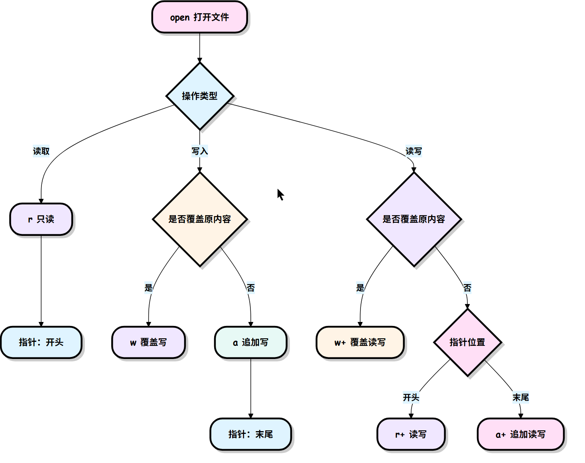

## 文件对象的方法

本节中剩下的例子假设已经创建了一个称为 f 的文件对象。

### f.read()

为了读取一个文件的内容，调用 f.read(size), 这将读取一定数目的数据, 然后作为字符串或字节对象返回。

size 是一个可选的数字类型的参数。 当 size 被忽略了或者为负, 那么该文件的所有内容都将被读取并且返回。

### f.readline()

f.readline() 会从文件中读取单独的一行。换行符为 '\n'。f.readline() 如果返回一个空字符串, 说明已经已经读取到最后一行。

### f.readlines()

f.readlines() 将返回该文件中包含的所有行。

如果设置可选参数 sizehint, 则读取指定长度的字节, 并且将这些字节按行分割。

### f.write()

f.write(string) 将 string 写入到文件中, 然后返回写入的字符数。

### f.tell()

f.tell() 用于返回文件当前的读/写位置（即文件指针的位置）。文件指针表示从文件开头开始的字节数偏移量。f.tell() 返回一个整数，表示文件指针的当前位置。

### f.seek()

如果要改变文件指针当前的位置, 可以使用 f.seek(offset, from_what) 函数。

f.seek(offset, whence) 用于移动文件指针到指定位置。

offset 表示相对于 whence 参数的偏移量，from_what 的值, 如果是 0 表示开头, 如果是 1 表示当前位置, 2 表示文件的结尾，例如：


- seek(x,0) ： 从起始位置即文件首行首字符开始移动 x 个字符
- seek(x,1) ： 表示从当前位置往后移动x个字符
- seek(-x,2)：表示从文件的结尾往前移动x个字符

### f.close()

在文本文件中 (那些打开文件的模式下没有 b 的), 只会相对于文件起始位置进行定位。

当你处理完一个文件后, 调用 f.close() 来关闭文件并释放系统的资源，如果尝试再调用该文件，则会抛出异常。

## pickle 模块

Python的pickle模块实现了基本的数据序列和反序列化。

通过pickle模块的序列化操作我们能够将程序中运行的对象信息保存到文件中去，永久存储。

通过pickle模块的反序列化操作，我们能够从文件中创建上一次程序保存的对象。

```python
pickle.dump(obj, file, [,protocol])
```

**注解：**从 file 中读取一个字符串，并将它重构为原来的Python对象。

**file:** 类文件对象，有read()和readline()接口。

# File(文件) 方法

## open() 方法

Python **open()** 方法用于打开一个文件，并返回文件对象。

在对文件进行处理过程都需要使用到这个函数，如果该文件无法被打开，会抛出 **OSError**。

**注意：**使用 **open()** 方法一定要保证关闭文件对象，即调用 **close()** 方法。

**open()** 函数常用形式是接收两个参数：文件名(file)和模式(mode)。

```python
open(file, mode='r')
```

完整的语法格式为：

```python
open(file, mode='r', buffering=-1, encoding=None, errors=None, newline=None, closefd=True, opener=None)
```

源码:

```python
@overload
def open(
    file: FileDescriptorOrPath,
    mode: OpenTextMode = "r",
    buffering: int = -1,
    encoding: str | None = None,
    errors: str | None = None,
    newline: str | None = None,
    closefd: bool = True,
    opener: _Opener | None = None,
) -> TextIOWrapper: ...
```

参数说明:

- file: 必需，文件路径（相对或者绝对路径）。
- mode: 可选，文件打开模式
- buffering: 设置缓冲
- encoding: 一般使用utf8
- errors: 报错级别
- newline: 区分换行符
- closefd: 传入的file参数类型
- opener: 设置自定义开启器，开启器的返回值必须是一个打开的文件描述符。

mode 参数有：

| 模式 | 描述                                                         |
| :--- | :----------------------------------------------------------- |
| t    | 文本模式 (默认)。                                            |
| x    | 写模式，新建一个文件，如果该文件已存在则会报错。             |
| b    | 二进制模式。                                                 |
| +    | 打开一个文件进行更新(可读可写)。                             |
| U    | 通用换行模式（**Python 3 不支持**）。                        |
| r    | 以只读方式打开文件。文件的指针将会放在文件的开头。这是默认模式。 |
| rb   | 以二进制格式打开一个文件用于只读。文件指针将会放在文件的开头。这是默认模式。一般用于非文本文件如图片等。 |
| r+   | 打开一个文件用于读写。文件指针将会放在文件的开头。           |
| rb+  | 以二进制格式打开一个文件用于读写。文件指针将会放在文件的开头。一般用于非文本文件如图片等。 |
| w    | 打开一个文件只用于写入。如果该文件已存在则打开文件，并从开头开始编辑，即原有内容会被删除。如果该文件不存在，创建新文件。 |
| wb   | 以二进制格式打开一个文件只用于写入。如果该文件已存在则打开文件，并从开头开始编辑，即原有内容会被删除。如果该文件不存在，创建新文件。一般用于非文本文件如图片等。 |
| w+   | 打开一个文件用于读写。如果该文件已存在则打开文件，并从开头开始编辑，即原有内容会被删除。如果该文件不存在，创建新文件。 |
| wb+  | 以二进制格式打开一个文件用于读写。如果该文件已存在则打开文件，并从开头开始编辑，即原有内容会被删除。如果该文件不存在，创建新文件。一般用于非文本文件如图片等。 |
| a    | 打开一个文件用于追加。如果该文件已存在，文件指针将会放在文件的结尾。也就是说，新的内容将会被写入到已有内容之后。如果该文件不存在，创建新文件进行写入。 |
| ab   | 以二进制格式打开一个文件用于追加。如果该文件已存在，文件指针将会放在文件的结尾。也就是说，新的内容将会被写入到已有内容之后。如果该文件不存在，创建新文件进行写入。 |
| a+   | 打开一个文件用于读写。如果该文件已存在，文件指针将会放在文件的结尾。文件打开时会是追加模式。如果该文件不存在，创建新文件用于读写。 |
| ab+  | 以二进制格式打开一个文件用于追加。如果该文件已存在，文件指针将会放在文件的结尾。如果该文件不存在，创建新文件用于读写。 |

默认为文本模式，如果要以二进制模式打开，加上 **b** 。

## file 对象

file 对象使用 open 函数来创建，下表列出了 file 对象常用的函数：

| 序号 | 方法及描述                                                   |
| :--- | :----------------------------------------------------------- |
| 1    | file.close () 关闭文件。关闭后文件不能再进行读写操作。       |
| 2    | file.flush () 刷新文件内部缓冲，直接把内部缓冲区的数据立刻写入文件，而不是被动的等待输出缓冲区写入。 |
| 3    | file.fileno () 返回一个整型的文件描述符 (file descriptor FD 整型), 可以用在如 os 模块的 read 方法等一些底层操作上。 |
| 4    | file.isatty () 如果文件连接到一个终端设备返回 True，否则返回 False。 |
| 5    | file.next() **Python 3 中的 File 对象不支持 next () 方法。**返回文件下一行。 |
| 6    | file.read ([size]) 从文件读取指定的字节数，如果未给定或为负则读取所有。 |
| 7    | file.readline ([size]) 读取整行，包括 "\n" 字符。            |
| 8    | file.readlines ([sizeint]) 读取所有行并返回列表，若给定 sizeint>0，返回总和大约为 sizeint 字节的行，实际读取值可能比 sizeint 较大，因为需要填充缓冲区。 |
| 9    | file.seek (offset [, whence]) 移动文件读取指针到指定位置     |
| 10   | file.tell () 返回文件当前位置。                              |
| 11   | file.truncate ([size]) 从文件的首行首字符开始截断，截断文件为 size 个字符，无 size 表示从当前位置截断；截断之后后面的所有字符被删除，其中 windows 系统下的换行代表 2 个字符大小。 |
| 12   | file.write (str) 将字符串写入文件，返回的是写入的字符长度。  |
| 13   | file.writelines (sequence) 向文件写入一个序列字符串列表，如果需要换行则要自己加入每行的换行符。 |

# OS 文件/目录方法

`os` 模块是 Python 标准库中的一个重要模块，它提供了与操作系统交互的功能。

通过 `os` 模块，你可以执行文件操作、目录操作、环境变量管理、进程管理等任务。

`os` 模块是跨平台的，这意味着你可以在不同的操作系统（如 Windows、Linux、macOS）上使用相同的代码。

在使用 `os` 模块之前，你需要先导入它。导入 `os` 模块的代码如下：

```python
import os
```

## os 模块的常用功能

### 1. 获取当前工作目录

`os.getcwd()` 函数用于获取当前工作目录的路径。当前工作目录是 Python 脚本执行时所在的目录。

```python
import os

current_directory = os.getcwd()
print("当前工作目录:", current_directory)
```

### 2. 改变当前工作目录

`os.chdir(path)` 函数用于改变当前工作目录。`path` 是你想要切换到的目录路径。

```python
import os

current_directory = os.getcwd()
print("当前工作目录:", current_directory)

os.chdir("./work/")
print("新的工作目录:", os.getcwd())
```

### 3. 列出目录内容

`os.listdir(path)` 函数用于列出指定目录中的所有文件和子目录。如果不提供 `path` 参数，则默认列出当前工作目录的内容。

```python
import os

current_directory = os.getcwd()
print("当前工作目录:", current_directory)

files_and_dirs = os.listdir()
print("目录内容:", files_and_dirs)
>>>
当前工作目录: C:\Users\17867\Desktop\Projects\Python\51-test\Python Basics
目录内容: ['List.py', 'temp', 'Temp_main.py', 'with关键字.py', 'work', '函数.py', '列表推导式.py', '基本数据类型.py', '基础语法.py', '循环.py', '数据类型转换.py', '文档字符串.py', '装饰器.py', '运算符.py', '迭代器.py']
```

### 4. 创建目录

`os.mkdir(path)` 函数用于创建一个新的目录。如果目录已经存在，会抛出 `FileExistsError` 异常。

```python
os.mkdir("new_directory")
```

### 5. 删除目录

`os.rmdir(path)` 函数用于删除一个空目录。如果目录不为空，会抛出 `OSError` 异常。

```python
os.rmdir("new_directory")
```

### 6. 删除文件

`os.remove(path)` 函数用于删除一个文件。如果文件不存在，会抛出 `FileNotFoundError` 异常。

```python
os.remove("file_to_delete.txt")
```

### 7. 重命名文件或目录

`os.rename(src, dst)` 函数用于重命名文件或目录。`src` 是原始路径，`dst` 是新的路径。

```python
os.rename("old_name.txt", "new_name.txt")
```

### 8. 获取环境变量

`os.getenv(key)` 函数用于获取指定环境变量的值。如果环境变量不存在，返回 `None`。

```python
import os

home_directory = os.getenv("PATH")
for s in home_directory.split(";"):
    print(s)

```

### 9. 执行系统命令

`os.system(command)` 函数用于在操作系统的 shell 中执行命令。命令执行后，返回命令的退出状态。

```python
os.system("ls -l")
```

## os 常用方法

**os** 模块提供了非常丰富的方法用来处理文件和目录。常用的方法如下表所示：

### 一、目录操作

| 方法                | 作用                                          |
| :------------------ | :-------------------------------------------- |
| os.getcwd()         | 获取当前工作目录                              |
| os.chdir(path)      | 切换工作目录到 path                           |
| os.listdir(path)    | 列出指定路径下所有文件 / 文件夹名称，返回列表 |
| os.mkdir(path)      | 创建单层文件夹，路径不存在上级目录会报错      |
| os.makedirs(path)   | 递归创建多层文件夹                            |
| os.rmdir(path)      | 删除空文件夹，非空报错                        |
| os.removedirs(path) | 递归删除多层空文件夹                          |

### 二、文件操作

| 方法                    | 作用                                        |
| :---------------------- | :------------------------------------------ |
| os.rename(old, new)     | 文件 / 文件夹重命名，可移动文件             |
| os.remove(path)         | 删除文件，不能删文件夹                      |
| os.stat(path)           | 获取文件状态信息（大小、创建 / 修改时间等） |
| os.truncate(path, size) | 截断文件到指定字节长度                      |

### 三、路径处理（跨平台兼容）

| 方法                       | 作用                                    |
| :------------------------- | :-------------------------------------- |
| os.path.abspath(path)      | 返回绝对路径                            |
| os.path.basename(path)     | 获取路径末尾文件名 / 文件夹名           |
| os.path.dirname(path)      | 获取路径上级目录                        |
| os.path.exists(path)       | 判断路径是否存在（文件 / 目录都适用）   |
| os.path.isfile(path)       | 判断是否为文件                          |
| os.path.isdir(path)        | 判断是否为文件夹                        |
| os.path.join(path1, path2) | 拼接路径，自动适配系统分隔符 / \        |
| os.path.getsize(path)      | 获取文件大小（单位：字节）              |
| os.path.split(path)        | 拆分路径为 (目录，文件名)               |
| os.path.splitext(path)     | 拆分文件名和后缀，如 `("test", ".txt")` |

### 四、系统与环境变量

| 方法           | 作用                                          |
| :------------- | :-------------------------------------------- |
| os.name        | 获取操作系统标识：nt=Windows，posix=Linux/Mac |
| os.system(cmd) | 执行系统终端命令，返回执行状态码              |
| os.popen(cmd)  | 执行命令并返回输出流，可读取命令返回内容      |
| os.environ     | 获取系统环境变量字典                          |
| os.getenv(key) | 获取指定环境变量值，不存在返回 None           |

### 五、文件描述符 / 进程相关

| 方法          | 作用                                   |
| :------------ | :------------------------------------- |
| os.fdopen(fd) | 通过文件描述符创建文件对象             |
| os.fork()     | Linux/Mac 创建子进程（Windows 不支持） |
| os.getpid()   | 获取当前进程 ID                        |
| os.getppid()  | 获取父进程 ID                          |

### 六、分隔符常量（常用）

- `os.sep`：当前系统路径分隔符（Windows `\`，Linux `/`）
- `os.linesep`：系统换行符
- `os.pathsep`：环境变量路径分隔符（Windows `;`，Linux `:`）

# 错误和异常

作为 Python 初学者，在刚学习 Python 编程时，经常会看到一些报错信息，在前面我们没有提及，这章节我们会专门介绍。

Python 有两种错误很容易辨认：语法错误和异常。

Python assert（断言）用于判断一个表达式，在表达式条件为 false 的时候触发异常。

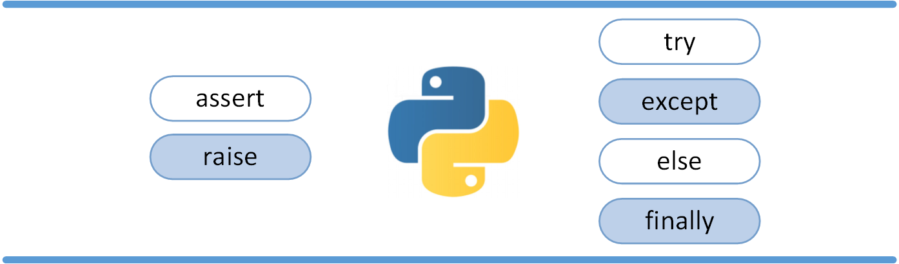

## 语法错误

Python 的语法错误或者称之为解析错，是初学者经常碰到的

## 异常

即便 Python 程序的语法是正确的，在运行它的时候，也有可能发生错误。运行期检测到的错误被称为异常。

大多数的异常都不会被程序处理，都以错误信息的形式展现

```python
>>> 10 * (1/0)             # 0 不能作为除数，触发异常
Traceback (most recent call last):
  File "<stdin>", line 1, in ?
ZeroDivisionError: division by zero
>>> 4 + spam*3             # spam 未定义，触发异常
Traceback (most recent call last):
  File "<stdin>", line 1, in ?
NameError: name 'spam' is not defined
>>> '2' + 2               # int 不能与 str 相加，触发异常
Traceback (most recent call last):
  File "<stdin>", line 1, in <module>
TypeError: can only concatenate str (not "int") to str
```

异常以不同的类型出现，这些类型都作为信息的一部分打印出来: 例子中的类型有 ZeroDivisionError，NameError 和 TypeError。

错误信息的前面部分显示了异常发生的上下文，并以调用栈的形式显示具体信息。

## 异常处理

### try/except

异常捕捉可以使用 **try/except** 语句。


以下例子中，让用户输入一个合法的整数，但是允许用户中断这个程序（使用 Control-C 或者操作系统提供的方法）。用户中断的信息会引发一个 KeyboardInterrupt 异常。

```python
while True:
    try:
        x = float(input("请输入一个数字: "))
        break
    except ValueError:
        print("您输入的不是数字，请再次尝试输入！")
```

try 语句按照如下方式工作；

- 首先，执行 try 子句（在关键字 try 和关键字 except 之间的语句）。
- 如果没有异常发生，忽略 except 子句，try 子句执行后结束。
- 如果在执行 try 子句的过程中发生了异常，那么 try 子句余下的部分将被忽略。如果异常的类型和 except 之后的名称相符，那么对应的 except 子句将被执行。
- 如果一个异常没有与任何的 except 匹配，那么这个异常将会传递给上层的 try 中。

`一个 try 语句可能包含多个except子句`，分别来处理不同的特定的异常。最多只有一个分支会被执行。

处理程序将只针对对应的 try 子句中的异常进行处理，而不是其他的 try 的处理程序中的异常。

`一个except子句可以同时处理多个异常`，这些异常将被放在一个括号里成为一个元组，例如:

```python
except (RuntimeError, TypeError, NameError):
    pass
```

最后一个except子句可以忽略异常的名称，它将被当作通配符使用。你可以使用这种方法打印一个错误信息，然后再次把异常抛出。

```python
import sys

try:
    f = open('myfile.txt')
    s = f.readline()
    i = int(s.strip())
except OSError as err:
    print("OS error: {0}".format(err))
except ValueError:
    print("Could not convert data to an integer.")
except:
    print("Unexpected error:", sys.exc_info()[0])
    raise
```

### try/except...else

**try/except** 语句还有一个可选的 **else** 子句，如果使用这个子句，那么必须放在所有的 except 子句之后。

else 子句将在 try 子句没有发生任何异常的时候执行。

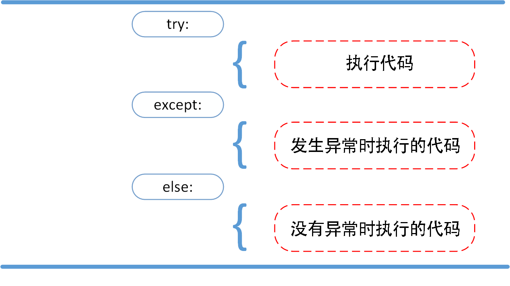

以下实例在 try 语句中判断文件是否可以打开，如果打开文件时正常的没有发生异常则执行 else 部分的语句，读取文件内容：

```python
for arg in sys.argv[1:]:
    try:
        f = open(arg, 'r')
    except IOError:
        print('cannot open', arg)
    else:
        print(arg, 'has', len(f.readlines()), 'lines')
        f.close()
```

使用 else 子句比把所有的语句都放在 try 子句里面要好，这样可以避免一些意想不到，而 except 又无法捕获的异常。

异常处理并不仅仅处理那些直接发生在 try 子句中的异常，而且还能处理子句中调用的函数（甚至间接调用的函数）里抛出的异常。例如:

```python
>>> def this_fails():
        x = 1/0

>>> try:
        this_fails()
    except ZeroDivisionError as err:
        print('Handling run-time error:', err)

Handling run-time error: int division or modulo by zero
```

### try-finally 语句

try-finally 语句无论是否发生异常都将执行最后的代码。


以下实例中 finally 语句无论异常是否发生都会执行：

```python
try:
    runoob()
except AssertionError as error:
    print(error)
else:
    try:
        with open('file.log') as file:
            read_data = file.read()
    except FileNotFoundError as fnf_error:
        print(fnf_error)
finally:
    print('这句话，无论异常是否发生都会执行。')
```

## 抛出异常

Python 使用 raise 语句抛出一个指定的异常。

raise语法格式如下：

```python
raise [Exception [, args [, traceback]]]
```


以下实例如果 x 大于 5 就触发异常:

```python
x = 10
if x > 5:
    raise Exception('x 不能大于 5。x 的值为: {}'.format(x))
```

执行以上代码会触发异常：

```python
Traceback (most recent call last):
  File "test.py", line 3, in <module>
    raise Exception('x 不能大于 5。x 的值为: {}'.format(x))
Exception: x 不能大于 5。x 的值为: 10
```

raise 唯一的一个参数指定了要被抛出的异常。它必须是一个异常的实例或者是异常的类（也就是 Exception 的子类）。

如果你只想知道这是否抛出了一个异常，并不想去处理它，那么一个简单的 raise 语句就可以再次把它抛出。

```python
>>> try:
        raise NameError('HiThere')  # 模拟一个异常。
    except NameError:
        print('An exception flew by!')
        raise

An exception flew by!
```

## 用户自定义异常

你可以通过创建一个新的异常类来拥有自己的异常。异常类继承自 Exception 类，可以直接继承，或者间接继承，例如:

```python
>>> class MyError(Exception):
        def __init__(self, value):
            self.value = value
        def __str__(self):
            return repr(self.value)

>>> try:
        raise MyError(2*2)
    except MyError as e:
        print('My exception occurred, value:', e.value)

My exception occurred, value: 4
```

在这个例子中，类 Exception 默认的 **init**() 被覆盖。

当创建一个模块有可能抛出多种不同的异常时，一种通常的做法是为这个包建立一个基础异常类，然后基于这个基础类为不同的错误情况创建不同的子类:

```python
class Error(Exception):
    """Base class for exceptions in this module."""
    pass

class InputError(Error):
    """Exception raised for errors in the input.

    Attributes:
        expression -- input expression in which the error occurred
        message -- explanation of the error
    """

    def __init__(self, expression, message):
        self.expression = expression
        self.message = message

class TransitionError(Error):
    """Raised when an operation attempts a state transition that's not
    allowed.

    Attributes:
        previous -- state at beginning of transition
        next -- attempted new state
        message -- explanation of why the specific transition is not allowed
    """

    def __init__(self, previous, next, message):
        self.previous = previous
        self.next = next
        self.message = message
```

大多数的异常的名字都以"Error"结尾，就跟标准的异常命名一样。

------

## 定义清理行为

try 语句还有另外一个可选的子句，它定义了无论在任何情况下都会执行的清理行为。 例如:

```python
>>> try:
...     raise KeyboardInterrupt
... finally:
...     print('Goodbye, world!')
...
Goodbye, world!
```

以上例子不管 try 子句里面有没有发生异常，finally 子句都会执行。

如果一个异常在 try 子句里（或者在 except 和 else 子句里）被抛出，而又没有任何的 except 把它截住，那么这个异常会在 finally 子句执行后被抛出。

下面是一个更加复杂的例子（在同一个 try 语句里包含 except 和 finally 子句）:

```python
>>> def divide(x, y):
        try:
            result = x / y
        except ZeroDivisionError:
            print("division by zero!")
        else:
            print("result is", result)
        finally:
            print("executing finally clause")

>>> divide(2, 1)
result is 2.0
executing finally clause
>>> divide(2, 0)
division by zero!
executing finally clause
>>> divide("2", "1")
executing finally clause
```

## 预定义的清理行为

一些对象定义了标准的清理行为，无论系统是否成功的使用了它，一旦不需要它了，那么这个标准的清理行为就会执行。

下面这个例子展示了尝试打开一个文件，然后把内容打印到屏幕上:

```python
for line in open("myfile.txt"):
    print(line, end="")
```

以上这段代码的问题是，当执行完毕后，文件会保持打开状态，并没有被关闭。

关键词 with 语句就可以保证诸如文件之类的对象在使用完之后一定会正确的执行他的清理方法:

```python
with open("myfile.txt") as f:
    for line in f:
        print(line, end="")
```

以上这段代码执行完毕后，就算在处理过程中出问题了，文件 f 总是会关闭。

# 面向对象

Python从设计之初就已经是一门面向对象的语言，正因为如此，在Python中创建一个类和对象是很容易的。本章节我们将详细介绍Python的面向对象编程。

## 面向对象技术简介

- **类(Class):** 用来描述具有相同的属性和方法的对象的集合。它定义了该集合中每个对象所共有的属性和方法。对象是类的实例。
- **方法：**类中定义的函数。
- **类变量：**类变量在整个实例化的对象中是公用的。类变量定义在类中且在函数体之外。类变量通常不作为实例变量使用。
- **数据成员：**类变量或者实例变量用于处理类及其实例对象的相关的数据。
- **方法重写：**如果从父类继承的方法不能满足子类的需求，可以对其进行改写，这个过程叫方法的覆盖（override），也称为方法的重写。
- **局部变量：**定义在方法中的变量，只作用于当前实例的类。
- **实例变量：**在类的声明中，属性是用变量来表示的，这种变量就称为实例变量，实例变量就是一个用 self 修饰的变量。
- **继承：**即一个派生类（derived class）继承基类（base class）的字段和方法。继承也允许把一个派生类的对象作为一个基类对象对待。例如，有这样一个设计：一个Dog类型的对象派生自Animal类，这是模拟"是一个（is-a）"关系（例图，Dog是一个Animal）。
- **实例化：**创建一个类的实例，类的具体对象。
- **对象：**通过类定义的数据结构实例。对象包括两个数据成员（类变量和实例变量）和方法。

和其它编程语言相比，Python 在尽可能不增加新的语法和语义的情况下加入了类机制。

Python中的类提供了面向对象编程的所有基本功能：类的继承机制允许多个基类，派生类可以覆盖基类中的任何方法，方法中可以调用基类中的同名方法。

对象可以包含任意数量和类型的数据。

## 类定义

语法格式如下：

```python
class 类名:
    # 1. 类属性（类数据成员，所有实例共享）
    类变量 = 值

    # 2. 构造方法：创建实例时自动执行，初始化实例属性
    def __init__(self, 参数):
        # 实例属性（实例数据成员，每个对象独有）
        self.实例变量 = 参数

    # 3. 普通成员方法（对象行为）
    def 方法名(self, 其他参数):
        方法逻辑
```

类实例化后，可以使用其属性，实际上，创建一个类之后，可以通过类名访问其属性。

## 类对象

类对象支持两种操作：属性引用和实例化。

属性引用使用和 Python 中所有的属性引用一样的标准语法：**obj.name**。

类对象创建后，类命名空间中所有的命名都是有效属性名。所以如果类定义是这样:

```python
#!/usr/bin/python3

class MyClass:
    """一个简单的类实例"""
    i = 12345
    def f(self):
        return 'hello world'

# 实例化类
x = MyClass()

# 访问类的属性和方法
print("MyClass 类的属性 i 为：", x.i)
print("MyClass 类的方法 f 输出为：", x.f())
```

类有一个名为 **init**() 的特殊方法（**构造方法**），该方法在类实例化时会自动调用，像下面这样：

```python
def __init__(self):
    self.data = []
```

类定义了 **init**() 方法，类的实例化操作会自动调用 **init**() 方法。如下实例化类 MyClass，对应的 **init**() 方法就会被调用:

```python
x = MyClass()
```

当然， **init**() 方法可以有参数，参数通过 **init**() 传递到类的实例化操作上。例如:

```python
#!/usr/bin/python3

class Complex:
    def __init__(self, realpart, imagpart):
        self.r = realpart
        self.i = imagpart
x = Complex(3.0, -4.5)
print(x.r, x.i)   # 输出结果：3.0 -4.5
```

### self 代表类的实例，而非类

类的方法与普通的函数只有一个特别的区别——它们必须有一个额外的**第一个参数名称**, 按照惯例它的名称是 self。

```python
class Test:
    def prt(self):
        print(self)
        print(self.__class__)

t = Test()
t.prt()

>>>
<__main__.Test object at 0x0000027908FFB4D0>
<class '__main__.Test'>
```

从执行结果可以很明显的看出，self 代表的是类的实例，代表当前对象的地址，而 self.class 则指向类。

self 不是 Python 关键字，我们把他换成 runoob 也是可以正常执行的:

在 Python中，self 是一个惯用的名称，用于表示类的实例（对象）自身。它是一个指向实例的引用，使得类的方法能够访问和操作实例的属性。

当你定义一个类，并在类中定义方法时，第一个参数通常被命名为 self，尽管你可以使用其他名称，但强烈建议使用 self，以保持代码的一致性和可读性。

```python
class MyClass:
    def __init__(self, value):
        self.value = value

    def display_value(self):
        print(self.value)

# 创建一个类的实例
obj = MyClass(42)

# 调用实例的方法
obj.display_value() # 输出 42
```

在上面的例子中，self 是一个指向类实例的引用，它在 ****init**** 构造函数中用于初始化实例的属性，也在 **display_value** 方法中用于访问实例的属性。通过使用 self，你可以在类的方法中访问和操作实例的属性，从而实现类的行为。

------

## 类的方法

在类的内部，使用 **def** 关键字来定义一个方法，与一般函数定义不同，类方法必须包含参数 self, 且为第一个参数，self 代表的是类的实例。

```python
#类定义
class people:
    #定义基本属性
    name = ''
    age = 0
    #定义私有属性,私有属性在类外部无法直接进行访问
    __weight = 0
    #定义构造方法
    def __init__(self,n,a,w):
        self.name = n
        self.age = a
        self.__weight = w
    def speak(self):
        print("%s 说: 我 %d 岁。" %(self.name,self.age))

# 实例化类
p = people('runoob',10,30)
p.speak()
```

## 继承

Python 同样支持类的继承，如果一种语言不支持继承，类就没有什么意义。派生类的定义如下所示:

子类（派生类 DerivedClassName）会继承父类（基类 BaseClassName）的属性和方法。

BaseClassName（实例中的基类名）必须与派生类定义在一个作用域内。除了类，还可以用表达式，基类定义在另一个模块中时这一点非常有用:

```python
class DerivedClassName(modname.BaseClassName):
```

```python
#类定义
class people:
    #定义基本属性
    name = ''
    age = 0
    #定义私有属性,私有属性在类外部无法直接进行访问
    __weight = 0
    #定义构造方法
    def __init__(self,n,a,w):
        self.name = n
        self.age = a
        self.__weight = w
    def speak(self):
        print("%s 说: 我 %d 岁。" %(self.name,self.age))

#单继承示例
class student(people):
    grade = ''
    def __init__(self,n,a,w,g):
        #调用父类的构函
        people.__init__(self,n,a,w)
        self.grade = g
    #覆写父类的方法
    def speak(self):
        print("%s 说: 我 %d 岁了，我在读 %d 年级"%(self.name,self.age,self.grade))


s = student('ken',10,60,3)
s.speak()
```

## 多继承

Python同样有限的支持多继承形式。多继承的类定义形如下例:

```python
class DerivedClassName(Base1, Base2, Base3):
```

需要注意圆括号中父类的顺序，若是父类中有相同的方法名，而在子类使用时未指定，Python从左至右搜索 即方法在子类中未找到时，从左到右查找父类中是否包含方法。

**方法名同，默认调用的是在括号中参数位置排前父类的方法**

```python
#类定义
class people:
    #定义基本属性
    name = ''
    age = 0
    #定义私有属性,私有属性在类外部无法直接进行访问
    __weight = 0
    #定义构造方法
    def __init__(self,n,a,w):
        self.name = n
        self.age = a
        self.__weight = w
    def speak(self):
        print("%s 说: 我 %d 岁。" %(self.name,self.age))

#单继承示例
class student(people):
    grade = ''
    def __init__(self,n,a,w,g):
        #调用父类的构函
        people.__init__(self,n,a,w)
        self.grade = g
    #覆写父类的方法
    def speak(self):
        print("%s 说: 我 %d 岁了，我在读 %d 年级"%(self.name,self.age,self.grade))

#另一个类，多继承之前的准备
class speaker():
    topic = ''
    name = ''
    def __init__(self,n,t):
        self.name = n
        self.topic = t
    def speak(self):
        print("我叫 %s，我是一个演说家，我演讲的主题是 %s"%(self.name,self.topic))

#多继承
class sample(speaker,student):
    a =''
    def __init__(self,n,a,w,g,t):
        student.__init__(self,n,a,w,g)
        speaker.__init__(self,n,t)

test = sample("Tim",25,80,4,"Python")
test.speak()   #方法名同，默认调用的是在括号中参数位置排前父类的方法
```

## 方法重写

如果你的父类方法的功能不能满足你的需求，你可以在子类重写你父类的方法，实例如下：

```python
class Parent:        # 定义父类
   def myMethod(self):
      print ('调用父类方法')

class Child(Parent): # 定义子类
   def myMethod(self):
      print ('调用子类方法')

c = Child()          # 子类实例
c.myMethod()         # 子类调用重写方法
super(Child,c).myMethod() #用子类对象调用父类已被覆盖的方法
```

super() 函数是用于调用父类(超类)的一个方法。

## 子类继承父类构造函数说明

如果在子类中需要父类的构造方法就需要显式地调用父类的构造方法，或者不重写父类的构造方法。

子类不重写 ****init****，实例化子类时，会自动调用父类定义的 ****init****。

```python
class Father(object):
    def __init__(self, name):
        self.name=name
        print ( "name: %s" %( self.name) )
    def getName(self):
        return 'Father ' + self.name

class Son(Father):
    def getName(self):
        return 'Son '+self.name

if __name__=='__main__':
    son=Son('runoob')
    print ( son.getName() )

>>>
name: runoob
Son runoob
```

如果重写了****init**** 时，实例化子类，就不会调用父类已经定义的 ****init****，语法格式如下：

```python
class Father(object):
    def __init__(self, name):
        self.name=name
        print ( "name: %s" %( self.name) )
    def getName(self):
        return 'Father ' + self.name

class Son(Father):
    def __init__(self, name):
        print ( "hi" )
        self.name =  name
    def getName(self):
        return 'Son '+self.name

if __name__=='__main__':
    son=Son('runoob')
    print ( son.getName() )
>>>
hi
Son runoob
```

如果重写了****init**** 时，要继承父类的构造方法，可以使用 **super** 关键字：

```python
super(子类，self).__init__(参数1，参数2，....)
```

还有一种经典写法：

```python
父类名称.__init__(self,参数1，参数2，...)
```

```python
class Father(object):
    def __init__(self, name):
        self.name=name
        print ( "name: %s" %( self.name))
    def getName(self):
        return 'Father ' + self.name

class Son(Father):
    def __init__(self, name):
        super(Son, self).__init__(name)
        print ("hi")
        self.name =  name
    def getName(self):
        return 'Son '+self.name

if __name__=='__main__':
    son=Son('runoob')
    print ( son.getName() )
>>>
name: runoob
hi
Son runoob
```

## 类属性与方法

### 类的私有属性

**__private_attrs**：两个下划线开头，声明该属性为私有，不能在类的外部被使用或直接访问。在类内部的方法中使用时 **self.__private_attrs**。

### 类的方法

在类的内部，使用 def 关键字来定义一个方法，与一般函数定义不同，类方法必须包含参数 **self**，且为第一个参数，**self** 代表的是类的实例。

**self** 的名字并不是规定死的，也可以使用 **this**，但是最好还是按照约定使用 **self**。

### 类的私有方法

**__private_method**：两个下划线开头，声明该方法为私有方法，只能在类的内部调用 ，不能在类的外部调用。**self.__private_methods**。

**类的私有属性实例如下：**

```python
class JustCounter:
    __secretCount = 0  # 私有变量
    publicCount = 0    # 公开变量

    def count(self):
        self.__secretCount += 1
        self.publicCount += 1
        print (self.__secretCount)

counter = JustCounter()
counter.count()
counter.count()
print (counter.publicCount)
print (counter.__secretCount)  # 报错，实例不能访问私有变量
```

**类的私有方法实例如下：**

```python
class JustCounter:
    __secretCount = 0  # 私有变量
    publicCount = 0    # 公开变量

    def count(self):
        self.__secretCount += 1
        self.publicCount += 1
        print (self.__secretCount)

counter = JustCounter()
counter.count()
counter.count()
print (counter.publicCount)
print (counter.__secretCount)  # 报错，实例不能访问私有变量
```

**类的私有方法实例如下：**

```python
class Site:
    def __init__(self, name, url):
        self.name = name       # public
        self.__url = url   # private

    def who(self):
        print('name  : ', self.name)
        print('url : ', self.__url)

    def __foo(self):          # 私有方法
        print('这是私有方法')

    def foo(self):            # 公共方法
        print('这是公共方法')
        self.__foo()

x = Site('菜鸟教程', 'www.runoob.com')
x.who()        # 正常输出
x.foo()        # 正常输出
x.__foo()      # 报错
```

### 类的专有方法

- **`__init__`:** 构造函数，在生成对象时调用
- **`__del__`:** 析构函数，释放对象时使用
- **`__repr__`:** 打印，转换
- **`__setitem__` :** 按照索引赋值
- **`__getitem__`:** 按照索引获取值
- **`__len__`:** 获得长度
- **`__cmp__`:** 比较运算
- **`__call__`:** 函数调用
- **`__add__`:** 加运算
- **`__sub__`:** 减运算
- **`__mul__`:** 乘运算
- **`__truediv__`:** 除运算
- **`__mod__`:** 求余运算
- **`__pow__`:** 乘方

### 运算符重载

Python同样支持运算符重载，我们可以对类的专有方法进行重载，实例如下：

```python
#!/usr/bin/python3

class Vector:
   def __init__(self, a, b):
      self.a = a
      self.b = b

   def __str__(self):
      return 'Vector (%d, %d)' % (self.a, self.b)

   def __add__(self,other):
      return Vector(self.a + other.a, self.b + other.b)

v1 = Vector(2,10)
v2 = Vector(5,-2)
print (v1 + v2)
```

# 命名空间和作用域

## 命名空间

名空间(Namespace)是从名称到对象的映射，大部分的命名空间都是通过 Python 字典来实现的。

命名空间提供了在项目中避免名字冲突的一种方法。各个命名空间是独立的，没有任何关系的，所以一个命名空间中不能有重名，但不同的命名空间是可以重名而没有任何影响。

我们举一个计算机系统中的例子，一个文件夹(目录)中可以包含多个文件夹，每个文件夹中不能有相同的文件名，但不同文件夹中的文件可以重名。

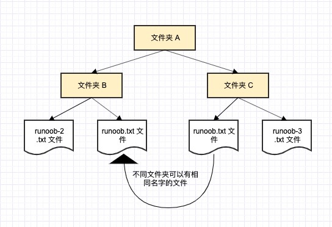

一般有三种命名空间：

- **内置名称（built-in names**）， Python 语言内置的名称，比如函数名 abs、char 和异常名称 BaseException、Exception 等等。
- **全局名称（global names）**，模块中定义的名称，记录了模块的变量，包括函数、类、其它导入的模块、模块级的变量和常量。
- **局部名称（local names）**，函数中定义的名称，记录了函数的变量，包括函数的参数和局部定义的变量。（类中定义的也是）

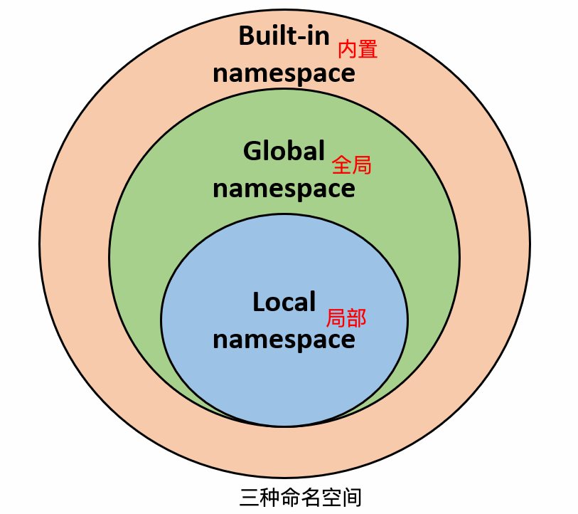

命名空间查找顺序:

假设我们要使用变量 runoob，则 Python 的查找顺序为：**局部的命名空间 -> 全局命名空间 -> 内置命名空间**。

如果找不到变量 runoob，它将放弃查找并引发一个 NameError 异常:  `NameError: name 'runoob' is not defined。`

命名空间的生命周期：

命名空间的生命周期取决于对象的作用域，如果对象执行完成，则该命名空间的生命周期就结束。

因此，我们无法从外部命名空间访问内部命名空间的对象。

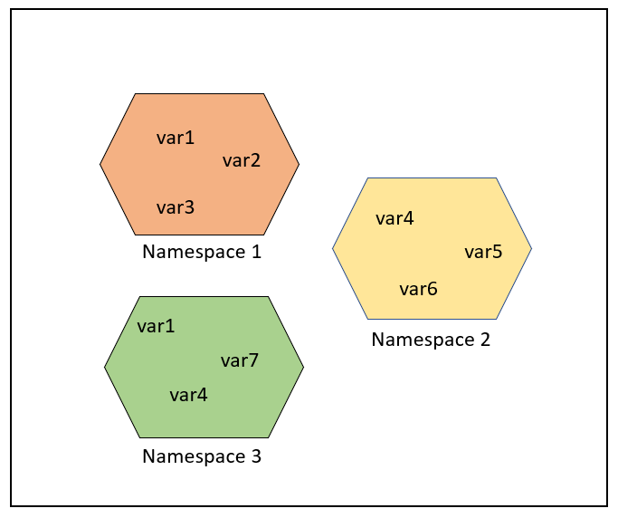

## 作用域

作用域就是一个 Python 程序可以直接访问命名空间的正文区域。

在一个 Python 程序中，直接访问一个变量，会从内到外依次访问所有的作用域直到找到，否则会报未定义的错误。

Python 中，程序的变量并不是在哪个位置都可以访问的，访问权限决定于这个变量是在哪里赋值的。

变量的作用域决定了在哪一部分程序可以访问哪个特定的变量名称。

Python 的作用域一共有 4 种，分别是：

有四种作用域：

- **L（Local）**：最内层，包含局部变量，比如一个函数/方法内部。
- **E（Enclosing）**：包含了非局部(non-local)也非全局(non-global)的变量。比如两个嵌套函数，一个函数（或类） A 里面又包含了一个函数 B ，那么对于 B 中的名称来说 A 中的作用域就为 nonlocal。
- **G（Global）**：当前脚本的最外层，比如当前模块的全局变量。
- **B（Built-in）**： 包含了内建的变量/关键字等，最后被搜索。

LEGB 规则（Local, Enclosing, Global, Built-in）：Python 查找变量时的顺序是： **L –> E –> G –> B**。

1. **Local**：当前函数的局部作用域。
2. **Enclosing**：包含当前函数的外部函数的作用域（如果有嵌套函数）。
3. **Global**：当前模块的全局作用域。
4. **Built-in**：Python 内置的作用域。

在局部找不到，便会去局部外的局部找（例如闭包），再找不到就会去全局找，再者去内置中找。

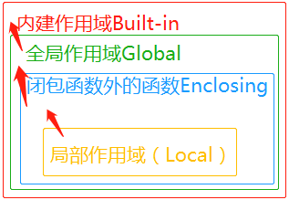

```python
g_count = 0  # 全局作用域
def outer():
    o_count = 1  # 闭包函数外的函数中
    def inner():
        i_count = 2  # 局部作用域
```

内置作用域是通过一个名为 builtin 的标准模块来实现的，但是这个变量名自身并没有放入内置作用域内，所以必须导入这个文件才能够使用它。在Python3.0中，可以使用以下的代码来查看到底预定义了哪些变量:

Python 中只有模块（module），类（class）以及函数（def、lambda）才会引入新的作用域，其它的代码块（如 if/elif/else/、try/except、for/while等）是不会引入新的作用域的，也就是说这些语句内定义的变量，外部也可以访问，如下代码：

### 全局变量和局部变量

定义在函数内部的变量拥有一个局部作用域，定义在函数外的拥有全局作用域。

局部变量只能在其被声明的函数内部访问，而全局变量可以在整个程序范围内访问。

在函数内部声明的变量只在函数内部的作用域中有效，调用函数时，这些内部变量会被加入到函数内部的作用域中，并且不会影响到函数外部的同名变量

```python
#!/usr/bin/python3

total = 0 # 这是一个全局变量
# 可写函数说明
def sum( arg1, arg2 ):
    #返回2个参数的和."
    total = arg1 + arg2 # total在这里是局部变量.
    print ("函数内是局部变量 : ", total)
    return total

#调用sum函数
sum( 10, 20 )
print ("函数外是全局变量 : ", total)
>>>
函数内是局部变量 :  30
函数外是全局变量 :  0
```

**1、全局变量**：在函数外部定义的变量，可以在整个文件中被访问。在函数外部定义的变量对所有函数都是可见的，除非函数内部定义了同名的局部变量。

**2、局部变量**：在函数内部定义的变量，仅在函数内有效，函数外无法访问。局部变量优先级高于全局变量，因此如果局部变量和全局变量同名，函数内部会使用局部变量。

### global 和 nonlocal关键字

当内部作用域想修改外部作用域的变量时，就要用到 global 和 nonlocal 关键字了。

以下实例修改全局变量 num：

```python
num = 1
def fun1():
    global num  # 需要使用 global 关键字声明
    print(num)
    num = 123
    print(num)
fun1()
print(num)
```

如果要修改嵌套作用域（enclosing 作用域，外层非全局作用域）中的变量则需要 nonlocal 关键字了，如下实例：

```python
def outer():
    num = 10
    def inner():
        nonlocal num   # nonlocal关键字声明
        num = 100
        print(num)
    inner()
    print(num)
outer()
```

另外有一种特殊情况，假设下面这段代码被运行：

```python
a = 10
def test():
    a = a + 1
    print(a)
test()

错误信息为局部作用域引用错误，因为 test 函数中的 a 使用的是局部，未定义，无法修改。
修改 a 为全局变量：

a = 10
def test():
    global a
    a = a + 1
    print(a)
test()
```

也可以通过函数参数传递：

```python
a = 10
def test(a):
    a = a + 1
    print(a)
test(a)
```

### 总结

- **全局变量**在函数外部定义，可以在整个文件中访问。
- **局部变量**在函数内部定义，只能在函数内访问。
- 使用 `global` 可以在函数中修改全局变量。
- 使用 `nonlocal` 可以在嵌套函数中修改外部函数的变量。

# 虚拟环境的创建（venv）

虚拟环境是一个独立的 Python 运行空间，拥有自己的解释器、安装包和配置，与系统全局环境完全隔离。

Python 虚拟环境（Virtual Environment）是一个独立的 Python 运行环境，它允许你在同一台机器上为不同的项目创建隔离的 Python 环境。

不同项目可以在各自的虚拟环境中并行运行，互不干扰。

每个虚拟环境都有自己的：

- Python 解释器
- 安装的包/库
- 环境变量

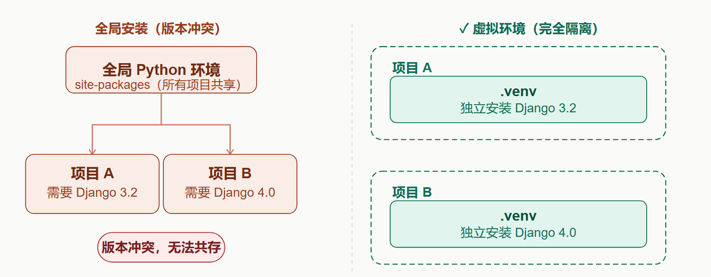

虚拟环境让每个项目拥有独立的依赖空间，彻底消除版本冲突

## 为什么需要虚拟环境

- **项目隔离**：不同项目可使用不同版本的 Python 和第三方库
- **避免污染**：安装的包只影响当前环境，不污染全局 Python
- **依赖可控**：通过 `requirements.txt` 精确记录和复现环境
- **安全测试**：可以放心升级或试用新包，不影响其他项目

**场景举例：**

- 项目 A 需要 Django 3.2 版本
- 项目 B 需要 Django 4.0 版本
- 如果在系统全局安装，两个版本会冲突

### 虚拟环境工具

| 工具名称         | 类型         | Python版本支持 | 安装方式                   | 特点                       | 适用场景                 |
| :--------------- | :----------- | :------------- | :------------------------- | :------------------------- | :----------------------- |
| **venv**（推荐） | 内置模块     | ≥ 3.3          | 无需安装，内置             | 轻量级、官方推荐、使用简单 | 通用开发、日常项目       |
| **virtualenv**   | 第三方工具   | 2.x 和 3.x     | `pip install virtualenv`   | 功能丰富、兼容多版本       | 需要兼容旧版本或高级功能 |
| **conda**        | Anaconda自带 | 2.x 和 3.x     | 随 Anaconda/Miniconda 安装 | 跨语言包管理、数据科学生态 | 数据科学、机器学习项目   |

## 创建虚拟环境

Python 3.3+ 内置了 `venv` 模块，无需额外安装。

### 使用流程

## 使用流程总览

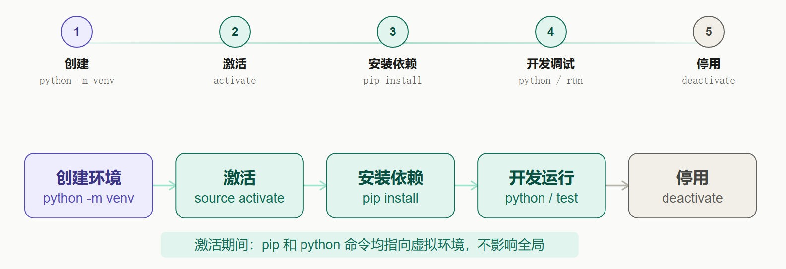

创建虚拟环境：

```python
# 基本语法
python3 -m venv 环境名称
```

例如，创建一个名为 `.venv` 的虚拟环境：

```python
# 进入项目目录
mkdir my_project && cd my_project

# 创建虚拟环境（命名为'.venv'是常见约定）
python3 -m venv .venv
```

**参数说明：**

- `-m venv`：使用 venv 模块
- `.venv`：虚拟环境的名称（可以自定义）

### 创建后的目录结构

```text
.venv/
├── bin/            # 在 Unix/Linux 系统上
│   ├── activate    # 激活脚本
│   ├── python      # 环境 Python 解释器
│   └── pip         # 环境的 pip
├── Scripts/        # 在 Windows 系统上
│   ├── activate    # 激活脚本
│   ├── python.exe  # 环境 Python 解释器
│   └── pip.exe     # 环境的 pip
└── Lib/            # 安装的第三方库
```

## 激活虚拟环境

激活后，当前终端的 Python 和 pip 命令将自动指向该虚拟环境，所有安装操作均在隔离空间内进行。

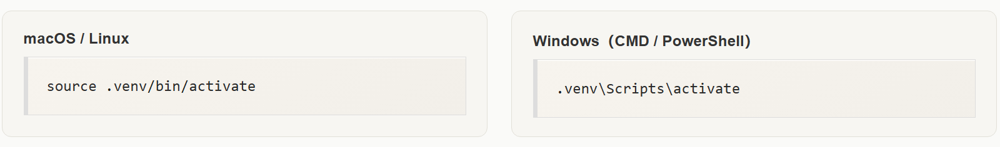

激活成功后，命令行提示符通常会显示环境名称：

```python
(.venv) $
# 验证激活是否生效：
# 查看 Python 路径，应指向 .venv 目录
which python       # macOS/Linux
where python       # Windows
→ /path/to/my_project/.venv/bin/python
```

## 使用虚拟环境

### 安装包

在激活的环境中，使用 pip 安装的包只会影响当前环境：

```python
# 安装单个包（如Django）
(.venv) pip install django==3.2.12

# 安装多个包
(.venv) pip install requests pandas

# 安装速度慢？使用国内镜像
(.venv)  pip install django -i https://pypi.tuna.tsinghua.edu.cn/simple
```

### 查看已安装的包

```python
(.venv) pip list
Package    Version
---------- -------
Django     3.2.12
pip        21.2.4

# 查看某个包的详情
(.venv) pip show django

# 升级包
(.venv) pip install --upgrade pip
```

### 导出依赖

使用 requirements.txt 记录和复现项目环境，是团队协作的标准做法：

```python
(.venv) pip freeze > requirements.txt
# requirements.txt 文件内容示例：
Django==3.2.12
requests==2.26.0
pandas==1.3.3
```

### 从文件安装依赖

```python
(.venv) pip install -r requirements.txt
```

## 退出虚拟环境

当完成工作后，可以退出虚拟环境：

```python
deactivate
```

退出后，命令行提示符会恢复正常，Python 和 pip 命令将使用系统全局版本。

## 删除虚拟环境

要删除虚拟环境，只需删除对应的目录即可：

```python
# 确保已退出环境
deactivate
```

### 删除虚拟环境

虚拟环境本质上是一个普通目录，删除目录即彻底移除：

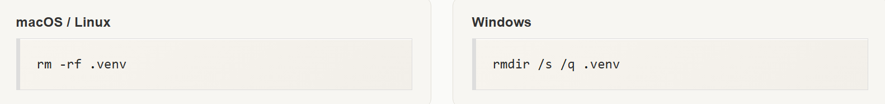**注意**：删除前请先执行 `deactivate` 退出环境，否则当前 Shell 会保留失效的环境变量。

## 高级用法

### 指定 Python 版本

如果你安装了多个 Python 版本，可以指定使用哪个版本来创建虚拟环境：

```python
python3.8 -m venv .venv  # 使用 Python 3.8
```

### 创建不带 pip 的环境

```python
python -m venv --without-pip .venv
```

### 创建继承系统包的虚拟环境

```python
python -m venv --system-site-packages .venv
```

# 类型注解（Type Hints）

想象一下，你给朋友寄一个包裹。如果你在包裹上写明"易碎品"和"向上箭头"，快递员就会知道要小心轻放、正确朝向。**类型注解（Type Hints）** 在编程中就扮演着类似的角色——它是一种为代码添加"说明标签"的技术，明确地指出变量、函数参数和返回值应该是什么数据类型。

简单来说，类型注解就是在代码中注明数据类型的语法，它的核心目的是：

- **提高代码可读性**：让他人（以及未来的你）一眼就能看懂代码的意图
- **便于静态检查**：在运行代码前，通过工具发现潜在的类型错误
- **增强IDE支持**：让代码编辑器提供更准确的自动补全和提示

## 基础语法详解

### 变量注解

从 Python 3.6 开始，你可以直接为变量添加类型注解

```python
# 没有类型注解的代码
name = "Alice"
age = 30
is_student = False
scores = [95, 88, 91]

# 有类型注解的代码
name: str = "Alice"       # 注解为字符串 (str)
age: int = 30             # 注解为整数 (int)
is_student: bool = False  # 注解为布尔值 (bool)
scores: list = [95, 88, 91] # 注解为列表 (list)
```

**说明：**`name: str` 读作"变量 name 的类型是 str"。

### 函数注解

在函数参数后加 **: 类型**。

```python
# 没有类型注解的函数
def greet(first_name, last_name):
    full_name = first_name + " " + last_name
    return "Hello, " + full_name

# 有类型注解的函数
def greet(first_name: str, last_name: str) -> str:
    full_name = first_name + " " + last_name
    return "Hello, " + full_name
```

**解读这个函数**：

- `first_name: str`：参数 `first_name` 应该是字符串。
- `last_name: str`：参数 `last_name` 应该是字符串。
- `-> str`：这个函数执行后会返回一个字符串。

### 参数默认值

你可以同时使用类型注解和默认值：

```python
def say_hello(name: str, times: int = 1) -> str:
    """向某人问好指定次数"""
    return " ".join([f"Hello, {name}!"] * times)

print(say_hello("Bob"))      # 输出：Hello, Bob!
print(say_hello("Alice", 3)) # 输出：Hello, Alice! Hello, Alice! Hello, Alice!
```

## 复杂类型注解

基本的 str, int, list 很好用，但如果我们想表达"一个由整数组成的列表"该怎么办？这时就需要 Python 的 typing 模块提供更强大的工具。

### 列表、字典等容器类型

```python
from typing import List, Dict, Tuple, Set

# List[int] 表示这是一个只包含整数的列表
numbers: List[int] = [1, 2, 3, 4, 5]
# Python 3.10+ 简化写法 |
numbers: List[int | str | bool] = [1, "a", False]

# 类型别名（类型多的时候更清爽）
NumType = int | str | bool
numbers: List[NumType] = [10, "hello", True]

# Dict[str, int] 表示这是一个键为字符串、值为整数的字典
student_scores: Dict[str, int] = {"Alice": 95, "Bob": 88}

# Tuple[int, str, bool] 表示这是一个包含整数、字符串、布尔值的元组
person_info: Tuple[int, str, bool] = (25, "Alice", True)

# Set[str] 表示这是一个只包含字符串的集合
unique_names: Set[str] = {"Alice", "Bob", "Charlie"}
```

### 可选类型（Optional）

当值可能是某种类型或者是 `None` 时使用：

```python
from typing import Optional

def find_student(name: str) -> str | None:
def find_student(name: str) -> Optional[str]:

    """根据名字查找学生，可能找到也可能返回None"""
    students = {"Alice": "A001", "Bob": "B002"}
    return students.get(name)  # 可能返回字符串或None

# 等价于 Union[str, None]
```

### 联合类型（Union）

当值可能是多种类型之一时使用：

```python
from typing import Union

def process_input(data: Union[str, int, List[int]]) -> None:
    """处理可能是字符串、整数或整数列表的输入"""
    if isinstance(data, str):
        print(f"字符串: {data}")
    elif isinstance(data, int):
        print(f"整数: {data}")
    elif isinstance(data, list):
        print(f"列表: {data}")

process_input("hello")    # 输出：字符串: hello
process_input(42)         # 输出：整数: 42  
process_input([1, 2, 3])  # 输出：列表: [1, 2, 3]
```

## 类型检查实战

### 使用 Mypy 进行静态类型检查

Mypy 是最流行的 Python 类型检查器。首先安装它：

```python
pip install mypy
```

假设我们有一个有潜在类型问题的文件 `example.py`：

```python
# example.py
def add_numbers(a: int, b: int) -> int:
    return a + b

result = add_numbers("5", "3")  # 这里有问题！传入了字符串
```

### 在 IDE 中实时检查

现代 IDE（如 VS Code、PyCharm）都内置了类型检查支持：

1. **错误高亮**：类型不匹配的代码会被标记出来
2. **智能提示**：输入代码时会显示参数和返回值的类型信息
3. **自动补全**：基于类型信息提供更准确的代码补全建议

## 最佳实践指南

### 1. 渐进式采用

- 从新代码开始使用类型注解
- 逐步为重要的旧代码添加注解
- 不需要一次性为所有代码添加类型

### 2. 保持一致性

- 在项目中保持统一的注解风格
- 团队协商决定注解的详细程度

### 3. 避免过度注解

```python
# 不推荐：过于明显的类型不需要注解
x: int = 5  # 5明显是整数，可以省略注解

# 推荐：为复杂逻辑或公共接口添加注解
def calculate_statistics(data: List[float]) -> Dict[str, float]:
    """计算数据的各种统计指标"""
    # 复杂实现...
```

### 4. 处理第三方库

对于没有类型注解的第三方库，可以：

- 查看是否有对应的类型存根文件（通常叫 `types-packageName`）
- 使用 `Any` 类型暂时绕过检查
- 或者为常用函数添加自己的类型注解

# 标准库概览

Python 标准库非常庞大，所提供的组件涉及范围十分广泛，使用标准库我们可以让您轻松地完成各种任务。

以下是一些 Python3 标准库中的模块：

- os 模块：os 模块提供了许多与操作系统交互的函数，例如创建、移动和删除文件和目录，以及访问环境变量等。
- sys 模块：sys 模块提供了与 Python 解释器和系统相关的功能，例如解释器的版本和路径，以及与 stdin、stdout 和 stderr 相关的信息。
- time 模块：time 模块提供了处理时间的函数，例如获取当前时间、格式化日期和时间、计时等。
- datetime 模块：datetime 模块提供了更高级的日期和时间处理函数，例如处理时区、计算时间差、计算日期差等。
- random 模块：random 模块提供了生成随机数的函数，例如生成随机整数、浮点数、序列等。
- math 模块：math 模块提供了数学函数，例如三角函数、对数函数、指数函数、常数等。
- re 模块：re 模块提供了正则表达式处理函数，可以用于文本搜索、替换、分割等。
- json 模块：json 模块提供了 JSON 编码和解码函数，可以将 Python 对象转换为 JSON 格式，并从 JSON 格式中解析出 Python 对象。
- urllib 模块：urllib 模块提供了访问网页和处理 URL 的功能，包括下载文件、发送 POST 请求、处理 cookies 等。

## 操作系统接口

os 模块提供了不少与操作系统相关联的函数，例如文件和目录的操作。

```python
import os

# 获取当前工作目录
current_dir = os.getcwd()
print("当前工作目录:", current_dir)

# 列出目录下的文件
files = os.listdir(current_dir)
print("目录下的文件:", files)
```

建议使用 **import os** 风格而非 **from os import \***，这样可以保证随操作系统不同而有所变化的 **os.open()** 不会覆盖内置函数 open()。

在使用 os 这样的大型模块时内置的 dir() 和 help() 函数非常有用:

```python
>>> import os
>>> dir(os)
<returns a list of all module functions>
>>> help(os)
<returns an extensive manual page created from the module's docstrings>
```

针对日常的文件和目录管理任务，:mod:shutil 模块提供了一个易于使用的高级接口:

```python
>>> import shutil
>>> shutil.copyfile('data.db', 'archive.db')
>>> shutil.move('/build/executables', 'installdir')
```

## 文件通配符

glob 模块提供了一个函数用于从目录通配符搜索中生成文件列表:

```python
>>> import glob
>>> glob.glob('*.py')
['primes.py', 'random.py', 'quote.py']
```

### 目录通配符

| 符号 | 作用                                                |
| :--- | :-------------------------------------------------- |
| `*`  | 匹配**任意长度任意字符**（不含路径分隔符 `/`、`\`） |
| `?`  | 匹配**单个任意字符**                                |
| `[]` | 匹配括号内单个字符，支持区间 `[0-9]` `[a-z]`        |
| `**` | 递归匹配所有子目录（glob 专用，重点）               |

#### 1. 批量读取文件夹下所有同类型文件

比如批量读取所有 txt、csv、图片，不用手写每个文件路径

#### 2. 批量清理、批量重命名、批量上传文件

自动化脚本必备：筛选出目标文件统一处理

#### 3. 遍历项目代码，批量检索 / 统计

统计项目所有 py 代码行数、批量查找关键词，靠`**`递归遍历全部子目录

## 命令行参数

通用工具脚本经常调用命令行参数。这些命令行参数以链表形式存储于 sys 模块的 argv 变量。例如在命令行中执行 "Python demo.py one two three" 后可以得到以下输出结果:

```python
>>> import sys
>>> print(sys.argv)
['demo.py', 'one', 'two', 'three']
```

## 错误输出重定向和程序终止

sys 还有 stdin，stdout 和 stderr 属性，即使在 stdout 被重定向时，后者也可以用于显示警告和错误信息。

```python
>>> sys.stderr.write('Warning, log file not found starting a new one\n')
Warning, log file not found starting a new one
```

大多脚本的定向终止都使用 **sys.exit()**。

------

## 字符串正则匹配

**re** 模块为高级字符串处理提供了正则表达式工具。对于复杂的匹配和处理，正则表达式提供了简洁、优化的解决方案:

```python
>>> import re
>>> re.findall(r'\bf[a-z]*', 'which foot or hand fell fastest')
['foot', 'fell', 'fastest']
>>> re.sub(r'(\b[a-z]+) \1', r'\1', 'cat in the the hat')
'cat in the hat'
```

如果只需要简单的功能，应该首先考虑字符串方法，因为它们非常简单，易于阅读和调试:

## 数学

**math** 模块为浮点运算提供了对底层 C 函数库的访问:

```python
>>> import math
>>> math.cos(math.pi / 4)
0.70710678118654757
>>> math.log(1024, 2)
10.0
```

**random** 提供了生成随机数的工具。

```python
>>> import random
>>> random.choice(['apple', 'pear', 'banana'])
'apple'
>>> random.sample(range(100), 10)   # sampling without replacement
[30, 83, 16, 4, 8, 81, 41, 50, 18, 33]
>>> random.random()    # random float
0.17970987693706186
>>> random.randrange(6)    # random integer chosen from range(6)
4
```

## 日期和时间

**datetime** 模块为日期和时间处理同时提供了简单和复杂的方法。

支持日期和时间算法的同时，实现的重点放在更有效的处理和格式化输出。

```python
import datetime

#获取当前日期和时间
current_datetime = datetime.datetime.now()
print(current_datetime)

# 获取当前日期
current_date = datetime.date.today()
print(current_date)

# 格式化日期
formatted_datetime = current_datetime.strftime("%Y-%m-%d %H:%M:%S")
print(formatted_datetime)  # 输出：2023-07-17 15:30:45
```

## 数据压缩

以下模块直接支持通用的数据打包和压缩格式：zlib，gzip，bz2，zipfile，以及 tarfile。

```python
>>> import zlib
>>> s = b'witch which has which witches wrist watch'
>>> len(s)
41
>>> t = zlib.compress(s)
>>> len(t)
37
>>> zlib.decompress(t)
b'witch which has which witches wrist watch'
>>> zlib.crc32(s)
226805979
```


## 性能度量

有些用户对了解解决同一问题的不同方法之间的性能差异很感兴趣。Python 提供了一个度量工具，为这些问题提供了直接答案。

例如，使用元组封装和拆封来交换元素看起来要比使用传统的方法要诱人的多,timeit 证明了现代的方法更快一些。

```python
>>> from timeit import Timer
>>> Timer('t=a; a=b; b=t', 'a=1; b=2').timeit()
0.57535828626024577
>>> Timer('a,b = b,a', 'a=1; b=2').timeit()
0.54962537085770791
```

相对于 timeit 的细粒度，:mod:profile 和 pstats 模块提供了针对更大代码块的时间度量工具。

------

## 测试模块

开发高质量软件的方法之一是为每一个函数开发测试代码，并且在开发过程中经常进行测试

doctest模块提供了一个工具，扫描模块并根据程序中内嵌的文档字符串执行测试。

测试构造如同简单的将它的输出结果剪切并粘贴到文档字符串中。

通过用户提供的例子，它强化了文档，允许 doctest 模块确认代码的结果是否与文档一致:

```python
def average(values):
    """Computes the arithmetic mean of a list of numbers.

    >>> print(average([20, 30, 70]))
    40.0
    """
    return sum(values) / len(values)

import doctest
doctest.testmod()   # 自动验证嵌入测试
```

unittest模块不像 doctest模块那么容易使用，不过它可以在一个独立的文件里提供一个更全面的测试集:

```python
import unittest

class TestStatisticalFunctions(unittest.TestCase):

    def test_average(self):
        self.assertEqual(average([20, 30, 70]), 40.0)
        self.assertEqual(round(average([1, 5, 7]), 1), 4.3)
        self.assertRaises(ZeroDivisionError, average, [])
        self.assertRaises(TypeError, average, 20, 30, 70)

unittest.main() # Calling from the command line invokes all tests
```

