# web协议和测试

## 知识库入口

- 返回总索引：[[00-知识地图]]
- 关联主题：[[软件测试基本常识]]、[[Python/Python基础|Python 基础]]、[[jmeter性能测试|JMeter 性能测试]]

> 学习web相关技术原因：
>
> 工作测试web产品，
>
> 学习web相关的知识，测试人员快速对web系统开发过程有直观的了解，
>
>****
> web自动化测试，必须对于web技术有了解和掌握，

## web系统

服务器端，通过浏览器访问服务器端的web页面


服务器：apache http server开源


基本原理：


## 两种网络：Internet、intranet


Internet : 因特网，国际互联网


intranet: 企业内部网络

- 特点：访问设置限制，受到防火墙保护


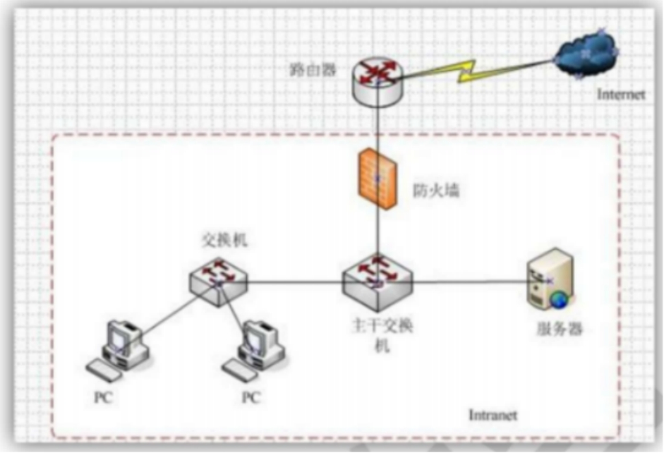

## 3种基本网络架构  重点


C/S   client server    客户端到服务器

B/S   browser  server  浏览器到服务器

P2P  point to point   点对点传输

### C/S（客户端/服务器）

| 序号 | 典型例子                            | 为什么属于 C/S（核心特征）                                   |
| :--- | :---------------------------------- | :----------------------------------------------------------- |
| 1    | **微信 / QQ**                       | 需要安装独立的桌面或手机App，聊天记录、朋友圈数据全部存储在腾讯云端服务器，App通过私有协议与服务器通信。 |
| 2    | **《英雄联盟》/《原神》**           | 游戏客户端负责渲染画面和接收你的操作指令，服务器负责计算伤害、同步所有玩家位置——**计算密集型任务交给服务器**。 |
| 3    | **银行柜台系统（柜员机/柜面软件）** | 柜员使用的客户端软件必须安装在银行内网电脑上，连接后台核心数据库服务器，**安全性要求极高，不允许浏览器访问**。 |

------

### B/S（浏览器/服务器）

| 序号 | 典型例子                                       | 为什么属于 B/S（核心特征）                                   |
| :--- | :--------------------------------------------- | :----------------------------------------------------------- |
| 1    | **百度 / Google 搜索**                         | 你无需安装任何软件，打开浏览器输入网址就能用，搜索算法在后台服务器执行，结果通过网页返回。 |
| 2    | **企业 OA 审批系统（如钉钉网页版、飞书文档）** | 员工出差在外，用任何一台电脑的浏览器登录公司门户就能提交报销单，**免安装、跨平台**是最大优势。 |
| 3    | **在线 PS（Photopea） / 腾讯文档**             | 以前必须装Photoshop或Office，现在浏览器里直接运行，**运算压力在云端服务器，浏览器只负责显示和交互**。 |

------

### P2P（对等网络）

| 序号 | 典型例子                                      | 为什么属于 P2P（核心特征）                                   |
| :--- | :-------------------------------------------- | :----------------------------------------------------------- |
| 1    | **迅雷 / BitTorrent（BT）下载**               | 下载一部电影时，你同时从几十上百个“别人”的电脑上获取不同的数据片段，同时你也把自己已下载的部分上传给别人——**每个节点既下载又上传**。 |
| 2    | **区块链（比特币 / 以太坊）**                 | 全球所有参与者的电脑共同维护同一本“公共账本”，没有中央服务器，每台电脑都是全量数据的副本，**靠共识算法（而非中心）达成一致**。 |
| 3    | **早期 QQ 的“点对点传文件” / 钉钉局域网传输** | 你和同事在同一个Wi-Fi下互传大文件时，数据**直接走你们两个设备之间的直连通道**，不经过腾讯或阿里的中转服务器（速度更快且节省公司带宽）。 |

------

### 异同

| 对比维度         | **C/S**                  | **B/S**                  | **P2P**                                   |
| :--------------- | :----------------------- | :----------------------- | :---------------------------------------- |
| **是否需要安装** | 需要（App/客户端）       | 不需要（浏览器即可）     | 通常需要（下载软件/插件）                 |
| **服务器压力**   | 大（所有请求都到服务器） | 大（所有请求都到服务器） | **小**（流量分散在各节点间）              |
| **中心节点**     | 有（服务器是绝对核心）   | 有（Web服务器是核心）    | **无**（逻辑上平等，但启动需Tracker辅助） |
| **典型传输方向** | 客户端 ↔ 服务器          | 浏览器 ↔ 服务器          | 节点 ↔ 节点（直连）                       |

------

### 一个“非标准但很实用”的补充

现在很多大型系统其实是**混合架构**：

- **B站 / 抖音**：你刷视频用的是 **B/S（网页版）** 或 **C/S（App版）**，但视频流本身的分发用了 **P2P 技术**（比如你看直播时，会从附近观看同一场直播的用户那里获取部分数据，以减轻服务器带宽压力）。

## Web工作原理

B/S架构基本工作原理

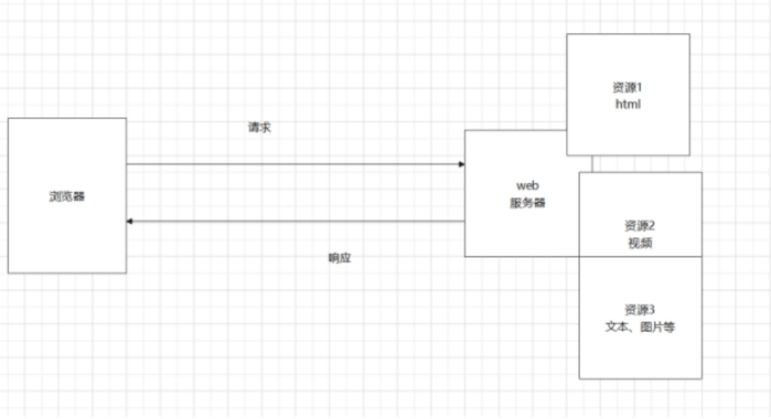

### Web 服务器（Web Server）

**定义**：
提供 Web 服务的软件/硬件，负责**监听并接收客户端请求**，根据请求返回对应的内容（HTML、图片、JSON数据等）。

**核心职责**：

- 接收 HTTP/HTTPS 请求
- 处理请求（直接返回静态资源，或转发给应用服务器）
- 返回响应给客户端

**常见例子**：

- Apache HTTP Server
- Nginx（目前最流行）
- Tomcat（本质是Servlet容器，也可作Web服务器）
- IIS（微软）

**通信协议与端口**：

- 协议：HTTP（超文本传输协议）/ HTTPS（加密版）
- 默认端口：80（HTTP）、443（HTTPS）

------

### Web 客户端（Web Client）

**定义**：
向 Web 服务器发送请求、获取资源并**解析/渲染**返回内容的软件，称为 Web 客户端。

**核心职责**：

- 构造并发送 HTTP 请求（URL、方法、请求头等）
- 接收服务器响应
- 解析并展示内容（HTML渲染、执行JS、加载CSS等）

**常见例子**：

- Google Chrome
- Microsoft Edge
- Mozilla Firefox
- Safari
- （补充）curl / Postman（开发调试工具，也是客户端的一种）

------

### Web 站点的完整组成

一个完整的 Web 站点通常由以下**四层**构成：

| 层级         | 组件                                     | 作用                      |
| :--------- | :------------------------------------- | :---------------------- |
| **① 客户端层** | 浏览器（Chrome/Edge/Firefox等）              | 发起请求，渲染页面，与用户交互         |
| **② 前端层**  | HTML + CSS + JavaScript                | 定义页面结构、样式、交互逻辑（在浏览器中运行） |
| **③ 服务端层** | Web服务器（如Nginx）+ 应用服务器（如Tomcat/Node.js） | 接收请求、处理业务逻辑、生成动态内容      |
| **④ 数据层**  | 数据库（如MySQL/Redis） + 文件存储               | 持久化存储用户数据、文章、图片等        |

**请求流转示意**：
`浏览器 → Web服务器（Nginx） → 应用服务器（处理逻辑） → 数据库（读写数据） → 逐级返回响应`

------

### 补充

- **动静分离**：静态资源（图片/CSS/JS）由 Web 服务器直接返回，动态请求（如 `/api/...`）转发给应用服务器处理。
- **反向代理**：Nginx 等 Web 服务器常用作“入口网关”，将请求分发给后端多台应用服务器（负载均衡）。
- **HTTPS 原理**：HTTP + SSL/TLS 加密，端口 443，保证数据传输的机密性和完整性。

## URL的核心组成（重点）

一个完整的URL格式如下：

```url
协议://主机:端口/文件路径?参数名1=值1&参数名2=值2...
```

| 组成部分               | 作用                                               | 重点 / 常见示例                                              |
| :--------------------- | :------------------------------------------------- | :----------------------------------------------------------- |
| **协议**               | 告诉浏览器用什么“语言”和服务器沟通。               | **http://**（明文）、**https://**（加密，更安全）<br>其他：ftp://、smtp:// 等 |
| **主机**               | 指定要访问的服务器地址。                           | **域名**：www.baidu.com<br>**IP地址**：172.30.212.105<br>**本地**：localhost 或 127.0.0.1（本机网卡地址） |
| **端口**               | 区分服务器上不同的服务程序（就像大楼的不同房门）。 | **范围**：0~65535<br>**默认端口（重点记忆）**：<br>- HTTP：**80**<br>- HTTPS：**443**<br>- MySQL：3306<br>- FTP：21<br>- SSH：22<br>**不输入端口时，浏览器自动使用默认端口（80或443）** |
| **路径**               | 指定服务器上的具体文件或目录位置。                 | `/` 表示网站根目录。<br>例如：`/a/b/test.jpg`<br>**不输入路径时，访问网站的默认首页**（如 index.HTML） |
| **参数（查询字符串）** | 向服务器传递额外的信息（如用户ID、搜索关键词）。   | 格式：`?参数名=值`<br>多个参数用 `&` 连接。<br>例如：`/goods.php?id=3` 表示请求商品详情页，并指定查看ID为3的商品。 |

---

### 补充重点：如何查看本机端口占用（Windows）

在命令提示符（cmd）中可以用以下命令查看端口情况：

- 查看所有端口占用：`netstat -oan`
- 查看特定端口（例如8080）：`netstat -oan | find "8080"`

---

### 举个综合例子

假设你要访问一个商品详情页：

```url
https://www.shop.com:443/products/detail?productId=1001&source=home
```

- **协议**：https（加密）
- **主机**：www.shop.com
- **端口**：443（https默认，可不写）
- **路径**：/products/detail（定位到商品详情页面）
- **参数**：productId=1001 和 source=home（告诉服务器你要看哪个商品，以及从哪里点进来的）

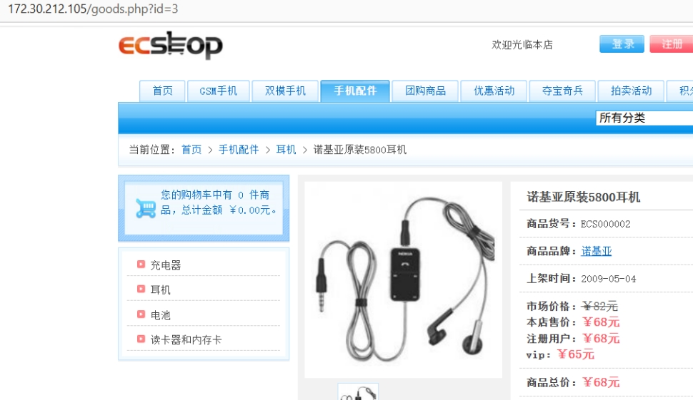

基于你之前的笔记和刚才提出的问题，我为你把 **Web协议（主要是HTTP/HTTPS）** 的核心知识点做了梳理和重点提炼。

---

## Web协议

- **定义**：是浏览器（客户端）与Web服务器之间进行**数据通信的规则和标准**。
- **作用**：规定了双方如何“打招呼”、如何“索要数据”、如何“回应数据”，以及数据以什么格式传输。

---

### 最核心的Web协议：HTTP 与 HTTPS

| 协议      | 全称                 | 核心特点                                                     | 默认端口 | 安全性               |
| :-------- | :------------------- | :----------------------------------------------------------- | :------- | :------------------- |
| **HTTP**  | 超文本传输协议       | 明文传输，速度快，但信息（如密码）可能被窃听或篡改。         | 80       | **不安全**           |
| **HTTPS** | 安全版超文本传输协议 | 在HTTP基础上增加了**SSL/TLS加密层**，数据加密传输，防窃听、防篡改、防冒充。 | 443      | **安全（强烈推荐）** |

现在绝大多数正规网站（如银行、电商、搜索引擎）都强制使用HTTPS，浏览器地址栏会显示🔒小锁标志。

**HTTP协议的工作模式（重点）**

1. **请求-响应模型**：
   - **浏览器**（客户端）先向服务器发起一个**HTTP请求**（Request）。
   - **服务器**收到请求后，处理并返回一个**HTTP响应**（Response）。
   - 这是一个**短连接**（一次请求对应一次响应，响应结束后连接通常就断开了）。

2. **无状态协议**：
   - 服务器默认不“记住”你是谁。每次请求都是独立的。
   - **解决办法**：通过Cookie、Session等技术来记录用户状态（比如保持登录状态）。

---

### HTTP请求的典型内容

一个HTTP请求包含三个主要部分（结合你之前学的URL）：

1. **请求行**：包含**方法**（GET/POST等）、**URL路径**（你笔记中的路径+参数）、**协议版本**（HTTP/1.1或HTTP/2）。
   - **GET**：从服务器**获取**数据（参数暴露在URL中，有长度限制，常用于搜索、查看详情）。
   - **POST**：向服务器**提交**数据（参数放在请求体中，更安全、无长度限制，常用于登录、注册、上传文件）。
2. **请求头**：包含浏览器信息（User-Agent）、接受的数据类型、Cookie等元数据。
3. **请求体**：POST/PUT等方法提交的数据（例如表单填写的内容）。

---

### “路径与参数”在HTTP中的体现

当你访问：

```url
https://www.shop.com/products/detail?productId=1001
```

浏览器会生成一个**HTTP GET请求**：

- **请求行**：`GET /products/detail?productId=1001 HTTP/1.1`
- **主机**：`www.shop.com`（写在请求头Host字段中）

---

### 常见状态码（HTTP响应中的重要部分）

服务器处理请求后，会在响应中返回一个三位数状态码，表示处理结果：

| 状态码范围 | 代表含义   | 常见例子                                                     |
| :--------- | :--------- | :----------------------------------------------------------- |
| **2xx**    | 成功       | **200 OK**（请求成功）                                       |
| **3xx**    | 重定向     | **301**（永久移动）、**302**（临时移动）                     |
| **4xx**    | 客户端错误 | **404 Not Found**（你笔记中提到的“资源未找到”）、**403**（禁止访问） |
| **5xx**    | 服务器错误 | **500 Internal Server Error**（服务器内部故障）、**502**（网关错误） |

**Web协议**（HTTP/HTTPS）就是浏览器和服务器之间沟通的**语言规范**，HTTPS是HTTP的**加密安全版**。其中，**GET用于拿数据，POST用于交数据**。

## OSI参考模型

### 概念

OSI模型（Open System Interconnection Reference Model），即开放式通信系统互联参考模型，是国际标准化组织（ISO，International Organization for Standards）提出的一个试图使各种计算机在世界范围内互连为网络的标准框架。

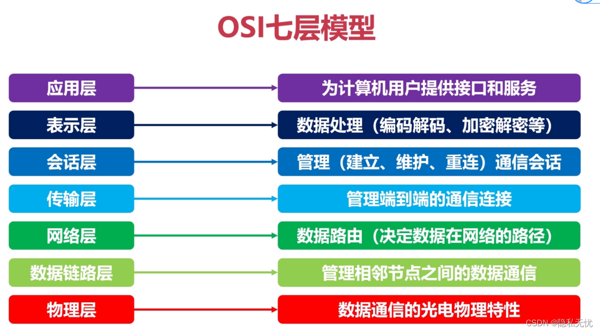

- 应用层（Application Layer）：发什么
- 表示层（Presentation Layer）：以什么样的格式发
- 会话层（Session Layer）：分几次发
- 传输层（Transport Layer）：是否可靠发送/是否有数据丢失
- 网络层（Network Layer）：怎么发到
- 数据链路层（Data Link Layer）：收到数据，分给哪些设备
- 物理层（Physical Layer）：数据传输至物理设备

**（1） 应用层**

针对特定应用协议，为应用程序或用户请求提供各种请求服务，**规定应用程序的相关通信细节**。

OSI参考模型最高层，也是最靠近用户的一层，为计算机用户、各种应用程序以及网络提供接口，也为用户直接提供各种网络服务。

**（2）表示层**

**数据编码、格式转换、数据加密。**

该层可提供一种标准表示形式，用于将计算机内部的多种数据格式转换成通信中采用的标准表示形式，确保一个系统的应用层发送的数据能被另一个系统的应用层识别。

数据压缩和加密也属于表示层可提供的转换功能。

**（3）会话层**

**通信管理**：负责建立、管理和终止表示层实体之间的通信会话，支持它们之间的数据交换。

该层的通信由不同设备中的应用程序之间的服务[[19-请求和响应]]组成。

**（4）传输层**

**管理两个节点之间的数据传输**：建立主机端到端的链接，为会话层和网络层提供端到端**可靠的**和**透明的**数据传输服务，确保数据能完整的传输到网络层。

**（5）网络层**

**地址管理及路由选择**：通过路由选择算法，为报文或通信子网选择最适当的路径。控制数据链路层与传输层之间的信息转发，建立、维持和终止网络的连接。数据链路层的数据在这一层被转换为数据包，然后通过路径选择、分段组合、顺序、进/出路由等控制，将信息从一个网络设备传送到另一个网络设备。

**（6）数据链路层**

**互联设备的数据帧传送和链路管理**：接收来自物理层的位流形式的数据，封装成帧，传送到网络层；将网络层的数据帧，拆装为位流形式的数据转发到物理层；负责建立和管理节点间的链路，通过各种控制协议，将有差错的物理信道变为无差错的、能可靠传输数据帧的数据链路。

**（7）物理层**

管理通信设备和网络媒体之间的互联互通。传输介质为数据链路层提供物理连接，实现比特流的透明传输。实现相邻计算机节点之间比特流的透明传送，屏蔽具体传输介质和物理设备的差异。

### 数据传输过程

网络中传输的数据包由两部分组成:

- 一部分是协议所要用到的首部
- 另一部分是上层传过来的数据

每个分层中，都会对所发送的数据附加一个首部，在这个首部中包含了该层必要的信息，如发送的目标地址以及协议相关信息，明确标明了协议应该如何读取数据。首部的结构由协议的具体规范详细定义。

在下一层的角度看，从上一分层收到的包全部都被认为是本层的数据。

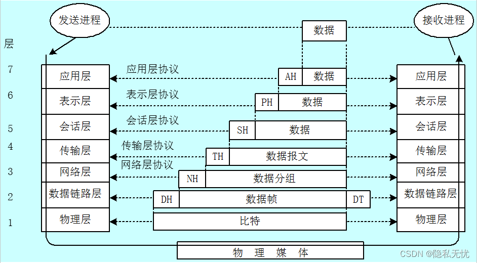

## TCP/IP

### 概念

**（1）应用层**

TCP/IP模型将OSI参考模型中的会话层和表示层的功能合并到应用层实现。

主要协议：HTTP（HyperText Transfer Protocol）、DNS（Domain Name System）、SMTP（Simple Mail Transfer Protocol）、FTP（File Transfer Protocol），TELNET、SNMP（Simple Network Management Protocol）

**（2）传输层**

在TCP/IP模型中，传输层的功能是使源端主机和目标端主机上的对等实体可以进行会话。

传输层定义了两种服务质量不同的协议。

- **TCP**（Transmission Control Protocol）：传输控制协议是一种**面向有连接的传输层协议**，能够正确处理在传输过程中丢包、传输顺序乱掉等异常情况，保证两端通信主机之间的通信可达
- **UDP**（User Datagram Protocol）：用户数据报协议是一种**面向无连接的传输层协议**，常用于分组数据较少或多播、广播通信以及视频通信等多媒体领域。

**（3）网络层**

网络层是整个TCP/IP协议栈的核心，它的功能是把分组发往目标网络或主机。

网络层定义了分组格式和协议，即**IP协议（Internet Protocol ）**。

**（4）数据链路层**

数据链路层控制网络层与物理层之间的通信，主要功能是保证物理线路上进行可靠的数据传递。

为了保证传输，从网络层接收到的数据被分割成特定的可被物理层传输的帧。帧是用来移动数据结构的结构包，不仅包含原始数据，还包含发送方和接收方的物理地址以及纠错和控制信息。其中的地址确定了帧将发送到何处，而纠错和控制信息则确保帧无差错到达。如果在传达数据时，接收点检测到所传数据中有差错，就要通知发送方重发这一帧。

**（5）物理层**

该层负责比特流在节点之间的传输，该层的协议既与链路有关，也与传输的介质有关，通俗来说就是把计算机连接起来的物理手段。

有时也将数据链路层与物理层合并称为**网络接口层（Network Access Layer）**。

### 数据传输过程

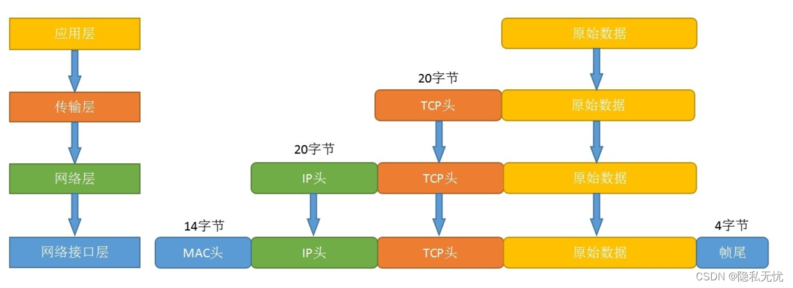

### 对应关系

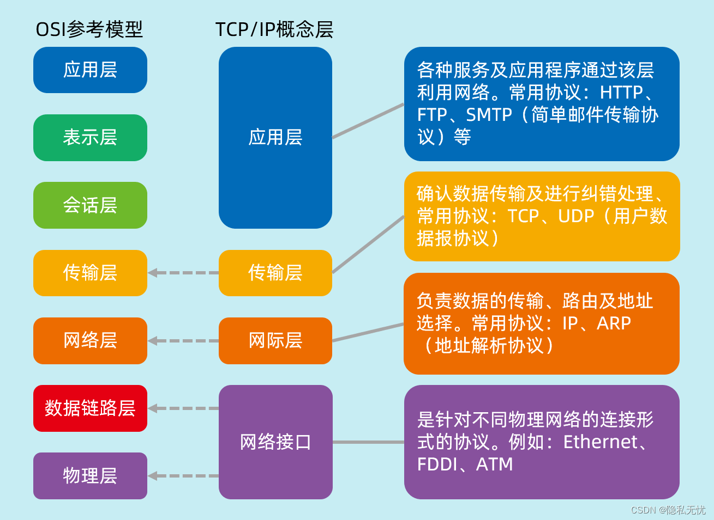

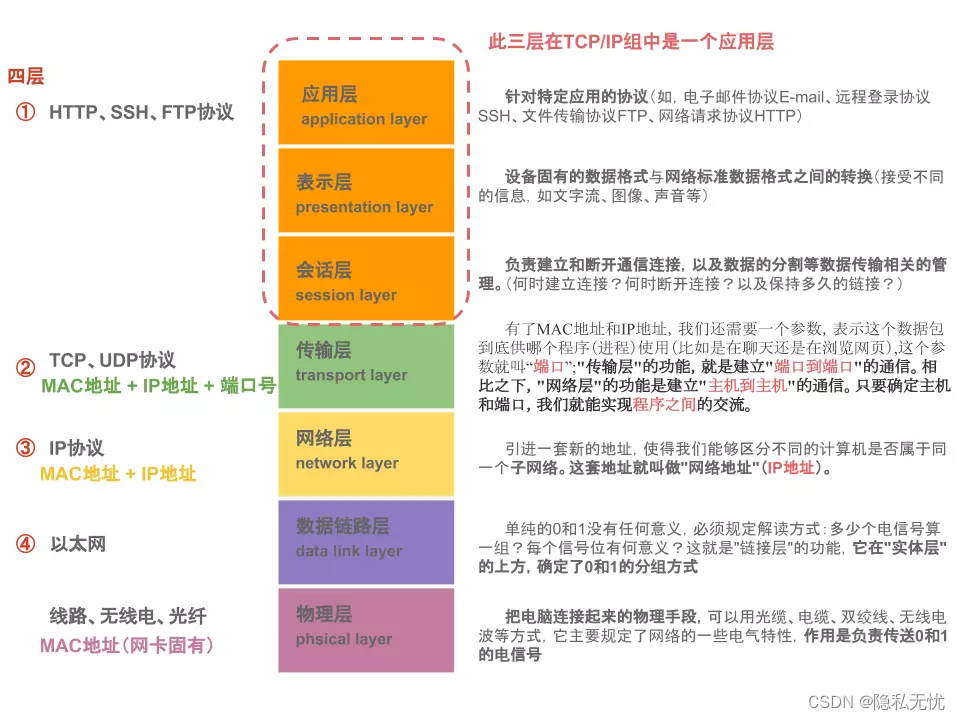

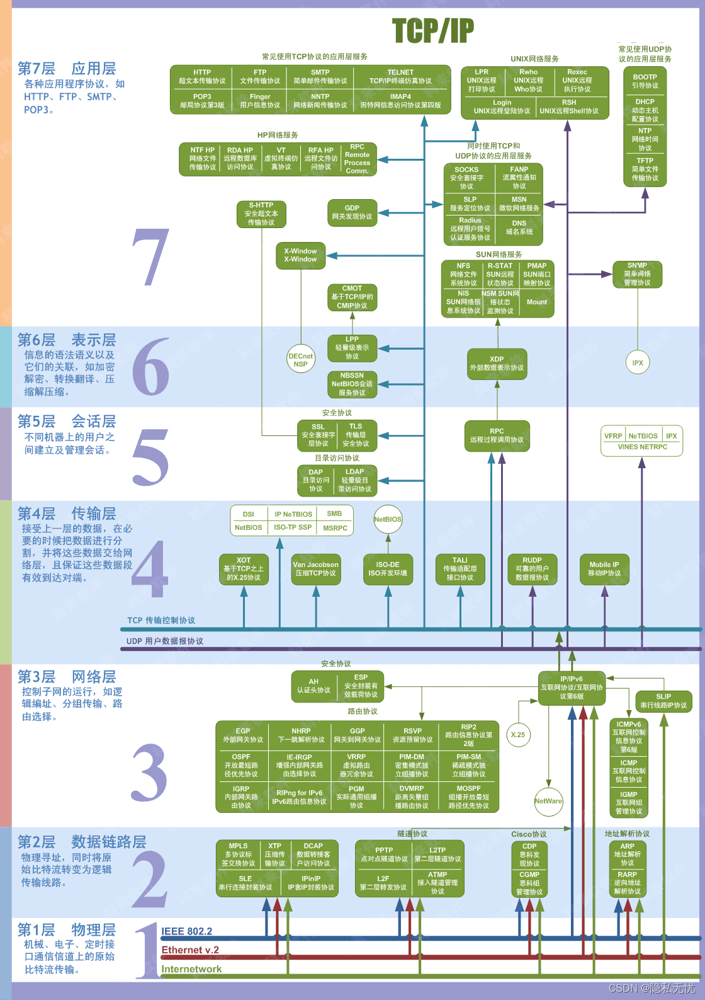

### 4.1 发送数据包

假设甲给乙发送电子邮件，内容为:“早上好”。而从TCP/IP通信上看，是从一台计算机A向另一台计算机B发送电子邮件。

**（1）应用层处理**

启动应用程序新建邮件，将收件人邮箱填好，再由键盘输入邮件内容“早上好”，点击“发送”按钮开始通信。

应用在发送邮件的那一刻建立TCP连接，从而利用这个TCP连接发送数据。它的过程首先是将应用的数据发送给下一层的TCP，再做实际的转发处理。

- 首先，应用程序中会进行编码处理，相当于OSI的**表示层**功能。
- 邮件编码后不一定会马上被发送出去，因为有些邮件的软件有一次同时发送多个邮件的功能，也可能会有用户点击“收信”按钮以后才一并接收新邮件的功能。这种何时建立通信连接何时发送数据的管理功能，从某种宽泛的意义上看属于OSI参考模型中**会话层**的功能。

**（2）传输层处理**

TCP 根据应用层要求，负责建立连接、发送数据以及断开连接。TCP 提供将应用层发来的数据顺利发送至对端的可靠传输。

TCP在应用层数据的前端附加一个TCP首部，发给网络层。

TCP 首部中包括：

- 源端口号和目标端口号（识别发送主机跟接收主机上的应用）
- 序号（用以发送的包中哪部分是数据）
- Check Sum（判断数据是否被损坏）

**（3）网络层处理**

网络层将传输层传过来的TCP首部和TCP数据合起来当做自己的数据，并在TCP首部的前端在加IP首部。

IP首部中包含

- 接收端IP地址以及发送端 IP地址
- 判断其后面数据是TCP还是UDP的信息

IP包生成后，参考路由控制表决定接受此IP包的路由或主机。随后，IP包将被发送给连接这些路由器或主机网络接口的驱动程序，以实现真正发送数据。

如果尚不知道接收端的MAC地址，可以利用ARP（Address Resolution Protocol）查找。只要知道了对端的MAC地址，就可以将MAC地址和IP地址交给以太网的驱动程序，实现数据传输。

**（4）数据链路层的处理**

数据链路层将IP包，附加以太网首部并进行发送处理。

以太网首部中包含

- 接收端MAC地址和发送端MAC地址
- 标志以太网类型的以太网数据的协议。

根据上述信息产生的以太网数据包将通过物理层传输给接收端。发送处理中的FCS（Frame Check Sequence）由硬件计算，添加到包的最后，FCS 的目的是为了判断数据包是否由于噪声而被破坏。

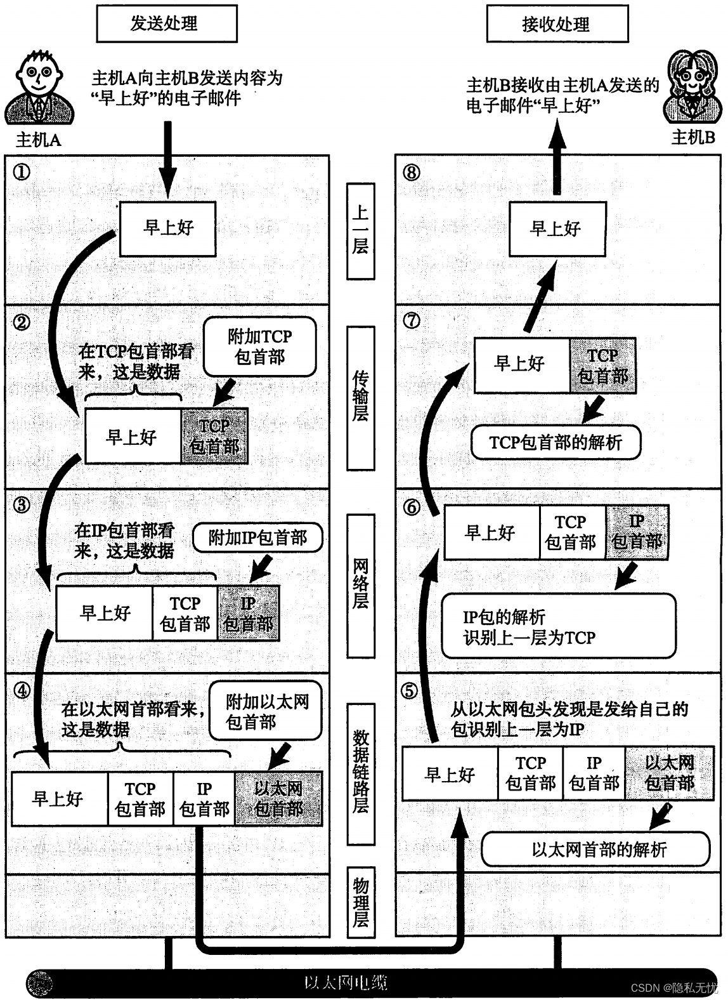

### 4.2 传输数据包

每个包首部中至少都会包含两个信息：

- 发送端和接收端地址
- 上一层的协议类型

每个包从前往后依此被附加了以太网包首部、IP包首部、TCP包首部（或UDP包首部)以及应用的包首部和数据，包的最后则追加了以太网包尾（Ethernet Trailer）。

此外，每个分层的包首部中还包含一个识别位，用来标识上一层协议的种类信息。例如以太网的包首部中的以太网类型，IP中的协议类型以及TCP/UDP中两个端口的端口号等都起着识别协议类型的作用。应用的首部信息中，有时也会包含一个用来识别其数据类型的标签。

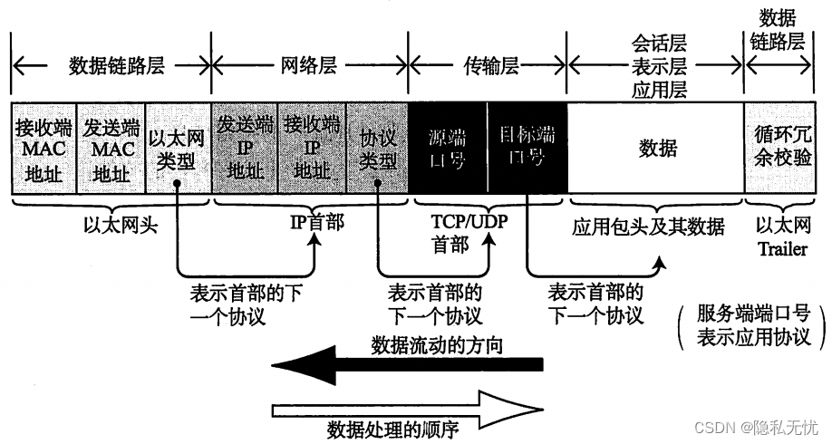

### 4.3 接收数据包

数据包的接收流程是发送流程的逆序过程。

**（1）数据链路层处理**

主机收到以太网包以后，首先从以太网的包首部找到MAC地址判断是否为发给自己的包。如果不是发给自己的包则丢弃；如果是，就查找以太网包首部中的类型域从而确定以太网协议所传送过来的数据类型。如该例中数据类型是IP包，因此再将数据传给处理IP的子程序，如果是其他诸如ARP的协议，就把数据传给ARP处理。

如果以太网包首部的类型域包含了一个无法识别的协议类型，则丢弃数据。

**（2）网络层处理**

IP 模块收到IP包首部及后面的数据部分以后，也做类似处理。如果判断得出包首部中的IP地址与自己的IP地址匹配，则接收数据并从中查找上一层的协议。如果上一层是TCP就将IP包首部之后的部分传给TCP处理；如果是UDP则将IP包首部后面的部分传给UDP处理。

对于有路由器的情况下，接收端地址往往不是自己的地址，此时，需要借助路由控制表，在调查应该送达的主机或路由器以后再转发数据。

**（3）传输层处理**

TCP模块首先会计算一下Check Sum，判断数据是否被破坏。然后检查是否在按照序号接收数据。最后检查端口号，确定具体的应用程序。

数据接收完毕后，接收端则发送一个“确认回执”给发送端。如果这个回执信息未能达到发送端，那么发送端会认为接收端没有接收到数据而一直反复发送。

数据被完整地接收以后，会传给由端口号识别的应用程序。

**（4）应用层处理**

接收端应用程序会直接接收发送端发送的数据。通过解析数据可以获知邮件的收件人地址是乙的地址。如果主机B上没有乙的邮件信箱，那么主机B返回给发送端一个“无此收件地址”的报错信息。

该例中，主机B上恰好有乙的收件箱，所以主机B和收件人乙能够收到电子邮件的正文。邮件会被保存到本机的硬盘上。如果保存也能正常进行，那么接收端会返回一个“处理正常”的回执给发送端。反之，一旦出现磁盘满、邮件未能成功保存等问题，就会发送一个“处理异常”的回执给发送端。

最终，用户乙利用主机B上的邮件客户端，接收并阅读由主机A上的用户甲所发送的电子邮件一“早上好”。

## UDP

- **全称**：User Datagram Protocol（用户数据报协议）
- **层级**：传输层（TCP/IP四层模型的第3层）
- **定位**：与TCP并列的传输层两大核心协议之一

> **UDP是一个面向非连接的、不可靠的、但传输速度快的传输层协议。**

### UDP的核心特点

| 特点                  | 说明                                                         |
| :-------------------- | :----------------------------------------------------------- |
| **1. 面向非连接**     | 发送数据前**不需要**建立连接（不需要三次握手），直接发就完了 |
| **2. 不可靠传输**     | 不保证数据一定能到达对方；不保证数据顺序；丢失了不重发       |
| **3. 无流量控制**     | 发送端想发多快就发多快，不管接收端能不能处理得过来           |
| **4. 无拥塞控制**     | 网络拥堵时不会主动降低发送速率                               |
| **5. 数据报边界保留** | 每次发送是一个完整的报文，接收端一次读取一个完整报文（不会像TCP那样拆分成流） |
| **6. 头部开销小**     | UDP头部只有**8个字节**，而TCP头部至少**20个字节**            |

### 理解

> **UDP就像寄明信片**：
>
> - 不用事先打招呼说"我要给你寄信了"
> - 写好了直接扔进邮筒
> - 寄出去了就不管了，不知道对方收没收到
> - 路上丢了就丢了，不会补寄
> - 明信片薄、轻便（开销小），寄得快

## Tcp和Udp的比较

### 相同点

| 相同点       | 说明                            |
| :-------- | :---------------------------- |
| 同属传输层     | 都是 TCP/IP 模型中的**传输层**协议       |
| 都基于 IP 协议 | 底层都是使用 **IP 协议**进行数据包路由       |
| 都使用端口号    | 都通过 **源端口 + 目标端口** 来区分不同的应用程序 |
| 都是端到端通信   | 都是在两个主机之间进行数据传输               |

------

### 不同点

| 对比维度      | **TCP**          | **UDP**            |
| :-------- | :--------------- | :----------------- |
| **连接方式**  | 面向连接（先握手）        | 无连接（直接发）           |
| **可靠性**   | 可靠（确认+重传）        | 不可靠（丢了不管）          |
| **传输速度**  | 慢                | 快                  |
| **头部大小**  | 20~60 字节         | 8 字节（开销小）          |
| **数据边界**  | 字节流（无边界）         | 数据报（有边界）           |
| **流量控制**  | 有                | 无                  |
| **拥塞控制**  | 有                | 无                  |
| **一对多通信** | 不支持（点对点）         | 支持广播/组播            |
| **适用场景**  | Web浏览、文件下载、邮件、支付 | 视频直播、在线游戏、DNS、语音通话 |

## 网络层：IP协议

- **全称**：Internet Protocol（网际协议）
- **层级**：网络层（TCP/IP四层模型的第2层 / OSI七层模型的第3层）
- **核心作用**：**寻址**和**路由**——给每台联网设备分配唯一标识（IP地址），并决定数据包从源到目标的传输路径。

> 💡 **通俗理解**：IP协议就像**邮政系统**，它给每户人家分配一个**门牌号（IP地址）**，邮递员（路由器）根据门牌号把包裹（数据包）送到目的地。

------

### IP协议的版本发展

| 版本     | 现状                       | 核心区别                                      |
| :------- | :------------------------- | :-------------------------------------------- |
| **IPv4** | 目前**主流使用**           | 地址长度32位，约42亿个地址，已不够用          |
| **IPv6** | 正在**逐步推广**（下一代） | 地址长度128位，几乎无限，解决IPv4地址枯竭问题 |

------

### IPv4 地址详解（重点）

#### 地址格式与长度

- **地址长度**：**32位**（[[bit]]）
- **表示方式**：**点分十进制**，分为4组，每组8位，用 `.` 分隔
- **每组取值范围**：**0 ~ 255**

#### 示例

```shell
172.30.212.105
```

- 二进制表示：`10101100.00011110.11010100.01101001`
- 每组 8 位（1字节），最大值为 `11111111`（二进制）= `FF`（十六进制）= `255`（十进制）

> 💡 **重点记忆**：IPv4地址 = 32位 = 4组 × 每组8位，每组的范围是 0~255

### 2. IPv4地址总数

- **总数量**：`256^4 = 2^32 ≈ 42.9亿`
- 但因历史分配原因，实际可用的**公网地址**远小于42亿

------

### IPv4 地址分类（重点）

IPv4地址分为 **A、B、C、D、E** 五类，根据**第一组数字**的范围来区分：

| 类别    | 地址范围（第一组）          | 网络规模 | 用途                 | 默认子网掩码  |
| :------ | :-------------------------- | :------- | :------------------- | :------------ |
| **A类** | 0.0.0.0 ~ 127.255.255.255   | 大型网络 | 国家级/超大型企业    | 255.0.0.0     |
| **B类** | 128.0.0.0 ~ 191.255.255.255 | 中型网络 | 普通企业/高校        | 255.255.0.0   |
| **C类** | 192.0.0.0 ~ 223.255.255.255 | 小型网络 | 小型企业/家庭网络    | 255.255.255.0 |
| **D类** | 224.0.0.0 ~ 239.255.255.255 | —        | **组播**（一对多）   | 无            |
| **E类** | 240.0.0.0 ~ 255.255.255.255 | —        | **保留**（实验用途） | 无            |

### 记忆技巧

> 看**第一组数字**：
>
> - **0~127** → A类
> - **128~191** → B类
> - **192~223** → C类
> - **224~239** → D类（组播）
> - **240~255** → E类（保留）

------

### 特殊IP地址（重点）

| IP地址              | 作用                                     | 说明                                                         |
| :------------------ | :--------------------------------------- | :----------------------------------------------------------- |
| **127.0.0.1**       | **本机回环地址**（你笔记中提到的"保留"） | 代表本机自身，用于本地测试，不对外通信                       |
| **0.0.0.0**         | 代表**所有网络**                         | 服务器监听时使用（如 `0.0.0.0:8080` 表示监听所有网卡的8080端口） |
| **255.255.255.255** | **有限广播地址**                         | 向本网络内所有设备广播                                       |
| **10.0.0.0/8**      | **私有地址**（A类）                      | 企业内部局域网使用，不可在公网路由                           |
| **172.16.0.0/12**   | **私有地址**（B类）                      | 企业内部局域网使用（你笔记中的172.30.x.x属于这一类）         |
| **192.168.0.0/16**  | **私有地址**（C类）                      | 家庭路由器默认网段（如192.168.1.1）                          |

------

### IPv6 地址（下一代协议）

#### 为什么需要IPv6？

- IPv4地址约**42亿个**，早已分配完毕（2011年正式耗尽）
- 物联网时代，每台设备（手机、电脑、灯泡、汽车）都需要IP地址

#### IPv6的核心特点

| 对比维度     | **IPv4**                     | **IPv6**                                            |
| :----------- | :--------------------------- | :-------------------------------------------------- |
| **地址长度** | 32位                         | **128位**                                           |
| **地址数量** | ~42亿                        | 约 2^128 ≈ **3.4×10^38**                            |
| **表示方式** | 点分十进制（如 192.168.1.1） | 冒号十六进制（如 `2001:0db8:85a3::8a2e:0370:7334`） |
| **安全性**   | 无原生加密                   | **原生支持IPsec**（加密认证）                       |
| **配置方式** | 手动/DHCP                    | **自动配置**（无状态地址自动配置）                  |

> 💡 **IPv6地址数量之夸张**：可以给地球上的**每一粒沙子**都分配一个IP地址，绰绰有余。

## 应用层：HTTP重点

### HTTP协议

- **全称**：HyperText Transfer Protocol（超文本传输协议）
- **层级**：**应用层**（OSI第7层 / TCP/IP第4层）
- **作用**：Web系统、移动互联网、API接口等，都基于HTTP进行通信
- **底层**：HTTP基于**TCP协议**（可靠传输）

### HTTP在OSI模型中的位置

```text
┌─────────────────────────────────────────┐
│              应用层 (7)                  │  ← HTTP/HTTPS 在这里
├─────────────────────────────────────────┤
│              表示层 (6)                  │
├─────────────────────────────────────────┤
│              会话层 (5)                  │
├─────────────────────────────────────────┤
│              传输层 (4)                  │  ← TCP/UDP 在这里
├─────────────────────────────────────────┤
│              网络层 (3)                  │  ← IP 在这里
├─────────────────────────────────────────┤
│             数据链路层 (2)               │
├─────────────────────────────────────────┤
│              物理层 (1)                  │
└─────────────────────────────────────────┘
```

> 💡 **HTTP基于TCP**：HTTP的底层使用TCP协议（端口80/443），保证数据可靠传输。

---

## HTTP协议版本发展（重点）

HTTP协议经历了多个版本的演进，核心变化如下：

| 版本         | 推出时间 | 核心特点                                                     |
| :----------- | :------- | :----------------------------------------------------------- |
| **HTTP 0.9** | 1991年   | 只有GET方法，只支持HTML，无状态，已淘汰                      |
| **HTTP 1.0** | 1996年   | 增加POST/HEAD方法，支持多媒体，但**短连接**（每次请求新建TCP连接） |
| **HTTP 1.1** | 1997年   | **默认长连接**（持久连接），支持管道化，目前**主流**         |
| **HTTP/2**   | 2015年   | 头部压缩、多路复用、服务器推送，性能大幅提升                 |
| **HTTP/3**   | 2022年   | 基于**UDP+QUIC**，连接更快，延迟更低                         |

---

### HTTP 1.0 vs HTTP 1.1（重点）

#### 核心差异表

| 对比维度          | **HTTP 1.0**                   | **HTTP 1.1**（及以后）         |
| :---------------- | :----------------------------- | :----------------------------- |
| **连接方式**      | **短连接**（默认）             | **长连接**（默认）             |
| **TCP连接复用**   | ❌ 每个请求建立一次连接         | ✅ 一次连接处理多个请求         |
| **请求/响应顺序** | 必须严格按顺序（队头阻塞）     | 支持管道化，多个请求可重叠执行 |
| **Host头**        | ❌ 不支持（一个IP只能一个网站） | ✅ 支持（一个IP可托管多个域名） |
| **缓存控制**      | 较弱（仅if-modified-since）    | 增强（Cache-Control、ETag等）  |
| **断点续传**      | ❌ 不支持                       | ✅ 支持（Range头）              |

---

#### 短连接（HTTP 1.0 及之前）

```text
请求1：建立TCP连接 → 发送请求 → 接收响应 → 关闭TCP连接
请求2：建立TCP连接 → 发送请求 → 接收响应 → 关闭TCP连接
请求3：建立TCP连接 → 发送请求 → 接收响应 → 关闭TCP连接
```

> ⚠️ **缺点**：每次请求都要重新建立TCP连接（三次握手+四次挥手），**开销大、速度慢**

---

#### 长连接（HTTP 1.1 及之后）

```text
建立TCP连接 → 请求1 → 响应1 → 请求2 → 响应2 → 请求3 → 响应3 → ... → 关闭TCP连接
```

> ✅ **优点**：一次TCP连接可以处理**多个请求/响应**，大大减少连接建立的开销

**相关头字段**：

- `Connection: keep-alive` → 表示使用长连接（HTTP 1.1默认）
- `Connection: close` → 表示请求完成后关闭连接

**你笔记中的图示含义**：

> "一次连接可以处理多个请求，多个请求可以重叠执行"

- 即**管道化（Pipelining）**：客户端可以在收到上一个响应之前，连续发送多个请求（减少了等待时间）
- 但在HTTP 1.1中管道化有"队头阻塞"问题，在**HTTP/2**中通过**多路复用**彻底解决

---

### HTTP 1.1 vs HTTP/2 vs HTTP/3（进阶对比）

| 特性             | HTTP 1.1                   | HTTP/2                           | HTTP/3                               |
| :--------------- | :------------------------- | :------------------------------- | :----------------------------------- |
| **底层协议**     | TCP                        | TCP                              | **UDP + QUIC**                       |
| **连接复用**     | 长连接（管道化有队头阻塞） | **多路复用**（彻底解决队头阻塞） | 多路复用                             |
| **头部压缩**     | ❌ 无（纯文本）             | ✅ **HPACK压缩**                  | ✅ **QPACK压缩**                      |
| **服务器推送**   | ❌ 无                       | ✅ 支持（服务器主动推送资源）     | ✅ 支持                               |
| **连接建立速度** | 慢（TCP握手）              | 慢（TCP握手+TLS握手）            | **快**（0-RTT或1-RTT）               |
| **应用场景**     | 传统网站、API              | 现代Web应用（如Facebook、淘宝）  | 未来趋势（Google、Cloudflare已支持） |

> 💡 **重点理解**：HTTP/3最大的变化是**底层不再用TCP，改用UDP**，在应用层（QUIC）实现了可靠性，从而解决了TCP的队头阻塞问题，连接建立更快。

---

### HTTP抓包/调试工具

| 工具                        | 类型         | 特点                                  |
| :-------------------------- | :----------- | :------------------------------------ |
| **浏览器开发者工具（F12）** | 内置工具     | 最常用，查看请求/响应头、参数、时间线 |
| **Fiddler**                 | 独立抓包软件 | Windows平台，代理方式抓包，可修改请求 |
| **Wireshark**               | 网络分析工具 | 最底层，可抓所有网络包（TCP/IP层）    |
| **HTTPWatch**               | 浏览器插件   | 老牌工具，集成于浏览器，查看HTTP细节  |

> ### 💡 **最常用推荐**：**浏览器F12**（日常开发）+ **[[Fiddler]]/Charles**（移动端调试）+ **[[Wireshark]]**（深度网络分析）

---

### 重点总结

#### HTTP版本演进一句话记忆

> **0.9生，1.0短，1.1长，2快，3更快**

| 知识点       | 核心内容                                                 |
| :----------- | :------------------------------------------------------- |
| **HTTP层级** | 应用层（OSI第7层）                                       |
| **HTTP基础** | 超文本传输协议，Web和移动互联网通信基础                  |
| **HTTP 1.0** | **短连接**，每个请求新建TCP连接，开销大                  |
| **HTTP 1.1** | **长连接**（默认），一次连接处理多个请求，**目前最主流** |
| **抓包工具** | F12、Fiddler、Wireshark、HTTPWatch                       |

## 工具

### Wireshark

### 浏览器开发者工具


### Fiddler

## 响应状态码分类表

| 分类      | 范围                  | 类别名称  | 含义                |
| :------ | :------------------ | :---- | :---------------- |
| **1xx** | 100–101             | 信息响应  | 请求已接收，继续处理        |
| **2xx** | 200–206             | 成功响应  | 请求成功，操作被接收和处理     |
| **3xx** | 300–308             | 重定向   | 需进一步操作以完成请求       |
| **4xx** | 400–418 421–431 451 | 客户端错误 | 请求有误，无法处理（责任在客户端） |
| **5xx** | 500–511             | 服务器错误 | 服务器处理请求失败（责任在服务端） |

------

### 1️⃣ 1xx（信息性状态码）

| 状态码 | 原因短语            | 含义                                     |
| :----- | :------------------ | :--------------------------------------- |
| 100    | Continue            | 初始部分已收到，客户端可继续发送剩余请求 |
| 101    | Switching Protocols | 服务器同意切换协议（如WebSocket升级）    |

------

### 2️⃣ 2xx（成功状态码）

| 状态码 | 原因短语               | 含义                                   |
| :----- | :--------------------- | :------------------------------------- |
| 200    | OK                     | 请求成功，返回期望的响应               |
| 201    | Created                | 请求成功且创建了新资源（通常POST/PUT） |
| 202    | Accepted               | 请求已接受但尚未处理完成（异步）       |
| 203    | Non-Authoritative Info | 响应来自代理缓存，非源服务器           |
| 204    | No Content             | 请求成功，但无响应体返回               |
| 205    | Reset Content          | 请求成功，要求客户端重置表单视图       |
| 206    | Partial Content        | 返回资源的部分内容（断点续传）         |

------

### 3️⃣ 3xx（重定向状态码）

| 状态码 | 原因短语           | 含义                                           |
| :----- | :----------------- | :--------------------------------------------- |
| 300    | Multiple Choices   | 资源有多种表示形式，客户端需选择               |
| 301    | Moved Permanently  | 资源永久移动到新URL（建议用GET）               |
| 302    | Found              | 资源临时移动到新URL（历史原因，实际用303/307） |
| 303    | See Other          | 重定向到另一个URL获取响应（POST转GET）         |
| 304    | Not Modified       | 资源未改变，使用缓存（条件请求）               |
| 307    | Temporary Redirect | 临时重定向，保持请求方法不变                   |
| 308    | Permanent Redirect | 永久重定向，保持请求方法不变                   |

------

### 4️⃣ 4xx（客户端错误状态码）

| 状态码 | 原因短语                        | 含义                               |
| :----- | :------------------------------ | :--------------------------------- |
| 400    | Bad Request                     | 请求语法错误或参数无效             |
| 401    | Unauthorized                    | 未认证，需提供有效凭证             |
| 402    | Payment Required                | 保留（未来用于数字支付）           |
| 403    | Forbidden                       | 认证通过但无权限访问               |
| 404    | Not Found                       | 请求的资源不存在                   |
| 405    | Method Not Allowed              | 请求方法不被允许                   |
| 406    | Not Acceptable                  | 服务器无法提供客户端接受的响应格式 |
| 407    | Proxy Auth Required             | 需通过代理认证                     |
| 408    | Request Timeout                 | 请求超时                           |
| 409    | Conflict                        | 请求与资源当前状态冲突             |
| 410    | Gone                            | 资源已被永久删除                   |
| 411    | Length Required                 | 缺少Content-Length头               |
| 412    | Precondition Failed             | 前置条件失败（如If-Match不匹配）   |
| 413    | Payload Too Large               | 请求体过大                         |
| 414    | URI Too Long                    | URL过长                            |
| 415    | Unsupported Media Type          | 不支持的媒体类型                   |
| 416    | Range Not Satisfiable           | 请求的范围无效                     |
| 417    | Expectation Failed              | Expect头期望无法满足               |
| 418    | I'm a teapot                    | 愚人节彩蛋（RFC 2324）             |
| 421    | Misdirected Request             | 请求被定向到无法生成响应的服务器   |
| 422    | Unprocessable Entity            | 语义错误，无法处理（WebDAV）       |
| 425    | Too Early                       | 请求可能重放，拒绝处理             |
| 426    | Upgrade Required                | 需升级协议                         |
| 429    | Too Many Requests               | 请求过于频繁，触发限流             |
| 431    | Request Header Fields Too Large | 请求头过大                         |
| 451    | Unavailable For Legal Reasons   | 因法律原因不可访问                 |

------

### 5️⃣ 5xx（服务器错误状态码）

| 状态码 | 原因短语                   | 含义                        |
| :----- | :------------------------- | :-------------------------- |
| 500    | Internal Server Error      | 服务器内部通用错误          |
| 501    | Not Implemented            | 服务器不支持请求的功能      |
| 502    | Bad Gateway                | 网关/代理从上游收到无效响应 |
| 503    | Service Unavailable        | 服务器过载或维护中          |
| 504    | Gateway Timeout            | 网关/代理等待上游超时       |
| 505    | HTTP Version Not Supported | 不支持的HTTP版本            |
| 507    | Insufficient Storage       | 存储空间不足（WebDAV）      |
| 508    | Loop Detected              | 检测到无限循环（WebDAV）    |
| 510    | Not Extended               | 需进一步扩展才能完成请求    |
| 511    | Network Auth Required      | 需网络认证（如Wi-Fi门户）   |