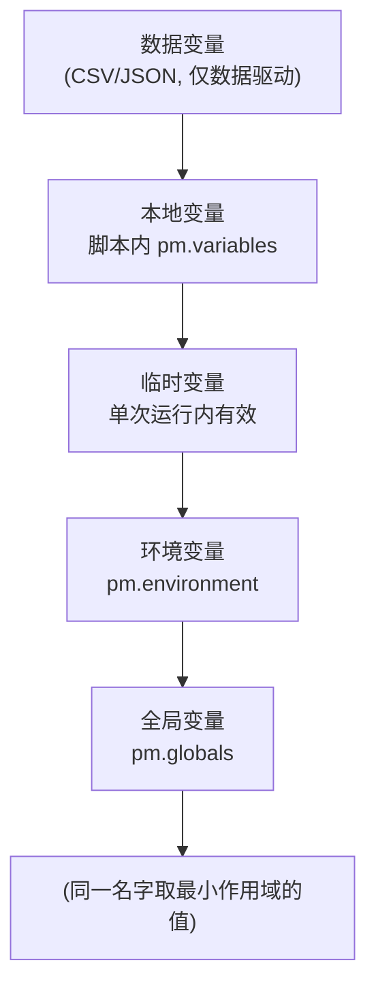

# Apifox 详细使用教程（从入门到 API 自动化）

> 适用对象：做 Web 应用测试、需要系统化掌握 **API 接口测试** 的测试工程师。
> 本文覆盖：安装 → 发请求 → 接口/接口用例管理 → 变量系统 → 前后置脚本断言 → **请求串联（用登录返回的 JWT 驱动后续接口）** → 数据驱动 → 命令行 apifox-cli + CI → Mock/文档/定时任务。
> 实战部分直接复用上一讲「RuoYi 3.9」的后台接口，前后两篇教程可无缝衔接。
> 姊妹篇：[[接口测试/Postman/Postman详细使用教程|Postman 详细教程]]（概念一一对应，可对照迁移；Apifox 脚本与 Postman 高度兼容，`pm` 对象几乎一致）。

---

## 目录

1. [Apifox 是什么 & 为什么 API 测试离不开它](#1-apifox-是什么)
2. [安装与界面概览](#2-安装与界面概览)
3. [发送第一个请求（GET / POST / PUT / DELETE）](#3-发送第一个请求)
4. [请求核心面板：Params / Auth / Headers / Body](#4-请求核心面板)
5. [接口（API）与接口用例、测试用例组织](#5-接口api与接口用例测试用例组织)
6. [变量系统：5 级作用域 + 动态变量（重点）](#6-变量系统)
7. [前置操作（Pre-processor）](#7-前置操作pre-processor)
8. [后置操作（Post-processor）：断言核心](#8-后置操作post-processor断言核心)
9. [请求串联（关联）：用上一个响应驱动下一个（RuoYi 登录拿 Token 实战）](#9-请求串联关联)
10. [测试场景与数据驱动（CSV / JSON）](#10-测试场景与数据驱动)
11. [命令行 apifox-cli + CI 集成](#11-命令行-apifox-cli--ci-集成)
12. [Mock（前后端并行开发）](#12-mock前后端并行开发)
13. [API 文档自动生成](#13-api-文档自动生成)
14. [定时任务（监控）](#14-定时任务监控)
15. [实战：用 Apifox 测 RuoYi 3.9 后台接口](#15-实战用-apifox-测-ruoyi-39-后台接口)
16. [最佳实践 & 常见坑](#16-最佳实践--常见坑)
17. [快捷键速查 & 附录](#17-快捷键速查--附录)

---

## 1. Apifox 是什么

Apifox 是一个 **API 设计 + 调试 + 测试 + Mock + 文档「一体化」平台**（常被称作「Postman + Swagger + Mock + JMeter 合体」）。对测试工程师来说，它主要解决三件事：

| 能力 | Apifox 中的对应 | 对应测试价值 |
|---|---|---|
| 发请求 | 「运行」标签图形化构造任意 HTTP 请求 | 替代 curl，调试接口快 |
| 写断言 | 后置操作：可视化断言 / JavaScript 脚本（基于 `pm` 对象） | 把「手动看响应」变成「自动判对错」 |
| 自动化 | 测试用例 + 测试场景（CLI 可跑） | 一键跑几百个接口，接入 CI |

> **和上一讲的关系**：pytest + Selenium 测的是「前端 UI 行为」；Apifox 测的是「后端接口契约」。两者互补 —— UI 层少而精（≤10%），接口层可以做得很厚（这正是测试金字塔的 20% 集成测试 + 大量 API 回归）。
> **和 Postman 的关系**：Apifox 自动化测试的脚本与 Postman 高度兼容——`pm.test` / `pm.expect` / `pm.response.json()` / `pm.environment.set` 写法基本一致，Postman 导出的 Collection 也能直接导入 Apifox，迁移成本极低。

---

## 2. 安装与界面概览

### 2.1 安装

- 桌面版（推荐）：<https://www.apifox.cn/download/> —— 选 Windows / macOS / Linux 安装包。
- 注册/登录账号（用于云端同步项目、团队共享、定时任务）。**纯本地使用也可跳过登录**（本地数据存本地）。
- 命令行工具 **apifox-cli**（后文 CI 用）：`npm install -g apifox-cli`

### 2.2 界面四大区

```json
┌──────────────┬────────────────────────────┬──────────────┐
│ 左侧 项目导航 │ 中间 接口编辑 / 运行 工作区  │ 右上 环境选择 │
│              │                            │              │
│● 项目         │  [Method] [URL         ]  │ 环境: dev ▾   │
│● 接口         │  修改│运行                 │  [发送]       │
│● 测试用例     │    ─────────────────────   │              │
│● 环境         │  响应: Status 200 · 23ms   │              │
│● Mock         │  Body / 断言 / 提取变量    │              │
└──────────────┴────────────────────────────┴──────────────┘
```

关键概念（与 Postman 的对应关系）：

- **项目（Project）**：隔离不同项目/团队的容器，约等于 Postman 的 Workspace。
- **接口（API）**：单个接口的定义（方法、路径、参数、响应示例），约等于 Postman 的 Request「定义侧」。
- **接口用例（Use Case）**：接口下保存的一个具体请求变体（不同参数/不同环境），约等于 Postman 里「保存的 Request」。
- **测试用例（Test Case）/ 测试场景（Scenario）**：一组接口用例的容器，约等于 Postman 的 Collection；可批量跑、数据驱动、接 CI。
- **环境（Environment）**：一组键值对（如 `base_url=http://localhost:81`），切换环境即可换测试地址。

---

## 3. 发送第一个请求

1. 在左侧项目里选一个接口，或点 **+ 新建接口**。
2. 方法下拉选 `GET`，URL（或路径）填 `https://jsonplaceholder.typicode.com/users/1`。
3. 切到 **运行** 标签，点 **发送**。
4. 右侧响应区看到：
   - **状态码**：`200 OK`
   - **响应体**：JSON 数据
   - **响应头 / 断言结果 / 提取变量**：不同标签页

**各方法速记**：

| 方法 | 语义 | 典型 Body |
|---|---|---|
| GET | 查 | 无 Body，参数走 Query（`?id=1`） |
| POST | 增 | JSON / form-data |
| PUT | 改（全量） | JSON |
| PATCH | 改（局部） | JSON |
| DELETE | 删 | 通常无 Body |

---

## 4. 请求核心面板

Apifox 把「接口定义」和「运行调试」分成两个标签：**修改**（定义接口，即文档）与 **运行**（发请求看响应）。常用请求配置项在两处都能填，运行时会用「运行」标签的值覆盖「修改」里的值。

### 4.1 Params（查询参数）

key-value 形式，自动拼到 URL 后：`?pageNum=1&pageSize=10`。Apifox 会高亮拼好的完整 URL。

### 4.2 Auth（鉴权）

Apifox 内置多种鉴权，**不用手动拼 Header**：

- **Bearer Token**：填 `{{token}}`（最常用，JWT 场景）。
- **Basic Auth**：填 username / password，自动生成 `Authorization: Basic base64(...)`。
- **API Key**：指定 key 名 + value，加到 Header 或 Query。
- **OAuth 2.0**：配置授权流拿 token。

> RuoYi 用 **Bearer Token**（JWT），所以给每个需登录的接口选 `Bearer Token` 并填 `{{token}}` 即可。

### 4.3 Headers

常用：`Content-Type: application/json`、`Accept: application/json`。Apifox 发 JSON Body 时会**自动加** `Content-Type`，一般不用手填。

### 4.4 Body（请求体）

| 类型 | 用途 |
|---|---|
| `none` | 无体 |
| `form-data` | 表单 + 文件上传（RuoYi 文件上传用这个） |
| `x-www-form-urlencoded` | 传统表单（key=value&...） |
| `raw` → 选 `JSON` | **最常用**，直接写 `{"username":"admin"}` |
| `binary` | 传单个文件 |

**raw JSON 示例**：

```json
{
  "username": "admin",
  "password": "admin123",
  "code": "",
  "uuid": ""
}
```

---

## 5. 接口（API）与接口用例、测试用例组织

Apifox 和 Postman 一个关键差异：**接口定义 与 接口用例 分离**。一个「接口」可以挂多个「接口用例」（同一接口的不同请求形态），自动化时引用的是「接口用例」。

把零散请求收进测试用例，才能批量跑、做数据驱动、接 CI。

1. 在项目的 **测试用例** 页，点 **+ 新建测试用例**，命名如 `RuoYi-3.9-API`。
2. 在测试用例里 **+ 新建测试场景**（Folder 分层），再把接口用例拖进去。
3. 测试场景内可再分层：

   ```json
   RuoYi-3.9-API/
   ├── 01-认证/
   │   ├── 登录获取Token
   │   └── 获取用户信息
   ├── 02-系统管理/
   │   ├── 用户列表
   │   ├── 新增用户
   │   └── 删除用户
   └── 03-监控/
       └── 在线用户
   ```

4. **公共脚本  /  用例级前后置**：在测试用例或测试场景上可配置「前置操作 / 后置操作」——这里的脚本会**对包含的每个接口前后都执行**（适合放统一鉴权、统一断言、统一失败日志）。也可在 **项目设置 → 公共脚本** 里放全局复用的前后置逻辑。

> 工程化建议：测试场景按「模块」分文件夹；公共前置（如「先登录拿 token」）放在测试用例级前置操作，子接口用例直接复用 `{{token}}`。

---

## 6. 变量系统

Apifox 的变量是「一改全生效」的核心，也是请求串联的基础。

### 6.1 五级作用域（从小到大）



**优先级（同名时谁生效）**：`本地变量` > `数据变量` > `临时变量` > `环境变量` > `全局变量`。

| 作用域 | 创建位置 | 适用 |
|---|---|---|
| 全局变量 | 项目 → 变量 → 全局 | 跨环境通用（如公司域名） |
| 环境变量 | 项目 → 环境 → 新建环境 | **最常用**：dev/test/prod 切换 |
| 临时变量 | 脚本里 `pm.variables.set`（或提取时选「临时」） | 单次运行内传递，运行结束清空 |
| 本地变量 | 脚本里 `pm.variables.set` | 单请求内临时变量 |
| 数据变量 | 测试场景数据驱动导入的 CSV/JSON | 数据驱动参数 |

### 6.2 使用变量

- 在 URL / Params / Body / Header **任意位置**用 `{{变量名}}` 引用，例如 `{{base_url}}/login`。
- 脚本里读写（与 Postman 一致）：

  ```javascript
  pm.environment.set("token", "abc");   // 写环境变量
  let t = pm.environment.get("token");     // 读
  pm.globals.set("host", "localhost");
  ```

### 6.3 动态变量（内置随机数）

Apifox 提供一大批 `{{$xxx}}` 动态值，每次发送自动生成（与 Postman 语法一致）：

| 写法                       | 生成内容        |
| ------------------------ | ----------- |
| `{{$guid}}`              | UUID        |
| `{{$timestamp}}`         | 当前 Unix 时间戳 |
| `{{$randomFullName}}`    | 随机姓名        |
| `{{$randomEmail}}`       | 随机邮箱        |
| `{{$randomPhoneNumber}}` | 随机手机号       |
| `{{$randomUserName}}`    | 随机用户名       |

> 造测试数据时极好用：`"userName": "auto_{{$guid}}"` 保证每次唯一、不冲突。

---

## 7. 前置操作（Pre-processor）

在发送请求**之前**执行，常用于：造随机数据、算签名、设置时间戳、从其它来源取 token。

```javascript
// 例1：生成随机手机号，写入环境变量
let phone = "138" + Math.floor(Math.random() * 1e8).toString().padStart(8, "0");
pm.environment.set("randomPhone", phone);

// 例2：动态时间戳
pm.environment.set("ts", new Date().getTime());

// 例3：计算简单签名（示例）
let sign = CryptoJS.MD5(pm.environment.get("ts") + "secret").toString();
pm.environment.set("sign", sign);
```

> Apifox 脚本沙箱内置 `CryptoJS`，常用 MD5/SHA 等哈希直接可用。

---

## 8. 后置操作（Post-processor）：断言核心

请求拿到响应**之后**执行。Apifox 提供**两种方式**写断言：

**方式 A：可视化断言（不用写代码）**
后置操作 → 添加断言 → 选来源（状态码 / 响应头 / 响应体 JSON）→ 选操作符（等于 / 包含 / 大于…）→ 填期望值。适合大多数常规校验。

**方式 B：脚本断言（灵活、可提取变量）**
和 Postman 一样用 `pm` 对象，结果在 **断言结果** 标签查看。

### 8.1 基本结构

```javascript
pm.test("测试名称", function () {
    // 断言
});
```

### 8.2 常用断言模板（直接抄）

```javascript
// 1) 状态码
pm.test("状态码为 200", function () {
    pm.response.to.have.status(200);
});

// 2) JSON 字段（RuoYi 返回 {code,msg,data}）
pm.test("业务 code 为 200", function () {
    let json = pm.response.json();
    pm.expect(json.code).to.eql(200);
});

// 3) 响应时间（性能基线）
pm.test("响应时间 < 500ms", function () {
    pm.expect(pm.response.responseTime).to.be.below(500);
});

// 4) Header 存在且包含某值
pm.test("返回 JSON", function () {
    pm.response.to.have.header("Content-Type");
    pm.expect(pm.response.headers.get("Content-Type")).to.include("application/json");
});

// 5) 字符串/正则包含
pm.test("msg 提示成功", function () {
    let json = pm.response.json();
    pm.expect(json.msg).to.include("成功");
});

// 6) 数组长度
pm.test("用户列表非空", function () {
    let json = pm.response.json();
    pm.expect(json.data.rows).to.be.an("array").and.have.length.of.at.least(1);
});

// 7) 提取变量给后续请求用（见第 9 节）
let json = pm.response.json();
pm.environment.set("token", json.token);
```

> 断言库是 **Chai**（BDD 风格）：`to.eql / to.include / to.be.a / to.have / to.be.below / to.exist` 等。Apifox 还提供快捷方式 `pm.response.to.have.status()`。

### 8.3 测试用例级统一断言

在 **测试用例 / 测试场景的后置操作** 写，对所有接口用例生效，适合做「契约守门员」：

```javascript
// 任何响应都应是 JSON，且状态码 2xx/3xx
pm.test("响应为 JSON", function () {
    pm.response.to.be.json;
});
pm.test("状态码正常", function () {
    pm.expect(pm.response.code).to.be.oneOf([200, 201, 204, 301, 302]);
});
```

---

## 9. 请求串联（关联）

真实接口很少孤立：**登录 → 拿 token → 后续所有请求带 token**。Apifox 用「后置操作提取 → 环境变量 → 下个请求引用」实现。

### 9.1 第一步：登录接口，后置操作提取 token

接口 `POST {{base_url}}/login`，Body（raw JSON）：

```json
{ "username": "admin", "password": "admin123", "code": "", "uuid": "" }
```

**方式 A：可视化提取** —— 后置操作 → 提取变量 → 来源选「响应体 JSON」，JSONPath 填 `token`，变量名 `token`，作用域选「环境变量」。

**方式 B：脚本提取**：

```javascript
pm.test("登录成功", function () {
    let json = pm.response.json();
    pm.expect(json.code).to.eql(200);
    pm.environment.set("token", json.token);   // ← 关键：存进环境变量
});
```

### 9.2 第二步：后续请求引用 `{{token}}`

接口 `GET {{base_url}}/system/user/list`，Auth 选 **Bearer Token**，填 `{{token}}`。发送后 Header 自动带上 `Authorization: Bearer <token>`。

> 这就是接口自动化的「登录态保持」——和上一讲 pytest+Selenium 用 session 级 fixture 登录一次是同一个思路，只是实现在 API 层，更快更稳。

### 9.3 串联多个字段（提取 data 里的值）

```javascript
let json = pm.response.json();
pm.environment.set("userId", json.data.userId);
pm.environment.set("deptId", json.data.deptId);
```

后续新增用户的请求 Body 直接写 `{{deptId}}`。

---

## 10. 测试场景与数据驱动

把测试用例当「测试套件」批量跑，并用外部数据文件驱动多组用例。

### 10.1 运行测试场景

1. 在测试用例里选测试场景，点 **运行**（或进入测试场景点运行）。
2. 配置里选环境、设「循环次数（Iterations）」、勾选要跑的场景/接口用例。
3. 点 **运行**，看每个接口用例的 Pass/Fail、耗时、断言数。

### 10.2 数据驱动（CSV / JSON）

1. 准备 `users.csv`：

   ```csv
   username,password,expect_code
   admin,admin123,200
   admin,wrong_pwd,500
   baduser,admin123,500
   ```

2. 在登录接口用例的后置操作里写**参数化断言**：

   ```javascript
   let json = pm.response.json();
   pm.test("符合预期结果", function () {
       pm.expect(json.code).to.eql(Number(pm.iterationData.get("expect_code")));
   });
   ```

3. 运行测试场景时，在「数据驱动」里 **上传 `users.csv`** 并绑定列，Apifox 会按行迭代，每行注入 `{{username}}` `{{password}}` `{{expect_code}}`。

> 也可以用 JSON 数据文件，结构为数组：`[{"username":"admin",...}, ...]`。

---

## 11. 命令行 apifox-cli + CI 集成

Apifox 界面跑适合调试；**进 CI 必须用 apifox-cli**（Node 写的命令行 runner）。

### 11.1 安装与基本运行

```bash
npm install -g apifox-cli

# 通过 项目 ID + 访问令牌 运行云端测试场景（推荐 CI 用法）
apifox run \
  --access-token "$APIFOX_ACCESS_TOKEN" \
  --project-id "$APIFOX_PROJECT_ID" \
  --env "dev" \
  --name "RuoYi-3.9-API"
```

- **access-token**：在项目设置（或个人设置 → API 访问令牌）生成，建议用环境变量注入，别写死在脚本里。
- **project-id**：项目 URL 里带的那串 ID。
- **env**：指定运行环境名（对应 Apifox 里的环境）。

### 11.2 生成报告

```bash
# 生成 HTML 报告
apifox run \
  --access-token "$APIFOX_ACCESS_TOKEN" \
  --project-id "$APIFOX_PROJECT_ID" \
  --env "dev" --name "RuoYi-3.9-API" \
  --report-html ./reports/api-report.html
```

### 11.3 接 GitHub Actions

```yaml
# .github/workflows/api-tests.yml
name: api-tests
on: [push, pull_request]
jobs:
  api:
    runs-on: ubuntu-latest
    steps:
      - uses: actions/checkout@v4
      - uses: actions/setup-node@v4
        with: { node-version: "20" }
      - run: npm install -g apifox-cli
      - run: |
          apifox run \
            --access-token "$APIFOX_ACCESS_TOKEN" \
            --project-id "$APIFOX_PROJECT_ID" \
            --env "dev" --name "RuoYi-3.9-API" \
            --report-html ./reports/api-report.html
        env:
          APIFOX_ACCESS_TOKEN: ${{ secrets.APIFOX_ACCESS_TOKEN }}
          APIFOX_PROJECT_ID: ${{ secrets.APIFOX_PROJECT_ID }}
      - uses: actions/upload-artifact@v4
        if: always()
        with:
          name: api-report
          path: reports
```

> **测试金字塔视角**：apifox-cli 跑的接口回归属于「集成测试层」，建议每次 PR 都跑；UI（Selenium）只跑核心链路、且可放到 nightly。两者报告都归档，团队才「敢发布」。

---

## 12. Mock（前后端并行开发）

后端还没好的场景下，用 Apifox 内置 Mock 返回假数据，让前端先并行开发。

1. 每个接口在「修改」标签里配置 **Mock 期望**（或开启「智能 Mock」）。
2. 智能 Mock 会根据**字段名/类型自动生成**合理假数据（中文姓名、手机号、邮箱等都能识别），几乎零配置。
3. Apifox 给项目一个统一 Mock 地址（`https://mock.apifox.com/...` 或本地 Mock 端口），前端直接调它。
4. 断言/变量同样可用，前端联调时就能验证自己的请求构造是否正确。

> 相比 Postman 要单独建 Mock Server，Apifox 的 Mock 与接口定义同源，改了接口 Mock 自动跟着变，不会「Mock 和真接口脱节」。

---

## 13. API 文档自动生成

Apifox 「接口即文档」——你在「修改」标签填的字段、参数、响应示例，自动渲染成在线文档：

1. 在项目里点 **分享 / 发布文档**，生成在线文档链接。
2. 可设密码 / 公开 / 有效期。
3. 每个接口的 Description、参数、Header、响应示例都会渲染成文档；也可导出为 OpenAPI (Swagger) 规范。

> 比手写 Swagger 更省事的地方：文档和「可执行用例」是同一份接口定义，改了用例文档自动更新，不会「文档和代码脱节」。

---

## 14. 定时任务（监控）

把测试场景定时在云端/本地跑，监控线上接口健康度：

1. 在测试用例 / 测试场景上配置 **定时任务**（cron 频率：每 5 分钟 / 每小时 / 每天）。
2. 绑定环境，设置失败时的**消息通知**：钉钉 / 飞书 / 企业微信 / 自定义 Webhook / 邮件。
3. 适合「核心交易/鉴权接口」的线上冒烟。

> 这对应 Postman 的 Monitor，但 Apifox 把通知直接接到了国内协作工具（钉钉/飞书/企微），更贴合国内团队。

---

## 15. 实战：用 Apifox 测 RuoYi 3.9 后台接口

把前面所有知识点串起来，直接测上一讲那套 RuoYi‑Vue 3.9。

> 前置：RuoYi 测试环境已 `captchaEnabled:false`（关验证码）、Redis 在跑、前端地址 `http://localhost:81`，后端 `:8080`。下面 `{{base_url}}` 指向后端 API（如 `http://localhost:8080`）。

### 15.1 建环境 `ruoyi-dev`

| 变量 | 值 |
|---|---|
| `base_url` | `http://localhost:8080` |
| `token` | （留空，登录后自动填） |

### 15.2 接口 1：登录拿 Token

- Method：`POST` ｜ URL：`{{base_url}}/login`
- Body（raw JSON）：

  ```json
  { "username": "admin", "password": "admin123", "code": "", "uuid": "" }
  ```

- 后置操作（脚本）：

  ```javascript
  pm.test("登录成功 code=200", function () {
      let json = pm.response.json();
      pm.expect(json.code).to.eql(200);
      pm.environment.set("token", json.token);
  });
  ```

### 15.3 接口 2：带 Token 查用户列表

- Method：`GET` ｜ URL：`{{base_url}}/system/user/list?pageNum=1&pageSize=10`
- Auth：**Bearer Token** → `{{token}}`
- 后置操作：

  ```javascript
  pm.test("返回 200 且列表非空", function () {
      let json = pm.response.json();
      pm.expect(json.code).to.eql(200);
      pm.expect(json.data.rows).to.be.an("array").and.have.length.of.at.least(1);
      // 提取第一个用户 id，供删除用例用
      pm.environment.set("firstUserId", json.data.rows[0].userId);
  });
  ```

### 15.4 接口 3：新增用户（数据驱动示例）

- Method：`POST` ｜ URL：`{{base_url}}/system/user`
- Auth：Bearer `{{token}}`
- Body（raw JSON，用动态变量保证唯一）：

  ```json
  {
    "userName": "auto_{{$guid}}",
    "nickName": "AutoTest",
    "password": "123456",
    "deptId": 100,
    "roleIds": [2]
  }
  ```

- 后置操作：

  ```javascript
  pm.test("新增成功", function () {
      let json = pm.response.json();
      pm.expect(json.code).to.eql(200);
  });
  ```

### 15.5 接口 4：删除用户

- Method：`DELETE` ｜ URL：`{{base_url}}/system/user/{{firstUserId}}`
- Auth：Bearer `{{token}}`
- 后置操作：断言 `code=200`。

### 15.6 用测试场景跑整套

把这 4 个接口用例按「登录 → 列表（顺便取 id）→ 新增 → 删除」顺序放进测试场景 `RuoYi-3.9-API`，运行选 `ruoyi-dev` 环境 → 运行。
顺序很重要：这正是「请求串联」的端到端接口回归。

---

## 16. 最佳实践 & 常见坑

| 主题 | 建议 |
|---|---|
| **接口定义与运行分离** | 「修改」标签写稳定的接口契约文档，「运行」标签填临时调试值；别把一次性调试参数污染了接口定义 |
| **变量命名** | 环境里用清楚的前缀：`dev_base_url` / `prod_base_url`，切换环境不打架 |
| **敏感信息** | 密码/token 别写死、别提交进 Git；用环境变量 + access-token 走 CI 密钥注入 |
| **断言要具体** | 别只断言状态码，至少加一条业务字段断言（`code`、`data` 结构）；常用校验尽量用可视化断言，可读性好 |
| **请求串联** | token 过期就加测试用例级前置操作「先登录刷新 token」；或每个用例自带登录步骤（更独立但更慢） |
| **公共脚本复用** | 把登录、统一断言抽到「项目设置 → 公共脚本」或测试用例级前后置，避免每个接口重复写 |
| **数据清理** | 测试造的数据（如 `auto_` 前缀用户）要在测试场景里用「删除接口用例」或后置 `pm.sendRequest` 自动清掉 |
| **flaky 接口** | 网络/异步任务导致的偶发失败，用前置/后置加重试逻辑，或开启测试场景的「失败重试」 |
| **时间断言** | 性能基线（`<500ms`）只在稳定内网环境开，外网/CI 放宽以免误报 |
| **接口即文档** | 每个接口填 Description、响应示例，团队直接看分享文档，省一份维护 |

**常见报错速排**：

- `连接失败 / ECONNREFUSED` → 后端没起 / 地址写错 / 环境 `base_url` 不对。
- `401 Unauthorized` → `{{token}}` 为空或过期，先单独跑登录接口用例。
- `Content-Type 缺失导致 400` → Body 用 raw 时确认选了 `JSON` 类型。
- `CSRF token 缺失`（某些非分离版 RuoYi）→ 分离版用 JWT 一般无此问题；若遇，从登录响应/页面里提取 `_csrf` 加到 Header。

> 🎩 **六顶思考帽速览：Postman 还是 Apifox？**
> 🤍 **事实**：两者脚本（`pm` API）高度兼容，Postman 集合可导入 Apifox。
> ❤️ **直觉**：国内团队用 Apifox 协作更顺（中文、钉钉/飞书通知、智能 Mock）。
> 🖤 **风险**：Apifox 重度依赖其云端账号体系，纯离线/强合规场景需评估；Postman 生态与插件更国际化。
> 💛 **优势**：Apifox 一体化（文档+Mock+测试同源），少切工具；Postman 生态成熟、Newman 资料多。
> 💚 **创意**：小团队可从 Apifox 起步；跨国/开源项目用 Postman 更通用；两者脚本互通，随时可迁。
> 🔵 **行动**：已有 Postman 体系就接着用、把本文当迁移对照；新项目想「一个工具搞定设计到测试」优先 Apifox。

---

## 17. 快捷键速查 & 附录

| 快捷键 | 作用 |
|---|---|
| `Ctrl+N` | 新建接口 |
| `Ctrl+Enter` | 发送请求（运行） |
| `Ctrl+Shift+Enter` | 保存并发送 |
| `Ctrl+S` | 保存接口 / 用例 |
| `Ctrl+K` | 全局搜索 |
| `Ctrl+Shift+C` | 复制为 cURL / 代码 |

> 快捷键可在 **设置 → 快捷键** 查看与自定义（不同版本略有差异）。

### 附：学习路线建议

```json
第 1 步：装好 Apifox，徒手写 5 个 CRUD 接口，会看响应        ✅
第 2 步：用变量 + 环境，实现「一改地址全项目生效」           ✅
第 3 步：给每个接口写后置断言，理解 可视化断言 / pm.test     ✅
第 4 步：登录 → 提取 token → 后续接口引用（请求串联）       ✅
第 5 步：测试场景 + CSV 做数据驱动                          ✅
第 6 步：apifox-cli 跑通，挂进 GitHub Actions               ✅
第 7 步：尝试 智能 Mock / 文档发布 / 定时任务（按需）        ◯
```

> **与上一讲呼应**：Apifox 搞定「接口契约回归」（快、稳、适合 CI），pytest+Selenium 搞定「用户视角的端到端关键链路」（慢、贵、少量）。两者都接进 CI，报告都留档，团队才真正「敢发布」。

### 参考

- Apifox 官方文档：<https://www.apifox.cn/help/>
- Apifox CLI（apifox-cli）：<https://www.apifox.cn/help/cli/>
- 姊妹篇（Postman 版）：[[接口测试/Postman/Postman详细使用教程|Postman 详细教程]]
- 断言库 Chai（Apifox 后置脚本内核）：<https://www.chaijs.com/>
- RuoYi 官方文档：<http://doc.ruoyi.vip>
