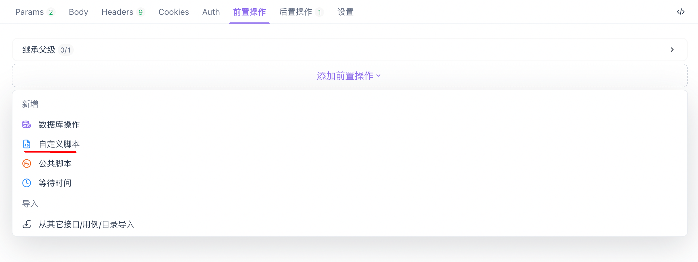
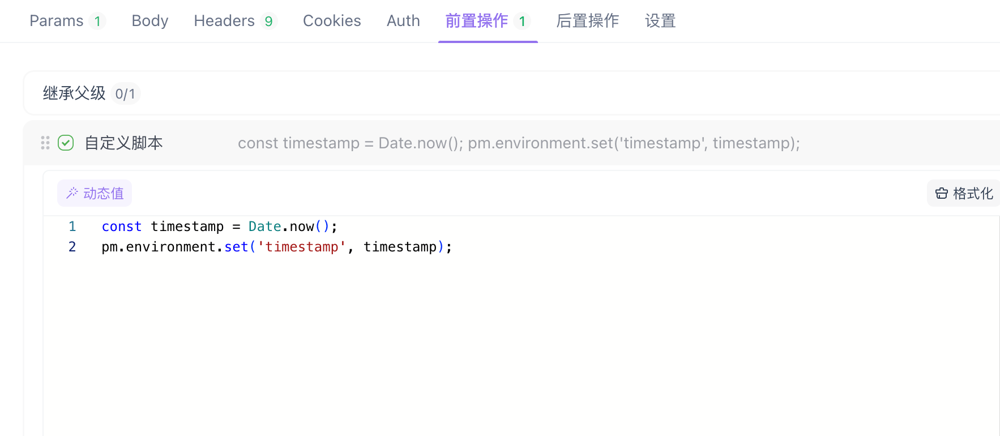
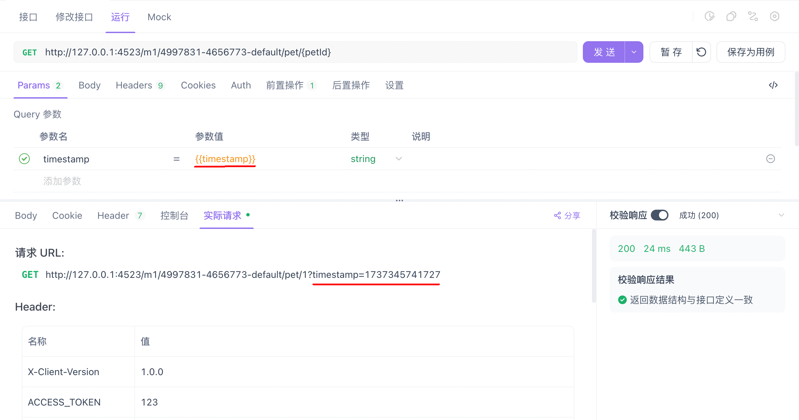

# 前置脚本

前置脚本是在**请求发送前**执行的代码片段，常用于动态设置请求参数、请求头等。例如，可以在请求头中加入时间戳，或在 URL 参数中添加随机生成的字母、数字、字符串等数据。

## 使用前置脚本

### 添加前置脚本

在 Apifox 的请求详情页，在 “前置操作 -> 添加前置操作” 中选择 “自定义脚本” 选项，进入脚本编辑界面。



### 编写前置脚本

前置脚本使用 JavaScript 编写，其语法与[后置脚本](https://docs.apifox.com/post-request-scripts)完全相同，但不包含 `pm.response` 对象。

在脚本中，可以通过 `pm.environment.set()` 设置环境变量，通过 `pm.variables.set()` 设置临时变量。例如，生成当前时间戳并设置为环境变量：

```js
const timestamp = Date.now();
pm.environment.set('timestamp', timestamp);
```



### 使用变量

在请求参数、URL、或请求头中引用变量，例如：

在参数中：将参数 `timestamp` 的值设置为 `{{timestamp}}`

在请求头中：例如 `X-Timestamp: {{timestamp}}`

当请求发送时，前置脚本会被执行，`{{timestamp}}` 将被替换为动态生成的时间戳。



### 验证效果

请求发送后，检查请求内容，确保动态生成的数据已正确应用。
