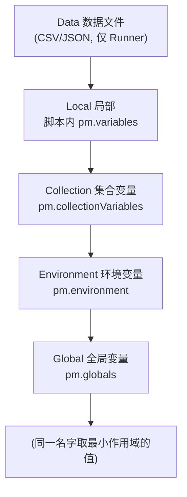

# Postman 详细使用教程（从入门到 API 自动化）

> 适用对象：做 Web 应用测试、需要系统化掌握 **API 接口测试** 的测试工程师。
> 本文覆盖：安装 → 发请求 → 集合管理 → 变量系统 → 脚本断言 → **请求串联（用登录返回的 JWT 驱动后续接口）** → 数据驱动 → 命令行 Newman + CI → Mock/文档/监控。
> 实战部分直接复用上一讲「RuoYi 3.9」的后台接口，前后两篇教程可无缝衔接。

---

## 目录

1. [Postman 是什么 & 为什么 API 测试离不开它](#1-postman-是什么)
2. [安装与界面概览](#2-安装与界面概览)
3. [发送第一个请求（GET / POST / PUT / DELETE）](#3-发送第一个请求)
4. [请求核心面板：Params / Authorization / Headers / Body](#4-请求核心面板)
5. [集合（Collections）与文件夹组织](#5-集合collections与文件夹组织)
6. [变量系统：5 级作用域 + 动态变量（重点）](#6-变量系统)
7. [前置脚本 Pre-request Script](#7-前置脚本-pre-request-script)
8. [测试脚本 Tests：断言核心](#8-测试脚本-tests断言核心)
9. [请求串联（关联）：用上一个响应驱动下一个（RuoYi 登录拿 Token 实战）](#9-请求串联关联)
10. [Collection Runner 与数据驱动（CSV / JSON）](#10-collection-runner-与数据驱动)
11. [命令行 Newman + CI 集成](#11-命令行-newman--ci-集成)
12. [Mock Server（前后端并行开发）](#12-mock-server)
13. [API 文档自动生成](#13-api-文档自动生成)
14. [Monitor 监控](#14-monitor-监控)
15. [实战：用 Postman 测 RuoYi 3.9 后台接口](#15-实战用-postman-测-ruoyi-39-后台接口)
16. [最佳实践 & 常见坑](#16-最佳实践--常见坑)
17. [快捷键速查 & 附录](#17-快捷键速查--附录)

---

## 1. Postman 是什么

Postman 是一个 **API 开发 + 测试一体化平台**。对测试工程师来说，它主要解决三件事：

| 能力 | 说明 | 对应测试价值 |
|---|---|---|
| 发请求 | 图形化构造任意 HTTP 请求 | 替代 curl，调试接口快 |
| 写断言 | JavaScript 测试脚本（基于 Node.js 的 `pm` 对象） | 把「手动看响应」变成「自动判对错」 |
| 自动化 | Collection Runner / Newman（CLI） | 一键跑几百个接口，接入 CI |

> **和上一讲的关系**：pytest + Selenium 测的是「前端 UI 行为」；Postman / Newman 测的是「后端接口契约」。两者互补 —— UI 层少而精（≤10%），接口层可以做得很厚（这正是测试金字塔的 20% 集成测试 + 大量 API 回归）。

---

## 2. 安装与界面概览

### 2.1 安装

- 桌面版（推荐）：<https://www.postman.com/downloads/> —— 选 Windows / macOS / Linux 安装包。
- 注册/登录账号（用于云端同步集合、团队共享、Monitor）。**纯本地使用也可跳过登录**。
- 命令行工具 **Newman**（后文 CI 用）：`npm install -g newman`

### 2.2 界面四大区

```json
┌──────────────┬────────────────────────────┬──────────────┐
│ 左侧 Sidebar │ 中间 请求/响应 工作区        │ 右上 环境选择 │
│              │                            │              │
│● Collections │  [Method] [URL         ]   │ 环境: dev ▾  │
│● Environments│  Params│Auth│Headers│Body  │  [Send]      │
│● Mock Servers│    ─────────────────────   │              │
│● Monitors    │  响应: Status 200 · 23ms   │              │
└──────────────┴────────────────────────────┴──────────────┘
```

关键概念：

- **Workspace（工作区）**：隔离不同项目/团队的容器。
- **Collection（集合）**：一组相关请求的容器，相当于「测试套件」，可导出 JSON 给 Newman 跑。
- **Environment（环境）**：一组键值对（如 `base_url=http://localhost:81`），切换环境即可换测试地址。
- **请求（Request）**：单个接口调用。

---

## 3. 发送第一个请求

1. 点左上角 **+ New → HTTP Request**（或快捷键 `Ctrl+N`）。
2. 方法下拉选 `GET`，URL 填 `https://jsonplaceholder.typicode.com/users/1`。
3. 点 **Send**。
4. 下方响应区看到：
   - **Status**：`200 OK`
   - **Body**：JSON 数据
   - **Headers / Cookies / Test Results**：不同标签页

**各方法速记**：

| 方法     | 语义    | 典型 Body                   |
| ------ | ----- | ------------------------- |
| GET    | 查     | 无 Body，参数走 Query（`?id=1`） |
| POST   | 增     | JSON / form-data          |
| PUT    | 改（全量） | JSON                      |
| PATCH  | 改（局部） | JSON                      |
| DELETE | 删     | 通常无 Body                  |

---

## 4. 请求核心面板

一个请求的标签栏：`Params` / `Authorization` / `Headers` / `Body` / `Pre-request` / `Tests`。

### 4.1 Params（查询参数）

key-value 形式，自动拼到 URL 后：`?pageNum=1&pageSize=10`。Postman 会高亮显示拼好的完整 URL。

### 4.2 Authorization（鉴权）

Postman 内置多种鉴权，**不用手动拼 Header**：

- **Bearer Token**：填 `{{token}}`（最常用，JWT 场景）。
- **Basic Auth**：填 username / password，自动生成 `Authorization: Basic base64(...)`。
- **API Key**：指定 key 名 + value，加到 Header 或 Query。
- **OAuth 2.0**：点 **Get New Access Token** 走授权流拿 token。

> RuoYi 用 **Bearer Token**（JWT），所以给每个需登录的请求选 `Bearer Token` 并填 `{{token}}` 即可。

### 4.3 Headers

常用：`Content-Type: application/json`、`Accept: application/json`。Postman 发 JSON Body 时会**自动加** `Content-Type`，一般不用手填。

### 4.4 Body（请求体）

| 类型 | 用途 |
|---|---|
| `none` | 无体 |
| `form-data` | 表单 + 文件上传（RuoYi 文件上传用这个） |
| `x-www-form-urlencoded` | 传统表单（key=value&...） |
| `raw` → 选 `JSON` | **最常用**，直接写 `{"username":"admin"}` |
| `binary` | 传单个文件 |

**raw JSON 示例**：

```json
{
  "username": "admin",
  "password": "admin123",
  "code": "",
  "uuid": ""
}
```

---

## 5. 集合（Collections）与文件夹组织

把零散请求收进集合，才能批量跑、做数据驱动、导出给 CI。

1. **+ New → Collection**，命名如 `RuoYi-3.9-API`。
2. 在集合上 **⋮ → Add request**，把请求拖进去。
3. 集合内可建 **Folder（文件夹）** 分层：

   ```json
   RuoYi-3.9-API/
   ├── 01-认证/
   │   ├── 登录获取Token
   │   └── 获取用户信息
   ├── 02-系统管理/
   │   ├── 用户列表
   │   ├── 新增用户
   │   └── 删除用户
   └── 03-监控/
       └── 在线用户
   ```

4. **集合级脚本**：在集合名上点开，有 `Pre-request` / `Tests` 标签页 —— 这里写的脚本会**对每个请求前后都执行**（适合放统一鉴权、统一断言、统一失败日志）。

> 工程化建议：集合按「模块」分文件夹；公共前置（如「先登录拿 token」）放在集合级 Pre-request，子请求直接复用 `{{token}}`。

---

## 6. 变量系统

Postman 的变量是「一改全生效」的核心，也是请求串联的基础。

### 6.1 五级作用域（从小到大）



**优先级（同名时谁生效）**：`Data` > `Local` > `Collection` > `Environment` > `Global`。

| 作用域         | 创建位置                             | 适用                       |
| ----------- | -------------------------------- | ------------------------ |
| Global      | Sidebar → Environments → Globals | 跨集合通用（如公司域名）             |
| Environment | Environments → 新建环境              | **最常用**：dev/test/prod 切换 |
| Collection  | 集合 → Variables 标签页               | 该集合专属配置                  |
| Local       | 脚本里 `pm.variables.set`           | 单请求内临时变量                 |
| Data        | Runner 导入的 CSV/JSON              | 数据驱动参数                   |

### 6.2 使用变量

- 在 URL / Params / Body / Header **任意位置**用 `{{变量名}}` 引用，例如 `{{base_url}}/login`。
- 脚本里读写：

  ```javascript
  pm.environment.set("token", "abc");   // 写
  let t = pm.environment.get("token");     // 读
  pm.globals.set("host", "localhost");
  ```

### 6.3 动态变量（内置随机数）

Postman 提供一大批 `{{$xxx}}` 动态值，每次发送自动生成：

| 写法                       | 生成内容        |
| ------------------------ | ----------- |
| `{{$guid}}`              | UUID        |
| `{{$timestamp}}`         | 当前 Unix 时间戳 |
| `{{$randomFullName}}`    | 随机姓名        |
| `{{$randomEmail}}`       | 随机邮箱        |
| `{{$randomPhoneNumber}}` | 随机手机号       |
| `{{$randomUserName}}`    | 随机用户名       |

> 造测试数据时极好用：`"userName": "auto_{{$guid}}"` 保证每次唯一、不冲突。

---

## 7. 前置脚本 Pre-request Script

在发送请求**之前**执行，常用于：造随机数据、算签名、设置时间戳、从其它来源取 token。

```javascript
// 例1：生成随机手机号，写入环境变量
let phone = "138" + Math.floor(Math.random() * 1e8).toString().padStart(8, "0");
pm.environment.set("randomPhone", phone);

// 例2：动态时间戳
pm.environment.set("ts", new Date().getTime());

// 例3：计算简单签名（示例）
let sign = CryptoJS.MD5(pm.environment.get("ts") + "secret").toString();
pm.environment.set("sign", sign);
```

---

## 8. 测试脚本 Tests：断言核心

请求拿到响应**之后**执行。断言写在这里，结果在响应区 **Test Results** 标签查看。

### 8.1 基本结构

```javascript
pm.test("测试名称", function () {
    // 断言
});
```

### 8.2 常用断言模板（直接抄）

```javascript
// 1) 状态码
pm.test("状态码为 200", function () {
    pm.response.to.have.status(200);
});

// 2) JSON 字段（RuoYi 返回 {code,msg,data}）
pm.test("业务 code 为 200", function () {
    let json = pm.response.json();
    pm.expect(json.code).to.eql(200);
});

// 3) 响应时间（性能基线）
pm.test("响应时间 < 500ms", function () {
    pm.expect(pm.response.responseTime).to.be.below(500);
});

// 4) Header 存在且包含某值
pm.test("返回 JSON", function () {
    pm.response.to.have.header("Content-Type");
    pm.expect(pm.response.headers.get("Content-Type")).to.include("application/json");
});

// 5) 字符串/正则包含
pm.test("msg 提示成功", function () {
    let json = pm.response.json();
    pm.expect(json.msg).to.include("成功");
});

// 6) 数组长度
pm.test("用户列表非空", function () {
    let json = pm.response.json();
    pm.expect(json.data.rows).to.be.an("array").and.have.length.of.at.least(1);
});

// 7) 提取变量给后续请求用（见第 9 节）
let json = pm.response.json();
pm.environment.set("token", json.token);
```

> 断言库是 **Chai**（BDD 风格）：`to.eql / to.include / to.be.a / to.have / to.be.below / to.exist` 等。Postman 还提供快捷方式 `pm.response.to.have.status()`。

### 8.3 集合级统一断言

在 **集合的 Tests** 标签页写，对所有请求生效，适合做「契约守门员」：

```javascript
// 任何响应都应是 JSON，且状态码 2xx/3xx
pm.test("响应为 JSON", function () {
    pm.response.to.be.json;
});
pm.test("状态码正常", function () {
    pm.expect(pm.response.code).to.be.oneOf([200, 201, 204, 301, 302]);
});
```

---

## 9. 请求串联（关联）

真实接口很少孤立：**登录 → 拿 token → 后续所有请求带 token**。Postman 用「Tests 里提取 → 环境变量 → 下个请求引用」实现。

### 9.1 第一步：登录请求，Tests 提取 token

请求 `POST {{base_url}}/login`，Body（raw JSON）：

```json
{ "username": "admin", "password": "admin123", "code": "", "uuid": "" }
```

Tests 脚本：

```javascript
pm.test("登录成功", function () {
    let json = pm.response.json();
    pm.expect(json.code).to.eql(200);
    pm.environment.set("token", json.token);   // ← 关键：存进环境变量
});
```

### 9.2 第二步：后续请求引用 `{{token}}`

请求 `GET {{base_url}}/system/user/list`，Authorization 选 **Bearer Token**，填 `{{token}}`。发送后 Header 自动带上 `Authorization: Bearer <token>`。

> 这就是接口自动化的「登录态保持」——和上一讲 pytest+Selenium 用 session 级 fixture 登录一次是同一个思路，只是实现在 API 层，更快更稳。

### 9.3 串联多个字段（提取 data 里的值）

```javascript
let json = pm.response.json();
pm.environment.set("userId", json.data.userId);
pm.environment.set("deptId", json.data.deptId);
```

后续新增用户的请求 Body 直接写 `{{deptId}}`。

---

## 10. Collection Runner 与数据驱动

把集合当「测试套件」批量跑，并用外部数据文件驱动多组用例。

### 10.1 运行集合

1. 集合上点 **▶ Run**（或 `Ctrl+Enter` 在集合上）。
2. 弹窗里选环境、选「Iterations 迭代次数」、勾选要跑的文件夹。
3. 点 **Run**，看每个请求的 Pass/Fail、耗时、断言数。

### 10.2 数据驱动（CSV / JSON）

1. 准备 `users.csv`：

   ```csv
   username,password,expect_code
   admin,admin123,200
   admin,wrong_pwd,500
   baduser,admin123,500
   ```

2. 在登录请求的 Tests 里写**参数化断言**：

   ```javascript
   let json = pm.response.json();
   pm.test("符合预期结果", function () {
       pm.expect(json.code).to.eql(Number(pm.iterationData.get("expect_code")));
   });
   ```

3. Runner 里 **Select File** 选 `users.csv`，Postman 会按行迭代，每行注入 `{{username}}` `{{password}}` `{{expect_code}}`。

> 也可以用 JSON 数据文件，结构为数组：`[{"username":"admin",...}, ...]`。

---

## 11. 命令行 Newman + CI 集成

Postman 界面跑适合调试；**进 CI 必须用 Newman**（Node 写的命令行 runner）。

### 11.1 导出

- 集合：**集合 ⋮ → Export → 选 v2.1 → 存成 `ruoyi-api.postman_collection.json`**
- 环境：**Environments → 导出环境 → `dev.postman_environment.json`**

### 11.2 安装与运行

```bash
npm install -g newman

# 基本跑
newman run ruoyi-api.postman_collection.json -e dev.postman_environment.json

# 生成 HTML 报告（需装 extra reporter）
npm install -g newman-reporter-htmlextra
newman run ruoyi-api.postman_collection.json -e dev.postman_environment.json \
  -r cli,htmlextra --reporter-htmlextra-export ./reports
```

### 11.3 接 GitHub Actions

```yaml
# .github/workflows/api-tests.yml
name: api-tests
on: [push, pull_request]
jobs:
  api:
    runs-on: ubuntu-latest
    steps:
      - uses: actions/checkout@v4
      - uses: actions/setup-node@v4
        with: { node-version: "20" }
      - run: npm install -g newman newman-reporter-htmlextra
      - run: |
          newman run ruoyi-api.postman_collection.json \
            -e dev.postman_environment.json \
            -r cli,htmlextra --reporter-htmlextra-export reports
      - uses: actions/upload-artifact@v4
        if: always()
        with:
          name: api-report
          path: reports
```

> **测试金字塔视角**：Newman 跑的接口回归属于「集成测试层」，建议每次 PR 都跑；UI（Selenium）只跑核心链路、且可放到 nightly。两者报告都归档，团队才「敢发布」。

---

## 12. Mock Server

前端还没好后端的场景下，用 Mock Server 返回假数据，让前端先并行开发。

1. **+ New → Mock Server**。
2. 可基于已有集合生成：为每个请求指定示例（Example）响应。
3. Postman 给一个 `mock-{{id}}.getpostman.com` 地址，前端直接调它。
4. 断言/变量同样可用，前端联调时就能验证自己的请求构造是否正确。

---

## 13. API 文档自动生成

Postman 可把集合一键变成在线文档：

1. 集合 ⋮ → **View Documentation**（本地预览）。
2. 点 **Publish** 发布到 `documenter.getpostman.com/<你的路径>`，可设密码/公开。
3. 每个请求的 Description、示例响应都会渲染成文档；参数、Header 自动列出。

> 比手写 Swagger 更省事的地方：文档和「可执行用例」是同一份集合，改了用例文档自动更新，不会「文档和代码脱节」。

---

## 14. Monitor 监控

把集合定时在云端跑，监控线上接口健康度：

1. **+ New → Monitor**，绑定一个集合 + 环境。
2. 设置频率（每 5 分钟 / 每小时 / 每天）。
3. 失败时邮件/Slack 告警。
4. 适合「核心交易/鉴权接口」的线上冒烟。

---

## 15. 实战：用 Postman 测 RuoYi 3.9 后台接口

把前面所有知识点串起来，直接测上一讲那套 RuoYi‑Vue 3.9。

> 前置：RuoYi 测试环境已 `captchaEnabled:false`（关验证码）、Redis 在跑、前端地址 `http://localhost:81`，后端 `:8080`。下面 `{{base_url}}` 指向后端 API（如 `http://localhost:8080`）。

### 15.1 建环境 `ruoyi-dev`

| 变量 | 值 |
|---|---|
| `base_url` | `http://localhost:8080` |
| `token` | （留空，登录后自动填） |

### 15.2 请求 1：登录拿 Token

- Method：`POST` ｜ URL：`{{base_url}}/login`
- Body（raw JSON）：

  ```json
  { "username": "admin", "password": "admin123", "code": "", "uuid": "" }
  ```

- Tests：

  ```javascript
  pm.test("登录成功 code=200", function () {
      let json = pm.response.json();
      pm.expect(json.code).to.eql(200);
      pm.environment.set("token", json.token);
  });
  ```

### 15.3 请求 2：带 Token 查用户列表

- Method：`GET` ｜ URL：`{{base_url}}/system/user/list?pageNum=1&pageSize=10`
- Authorization：**Bearer Token** → `{{token}}`
- Tests：

  ```javascript
  pm.test("返回 200 且列表非空", function () {
      let json = pm.response.json();
      pm.expect(json.code).to.eql(200);
      pm.expect(json.data.rows).to.be.an("array").and.have.length.of.at.least(1);
      // 提取第一个用户 id，供删除用例用
      pm.environment.set("firstUserId", json.data.rows[0].userId);
  });
  ```

### 15.4 请求 3：新增用户（数据驱动示例）

- Method：`POST` ｜ URL：`{{base_url}}/system/user`
- Authorization：Bearer `{{token}}`
- Body（raw JSON，用动态变量保证唯一）：

  ```json
  {
    "userName": "auto_{{$guid}}",
    "nickName": "AutoTest",
    "password": "123456",
    "deptId": 100,
    "roleIds": [2]
  }
  ```

- Tests：

  ```javascript
  pm.test("新增成功", function () {
      let json = pm.response.json();
      pm.expect(json.code).to.eql(200);
  });
  ```

### 15.5 请求 4：删除用户

- Method：`DELETE` ｜ URL：`{{base_url}}/system/user/{{firstUserId}}`
- Authorization：Bearer `{{token}}`
- Tests：断言 `code=200`。

### 15.6 用 Collection Runner 跑整套

把这 4 个请求按顺序放进集合 `RuoYi-3.9-API`，Runner 里选 `ruoyi-dev` 环境 → Run。
顺序很重要：**登录 → 列表（顺便取 id）→ 新增 → 删除**。这正是「请求串联」的端到端接口回归。

---

## 16. 最佳实践 & 常见坑

| 主题 | 建议 |
|---|---|
| **变量命名** | 环境里用清楚的前缀：`dev_base_url` / `prod_base_url`，切换环境不打架 |
| **敏感信息** | 密码/token 别提交进 Git；用环境变量 + `.gitignore` 忽略导出的环境文件 |
| **断言要具体** | 别只断言状态码，至少加一条业务字段断言（`code`、`data` 结构） |
| **请求串联** | token 过期就加集合级 Pre-request「先登录刷新 token」；或每个用例自带登录步骤（更独立但更慢） |
| **数据清理** | 测试造的数据（如 `auto_` 前缀用户）要在集合中用「删除请求」或 `pm.sendRequest` 自动清掉 |
| **flaky 接口** | 网络/异步任务导致的偶发失败，用 `pm.expect` 加重试逻辑或 Newman 的 `--delay-request` |
| **时间断言** | 性能基线（`<500ms`）只在稳定内网环境开，外网/CI 放宽以免误报 |
| **集合即文档** | 每个请求填 Description，团队直接看 Publish Docs，省一份维护 |

**常见报错速排**：

- `Could not send request` / `ECONNREFUSED` → 后端没起 / 地址写错 / 环境 `base_url` 不对。
- `401 Unauthorized` → `{{token}}` 为空或过期，先单独跑登录请求。
- `Content-Type 缺失导致 400` → Body 用 raw 时确认选了 `JSON` 类型。
- `CSRF token 缺失`（某些非分离版 RuoYi）→ 分离版用 JWT 一般无此问题；若遇，从登录响应/页面里提取 `_csrf` 加到 Header。

---

## 17. 快捷键速查 & 附录

| 快捷键 | 作用 |
|---|---|
| `Ctrl+N` | 新建请求 |
| `Ctrl+T` | 新建标签页 |
| `Ctrl+Enter` | 发送请求 |
| `Ctrl+Shift+L` | 切换环境 |
| `Ctrl+S` | 保存请求/集合 |
| `Ctrl+Alt+G` | 跳转搜索 |

### 附：学习路线建议

```json
第 1 步：装好 Postman，徒手写 5 个 CRUD 请求，会看响应   ✅
第 2 步：用变量 + 环境，实现「一改地址全集合生效」        ✅
第 3 步：给每个请求写 Tests 断言，理解 pm.test / pm.expect ✅
第 4 步：登录 → 提取 token → 后续请求引用（请求串联）    ✅
第 5 步：Collection Runner + CSV 做数据驱动              ✅
第 6 步：导出集合 + Newman 跑通，挂进 GitHub Actions   ✅
第 7 步：尝试 Mock / 文档发布 / Monitor（按需）         ◯
```

> **与上一讲呼应**：Postman/Newman 搞定「接口契约回归」（快、稳、适合 CI），pytest+Selenium 搞定「用户视角的端到端关键链路」（慢、贵、少量）。两者都接进 CI，报告都留档，团队才真正「敢发布」。

### 参考

- Postman 官方学习中心：<https://learning.postman.com/>
- Newman 文档：<https://github.com/postmanlabs/newman>
- Chai 断言库（Postman Tests 内核）：<https://www.chaijs.com/>
- RuoYi 官方文档：<http://doc.ruoyi.vip>
