## 常用路径

1. **MUMU模拟器shell目录:**  

   D:\Test\apk\MuMu\MuMuPlayer\nx_device\12.0\shell

2. 外部文件存放目录

   D:\Test\apk\zip\

3. root权限才能查看的配置文件

   /data/data/com.tal.kaoyan/shared_prefs

4. 共享文件夹

   /[[storage]]/emulated/0/Download

5. 文档日志存放

   /storage/emulated/0/Documents

## MuMu 模拟器 12 官方开启 ROOT 完整步骤

### 1. 打开模拟器设置

模拟器右上角 **三条横线菜单 → 设置中心**

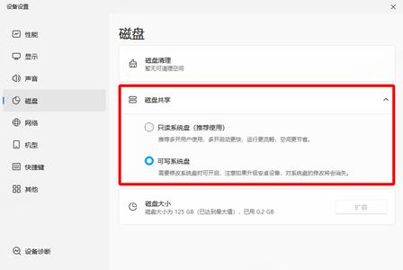

磁盘设置

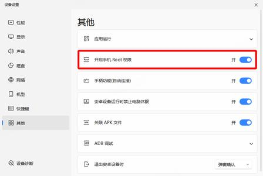

其他设置

### 2. 修改磁盘为「可写系统盘」

左侧栏【磁盘】→ 磁盘共享 → 选择 **可写系统盘**

> 只读系统盘无法修改系统文件，ROOT 必开此项

### 3. 开启手机 Root 权限

左侧栏【其他】→ 打开 **开启手机 Root 权限** 开关

### 4. 保存并重启模拟器

点击底部【保存设置】，关闭模拟器重新启动，ROOT 底层已生效。

### 5. 验证 ROOT 是否成功

### ADB 命令验证

1. 设置里打开【ADB 调试】
2. CMD 执行：


```shell
adb connect 127.0.0.1:7555
adb shell
su
```

1. 模拟器弹出**超级用户请求**，勾选「永久记住选择」→ 允许
2. 命令行前缀从 `$` 变成 `#` = ROOT 成功

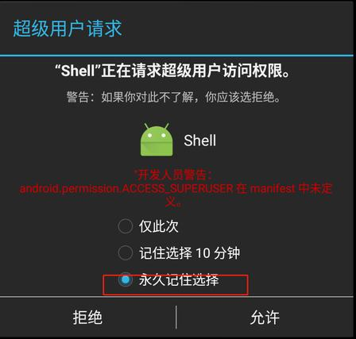

## 移动设备与嵌入式设备的操作系统

- 谷歌的Android：逐步走向闭源的系统（允许二次开发，有不少的模拟器可供使用）
- 苹果的iOS：封闭系统（通常需要苹果设备及开发者账号）
- 华为的 HarmonyOS：免费、开源系统（目前使用规模还小）

## 网络体系架构

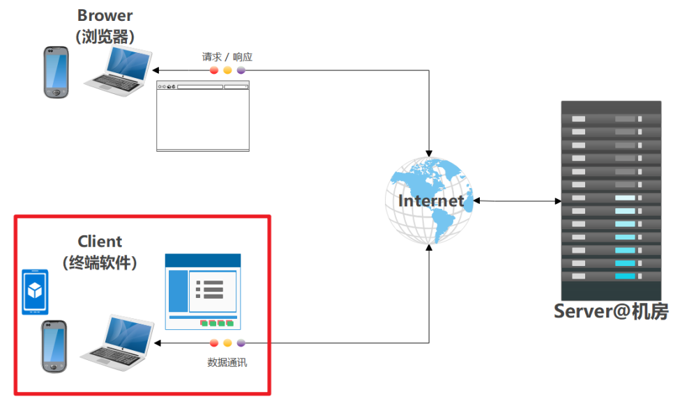


C/S结构

App(lication) @客户机（IP:端口）

Server @服务器 (IP:端口)

## Android体系结构

安卓（Android）是一种基于Linux内核（不包含GNU组件）的操作系统。

主要使用于移动设备，如智能手机和平板电脑，2008年9月，上线android第一个版本1.0.


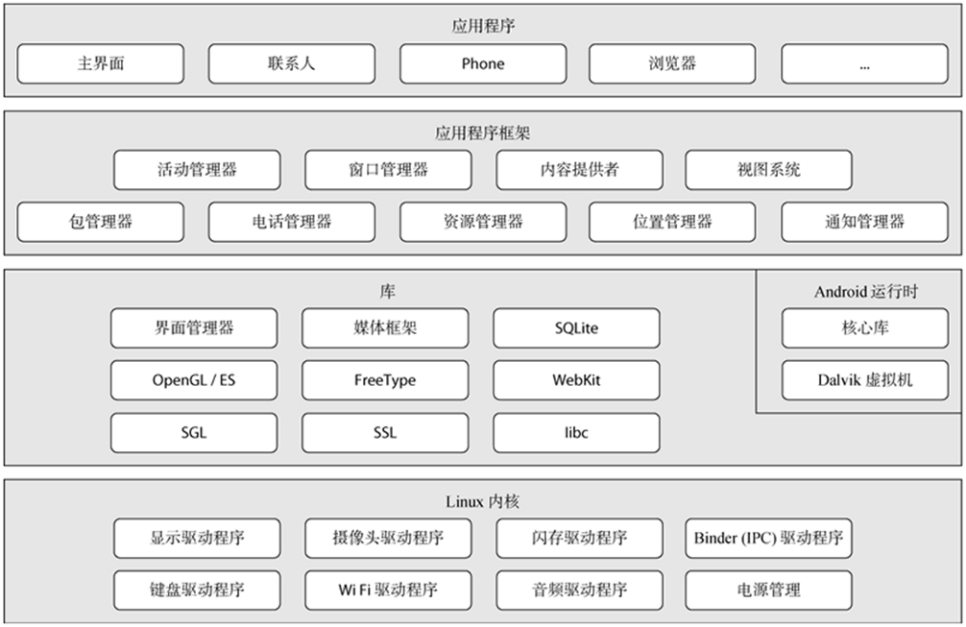


四层结构

1. Linux内核：控制硬件设备
2. 库 + 应用程序框架
   1. Shell —— 接受**用户命令**的接口
      1. Linux常用命令：cd， ls
      2. Android 专属命令
   2. API: **应用程序**编程接口：Java/Kotlin 编程语言
3. 应用程序：例如：微信，手机浏览器等等

## 模拟器的安装


### 创建安卓设备

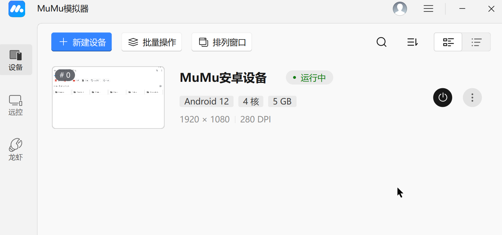

### 启动安卓设备

配置全局环境:

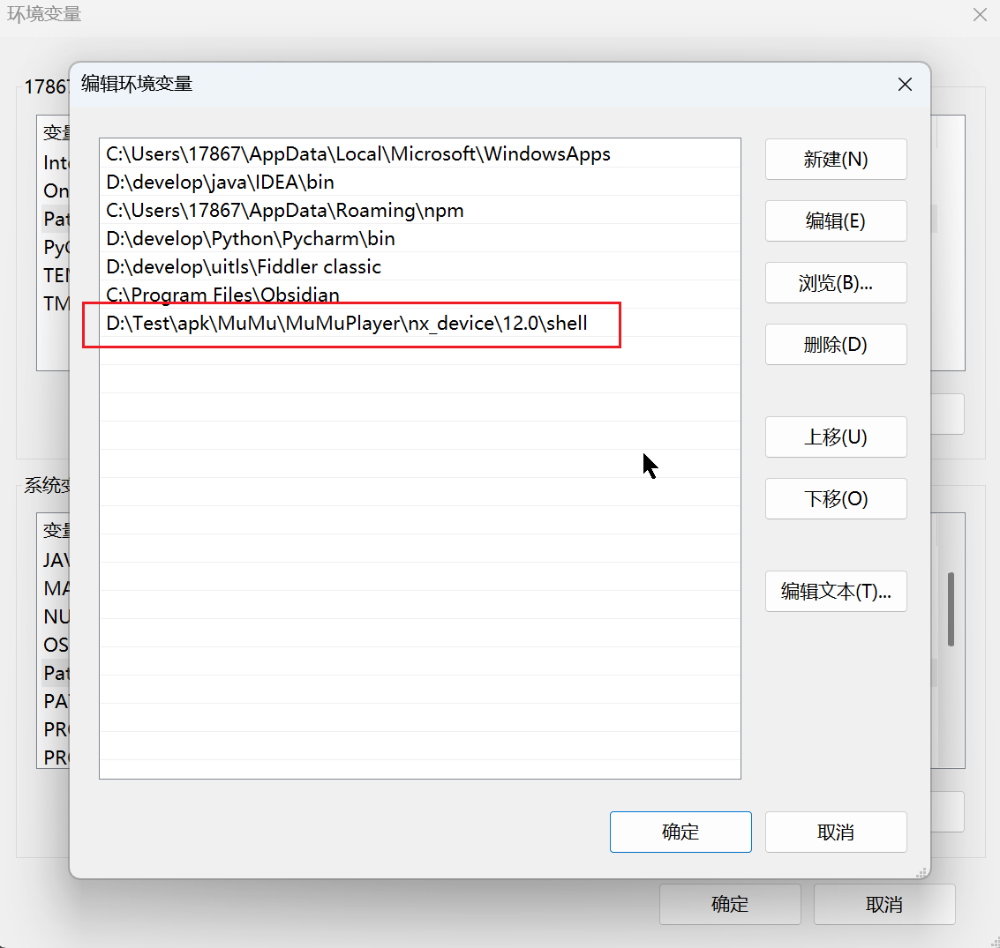

查看版本号:  adb version

```shell
Microsoft Windows [版本 10.0.26200.8457]
(c) Microsoft Corporation。保留所有权利。

C:\Users\17867>adb version
Android Debug Bridge version 1.0.41
Version 36.0.0-13206524
Installed as D:\Test\apk\MuMu\MuMuPlayer\nx_device\12.0\shell\adb.exe
Running on Windows 10.0.26200

C:\Users\17867>
```

连续点击版本号开启开发者模式

## ADB命令：Android 调试工具

### 连接模拟器

MuMu 模拟器默认的 ADB 连接端口是 **7555**（不是常见的 5555）。你需要用以下命令连接它：

1. 首先执行这个命令连接模拟器：


   ```bash
   adb connect 127.0.0.1:7555
   ```


   > 如果看到 `connected to 127.0.0.1:7555`，就成功了。

2. 然后再次查看设备列表：


   ```bash
   adb devices
   ```


   这时候应该能看到 `127.0.0.1:7555 device` 了。

### adb devices：检查电脑上连接的设备

```bash
C:\Users\17867>adb devices
List of devices attached
emulator-5554   device

C:\Users\17867>
```

### adb shell：进入Android 或 执行其shell命令


之后可以执行安卓系统中所有有权限的命令，如大部分linux命令都可以执行

进入 `adb shell` 后分两大类：**系统核心目录**、**应用相关目录**、**日志 / 性能目录**，附测试常用场景。

#### 系统基础根目录（/）

- /data/data/安装软件的包名：每个app安装后，均会在该目录下生成相应的目录
- /data/app/：放上传的安装文件(.apk)

**exit**：退出Android (shell)

常见命令见同级目录文档: [[移动APP--ADB一键调用命令合集]].md

### 挂载了多台设备解决方案

有多台设备连接时，先通过 adb devices 列出所有的设备

```bash
adb -s ip:port shell
```

连接多台设备中指定的某一台

如果只有一台设备联机的话，”**-s** *空格* **IP:port (或真机设备ID号)** ”可以省略

```bash
adb shell
```

### cls 清屏

## Android系统中的四大组件

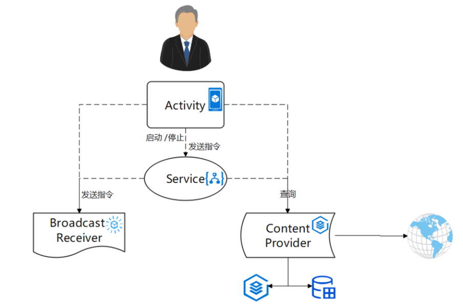

### 1. Activity 活动（所有可视化页面）

1. 浏览页面：首页、店铺页、菜品页，供用户滑动选餐、加购商品；
2. 下单页面：填地址、确认订单、选择支付方式，完成下单操作；
3. 物流页面：查看骑手接单、实时配送进度；
4. 完成页面：订单结束页，提供评价、优惠券入口。

#### dumpsys window

可以查看 App当前窗口的Actvity

```bash
PD2241:/ $ dumpsys window | grep -i focusedwindow
    mFocusedWindow=Window{2dac310 u0 com.tal.kaoyan/com.kaoyan.kylogin.ui.login.LoginKActivity}
```

1. **mFocusedWindow**：当前模拟器顶层、正在交互的窗口（前台页面）
2. `2dac310`：窗口内存 ID，无实际作用
3. `u0`：安卓默认主用户
4. `com.tal.kaoyan`：**考研帮包名**，确认当前前台是考研帮 App
5. `com.kaoyan.kylogin.ui.login.LoginKActivity`：当前打开的页面类 = **考研帮登录页**

#### 2. Service 服务（后台无界面任务）

1. 后台收发数据：上传下单信息至服务器，拉取订单实时状态；
2. 持久后台运行：切出 APP 仍持续监控配送进度，切回页面可刷新最新状态。

#### 3. Broadcast Receiver 广播接收器（接收消息并响应）

1. 监听系统广播：切换 Wi‑Fi / 流量时，通知服务稳定传输、页面提示流量消耗；
2. 监听业务广播：骑手接单、外卖送达等状态推送，弹窗给用户消息提醒。

#### 4. Content Provider 内容提供者（本地数据存取共享）

存储本地收货地址、收藏店铺、历史订单；各页面、服务统一读取复用数据，下单时自动回填地址，保证多模块数据统一。

## 安装（升级）/ 卸载测试

### adb shell pm list packages:　列出设备上所有已安装应用的包名

```bash
PS C:\Users\17867> adb shell pm list packages
package:com.android.internal.display.cutout.emulation.corner
package:com.android.internal.display.cutout.emulation.double
package:com.android.providers.telephony
package:com.android.providers.calendar
package:com.android.internal.systemui.navbar.gestural_wide_back
package:com.nemu.oaidmanager
package:com.android.documentsui
package:com.android.externalstorage
package:com.android.htmlviewer
package:com.android.providers.downloads
package:com.android.internal.systemui.onehanded.gestural
package:com.android.networkstack
package:com.android.connectivity.resources
package:com.tencent.mm
package:com.android.internal.display.cutout.emulation.hole
package:com.android.internal.display.cutout.emulation.tall
package:com.android.modulemetadata
package:com.android.certinstaller
package:com.android.internal.systemui.navbar.threebutton
package:android
package:com.android.camera2
package:com.android.internal.systemui.navbar.gestural_extra_wide_back
package:com.android.providers.settings
package:com.android.webview
package:com.sohu.inputmethod.sogou.chuizi
package:app.lawnchair
package:android.ext.shared
package:com.android.onetimeinitializer
package:com.android.keychain
package:com.android.gallery3d
package:android.ext.services
package:com.android.wifi.resources
package:com.android.packageinstaller
package:com.android.theme.font.notoserifsource
package:com.android.internal.display.cutout.emulation.waterfall
package:com.android.networkstack.tethering
package:com.android.settings
package:com.android.networkstack.permissionconfig
package:com.android.wallpaper
package:com.android.vpndialogs
package:com.android.phone
package:com.android.shell
package:com.android.providers.media.module
package:com.android.chromium
package:com.android.hotspot2.osulogin
package:com.android.internal.systemui.navbar.gestural
package:com.android.location.fused
package:com.android.systemui
package:com.android.permissioncontroller
package:com.nemu.nlp
package:com.android.providers.contacts
package:com.android.internal.systemui.navbar.gestural_narrow_back
```

**常用过滤选项**

| 选项                 | 说明                               | 示例                                            |
| :------------------- | :--------------------------------- | :---------------------------------------------- |
| `-3`                 | **仅显示第三方应用**（非系统预装） | `adb shell pm list packages -3`                 |
| `-s`                 | **仅显示系统应用**                 | `adb shell pm list packages -s`                 |
| `-f`                 | **同时显示 APK 文件的路径**        | `adb shell pm list packages -f`                 |
| `<关键字>`           | **按包名过滤**（末尾添加）         | `adb shell pm list packages wechat`             |
| `--show-versioncode` | **显示版本号**                     | `adb shell pm list packages --show-versioncode` |

```bash
C:\Windows\System32>adb shell pm list packages -3
package:com.tal.kaoyan
package:com.tencent.mm

C:\Windows\System32>

C:\Windows\System32>adb shell pm list packages -3 -f
package:/data/app/~~QuU_uyGs4k3phaXbu5GxDg==/com.tal.kaoyan-wJJf4_YxZ_D23CslB5lBzQ==/base.apk=com.tal.kaoyan
package:/data/app/~~0m1OvavdkZMerVq0LoCNRg==/com.tencent.mm-_gl9h-HHB_mEmoaxwmdbIw==/base.apk=com.tencent.mm

C:\Windows\System32>adb shell pm list packages -3 -f --show-versioncode
package:/data/app/~~QuU_uyGs4k3phaXbu5GxDg==/com.tal.kaoyan-wJJf4_YxZ_D23CslB5lBzQ==/base.apk=com.tal.kaoyan versionCode:183
package:/data/app/~~0m1OvavdkZMerVq0LoCNRg==/com.tencent.mm-_gl9h-HHB_mEmoaxwmdbIw==/base.apk=com.tencent.mm versionCode:2220

C:\Windows\System32>
```


### aapt list：列出该安装包文件中的内容

```bash
C:\Users\17867>aapt list D:\Test\apk\zip\weixin.apk
```

### adb install：从外部向Android内安装应用程序

```bash
C:\Users\17867>adb install D:\Test\apk\zip\weixin.apk
Performing Streamed Install
Success

C:\Users\17867>
```

安装文件：.apk 结尾。真机连接安装时，不支持拖拽安装

### adb install -r：软件的升级

```bash
#假设原来没有安装ECMobile的APK文件
adb install D:\DevWork\adbTest\apk\ECMobile3.2.apk
#升级第二次
adb install -r D:\DevWork\adbTest\apk\ECMobile_10.apk
#然后卸载所有安装第一次的3.2版本跳过10版本，直接安装13
adb install -r D:\DevWork\adbTest\apk\ECMobile_13.apk
#用于查看APK文件的各项元数据信息，包括包名、版本号、应用名称、目标SDK版本等
aapt dump badging D:\DevWork\adbTest\apk\ECMobile3.2.apk
```

### adb uninstall：从外部卸载Android内的应用程序（包）

adb uninstall [软件的包名]

```bash
PS C:\Users\17867> adb shell pm list packages -3
package:com.tencent.mm
PS C:\Users\17867> adb uninstall com.tencent.mm
Success
PS C:\Users\17867> adb shell pm list packages -3
PS C:\Users\17867>
```


------

### 准备工作

运行考研帮, App运行之后，shared_prefs/ 目录才会被生成, 生成的程序运行所需的配置文件存放目录：/data/data/安装包/shared_prefs/

```bash
PD2241:/ $ pwd
PD2241:/ $ su
cd /data/data
:/data/data # ls -n
ls -n
cd com.tal.kaoyan
ls
app_UApm   app_crashrecord  app_tbs       app_webview  code_cache  databases  lib        shared_prefs
app_bugly  app_flutter      app_textures  cache        crashsdk    files      no_backup
cd shared_prefs/
ls -l
total 216

:/data/data/com.tal.kaoyan/shared_prefs #
```

## Android系统内的文本编辑三步曲+

### 文件取出

#### adb pull：文件导出 —— 将文件从Android系统中，取出到本地（电脑上）

```bash
# 先查再复制
# 在设备内部存储中查找
C:\Windows\System32>adb shell find /storage/emulated/0/Download/ -iname "*sl*"
/storage/emulated/0/Download/sl.jpg

C:\Windows\System32>adb pull /storage/emulated/0/Download/sl.jpg C:\Users\17867\Downloads
/storage/emulated/0/Download/sl.jpg: 1 file pulled, 0 skipped. 31.0 MB/s (1916714 bytes in 0.059s)
```

### 文件编辑（更新）[为了push做准备]

MuMu 自带 toybox，自带精简版 vi，不用装任何文件，直接用：

### 1. 进入 adb shell


```bash
adb shell
```

### 2. 编辑文件语法


```bash
toybox vi /storage/emulated/0/test.txt
```

### 基础操作（toybox vi 和标准 vi 通用）

1. 按 `i` → 进入插入模式，打字编辑
2. 编辑完按 `Esc` 退出插入模式
3. 保存退出：`:wq` 回车
4. 不保存强制退出：`:q!` 回车

```bash
PD2241:/ $ cd    /storage/emulated/0/Download
PD2241:/storage/emulated/0/Download $ ls
sl.jpg  temp.txt  weixin.apk
PD2241:/storage/emulated/0/Download $ toybox vi
sl.jpg      temp.txt    weixin.apk
PD2241:/storage/emulated/0/Download $ toybox vi temp.txt
# cat temp.txt 等同于 toybox cat temp.txt
PD2241:/storage/emulated/0/Download $ cat temp.txt
PD2241:/storage/emulated/0/Download $ toybox cat temp.txt
```


### adb push：文件导入 —— 将文件从本地（电脑上），推入到 Android系统中

```bash
C:\Windows\System32>adb push C:\Users\17867\Desktop\temp.txt /storage/emulated/0/Download/
C:\Users\17867\Desktop\temp.txt: 1 file pushed, 0 skipped. 3.8 MB/s (3940 bytes in 0.001s)

C:\Windows\System32>adb shell
Welcome! If you need help getting started, check out our developer FAQ page at:

    https://g.126.fm/04jewvw

We're committed to making our emulator as useful as possible for developers,
so if you have any specific requirements or features that you'd like to see
in the emulator, please let us know. We're always open to new ideas and suggestions.
You can find our contact information on the FAQ page as well.

Thanks for using our emulator, happy coding!
PD2241:/ $ cd /storage/emulated/0/Download/
PD2241:/storage/emulated/0/Download $ ls
sl.jpg  temp.txt  weixin.apk
PD2241:/storage/emulated/0/Download $ head -n 20 temp.txt
server
{
    listen 80;
    listen 443 ssl;
    http2 on;
    server_name dingwenwang.xyz;
    index index.html index.htm default.htm default.html;
    include /www/server/panel/vhost/nginx/extension/badminton-score/*.conf;
    #root /www/wwwroot/dingwenwang.xyz/server;
    #CERT-APPLY-CHECK--START
    # 用于SSL证书申请时的文件验证相关配置 -- 请勿删除
    include /www/server/panel/vhost/nginx/well-known/badminton-score.conf;
    #CERT-APPLY-CHECK--END


    #SSL-START SSL相关配置
    #error_page 404/404.html;
    #HTTP_TO_HTTPS_START
    set $isRedcert 1;
    if ($server_port != 443) {
PD2241:/storage/emulated/0/Download $
```

添加过滤条件 `| grep SSL`

```bash
server
{
    listen 80;
    listen 443 ssl;
    http2 on;
    server_name dingwenwang.xyz;
    index index.html index.htm default.htm default.html;
    include /www/server/panel/vhost/nginx/extension/badminton-score/*.conf;
    #root /www/wwwroot/dingwenwang.xyz/server;
    #CERT-APPLY-CHECK--START
    # 用于SSL证书申请时的文件验证相关配置 -- 请勿删除
    include /www/server/panel/vhost/nginx/well-known/badminton-score.conf;
    #CERT-APPLY-CHECK--END


    #SSL-START SSL相关配置
    #error_page 404/404.html;
    #HTTP_TO_HTTPS_START
    set $isRedcert 1;
    if ($server_port != 443) {
PD2241:/storage/emulated/0/Download $ head -n 20 temp.txt | grep SSL
    # 用于SSL证书申请时的文件验证相关配置 -- 请勿删除
    #SSL-START SSL相关配置
```

## aapt 高频命令

```bash
# 基础查看版本
aapt version
```


### aapt dump permissions: 显示权限信息


**语法：**aapt dump permissions 安装路径\apk安装文件

```bash
# 查看考研帮的权限
PS C:\Users\17867> aapt dump permissions   D:\Test\apk\zip\kaoyanbang.apk
package: com.tal.kaoyan
uses-permission: android.permission.SYSTEM_ALERT_WINDOW
uses-permission: android.permission.INTERNET
uses-permission: android.permission.WRITE_EXTERNAL_STORAGE
uses-permission: android.permission.ACCESS_NETWORK_STATE
uses-permission: android.permission.ACCESS_WIFI_STATE
uses-permission: android.permission.READ_EXTERNAL_STORAGE
uses-permission: android.permission.MOUNT_UNMOUNT_FILESYSTEMS
uses-permission: android.permission.GET_TASKS
uses-permission: android.permission.CHANGE_WIFI_STATE
uses-permission: android.permission.READ_PHONE_STATE
uses-permission: android.permission.INTERACT_ACROSS_USERS_FULL
uses-permission: android.permission.WAKE_LOCK
uses-permission: android.permission.RECEIVE_BOOT_COMPLETED
uses-permission: android.permission.VIBRATE
uses-permission: android.permission.READ_LOGS
uses-permission: android.permission.RECEIVE_USER_PRESENT
uses-permission: android.permission.RECORD_AUDIO
uses-permission: android.permission.CAMERA
uses-permission: android.permission.DISABLE_KEYGUARD
uses-permission: android.permission.USE_FINGERPRINT
uses-permission: android.permission.FOREGROUND_SERVICE
uses-permission: android.permission.REQUEST_INSTALL_PACKAGES
uses-permission: android.permission.MODIFY_AUDIO_SETTINGS
uses-permission: android.permission.RECORD_VIDEO
uses-permission: android.permission.CHANGE_CONFIGURATION
permission: com.tal.kaoyan.permission.MIPUSH_RECEIVE
uses-permission: com.tal.kaoyan.permission.MIPUSH_RECEIVE
uses-permission: com.coloros.mcs.permission.RECIEVE_MCS_MESSAGE
uses-permission: com.heytap.mcs.permission.RECIEVE_MCS_MESSAGE
permission: com.tal.kaoyan.permission.PROCESS_PUSH_MSG
permission: com.tal.kaoyan.permission.PUSH_PROVIDER
permission: com.tal.kaoyan.permission.PUSH_WRITE_PROVIDER
uses-permission: com.tal.kaoyan.permission.PROCESS_PUSH_MSG
uses-permission: com.tal.kaoyan.permission.PUSH_PROVIDER
uses-permission: android.permission.CHANGE_NETWORK_STATE
uses-permission: com.huawei.appmarket.service.commondata.permission.GET_COMMON_DATA
PS C:\Users\17867>
```

`aapt`（Android Asset Packaging Tool）是Android SDK中用于处理和打包应用资源的命令行工具。它在`build-tools`目录下，常用于查看APK信息或执行打包操作。

以下是`aapt`的常用命令分类整理：

### 列出内容 (List)

用于查看APK等压缩包内的文件列表。

- **基础用法**：`aapt l[ist] <file.apk>`
- **常用选项**：
  - `-v`：以表格形式输出，包含文件大小、压缩率等详细信息。
  - `-a`：输出更详细的内容，包括Android特有的资源、清单等信息。

### 查看APK信息 (Dump)

用于提取APK包内的各类元数据，是日常最常用的功能。

- **基础用法**：`aapt d[ump] <子命令> <file.apk>`
- **常用子命令**：
  - **`badging`**：打印APK的概要信息，如包名(`packageName`)、版本号(`versionCode`、`versionName`)、应用图标和启动Activity等。

    ```bash
    aapt dump badging <your_app.apk>
    ```

  - **`permissions`**：列出APK在`AndroidManifest.xml`中声明的所有权限。


    aapt dump permissions <your_app.apk>


  - **`resources`**：输出APK中完整的资源列表及其ID。由于输出内容通常很多，建议将结果重定向到文件中查看。


    aapt dump resources <your_app.apk> > resources.txt


  - **`configurations`**：列出APK支持的所有设备配置，如不同的屏幕密度、语言等。


    aapt dump configurations <your_app.apk>


  - **`xmltree`**：以树形结构解析并打印APK中已编译的XML文件（如`AndroidManifest.xml`或布局文件）。


    aapt dump xmltree <your_app.apk> AndroidManifest.xml


  - **`xmlstrings`**：打印指定XML文件中所有的字符串信息。


    aapt dump xmlstrings <your_app.apk> res/layout/your_layout.xml


### 打包资源 (Package)

这是`aapt`的核心构建功能，用于将资源文件编译打包。

- **基础用法**：`aapt p[ackage] [选项]`
- **常用场景与选项**：
  - **生成`R.java`文件**：`-m` 使包目录结构生成，`-J` 指定`R.java`的输出目录。


```bash
aapt package -m -J <输出R.java的目录> -S <res目录> -I <android.jar路径> -M <AndroidManifest.xml路径>
```


- **打包资源文件（不包含DEX）**：`-F` 指定输出的APK文件。


```bash
aapt package -F <输出的APK文件> -M <AndroidManifest.xml路径> -S <res目录> -I <android.jar路径>
```


### 修改APK (Add/Remove)

可以在不重新打包的情况下，直接向APK中添加或删除文件。

- **添加文件**：`aapt a[dd] [-v] <file.apk> <要添加的文件1> [<文件2>...]`

    ```bash
    aapt add your_app.apk new_file.txt
    ```

- **移除文件**：`aapt r[emove] [-v] <file.apk> <要移除的文件1> [<文件2>...]`

    ```bash
    aapt remove your_app.apk unwanted_file.txt
    ```

### 其他工具命令

- **`c[runch]`**：对资源目录中的PNG图片进行预处理和优化（如压缩），并将结果保存到指定目录。

    ```bash
    aapt crunch -S <输入资源目录> -C <输出目录>
    ```

- **`v[ersion]`**：打印当前`aapt`工具的版本信息。

    ```bash
    aapt version
    ```

### 常用选项 (Modifiers)

这些选项常与上述命令结合使用。

- **`-v`**：开启详细输出模式。
- **`-f`**：强制覆盖已存在的文件。
- **`-I`**：指定要包含的Android平台包（如`android.jar`），用于编译时引用系统资源。
- **`-S`**：指定资源文件夹（`res`目录）的路径。
- **`-M`**：指定`AndroidManifest.xml`文件的路径。
- **`-A`**：指定资产文件夹（`assets`目录）的路径。

### 功能测试

考虑方面

- 业务侧（1）
  - 单功能测试 —— 页面/模块测试
  - 集成测试 —— 多功能（模块）交互测试
  - 业务流程测试 —— 工作流/端到端测试
- 业务侧（2）
  - （视业务情况）第三方集成
- 通用交互操作

### 通用交互操作

- 与Home键，电源键（触发锁屏）交互

切回app时，要合理（例如：恢复退出时的界面，或是直接重新回答主页）

- 与Back键交互
  - Android系统的 物理/虚拟“返回”键：例如：回退至前一幕
  - 应用程序的 "返回" 键：例如：可以等同于物理返回键，或是直接退至指定的页面（如首页）
- 滑屏（拉动边框）、长按、双击、多点触控支持 例如：长按 -- 全选；双击 -- 放大
- 屏幕旋转支持（包括摇一摇）
- 设备交互：摄像头支持、前后置摄像头的切换

## Android手机操作的命令行模拟：input 子命令空格[参数]

### adb shell input keyevent

| 键名                   | 描述        | 键值  |     |
| -------------------- | --------- | --- | --- |
| **电话键**              |           |     |     |
| KEYCODE_CALL         | 拨号键       | 5   |     |
| KEYCODE_ENDCALL      | 挂机键       | 6   |     |
| KEYCODE_HOME         | 按键home    | 3   |     |
| KEYCODE_MENU         | 菜单键       | 82  |     |
| KEYCODE_BACK         | 返回键       | 4   |     |
| KEYCODE_SEARCH       | 搜索键       | 84  |     |
| KEYCODE_CAMERA       | 拍照键       | 27  |     |
| KEYCODE_FOCUS        | 拍照对焦键     | 80  |     |
| KEYCODE_POWER        | 电源键       | 26  |     |
| KEYCODE_NOTIFICATION | 通知键       | 83  |     |
| KEYCODE_MUTE         | 语音静音键     | 91  |     |
| KEYCODE_VOLUME_MUTE  | 扬声器静音键    | 164 |     |
| KEYCODE_VOLUME_UP    | 音量增加键     | 24  |     |
| KEYCODE_VOLUME_DOWN  | 音量减少键     | 25  |     |
| **控制键**              |           |     |     |
| KEYCODE_ENTER        | 回车键       | 66  |     |
| KEYCODE_ESCAPE       | ESC键      | 111 |     |
| KEYCODE_DPAD_CENTER  | 导航键 确定键   | 23  |     |
| KEYCODE_DPAD_UP      | 导航键 向上键   | 19  |     |
| KEYCODE_DPAD_DOWN    | 导航键 向下键   | 20  |     |
| KEYCODE_DPAD_LEFT    | 导航键 向左键   | 21  |     |
| KEYCODE_DPAD_RIGHT   | 导航键 向右键   | 22  |     |
| KEYCODE_MOVE_HOME    | 光标移动键 开始键 | 122 |     |
| KEYCODE_MOVE_END     | 光标移动键 结束键 | 123 |     |
| KEYCODE_PAGE_UP      | 向上翻页键     | 92  |     |
| KEYCODE_PAGE_DOWN    | 向下翻页键     | 93  |     |

按键编号 menu 键：1 home 键：3 返回 键：4 拨打/挂断电话 键：5, 6 音量-+ 键：24（音量减小）, 25（音量减大) 电源 键：26 第一次是关电源，第二次是开电源

```bash
# 标准命令输入
PS C:\Users\17867> adb shell input keyevent 3
```

#### 模拟手机滑屏: adb shell input swipe

> **自动化脚本与日常“挂机”**
>
> 这是最常见的场景，用于代替人工完成重复性的滑动操作。
>
> - **短视频/资讯刷量**：在抖音、快手或考研类资讯App中，自动上滑刷新“推荐”列表，或者滑动浏览下一篇文章。
> - **游戏挂机**：在需要重复操作的游戏中（如某些卡牌或养成类游戏），用脚本模拟滑动来拾取物品或重复刷关卡。
> - **自动翻页**：在阅读类App（如考研政治刷题软件）中，自动滑动翻页实现“自动刷题”或“连续阅读”。
>
> **软件测试与稳定性验证**
>
> 这是开发者最常用的专业场景。
>
> - **压力测试（Monkey测试）**：虽然 `monkey` 命令是随机点击，但配合 `input swipe` 可以做**定向**的UI遍历，测试App在反复滑动切换页面时是否会闪退（ANR）。
> - **兼容性测试**：测试应用在不同分辨率下，滑动手势（如侧滑返回、下拉刷新）是否能正常触发。
>
> **模拟系统导航手势**
>
> 现在很多应用和系统都采用全面屏手势，ADB命令可以帮你绕过物理按键。
>
> - **模拟“返回”手势**：从屏幕左边缘向内滑动（`adb shell input swipe 50 500 300 500`），效果等同于点击返回键。
> - **呼出多任务/控制中心**：从底部上滑并悬停，或者从顶部下滑呼出通知栏。比如你想在模拟器里快速切换考研应用和微信，可以通过滑动呼出后台。
>
> **屏幕解锁与唤醒**
>
> - 如果你在模拟器中设置了锁屏密码或图案，可以通过ADB滑动来模拟绘制图案解锁（连续的`swipe`坐标组合），实现自动化无人值守启动。
>
> **调试复现**Bug
>
> - 当开发人员需要修复“滑动冲突”或“列表卡顿”问题时，会用精确的`swipe`命令（带毫秒时间参数）来重现特定滑动速度下的异常现象。

**基本命令格式**


```bash
adb shell input swipe <起始X> <起始Y> <结束X> <结束Y> [持续时间]
```


- **`<起始X> <起始Y>`**：滑动起点的屏幕坐标。
- **`<结束X> <结束Y>`**：滑动终点的屏幕坐标。
- **`[持续时间]`**：可选参数，指完成滑动所需的时间，单位是毫秒-[-1](https://developer.baidu.com/article/details/2904681)。如果不指定，系统会以默认速度执行。

**使用示例**

- **从左上向右滑**：

  ```bash
  adb shell input swipe 100 100 500 100
  ```

- **从下向上滑**（如解锁）：

  ```bash
  adb shell input swipe 300 1000 300 500
  ```

- **慢速垂直滑动**：（从 (500,800) 滑到 (500,300)，耗时500毫秒）

  ```bash
  adb shell input swipe 500 800 500 300 500
  ```

- **快速短滑**：

  ```bash
  adb shell input swipe 250 250 300 300
  ```

  ### input text：模拟输入文字

```bash
# 主页面打开考研帮
PS C:\Users\17867> adb shell input tap 1700 200
# 定位手机号
PS C:\Users\17867> adb shell input tap 300 400
# 输入手机号
# 定位验证码
PS C:\Users\17867> adb shell input tap 250 591
# 输入验证码
PS C:\Users\17867> adb shell input text 150854
# 勾选并同意
PS C:\Users\17867>  adb shell input tap 58 790
# 点击登录
PS C:\Users\17867>  adb shell input tap 560 700
```

## 检查运行日志：logcat

### 实时输出全部日志

```bash
adb logcat
```

### 清空历史日志，只看新输出（最常用）

```bash
adb logcat -c && adb logcat
```

### 日志输出到本地文件（留存复盘）

```bash
# 实时打印+保存日志
adb logcat -c && adb logcat > D:\Test\apk\log\all_log.txt
# 只保存，控制台不输出
adb logcat -d > D:\Test\apk\log\all_log.txt
```

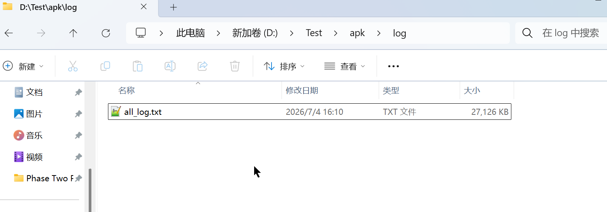

```bash
PS C:\Users\17867> adb logcat -d *:w | findstr /i com.tal.kaoyan
07-04 11:36:45.455  1303  1332 W BroadcastQueue: Background execution not allowed: receiving Intent { act=android.intent.action.PACKAGE_REMOVED dat=package:com.tal.kaoyan flg=0x4000010 (has extras) } to
#  省略 n 行
scontext=u:r:untrusted_app_27:s0:c47,c256,c512,c768 tcontext=u:object_r:app_data_file:s0:c47,c256,c512,c768 tclass=file
PS C:\Users\17867>
```

### 按日志级别过滤（Error、Warn、Info 等）

级别优先级：`V(Verbose) < D(Debug) < I(Info) < W(Warn) < E(Error) < F(Fatal) < S(Silent)`

```bash
# 只看错误日志
adb logcat *:E
# 只看警告+错误
adb logcat *:W
# 只看Info及以上（日常调试）
adb logcat *:I
```

### 按包名过滤（只抓目标 APP 日志，测试核心命令）

```bash
# 只打印TAG为MainActivity的所有级别日志
adb logcat MainActivity:* *:S
# 只打印TAG为Http的Error日志
adb logcat Http:E *:S
# 多TAG同时过滤
adb logcat Http:E Api:I Crash:* *:S
```

### 抓取崩溃日志

一些特定的错误信息关键字，也可以通过grep进行搜索

- crash：崩溃，代表app界面的闪退
- anr：Android No Response，安卓无响应 —— 界面提示无响应，是否关闭进程。

- timeout / exception：app开发人员自己标记的错误

```bash
#查看crash 崩溃日志
adb logcat -d | findstr /i crash
#查看anr 安卓未响应日志
adb logcat -d | findstr /i anr
#查看timeout开发人员自己编辑的错误日志
adb logcat -d | findstr /i timeout
#查看exception 开发人员自己编辑的错误日志
adb logcat -d | findstr /i exception
```

## 服务器端业务响应结果的模拟

应用场景：

通过伪造来自服务器的响应数据，测试移动app端（client）对服务器端的各种结果数据是否能正确展示

服务器响应数据的模拟（[[Fiddler]]）

手机通过代理服务器，连接服务器

- 配置并开启 fiddler 代理服务


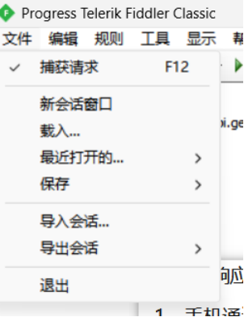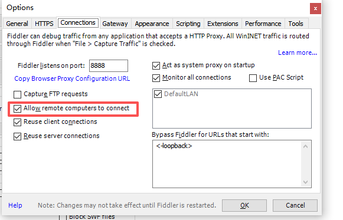

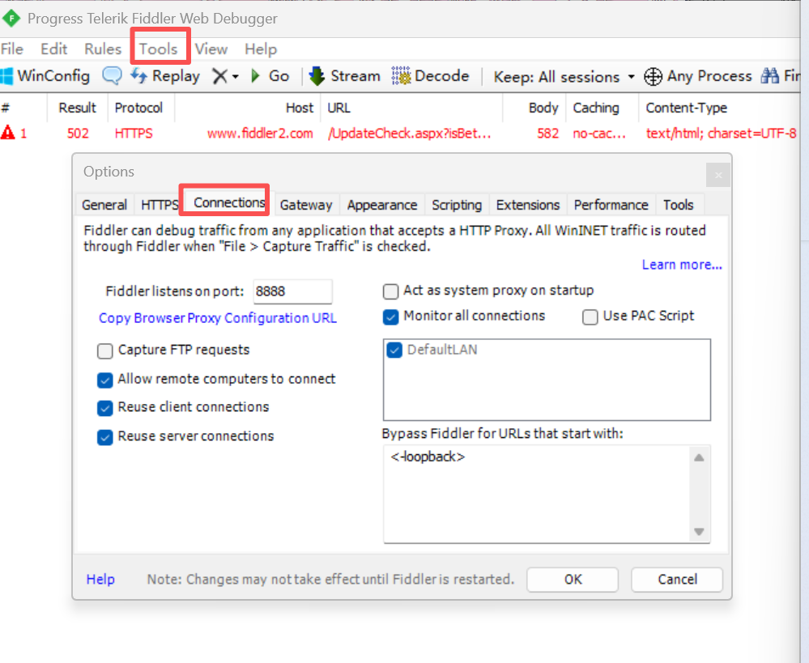

### 打开模拟器

- 确认配置生效（注意：请先关闭手机浏览器中的安全警告提示框）

 如果证书没有关闭先关闭证书，然后打开fiddler

关闭掉 网站里面的显示安全警告

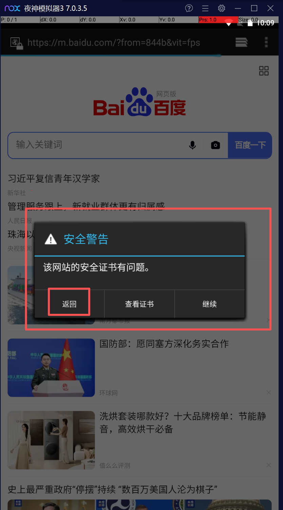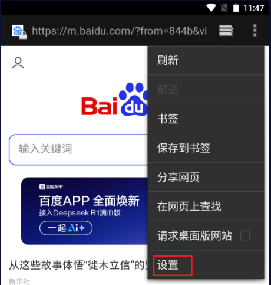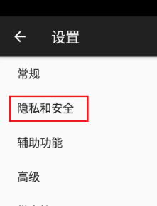


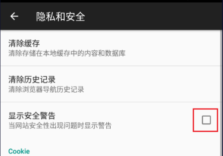

```BASH
# 找到本机的IP :
ipconfig
```

- 手机端设置：通过代理服务器上网 （IP）

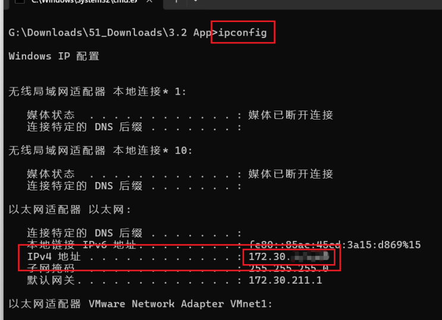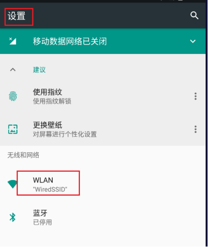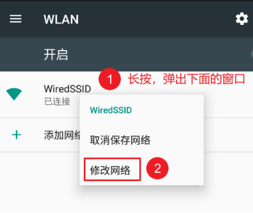


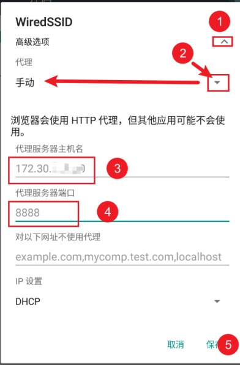

### 安装服务器

```JS
www.baidu.com; localhost; 127.0.0.1; train.atstudy.com; dict.youdao.com; www.youdao.com; cloud.seafile.com; shop.ecmobile.cn; www.51testing.com; 172.30.212.116;  (是本机IP)
```

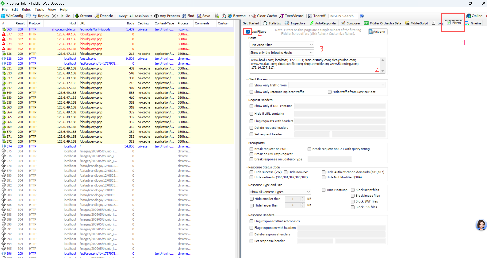

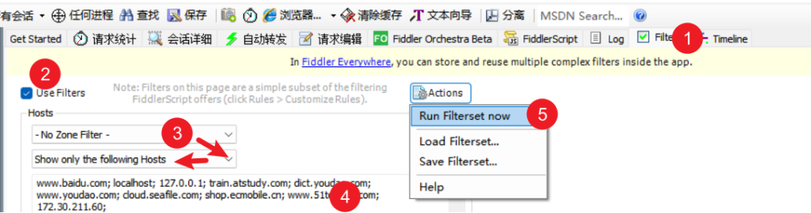

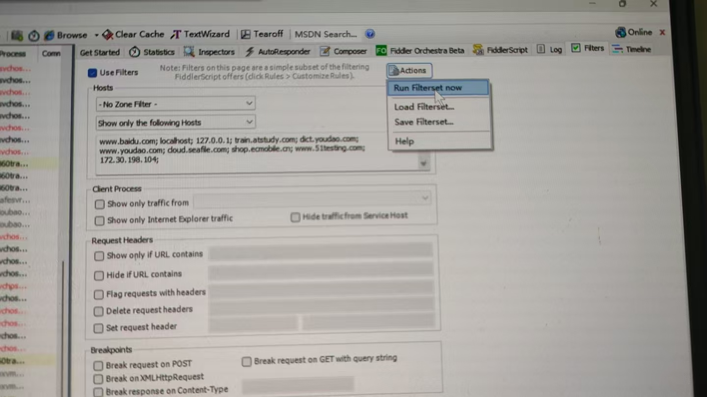

- Fiddler中设置请求转向转发（域名 转 IP）：将对某域名的**所有请求**均转发给另行指定的内网服务器  : (是本机IP)

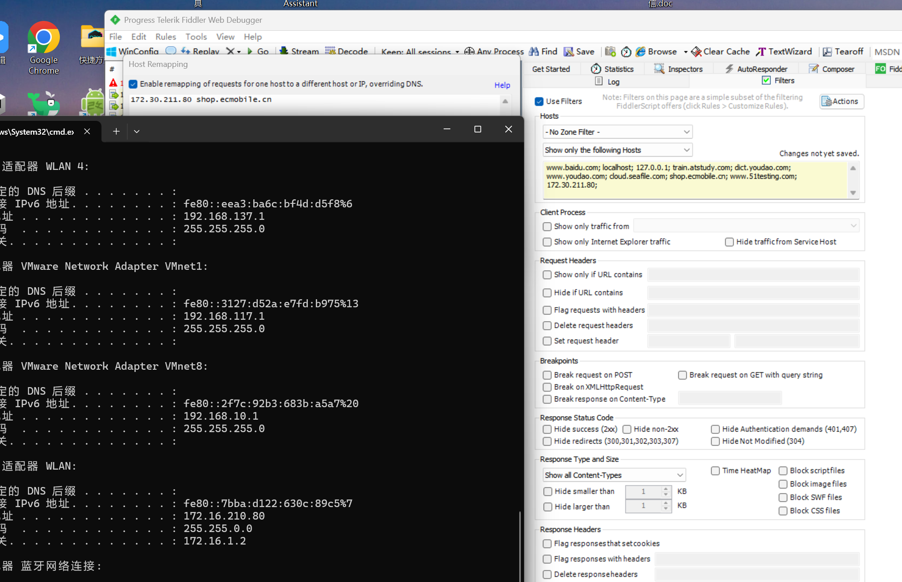

```Bash
# (是本机IP)
172.30.212.116 shop.ecmobile.cn
```

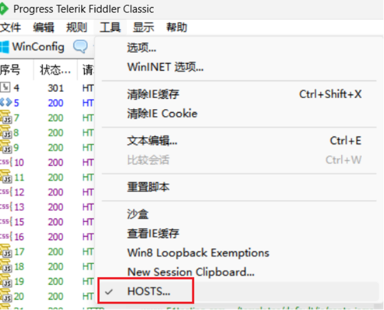


```Bash
# : (是本机IP)  
172.16.207.217  shop.ecmobile.cn
```

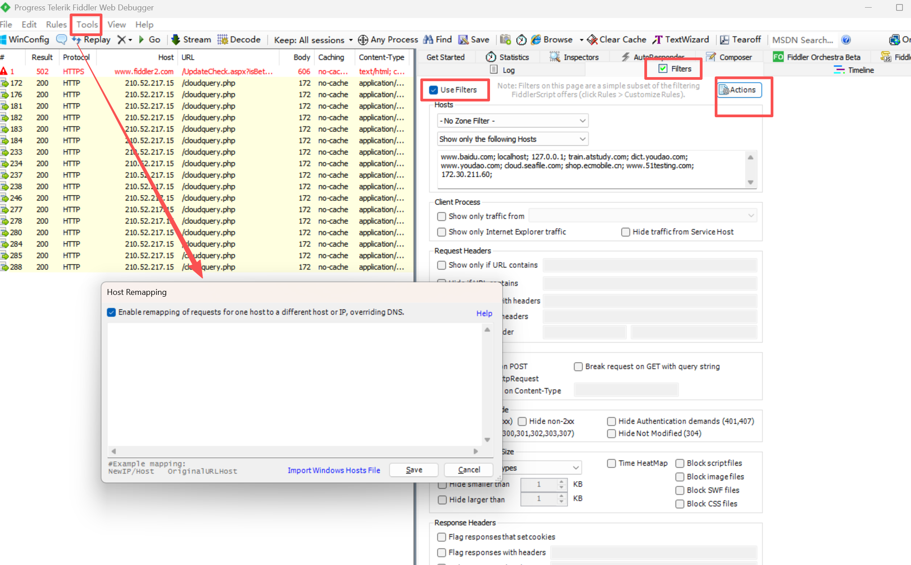

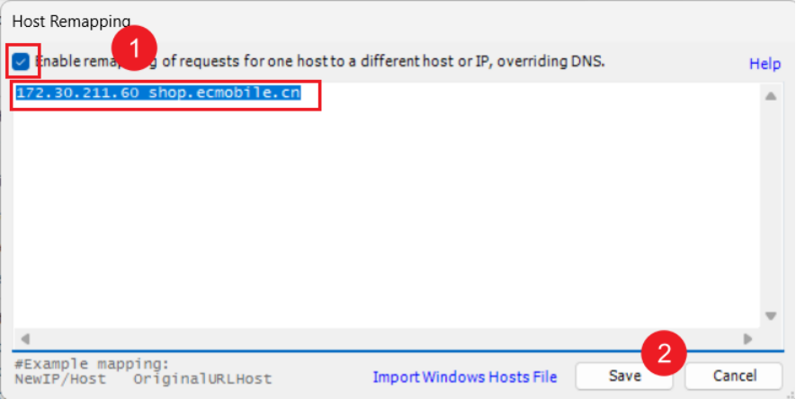

 具体IP :(是本机IP)

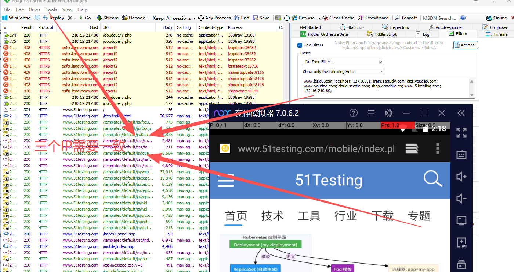

确认手机App工作正常：

<http://www.51testing.com/>

```TEXT
如果链接不上网，就在用夜神模拟器助手，新打开一个模拟器，然后就可以了，主要是因为模拟器本身的IP可能被占用
```

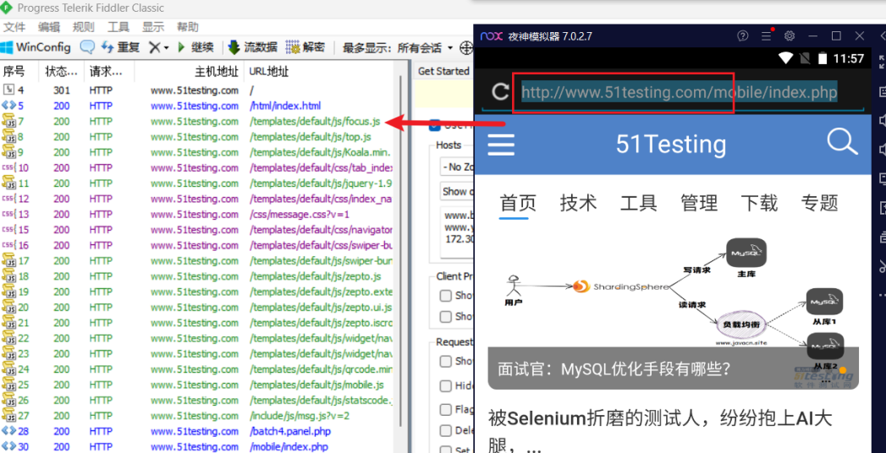

## am [子命令] [参数]

Android shell 提供的Activity（活动）管理工具

语法：**am start package/activity**:启动某界面

1. 只看自己安装的第三方 App

   ```bash
   C:\Windows\System32>adb shell pm list packages -3
   package:com.tal.kaoyan
   package:com.tencent.mm
   ```

2. 打开你要操作的 APP，停留在首页，直接运行：拿到包名后，查启动页 Activity

   ```bash
   C:\Windows\System32>adb shell dumpsys window | findstr mCurrentFocus
     mCurrentFocus=Window{b1bb107 u0 com.tal.kaoyan/com.tal.kaoyan.ui.activity.HomeTabActivity}
   ```

## 在windows下，启动shell内部命令

### adb shell执行命令有2种方式

1. 先执行adb shell，然后**在shell环境内**执行linux命令

​    因为输出在安卓设备中，所以需要对输出结果重定向时，只能选择安卓系统中的文件

1. **在window下**，直接adb shell Linux命令

因为输出在windows中，所以需要对输出结果重定向时，只能选择windows目录中的文件

### adb shell [shell内部命令]

 —— windows 中运行 Android 中的(shell)命令

```bash
 adb shell ls；adb shell am start ...
 #列出了 Android 设备 /data/data 目录下的所有文件和目录然后显示输入内容的最后 10 行
 adb shell ls /data/data | adb shell tail

 #在 ls -l /data/data 输出的详细列表内容中，查找所有包含 “ecmobile”（不区分大小写）的行
 adb shell ls -l /data/data |findstr /i ecmobile

 #adb shell grep -i ecmobile 会在 ls -l /data/data 输出的详细列表中，查找所有包含 “ecmobile”（不区分大小写）的行，并将这些行输出
 adb shell ls -l /data/data |adb shell grep -i ecmobile

 ----------------------------------------------------------------------------------
 adb shell "ls -l /data/data | grep -i ecmobile "
```

## 性能测试

考虑方面

- 界面操作的响应时间
- （硬件）资源的消耗
- 吞吐量（单位时间处理事务的数量）

### 界面操作的响应时间

测试方法：通过app的日志，查看界面（Activity）加载的完成时间

1. 首先，adb logcat -c
2. 其次，切换app的界面测试
3. 最后，adb logcat -d | findstr /i displayed

```bash
adb logcat -c

#关闭APP，重新打开APP,然后执行下面命令
切换app的界面测试

adb logcat -d | findstr /i displayed

 #adb logcat -d 输出的日志内容中，查找所有包含 “displayed”（不区分大小写）的日志行，并将这些日志行输出到控制台
 #在优化应用的界面显示性能时，该命令可用于查找与界面显示时机、渲染时间等相关的日志，帮助开发者了解界面显示过程中的性能瓶颈，从而针对性地进行优化。

 adb logcat -d | findstr /i displayed
```

```bash
# 登录界面
A0_SigninActivity
# 商品列表页面
B1_ProductListActivity
#产品详情页
B2_ProductDetailActivity
#应用启动页
StartActivity
#主界面
EcmobileMainActivity
#购物车
C0_ShoppingCartActivity
#可能提供地址类型选择功能
F1_NewAddressActivity
# 展示产品规格信息的界面组件
SpecificationActivity
这类日志主要用于分析 Android 应用的界面启动性能：
开发 / 测试人员可通过耗时数据，判断 Activity 启动是否 “卡顿”（若耗时过长，需排查页面初始化、资源加载等环节的性能问题）。
对比不同 Activity 的耗时，能定位哪类页面（如启动页、主界面、功能页）的启动性能存在优化空间。
结合业务流程（如 “启动应用→登录→进入商品列表→回到主界面”），可评估整个用户操作路径的界面加载效率。
```

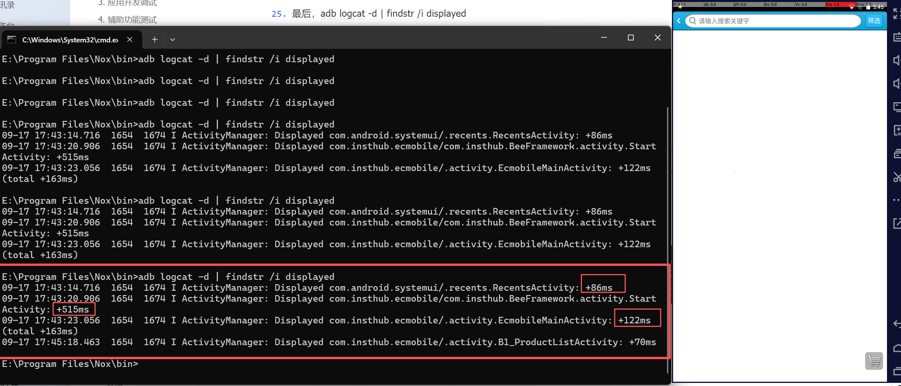

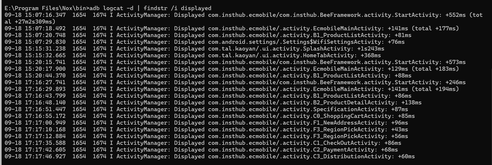

- 首屏启动时间
  - 首次安装后，启动软件的时间：安装好app之后，第一次运行的Activity界面消耗的时间
  - 非首次的软件启动时间：

```bash
09-23 13:50:50.309  2180  2200 I ActivityManager: Displayed com.android.packageinstaller/.UninstallerActivity: +120ms

am start com.insthub.ecmobile/com.insthub.ecmobile.activity.StartActivity

am start com.insthub.ecmobile/com.insthub.ecmobile.activity.B1_ProductListActivity

am start com.insthub.ecmobile/com.insthub.ecmobile.activity.A1_SignupActivity

com.insthub.ecmobile/.activity.A1_SignupActivity

09-23 13:51:10.590  2180  2200 I ActivityManager: Displayed com.insthub.ecmobile/com.insthub.BeeFramework.activity.StartActivity: +543ms (total +19s218ms)
09-23 13:51:12.705  2180  2200 I ActivityManager: Displayed com.insthub.ecmobile/.activity.GalleryImageActivity: +149ms
09-23 13:51:17.967  2180  2200 I ActivityManager: Displayed com.insthub.ecmobile/.activity.EcmobileMainActivity: +121ms
09-23 13:51:26.472  2180  2200 I ActivityManager: Displayed com.insthub.ecmobile/.activity.D1_CategoryActivity: +81ms
09-23 13:51:31.607  2180  2200 I ActivityManager: Displayed com.insthub.ecmobile/.activity.A0_SigninActivity: +67ms
09-23 13:51:48.229  2180  2200 I ActivityManager: Displayed com.insthub.ecmobile/.activity.A1_SignupActivity: +102ms
09-23 13:52:45.197  2180  2200 I ActivityManager: Displayed com.insthub.ecmobile/.activity.F0_AddressListActivity: +121ms
09-23 13:52:49.256  2180  2200 I ActivityManager: Displayed com.insthub.ecmobile/.activity.F1_NewAddressActivity: +75ms
09-23 13:53:01.593  2180  2200 I ActivityManager: Displayed com.insthub.ecmobile/.activity.F3_RegionPickActivity: +60ms
```

### **冷启动：**app进程未运行（强制退出，或是kill掉之后的启动）

***语法*** *am start -S -W 包名/启动的Activity* -S表示在启动前先强制停止应用，-W表示等待启动完成

主要查看This Time

测试内容：app首次启动时间、非首次启动时间

测试方法：adb shell命令

```bash
 #冷启动
 adb shell am start -S -W -n 包/activity


```

在 `adb shell am start -S -W -n 包/activity` 命令中，`-n` 是 `--component` 的缩写形式，用于指定要启动的组件（component），其格式为 **包名/活动名（package/activity）**。通过 `-n` 参数可以明确告知 Android 系统具体要启动哪个应用的哪个活动（Activity） 。

例如，要启动微信的主界面 Activity，假设微信的包名为 `com.tencent.mm`，主界面 Activity 为 `com.tencent.mm.ui.LauncherUI`，那么完整的命令可能是：

```Bash
adb shell am start -n com.tencent.mm/com.tencent.mm.ui.LauncherUI
```

在这里，`-n com.tencent.mm/com.tencent.mm.ui.LauncherUI` 指明了要启动的组件是微信应用（`com.tencent.mm` 包）中的 `LauncherUI` 活动。

其他参数含义如下：

- `-S`：启动目标 Activity 前，强制停止该 Activity 所在应用的所有其他 Activity。
- `-W`：等待启动完成，并输出启动操作的详细信息，如启动耗时等。

```Bash
10-23 15:16:40.040  2172  2192 I ActivityManager: Displayed com.tencent.mm/.plugin.account.ui.RegByMobileRegAIOUI: +84ms
```

指标：<=700ms   <=500ms

```Bash
微信冷热启动
adb shell am start -S -W com.tencent.mm/.plugin.account.ui.RegByMobileRegAIOUI
adb shell am start  -W com.tencent.mm/.plugin.account.ui.RegByMobileRegAIOUI

ecmobile 冷热启动

adb shell am start -S -W com.insthub.ecmobile/.activity.EcmobileMainActivity
adb shell am start  -W com.insthub.ecmobile/.activity.EcmobileMainActivity
```

### **热启动：**app进程有常驻在后台，然后被唤醒（检测方式，参照冷启动）

一般来说，耗时的时长：首次安装后启动 > 冷启动 > 热启动

```Bash
 adb logcat -c


#在包 com.insthub.ecmobile 下的 activity 目录（这里是一种路径表示，实际代码结构不一定完全对应）中的 EcmobileMainActivity 类，即应用的主活动类。通过包名和类名的组合，系统能够准确找到并启动指定的 Activity。
#当应用在启动过程中出现异常，如崩溃、黑屏等问题时，使用 -S 选项以全新状态启动应用，排除因残留进程或数据导致的问题。同时， -W 选项输出的启动信息可以帮助开发者了解应用在启动的哪个阶段出现了问题，例如是在加载资源阶段崩溃，还是在获取焦点阶段出现异常，进而快速定位和解决问题。
 #adb shell am start -W com.insthub.ecmobile/.activity.EcmobileMainActivity


```

注意：该时间的组成由 手机端app的加载，请求传输的时长，服务器处理的时长，响应传输的时长，app页面的呈现时长共同决定。

—— 所以当app显示慢的时候，需要确认主体时长是哪里（例如服务器的负载，造成长时间未响应）


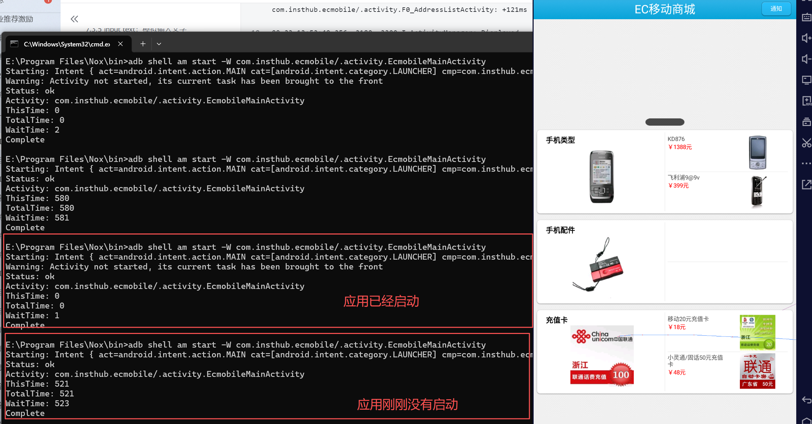

- （不同）页面间的切换时间

```Bash
 # adb logcat -d 输出的日志内容里，搜寻所有包含 “displayed”（不区分大小写）的日志行，并将这些日志行显示在控制台
 adb logcat -d | findstr /i displayed
```


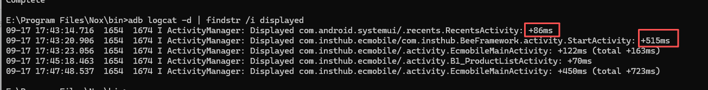

打开要查找界面的应用在当前窗口：

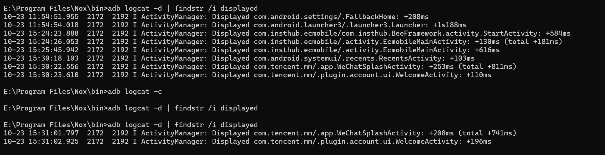

测试策略

1. 需要运行3~5次，取平均值，作为性能是否OK的参照值

—— 可以参照响应时间 2/5/8 秒的原则，判断是否需要进行性能调优

#### （硬件）资源的消耗：存储空间

- 机身存储占用：apk的大小

##### du -sHh 目录: 机身存储占用查看

```Bash
 adb shell
 #统计的是应用运行过程中产生的所有数据的大小，这些数据是应用在使用过程中不断积累和变化的，反映了应用实际使用数据所占用的空间。比如一个新闻应用，其下载并缓存的新闻文章、图片等数据都在这个目录统计范围内。
 du -sHh /data/data/com.insthub.ecmobile/
 #主要统计的是应用安装时所占用的空间，即安装包本身及相关安装元数据的大小。这个大小在应用安装后通常不会有太大变化，除非应用进行升级安装，安装包大小改变或者安装过程中生成的辅助文件有变动。
 du -sHh /data/app/com.insthub.ecmobile-1/


```

### 执行后的数据对比与意义

- 对比：
  - 私有数据目录（`/data/data/...`）的大小，反映应用运行中积累的数据量（如缓存的图片、下载的文件、[[16-数据库]]增长等），会随使用不断变化。
  - 安装包目录（`/data/app/...`）的大小，反映应用安装包本身的体积，通常安装后变小（除非升级 APK）。
- 意义：
  - 若私有数据目录过大，可能是缓存未及时清理，需优化应用的缓存策略。
  - 若安装包目录异常大，需检查 APK 本身是否包含过多冗余资源，可通过瘦身（如移除无用库、压缩资源）优化。

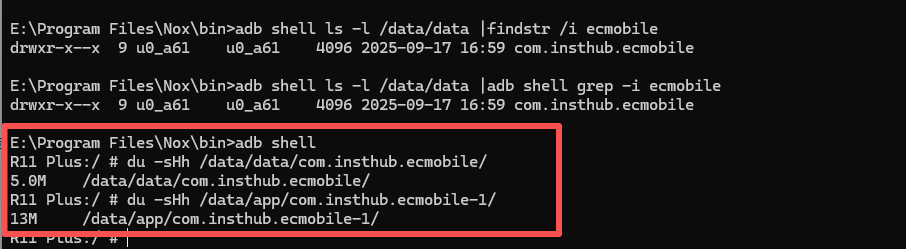

### 安装solopi

```Bash
adb install D:\DevWork\adbTest\apk\SoloPi.apk
```

1. ## 可靠性测试

### 稳定性测试

稳定性测试：只有非常长时间的随机操作，才可能暴露出软件中一些特殊操作中的错误

#### monkey：随机触屏操作

随机操作命令，用于对app做长时间的可靠性测试


**命令示例：**monkey -p com.insthub.ecmobile --ignore-crashes --throttle 500 -s 9 -vvv 300

```Bash
 #Monkey 工具会模拟用户对指定应用（com.insthub.ecmobile）进行 300 次随机操作（如点击、滑动、按键等），过程中忽略崩溃（--ignore-crashes）、控制操作间隔（--throttle 500）、固定随机种子（-s 9），并输出详细日志（-vvv），用于测试应用在大量随机操作下的稳定性，直到完成 300 次操作

 monkey -p com.insthub.ecmobile --ignore-crashes --throttle 500 -s 9 -vvv 300
```

**选项**

```Bash
    -p 包 .....：指定打开的包
--ignore-xxx：各种忽略异常
```


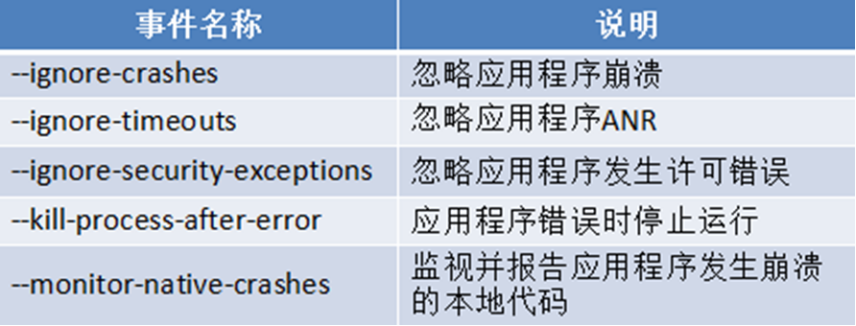

```Bash
--throttle 毫秒数：表示2个操作之间的间隔时间，也即操作的快慢或频率
    -s 数字：表示种子数，即当出现错误时，错误重复执行几次
    -vvv：日志详细程度，一个v最简约，3个V最详细
--pct-xxx：各种屏幕操作分布百分比
```

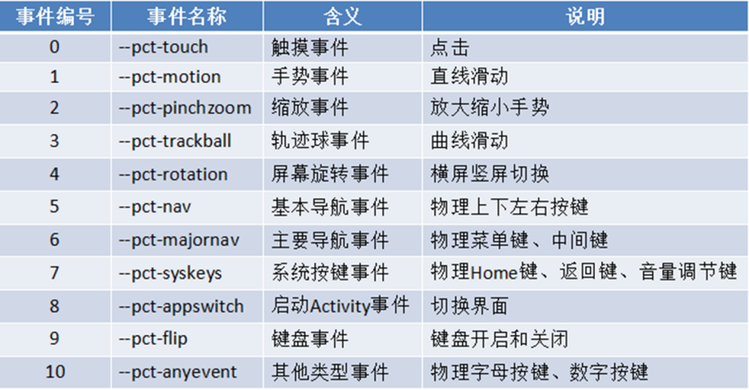

```Bash
    COUNT：模拟事件（操作）的数量，即间接的决定操作手机的时间
```


测试策略

1. 先以10~30分钟为一轮，快速检查及修复稳定性的bug
2. 以上可以顺利完成后，再开始10小时，12小时，或是24小时的稳定性测试


事实方案

1. 通过自动化脚本（appnium）+ monkey，共同完成稳定性测试

—— 例如：登录页面需要有正确的用户名/密码，有些由特殊路径才能抵达的页面需要特地去覆盖


## 异常测试

- 断电
- 断网
- 程序异常退出


常见的应对处理方式：当程序在处理中的数据不应该被破坏，或者说回滚到之前的状态


## 网络测试

**网络分类**

- wifi
- 2g 》3g 》4g 》5g

**关注点**

- 不同网络下app的使用
- 上行/下行速率
  - 延时
  - 丢包率


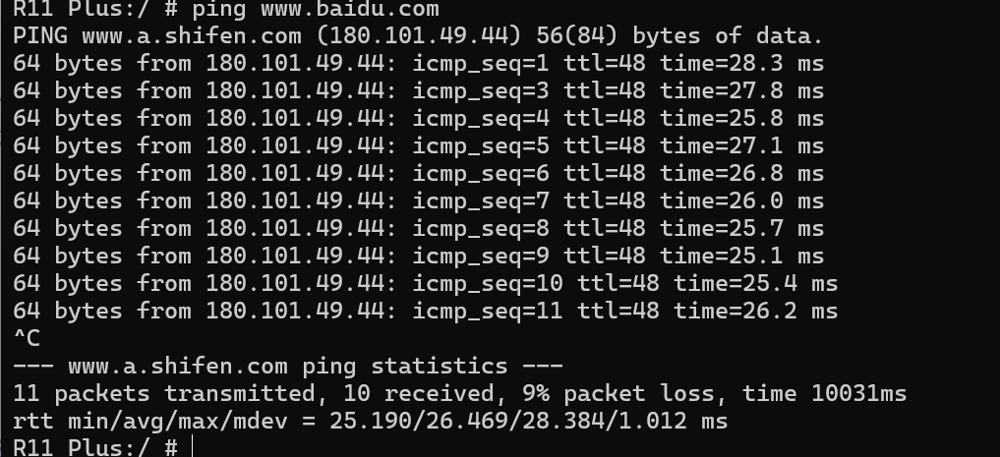

```Bash
9% packet loss：数据包丢失率为 9%。它是通过公式 (发送的数据包数 - 接收的数据包数) / 发送的数据包数 × 100% 计算得出，即 (11 - 10) / 11 × 100% ≈ 9%。数据包丢失可能是由于网络拥塞、网络故障、中间路由设备问题或目标主机负载过高导致无法及时响应等原因造成的

rtt min/avg/max/mdev = 25.190/26.469/28.384/1.012 ms：
rtt：即 Round - Trip Time（往返时间），指的是从发送数据包到接收到响应数据包所花费的时间。
min：最小往返时间为 25.190 毫秒。这是在所有成功接收的响应数据包中，往返时间最短的一次。它反映了在网络状况最佳时，数据包往返所需的时间。
avg：平均往返时间为 26.469 毫秒。它是通过将所有成功接收的响应数据包的往返时间相加，再除以接收的数据包数量得到的平均值，代表了网络连接的平均延迟情况。
max：最大往返时间为 28.384 毫秒。这是在所有成功接收的响应数据包中，往返时间最长的一次，显示了网络在最差情况下的延迟。
mdev：平均偏差为 1.012 毫秒。它衡量了往返时间的波动程度，数值越小，说明往返时间越稳定；数值越大，说明往返时间波动越大。
```

- 网络切换下app的使用

执行策略：高速 》低速 》高速；有网 》无网 》有网

- 弱网/无网测试

Fiddler进行弱网的模拟：

规则 》自定义规则 》查找并编辑“if (m_SimulateModem)” 》Performace - Simulate Modem

1. ## 其他测试

### 兼容性测试

考虑方面：

- 操作系统及版本
- 屏幕尺寸，分辨率
- 移动设备的使用环境：温度、压力


app版本的兼容性

- 覆盖的维度
  - Android系统的碎片化现象严重（截至 **2026 年 4 月 17 日**）
    - Android: 4.4 ~ 16
    - Android的各大厂的定制版本

#### 易用性测试

- **界面**是否美观易懂：图标，字体，大小  —— **风格要统一**，不能词不达意
- **操作**是否便捷：各组件的大小，摆放位置设计合理
- 与系统及第三方App的交互

#### 与手机系统及第三方中断衔接

- 短信、拨号、闹钟
  - 通知栏测试


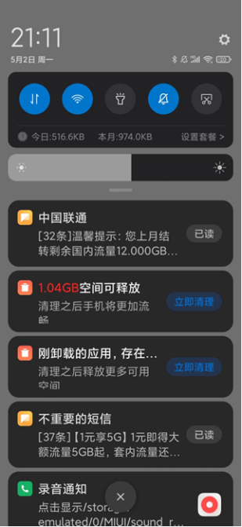

- 系统的中断及恢复
  - 来电接听
  - 息屏休眠
  - 关机

App从哪个页面中断的，应该回到哪个页面

- 与手机管理软件或安全软件的交互
  - 权限关闭
  - 关闭网络
  - 低电量提示
  - 温度太高提示
  - 内存不足提示

## 7.6 专项测试

1. **性能测试**

- **资源占用**
- 监测载具在运行过程中对CPU、内存、GPU等硬件资源的占用情况，确保不会导致游戏出现卡顿、掉帧甚至死机等问题。
- 观察在多人同时使用载具或场景中存在大量载具的情况下，资源占用是否在合理范围内，游戏是否能稳定运行。
- **帧率稳定性**
- 测试在不同场景（如复杂地形、多人场景、特效密集区域等）下使用载具时，游戏的帧率是否稳定，是否会出现明显的帧率波动或下降。
- 检查载具的各种操作和特效的播放是否会对帧率产生较大影响，例如载具发射武器特效时帧率是否会大幅下降。

1. **兼容性测试**

- **设备兼容性**
- 在不同类型和配置的设备上进行测试，包括手机、平板、PC等，确保载具在各种设备上都能正常显示、运行和操作，没有出现画面失真、卡顿、闪退等问题。
- 对于移动端，要测试不同分辨率、屏幕尺寸的设备，以及不同品牌和型号的手机和平板，检查载具的适配情况。
- **系统兼容性**
- 针对不同的操作系统版本，如安卓的不同版本、iOS的不同版本等，测试载具在各系统上的兼容性，确保其功能和性能不受系统差异的影响。

1. **安全测试**

- **数据安全**
- 检查载具相关数据的存储和传输是否安全，例如玩家购买载具、升级载具等数据是否正确保存，不会出现数据丢失、篡改或泄露的情况。
- 测试在网络不稳定或异常情况下，载具数据的同步是否正常，是否会出现数据不一致的问题。
- **漏洞测试**
- 查找是否存在利用载具可以进行的漏洞或作弊行为，如通过某种操作使载具获得无限资源、无敌状态，或者利用载具穿墙、瞬移等非法操作。

1. **异常测试**

- **网络异常**
- 在弱网、延迟高、网络波动等网络环境下，测试载具的各项功能是否仍然可用，是否会出现卡顿、操作无响应、数据不同步等问题。
- 模拟网络中断的情况，检查载具在网络恢复后是否能正常恢复状态，是否会出现数据异常或功能损坏。
- **操作异常**
- 快速连续地进行载具的各种操作，如频繁召唤和取消载具、快速切换载具功能等，检查是否会导致游戏崩溃或载具出现异常状态。
- 尝试在不满足载具使用条件的情况下进行操作，如在没有足够资源或不符合场景要求时使用载具，查看是否能正确给出提示并限制操作。
- **场景异常**
- 将载具放置在一些特殊场景位置或地形中，如地图边界、悬空位置、水下等，检查载具是否会出现异常行为，如漂浮、下沉过快、无法操作等。
- 测试在场景加载不完整或出现错误的情况下，载具的表现是否正常，是否会受到场景异常的影响而无法使用或出现异常显示。
