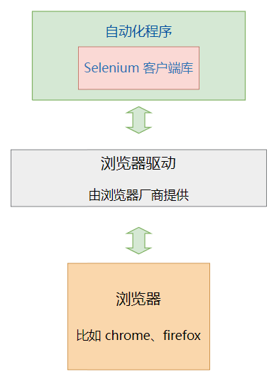
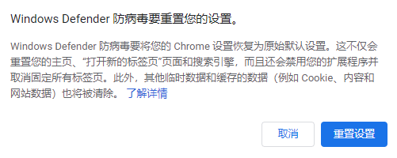

## 原理

Selenium 是目前主流的  **Web浏览器 自动化方案** 。

通过它，我们可以写出自动化程序，像人一样在浏览器里操作web界面。 比如点击界面按钮，在文本框中输入文字 等操作。

而且还能从web界面获取信息。  比如获取 火车、汽车票务信息，招聘网站职位信息，财经网站股票价格信息 等等，然后用程序进行分析处理。

Selenium 的自动化原理是这样的




从上图可以看出：

我们写的自动化程序 需要使用 **客户端库**。

我们程序的自动化请求都是通过这个库里面的编程接口发送给浏览器。

比如，我们要模拟用户点击界面按钮， 自动化程序里面就应该 调用客户端库相应的函数， 就会发送 **点击元素** 的请求给 下方的 **浏览器驱动**。 然后，浏览器驱动再转发这个请求给浏览器。

这个自动化程序发送给浏览器驱动的请求 是HTTP请求。

客户端库从哪里来的？ 是Selenium组织提供的。

Selenium组织提供了多种 编程语言的Selenium客户端库， 包括 Java，Python，js， ruby等，方便不同编程语言的开发者使用。

我们只需要安装好客户端库，调用这些库，就可以发出自动化请求给浏览器咯。

**浏览器驱动** 也是一个独立的程序，是由浏览器厂商提供的， 不同的浏览器需要不同的浏览器驱动。 比如 Chrome浏览器和 火狐浏览器有 各自不同的驱动程序。

浏览器驱动接收到我们的自动化程序发送的界面操作请求后，会转发请求给浏览器， 让浏览器去执行对应的自动化操作。

浏览器执行完操作后，会将自动化的**结果**返回给浏览器驱动， 浏览器驱动再通过HTTP响应的消息返回给我们的自动化程序的客户端库。

自动化程序的客户端库 接收到响应后，将结果转化为   `数据对象`  返回给 我们的代码。

我们的程序就可以知道这次自动化操作的结果如何了。


我们再总结一下，selenium 自动化流程如下：

1. 自动化程序调用Selenium 客户端库函数（比如点击按钮元素）
2. 客户端库会发送Selenium 命令 给浏览器的驱动程序
3. 浏览器驱动程序接收到命令后 ,驱动浏览器去执行命令
4. 浏览器执行命令
5. 浏览器驱动程序获取命令执行的结果，返回给我们自动化程序
6. 自动化程序对返回结果进行处理

## 安装

Selenium环境的安装主要就是安装3样东西：  `客户端库` ，`浏览器 驱动` 和 `浏览器` 。

其中，浏览器的安装非常简单，就是应用程序安装，无需这里特别讲解。

主要讲一下 `客户端库` 和 `浏览器 驱动` 的安装。

### 客户端库不同的编程语言选择不同的Selenium客户端库

对应我们Python语言来说，Selenium客户端库的安装非常简单，用 pip 命令即可。

打开 命令行程序，运行如下命令

```undefined
pip install selenium
```

如果安装比较慢，可以指定使用国内的清华大学源

```bash
pip install selenium -i https://pypi.tuna.tsinghua.edu.cn/simple
```

### 浏览器驱动不同的浏览器 需要选择不同的浏览器驱动

即使是同一种浏览器，自动化时， 使用的 浏览器驱动程序 也要 **版本匹配** 。

以前做selenium自动化，浏览器驱动 都是自己下载的。

商业浏览器 比如 Chrome, Edge, Firefox, Safari 都会自动更新版本， 而下载的浏览器驱动却不会自动更新。

这就会导致 selenium自动化一个常见的问题：浏览器驱动和浏览器的版本不匹配。

为了解决这个问题， 现在新版 Python Selenium 客户端库内置了一个 `selenium manager` 工具， 运行Selenium程序时， 它可以帮我们自动下载 浏览器和浏览器驱动。

所以，现在最简单的方法就是让 Selenium Mananger 自动帮你下载安装 浏览器驱动 。

#### Edge 驱动 自动安装Windows上，Edge浏览器缺省就会有，所以 Windows上基于 Edge浏览器的自动化，环境搭建最简单

如果你是Mac用户，[点击这里](https://www.microsoft.com/edge)下载安装一下。

下面的代码, 可以自动化的 打开 Edge浏览器，并且自动化打开 白月黑羽网站。

这个代码后面会详细讲解，这里大家先了解 代码里面哪行是执行自动下载的 即可。

```py
from selenium import webdriver

wd = webdriver.Edge() # 指定 Edge 浏览器，会自动下载驱动

wd.get('https://www.byhy.net')

input('按回车退出')
```

第3行代码里面的 `Edge` 指定了要自动化的是 Edge浏览器。

Selenium Mananger会自动检查系统是否安装了对应浏览器，如果没有就下载安装。

然后看是否有该浏览器 对应版本的驱动，如果没有就下载安装。

Selenium Mananger下载的驱动在本机的路径通常是：

```bash
# Windows
C:\Users\用户名\.cache\selenium\msedgedriver\win64\版本号\msedgedriver.exe

# Mac
/Users/用户名/.cache/selenium/msedgedriver/mac-arm64/版本号/msedgedriver
```

如果上面的这种安装方式 符合你的自动化需求，安装这一节后面的其它内容可以跳过去不用看，节省时间。

#### Chrome 驱动 自动安装如果，你要自动化的是 Chrome浏览器，该怎么做呢？

如果电脑上还没有安装Chrome浏览器，可以[点击这里，下载安装谷歌浏览器](https://www.google.cn/chrome/) 。

然后，就可以运行代码了。比如，要使用Chrome浏览器，就这样写

```py
from selenium import webdriver

wd = webdriver.Chrome() # 指定 Chrome 浏览器，会自动下载驱动

wd.get('https://www.byhy.net')

input('按回车退出')
```

海外用户，这样就可以了，和自动化Edge一样的方便。

但是国内用户，就可能有问题。

`selenium-manager`  对 Chrome浏览器驱动， 会去网址  `https://googlechromelabs.github.io/chrome-for-testing/known-good-versions-with-downloads.json` 查询各版本驱动下载网址，

这个网址在国内， 不同网络环境，有的能访问，有的不能访问，有的访问速度很慢 会卡顿很久。

`selenium-manager`  可以通过 设置环境变量 `SE_DRIVER_MIRROR_URL` 的值，指定驱动源的URL

比如，可以设置为 阿里的源  `https://cdn.npmmirror.com/binaries/chrome-for-testing`

Windows系统命令行窗口， 可以使用如下命令

```sh
set SE_DRIVER_MIRROR_URL=https://cdn.npmmirror.com/binaries/chrome-for-testing
```

Mac系统命令行窗口， 可以使用如下命令

```sh
export SE_DRIVER_MIRROR_URL=https://cdn.npmmirror.com/binaries/chrome-for-testing
```

也可以在代码最前面，加上如下代码，通过设置环境变量，指定使用国内的源

```py
# 指定 Chrome Driver下载源；
import os
os.environ['SE_DRIVER_MIRROR_URL'] = 'https://cdn.npmmirror.com/binaries/chrome-for-testing'
```

这样设置后，Selenium根据该网址这个 文件   `https://cdn.npmmirror.com/binaries/chrome-for-testing/known-good-versions-with-downloads.json` 检查从哪里下载Chrome浏览器驱动。

这是国内网址，总应该没问题了吧？

但是，仍然可能有问题：

打开这个文件可以发现，里面的下载地址，都是  `storage.googleapis.com`   这个海外镜像的域名，  不是本站下载网址。

这些镜像文件只是单纯的同步文件，至于里面的内容包含的URL，不会相应的替换为本站的地址。

`storage.googleapis.com` 这个域名，目前实战班大部分学员使用没有问题。

如果还是有问题，可以使用后文介绍的 手动下载浏览器驱动的方法。

#### Chrome 驱动 手动下载如果 Selenium Manager 不能自动下载安装 Chrome 浏览器驱动，可以 **手动下载**

Chrome浏览器安装好以后，接下来就是安装浏览器驱动  `ChromeDriver`

点击打开这个网址： [Chrome driver 国内镜像地址](https://registry.npmmirror.com/binary.html?path=chrome-for-testing/)

查看一下Chrome浏览器的版本， 选择当前的版本的浏览器对应的版本的驱动。

注意：浏览器和驱动的大版本号一定要匹配，小版本号尽量接近即可，不一定需要完全一致。

下载后，可以把 chromedriver.exe 放到环境变量 `PATH`  指定的其中一个目录里面，代码无需做任何修改。

因为Selenium会 优先在环境变量 `PATH` 的那些路径里面 找浏览器驱动。

如果你不想放在环境变量 `PATH` 中，就需要代码里面指定浏览器驱动路径，如下：

```py
from selenium import webdriver

# 指定驱动路径
from selenium.webdriver.chrome.service import Service
wd = webdriver.Chrome(service=Service(r"d:\tools\chromedriver.exe"))

wd.get('https://www.byhy.net')

input('按回车退出')
```

手动下载Chrome 驱动的弊病前面讲过，就是当浏览器自动升级时，可能现有的驱动和其不匹配，需要重新手动下载

否则，selenium manager还会尝试下载对应版本的新的驱动，如果下载不成功，自动化就会失败。

## 代码讲解

下面的代码, 可以自动化的 打开Chrome浏览器，并且自动化打开百度网站，可以大家可以运行一下看看。

```py
from selenium import webdriver

# 创建 WebDriver 对象
wd = webdriver.Chrome()

# 调用WebDriver 对象的get方法 可以让浏览器打开指定网址
wd.get('https://www.byhy.net')

# 程序运行完会自动关闭浏览器，就是很多人说的闪退
# 这里加入等待用户输入，防止闪退
input('按回车退出')

# 关闭浏览器窗口
wd.quit()
```

其中，第4行代码，就会运行浏览器驱动，并且运行Chrome浏览器

```py
wd = webdriver.Chrome()
```

注意，等号右边 返回的是 WebDriver 类型的对象，我们可以通过这个对象来操控浏览器，比如 打开网址、选择界面元素等。

而第7行代码，就是使用 WebDriver 的 get 方法 打开网址

```py
wd.get('https://www.byhy.net')
```

执行上面这行代码时，自动化程序就发起了 打开百度网址的 `请求消息`  ，通过浏览器驱动， 给 Chrome浏览器。

Chome浏览器接收到该请求后，就会打开网址，通过浏览器驱动， 告诉自动化程序  打开成功。

## 常见问题

### 关闭 chromedriver 日志

缺省情况下 chromedriver被启动后，会在屏幕上输出不少日志信息，如下

```ruby
DevTools listening on ws://127.0.0.1:19727/devtools/browser/c19306ca-e512-4f5f-b9c7-f13aec506ab7
[21564:14044:0228/160456.334:ERROR:device_event_log_impl.cc(211)] [16:04:56.333] Bluetooth: bluetooth_adapter_winrt.cc:1072 Getting Default Adapter failed.
```

可以这样关闭

```py
from selenium import webdriver

# 加上参数，禁止 chromedriver 日志写屏
options = webdriver.ChromeOptions()
options.add_experimental_option(
    'excludeSwitches', ['enable-logging'])

# 这里指定 options 参数
wd = webdriver.Chrome(options=options)
```

Edge浏览器驱动，也可以使用这个参数，比如

```py
options = webdriver.EdgeOptions() # 注意：这里是 EdgeOptions
options.add_experimental_option(
    'excludeSwitches', ['enable-logging'])

wd = webdriver.Edge(options=options)
```

### 浏览器首页显示防病毒重置设置

有的朋友的电脑上Selenium自动化时，浏览器开始显示如下



可以这样解决：

- 命令行输入  `regedit`  ，运行注册表编辑器
- 在左边的目录树找到  `HKEY_CURRENT_USER\Software\Google\Chrome`
- 删除其下的  `TriggeredReset` 子项
- 关闭 注册表编辑器

## 扩展知识

浏览器和驱动之间的接口是各浏览器厂商私有的，通常我们无需关心。

喜欢刨根问底的朋友，可以参考 [这个链接，了解 `Chrome浏览器`  和  `浏览器驱动` 之间的接口](https://chromedevtools.github.io/devtools-protocol/)
