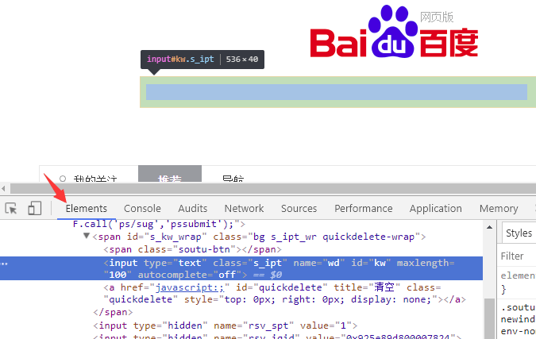
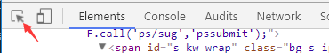
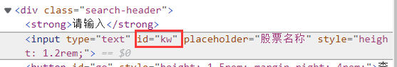

如果我们想自动化输入 `股票名称` ，怎么做呢？

这就是在网页中，操控界面元素。

web界面自动化，要操控元素，首先需要 `选择` 界面元素 ，或者说  `定位`  界面元素

就是 先告诉浏览器，你要操作 `哪个` 界面元素， 让它找到你要操作的界面元素。

我们必须要让浏览器 **先找到元素，然后，才能操作元素**。

## 选择元素的方法

对应web自动化来说， 就是要告诉浏览器，你要操作的界面元素是什么。

那么，怎么告诉浏览器 呢？

方法就是：告诉浏览器，你要操作的这个 web 元素的  `特征`  。

就是告诉浏览器，这个元素它有什么与众不同的地方，可以让浏览器一下子找到它。

元素的特征怎么查看？

可以使用浏览器的  `开发者工具栏`  帮我们查看、选择 web 元素。

请大家用chrome浏览器访问百度，按F12后，点击下图箭头处的 `Elements` 标签，即可查看页面对应的HTML 元素



然后，再点击 最左边的图标，如下所示



之后，鼠标在界面上点击哪个元素，就可以查看 **该元素对应的html标签** 了。

比如，前面的图的高亮处，就是百度搜索输入框 对应的 input元素。

## 根据 id属性 选择元素

[点击这里，边看视频讲解，边学习以下内容](https://www.bilibili.com/video/BV14K8NzUEF3?p=5)

[请大家点击这里](https://www.byhy.net/cdn2/files/selenium/stock1.html)，打开我们的教学示例页面

页面上有个输入股票名称的输入框，使用鼠标右键菜单 查看该 input元素，会发现它有一个属性叫id。



我们可以把 id 想象成元素的编号， 是用来在html中标记该元素的。

根据规范， 如果元素有id属性 ，这个id 必须是当前html中唯一的。

所以如果元素有id， 根据id选择元素是最简单高效的方式。

这里，股票名称输入框 元素的 id值为 kw

下面的代码，可以自动化在浏览器中 访问我们的股票搜索网站，并且在输入框中搜索 `通讯` 。

大家可以运行一下看看。

```py
from selenium import webdriver
from selenium.webdriver.common.by import By
 
# 创建 WebDriver 对象
wd = webdriver.Chrome()
 
# 调用WebDriver 对象的get方法 可以让浏览器打开指定网址
wd.get('https://www.byhy.net/cdn2/files/selenium/stock1.html')
 
# 根据id选择元素，返回的就是该元素对应的WebElement对象
element = wd.find_element(By.ID, 'kw')
 
# 通过该 WebElement对象，就可以对页面元素进行操作了
# 比如输入字符串到 这个 输入框里
element.send_keys('通讯\n')
 
input('按回车退出') 
```

其中

```py
wd = webdriver.Chrome()
```

前面讲过，wd 赋值的是 WebDriver 类型的对象，我们可以通过这个对象来操控浏览器，比如 打开网址、选择界面元素等。

高亮的第11行代码

```py
wd.find_element(By.ID, 'kw')
```

使用了 WebDriver 对象 的方法  `find_element` ，

这行代码运行是，就会发起一个请求通过 浏览器驱动 转发给浏览器，告诉它，需要选择一个id为 kw 的元素。

浏览器 找到id为kw的元素后，将结果通过 浏览器驱动 返回给 自动化程序， 所以 find_element 方法会 返回一个 **WebElement 类型的对象**。

这个WebElement 对象可以看成是对应  `页面元素`  的遥控器。

我们通过这个WebElement对象，就可以 `操控` 对应的界面元素。

比如 ：

调用这个对象的 send_keys 方法就可以在对应的元素中 输入字符串，

调用这个对象的 click 方法就可以 **点击** 该元素。

如果根据 传入的ID，找不到这样的元素，find_element 方法就会抛出  `selenium.common.exceptions.NoSuchElementException` 异常


## 注意：find_element写法

Selenium 升级到版本 4 以后， 下面这种  `find_element_by_xxx` 方法都作为过期不赞成的写法

```py
# 初始化代码 ....

wd.find_element_by_id('username').send_keys('byhy')
wd.find_element_by_class_name('password').send_keys('sdfsdf')
wd.find_element_by_tag_name('input').send_keys('sdfsdf')
wd.find_element_by_css_selector('button[type=submit]').click()
```

运行会有告警，所以现在都要写成下面这种格式

```py
from selenium.webdriver.common.by import By

# 初始化代码 ....

wd.find_element(By.ID, 'username').send_keys('byhy')
wd.find_element(By.CLASS_NAME, 'password').send_keys('sdfsdf')
wd.find_element(By.TAG_NAME, 'input').send_keys('sdfsdf')
wd.find_element(By.CSS_SELECTOR,'button[type=submit]').click()
```

## 根据 class属性、tag名 选择元素

### 根据 class属性 选择元素

web自动化的难点和重点之一，就是如何  `选择`  我们想要操作的web页面元素。

除了根据元素的id ，我们还可以根据元素的  `class`  属性选择元素。

就像一个 学生张三 可以定义类型为 中国人 或者 学生一样， 中国人 和  学生 都是 张三 的 类型。

元素也有类型， class 属性就用来标志着元素 `类型`  ，

请大家 [点击打开这个网址](https://www.byhy.net/cdn2/files/selenium/sample1.html)

这个网址对应的html内容 有如下的部分

```html
    <body>
        
        <div class="plant"><span>土豆</span></div>
        <div class="plant"><span>洋葱</span></div>
        <div class="plant"><span>白菜</span></div>

        <div class="animal"><span>狮子</span></div>
        <div class="animal"><span>老虎</span></div>
        <div class="animal"><span>山羊</span></div>

    </body>
```

所有的植物元素都有个class属性 值为 plant。

所有的动物元素都有个class属性 值为 animal。

如果我们要选择 **所有的 动物**， 就像下面可以这样写，

```py
wd.find_elements(By.CLASS_NAME, 'animal')
```

注意element后面多了个s

注意

find_elements  返回的是找到的符合条件的  `所有` 元素 (这里有3个元素)， 放在一个  `列表`  中返回。

而如果我们使用  `wd.find_element`  (注意少了一个s) 方法，  就只会返回  **第一个**  元素。

大家可以运行如下代码看看。

```py
from selenium import webdriver
from selenium.webdriver.common.by import By

# 创建 WebDriver 实例对象，指明使用chrome浏览器驱动
wd = webdriver.Chrome()

# WebDriver 实例对象的get方法 可以让浏览器打开指定网址
wd.get('https://www.byhy.net/cdn2/files/selenium/sample1.html')

# 根据 class name 选择元素，返回的是 一个列表
# 里面 都是class 属性值为 animal的元素对应的 WebElement对象
elements = wd.find_elements(By.CLASS_NAME, 'animal')

# 取出列表中的每个 WebElement对象，打印出其text属性的值
# text属性就是该 WebElement对象对应的元素在网页中的文本内容
for element in elements:
    print(element.text)

input('按回车退出')     
```

首先，大家要注意： 通过 WebElement 对象的 `text属性` 可以获取该元素 在网页中的文本内容。

所以 下面的代码，可以打印出 element 对应 网页元素的 文本

```py
print(element.text)
```

如果我们把

```py
elements = wd.find_elements(By.CLASS_NAME, 'animal')
```

去掉一个s ，改为

```py
element = wd.find_element(By.CLASS_NAME, 'animal')
print(element.text)
```

那么返回的就是第一个class 属性为 animal的元素， 也就是这个元素

```html
<div class="animal"><span>狮子</span></div>
```

就像一个 学生张三 可以定义有 `多个` 类型： 中国人 和 学生 ， 中国人 和  学生 都是 张三 的 类型。

元素也可以有 `多个class类型` ，多个class类型的值之间用 `空格` 隔开，比如

```html
<span class="chinese student">张三</span>
```

注意，这里 span元素 有两个class属性，分别 是 chinese 和 student， 而不是一个 名为  `chinese student` 的属性。

我们要用代码选择这个元素，可以指定任意一个class 属性值，都可以选择到这个元素，如下

```py
element = wd.find_elements(By.CLASS_NAME,'chinese')
```

或者

```py
element = wd.find_elements(By.CLASS_NAME,'student')
```

而不能这样写

```py
element = wd.find_elements(By.CLASS_NAME,'chinese student')
```

类似的，我们可以通过指定 参数为 `By.TAG_NAME` ，选择所有的tag名为 div的元素，如下所示

```py
from selenium import webdriver
from selenium.webdriver.common.by import By

wd = webdriver.Chrome()

wd.get('https://www.byhy.net/cdn2/files/selenium/sample1.html')

# 根据 tag name 选择元素，返回的是 一个列表
# 里面 都是 tag 名为 div 的元素对应的 WebElement对象
elements = wd.find_elements(By.TAG_NAME, 'div')

# 取出列表中的每个 WebElement对象，打印出其text属性的值
# text属性就是该 WebElement对象对应的元素在网页中的文本内容
for element in elements:
    print(element.text)

input('按回车退出')     
```

### find_element 和 find_elements 的区别

使用  `find_elements` 选择的是符合条件的 `所有` 元素， 如果没有符合条件的元素， `返回空列表`

使用  `find_element` 选择的是符合条件的 `第一个` 元素， 如果没有符合条件的元素， `抛出 NoSuchElementException 异常`

## 通过WebElement对象选择元素

不仅 WebDriver对象有 选择元素 的方法，  WebElement对象 也有选择元素的方法。

WebElement对象  也可以调用 `find_elements`，  `find_element`  之类的方法

WebDriver  对象 选择元素的范围是 整个 web页面， 而

WebElement 对象 选择元素的范围是 该元素的内部。

```py
from selenium import webdriver
from selenium.webdriver.common.by import By

wd = webdriver.Chrome()

wd.get('https://www.byhy.net/cdn2/files/selenium/sample1.html')

element = wd.find_element(By.ID,'container')

# 限制 选择元素的范围是 id 为 container 元素的内部。
spans = element.find_elements(By.TAG_NAME, 'span')
for span in spans:
    print(span.text)

input('按回车退出')     
```

输出结果就只有

```py
内层11
内层12
内层21
```

👓 注意

后面会学到css选择元素，这样的代码

```py
element.find_element(By.CSS_SELECTOR, "div > div > span")
```

限制的是最后一个  `span` 必须在 element内部，

而前面的  `div > div`  **不一定** 需要在 在 element内部

在我们进行网页操作的时候， 有的元素内容不是可以立即出现的， 可能会等待一段时间。

比如 我们的股票搜索示例页面，  搜索一个股票名称， 我们点击搜索后， 浏览器需要把这个搜索请求发送给服务器， 服务器进行处理后，再把搜索结果返回给我们。

所以，从点击搜索到得到结果，需要一定的时间，

只是通常 服务器的处理比较快，我们感觉好像是立即出现了搜索结果。

搜索的每个结果 对应的界面元素 其ID 分别是数字 1， 2 ，3， 4 。。。

我们可以先用如下代码 将 第一个搜索结果里面的文本内容 打印出来

```py
from selenium import webdriver
from selenium.webdriver.common.by import By

wd = webdriver.Chrome()

wd.get('https://www.byhy.net/cdn2/files/selenium/stock1.html')

element = wd.find_element(By.ID, 'kw')

element.send_keys('通讯\n')


# 返回页面 ID为1 的元素
element = wd.find_element(By.ID,'1')
# 打印该元素的文字内容
print(element.text)

input('按回车退出')     
```

如果大家去运行一下，就会发现有如下异常抛出

```py
selenium.common.exceptions.NoSuchElementException: Message: no such element: Unable to locate element: {"method":"css selector","selector":"[id="1"]"}
```

`NoSuchElementException` 的意思就是在当前的网页上 找不到该元素， 就是找不到 id 为 1 的元素。


为什么呢？

因为我们的代码执行的速度比 网站响应的速度 快。

网站还没有来得及 返回搜索结果，我们就执行了如下代码

```py
element = wd.find_element(By.ID, '1')
```

在那短暂的瞬间， 网页上是没有用 id为1的元素的 （因为还没有搜索结果呢）。自然就会报告错误 id为1 的元素不存在了。

那么怎么解决这个问题呢？

很多聪明的读者可以想到， 点击搜索后， 用sleep 来 等待几秒钟， 等百度服务器返回结果后，再去选择 id 为1 的元素， 就像下面这样

```py
from selenium import webdriver
from selenium.webdriver.common.by import By

wd = webdriver.Chrome()

wd.get('https://www.byhy.net/cdn2/files/selenium/stock1.html')

element = wd.find_element(By.ID, 'kw')

element.send_keys('通讯\n')

# 等待 1 秒
from time import sleep
sleep(1)

element = wd.find_element(By.ID,'1')
print(element.text)

input('按回车退出')     
```

大家可以运行一下，基本是可以的，不会再报错了。


但是这样的方法 有个很大的问题，就是：设置等待多长时间合适呢？

这次百度网站反应可能比较快，我们等了一秒钟就可以了。

但是谁知道下次他的反应是不是还这么快呢？百度也曾经出现过服务器瘫痪的事情。

可能有的读者说，我干脆sleep比较长的时间， 等待 20 秒， 总归可以了吧？

这样也有很大问题，假如一个自动化程序里面需要10次等待， 就要花费 200秒。 而可能大部分时间， 服务器反映都是很快的，根本不需要等20秒， 这样就造成了大量的时间浪费了。

Selenium提供了一个更合理的解决方案，是这样的：

当发现元素没有找到的时候， **并不立即返回** 找不到元素的错误。

而是周期性（每隔半秒钟）重新寻找该元素，直到该元素找到，

或者超出指定最大等待时长，这时才 抛出异常（如果是 `find_elements` 之类的方法， 则是返回空列表）。

Selenium 的 Webdriver 对象 有个方法叫  `implicitly_wait`  ，可以称之为  `隐式等待` ，或者 `全局等待` 。

该方法接受一个参数， 用来指定  最大等待时长。

如果我们 加入如下代码

```py
wd.implicitly_wait(10)
```

那么后续所有的 `find_element` 或者  `find_elements` 之类的方法调用 都会采用上面的策略：

如果找不到元素， 每隔 半秒钟 再去界面上查看一次， 直到找到该元素， 或者 过了10秒 最大时长。

这样，我们的百度搜索的例子的最终代码如下

```py
from selenium import webdriver
from selenium.webdriver.common.by import By

wd = webdriver.Chrome()
wd.implicitly_wait(10)

wd.get('https://www.byhy.net/cdn2/files/selenium/stock1.html')

element = wd.find_element(By.ID, 'kw')

element.send_keys('通讯\n')


# 返回页面 ID为1 的元素
element = wd.find_element(By.ID,'1')

print(element.text)

input('按回车退出')     
```

大家再运行一下，可以发现不会有错误了。

那么是不是有了 `implicitwait` ， 可以彻底不用sleep了呢？

不是的，有的时候我们等待元素出现，仍然需要sleep。
