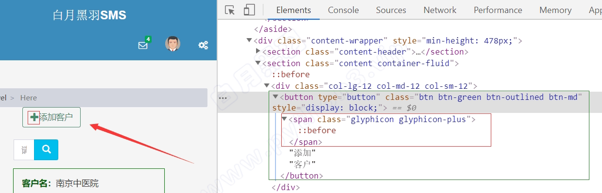

选择到元素之后，我们的代码会返回元素对应的 WebElement对象，通过这个对象，我们就可以 `操控` 元素了。

操控元素通常包括

- 点击元素
- 在元素中输入字符串，通常是对输入框这样的元素
- 获取元素包含的信息，比如文本内容，元素的属性

您需要高效学习，找工作？ [点击这里 白月黑羽实战班](https://www.byhy.net/adv/vipcourse/)

[点击查看学员就业情况](https://www.bilibili.com/read/readlist/rl416500)

## 点击元素[🏷️](https://www.byhy.net/auto/selenium/03/#h_0)

`点击元素` 非常简单，就是调用元素WebElement对象的 click方法。前面我们已经学过。

这里我们要补充讲解一点。

当我们调用 WebElement 对象的 click 方法去点击 元素的时候， 浏览器接收到自动化命令，点击的是该元素的 `中心点` 位置 。

例如，对于下面的这样一个元素



我们要点击 添加客户 这个按钮，既可以点击 右边对应的 绿色框子总的button 元素 ，也可以点击红色框子中的span元素 。

因为这两个元素的中心点都是 button 内部，都是有效点击区域

## 输入框[🏷️](https://www.byhy.net/auto/selenium/03/#h_1)

`输入字符串` 也非常简单，就是调用元素WebElement对象的send_keys方法。前面我们也已经学过。

如果我们要 把输入框中已经有的内容清除掉，可以使用WebElement对象的clear方法

请大家[点击打开这个网址](https://www.byhy.net/cdn2/files/selenium/test3.html)

并且按F12，观察HTML的内容

我们要写一个自动化程序：要求在输入框中填入姓名：白月黑羽。

而且要做到输入框中已经有的提示字符，需要先 `清除掉`

代码应该如下

```py
element = wd.find_element(By.ID, "input1")
 
element.clear() # 清除输入框已有的字符串
element.send_keys('白月黑羽') # 输入新字符串
```

## 获取元素信息[🏷️](https://www.byhy.net/auto/selenium/03/#h_2)

### 获取元素的文本内容[🏷️](https://www.byhy.net/auto/selenium/03/#h_3)

上一章，我们已经知道，通过WebElement对象的 `text` 属性，可以获取元素  `展示在界面上的`  文本内容。

比如

```py
element = wd.find_element(By.ID, 'animal')
print(element.text)
```

### 获取元素属性[🏷️](https://www.byhy.net/auto/selenium/03/#h_4)

通过WebElement对象的  `get_attribute`  方法来获取元素的属性值

比如要获取元素属性class的值，就可以使用  `element.get_attribute('class')`

如下：

```py
element = wd.find_element(By.ID, 'input_name')
print(element.get_attribute('class'))
```

执行完自动化代码，如果想关闭浏览器窗口可以调用WebDriver对象的 quit 方法，像这样 wd.quit()

### 获取整个元素对应的HTML[🏷️](https://www.byhy.net/auto/selenium/03/#h_5)

要获取整个元素对应的HTML文本内容，可以使用 `element.get_attribute('outerHTML')`

如果，只是想获取某个元素 `内部` 的HTML文本内容，可以使用  `element.get_attribute('innerHTML')`

### 获取输入框里面的文字[🏷️](https://www.byhy.net/auto/selenium/03/#h_6)

对于input输入框的元素，要获取里面的输入文本，用text属性是不行的，这时可以使用 `element.get_attribute('value')`

比如

```py
element = wd.find_element(By.ID, "input1")
print(element.get_attribute('value')) # 获取输入框中的文本
```

### 获取元素文本内容2[🏷️](https://www.byhy.net/auto/selenium/03/#h_7)

通过WebElement对象的 `text` 属性，可以获取元素  `展示在界面上的`  文本内容。

但是，有时候，元素的文本内容没有展示在界面上，或者没有完全完全展示在界面上。 这时，用WebElement对象的text属性，获取文本内容，就会有问题。

出现这种情况，可以尝试使用 `element.get_attribute('innerText')` ，或者 `element.get_attribute('textContent')`

使用 innerText 和 textContent 的区别是，前者只显示元素可见文本内容，后者显示所有内容（包括display属性为none的部分）

具体可以[参考这里](https://stackoverflow.com/questions/35213147/difference-between-textcontent-vs-innertext)

👓 注意

如果您了解web前端开发，可以知晓一下：

get_attribute 调用本质上就是调用 HTMLElement 对象的属性

比如

element.get_attribute('value') 等价于js里面的 element.value

element.get_attribute('innerText') 等价于js里面的 element.innerText