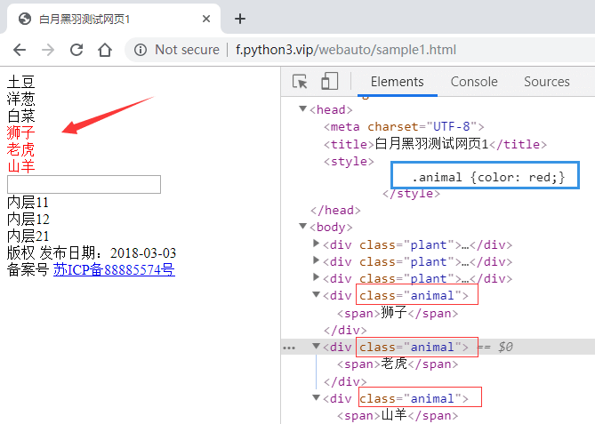
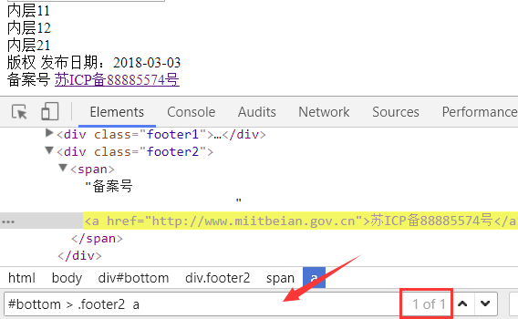
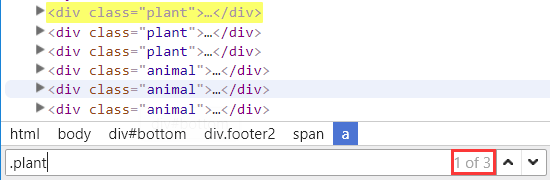

前面我们看到了根据 id、class属性、tag名 选择元素。

如果我们要选择的 元素 没有id、class 属性，或者有些我们不想选择的元素 也有相同的 id、class属性值，怎么办呢？

这时候我们通常可以通过  `CSS selector (选择器)`   语法选择元素。

## CSS Selector 语法选择元素原理

HTML中经常要 为 某些元素 指定 **显示效果**，比如 前景文字颜色是红色， 背景颜色是黑色， 字体是微软雅黑等。

那么CSS必须告诉浏览器：要 **选择哪些元素** ， 来使用这样的显示风格。

比如 ，[下图中](https://www.byhy.net/cdn2/files/selenium/sample1.html)，为什么狮子老虎山羊会显示为红色呢？



因为蓝色框里面用css 样式，指定了class 值为animal的元素，要显示为红色。

其中 蓝色框里面的 .animal 就是 CSS Selector ，或者说 CSS 选择器。

CSS Selector 语法就是用来选择元素的。

既然 CSS Selector 语法 天生就是浏览器用来选择元素的，selenium自然就可以使用它用在自动化中，去选择要操作的元素了。

只要 CSS Selector 的语法是正确的， Selenium 就可以选择到该元素。

CSS Selector 非常强大，学习Selenium Web自动化一定要学习 CSS Selector

通过 CSS Selector  选择单个元素的方法是

```scss
find_element(By.CSS_SELECTOR, CSS Selector参数)
```

选择所有元素的方法是

```scss
find_elements(By.CSS_SELECTOR, CSS Selector参数)
```

CSS Selector 选择元素非常灵活强大， 大家可以从下面的例子看出来。

## 根据 tag名、id、class 选择元素

CSS Selector 同样可以根据tag名、id 属性和 class属性 来 选择元素，

根据 tag名 选择元素的 CSS Selector 语法非常简单，直接写上tag名即可，

比如 要选择 所有的tag名为div的元素，就可以是这样

```py
elements = wd.find_elements(By.CSS_SELECTOR, 'div')
```

等价于

```py
elements = wd.find_elements(By.TAG_NAME, 'div')
```

------

根据id属性 选择元素的语法是在id号前面加上一个井号： `#id值`

比如  [请点击打开这个网址](https://www.byhy.net/cdn2/files/selenium/sample1.html)

有下面这样的元素：

```html
<input  type="text" id='searchtext' />
```

就可以使用  `#searchtext` 这样的 CSS Selector 来选择它。

比如，我们想在  `id 为 searchtext`  的输入框中输入文本  `你好`  ，完整的Python代码如下

```py
from selenium import webdriver
from selenium.webdriver.common.by import By
 
wd = webdriver.Chrome()
 
wd.get('https://www.byhy.net/cdn2/files/selenium/sample1.html')
 
element = wd.find_element(By.CSS_SELECTOR, '#searchtext')
element.send_keys('你好')
```

------

根据class属性 选择元素的语法是在 class 值 前面加上一个点： `.class值`

比如 这个网址 <https://www.byhy.net/cdn2/files/selenium/sample1.html>

要选择**所有** class 属性值为 animal的元素 动物 除了这样写

```py
elements = wd.find_elements(By.CLASS_NAME, 'animal')
```

还可以这样写

```py
elements = wd.find_elements(By.CSS_SELECTOR, '.animal')
```

因为是选择 `所有` 符合条件的 ，所以用  `find_elements`  而不是  `find_element`


## 选择 子元素 和 后代元素

[点击这里，边看视频讲解，边学习以下内容](https://www.bilibili.com/video/BV14K8NzUEF3?p=11)

CSS 选择器 可以 **限定选择的上级范围** ，也就是选择某个元素的  **子元素**  和  **后代元素** 。

什么是 **子元素**  和  **后代元素** 呢？

HTML中， 元素 内部可以 **包含其他元素**， 比如 下面的 HTML片段

```html
<div id='container'>
    
    <div id='layer1'>
        <div id='inner11'>
            <span>内层11</span>
        </div>
        <div id='inner12'>
            <span>内层12</span>
        </div>
    </div>

    <div id='layer2'>
        <div id='inner21'>
            <span>内层21</span>
        </div>
    </div>
    
</div>
```

下面的一段话有些绕口， 请 大家细心 阅读：

id 为 `container` 的div元素 包含了 id 为  `layer1` 和  `layer2` 的两个div元素。

这种包含是直接包含， 中间没有其他的层次的元素了。 所以 我们把  id 为  `layer1` 和  `layer2` 的两个div元素  称之为  id 为 `container` 的div元素 的 **直接子元素** ，简称  **子元素** 。 这里说的 `子` 是指 `孩子` 的意思。

反之，把 id 为 `container` 的div元素 称之为 id 为  `layer1` 和  `layer2` 的两个div元素 的  **父元素**

而对于 id 为 `container` 的div元素来说， id 为  `inner11` 、`inner12` 、`inner21` 的元素  和 两个  `span类型的元素`   都不是 它的直接子元素， 因为中间隔了 几层。

虽然不是直接子元素， 但是 它们还是在  `container`  的内部， 可以称之为它 的 **后代元素**。

反之， 把 把 id 为 `container` 的div元素 称之为 id 为   `inner11` 、`inner12` 、`inner21` 的元素 的  **祖先元素**

后代元素也包括了直接子元素， 比如 id 为  `layer1` 和  `layer2` 的两个div元素 也可以说 是 id 为 `container` 的div元素 的 **直接子元素，同时也是后代子元素**

如果  `元素2`   是 `元素1`  的 直接子元素， CSS Selector  选择子元素的语法是这样的

```undefined
元素1 > 元素2
```

中间用一个大于号 （我们可以理解为箭头号）

注意，最终选择的元素是 **元素2**， 并且要求这个 **元素2** 是 **元素1** 的直接子元素

也支持更多层级的选择， 比如

```undefined
元素1 > 元素2 > 元素3 > 元素4
```

就是选择  `元素1`  里面的子元素  `元素2`  里面的子元素  `元素3`  里面的子元素  `元素4` ， 最终选择的元素是 **元素4**

如果  `元素2`   是 `元素1`  的 后代元素， CSS Selector  选择后代元素的语法是这样的

```undefined
元素1   元素2
```

中间是一个或者多个空格隔开

最终选择的元素是 **元素2** ， 并且要求这个 **元素2** 是 **元素1** 的后代元素。

也支持更多层级的选择， 比如

```undefined
元素1   元素2   元素3  元素4
```

最终选择的元素是 **元素4**

CSS 支持 大于号和 空格 混合使用，比如

```py
元素1 >  元素2   元素3 > 元素4
```

其中每个元素的写法 可以是 **复合写法** ，比如

```css
span.date  // 选择 class 值有 date 的 span 元素

div#bottom // 选择 id 为 bottom 的 div 元素

div#bottom.date // 选择 id 为 bottom, class 值有 date, 的 div 元素
```

[点击这个链接，打开水浒人物网页](https://www.byhy.net/cdn2/files/selenium/shuihu.html)，结合视频讲解学习

## 根据属性选择

id、class 都是web元素的 `属性` ，因为它们是很常用的属性，所以css选择器专门提供了根据 id、class 选择的语法。

那么其他的属性呢？

比如  [点击打开这个网页](https://www.byhy.net/cdn2/files/selenium/sample1.html)， 里面底部的这个元素

```html
<a href="http://www.miitbeian.gov.cn">苏ICP备88885574号</a>
```

里面根据 href选择，可以用css 选择器吗？

当然可以！

css 选择器支持通过任何属性来选择元素，语法是用一个方括号 `[]` 。

比如要选择上面的a元素，就可以使用  `[href="http://www.miitbeian.gov.cn"]` 。

这个表达式的意思是，选择 属性href值为  `http://www.miitbeian.gov.cn` 的元素。

完整代码如下

```py
from selenium import webdriver
from selenium.webdriver.common.by import By

wd = webdriver.Chrome()

wd.get('https://www.byhy.net/cdn2/files/selenium/sample1.html')

# 根据属性选择元素
element = wd.find_element(By.CSS_SELECTOR, '[href="http://www.miitbeian.gov.cn"]')

# 打印出元素对应的html
print(element.get_attribute('outerHTML'))
```

当然，前面可以加上标签名的限制，比如  `div[class='SKnet']` 表示 选择所有  标签名为div，且class属性值为SKnet的元素。

属性值用单引号，双引号都可以。

根据属性选择，还可以不指定属性值，比如  `[href]` ， 表示选择 所有 具有 属性名 为href 的元素，不管它们的值是什么。

CSS 还可以选择 属性值 `包含` 某个字符串 的元素

比如， 要选择a节点，里面的href属性包含了 miitbeian 字符串，就可以这样写

```css
a[href*="miitbeian"]
```

还可以 选择 属性值 以某个字符串 `开头`  的元素

比如， 要选择a节点，里面的href属性以 http 开头 ，就可以这样写

```css
a[href^="http"]
```

还可以 选择 属性值 以某个字符串 `结尾`  的元素

比如， 要选择a节点，里面的href属性以 gov.cn 结尾 ，就可以这样写

```css
a[href$="gov.cn"]
```

如果一个元素具有多个属性

```html
<div class="misc" ctype="gun">沙漠之鹰</div>
```

CSS 选择器 可以指定 选择的元素要 同时具有多个属性的限制，像这样 `div[class=misc][ctype=gun]`

## 验证 CSS Selector

那么我们怎么验证  CSS Selector 的语法是否正确选择了我们要选择的元素呢？

当然可以像下面这样，写出Python代码，运行看看，能否操作成功

```py
element = wd.find_element(By.CSS_SELECTOR, '#searchtext')
element.input('输入的文本')
```

如果成功，说明选择元素的语法是正确的。

但是这样做的问题就是：太麻烦了。

当我们进行自动化开发的时候，有大量选择元素的语句，都要这样一个个的验证，就非常耗时间。

由于 CSS Selector 是浏览器直接支持的，可以在浏览器 **开发者工具栏** 中验证。

比如我们使用Chrome浏览器打开 <https://www.byhy.net/cdn2/files/selenium/sample1.html>

按F12 打开 开发者工具栏

如果我们要验证 下面的表达式

```less
#bottom > .footer2  a
```

能否选中 这个元素

```html
<a href="http://www.miitbeian.gov.cn">苏ICP备88885574号</a>
```

可以这样做：

点击 Elements 标签后， 同时按 Ctrl 键 和 F 键， 就会出现下图箭头处的 搜索框



我们可以在里面输入任何 CSS Selector 表达式 ，如果能选择到元素， 右边的的红色方框里面就会显示出类似 `2 of 3` 这样的内容。

of 后面的数字表示这样的表达式 `总共选择到几个元素`

of 前面的数字表示当前黄色高亮显示的是 `其中第几个元素`

上图中的  `1 of 1`  就是指 ： CSS 选择语法   `#bottom > .footer2  a`

在当前网页上共选择到 1 个元素， 目前高亮显示的是第1个。

如果我们输入 `.plant`  就会发现，可以选择到3个元素


