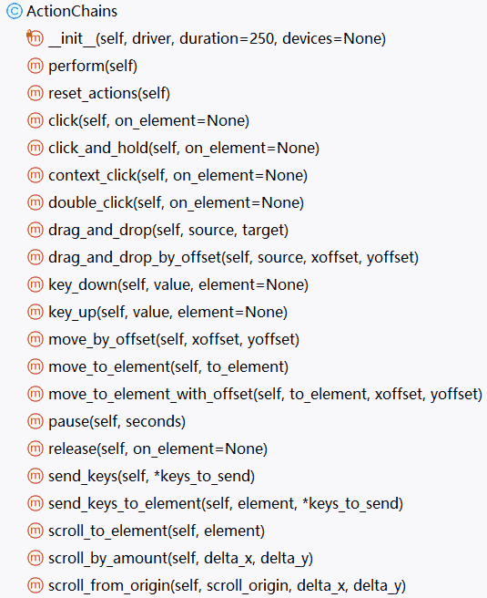
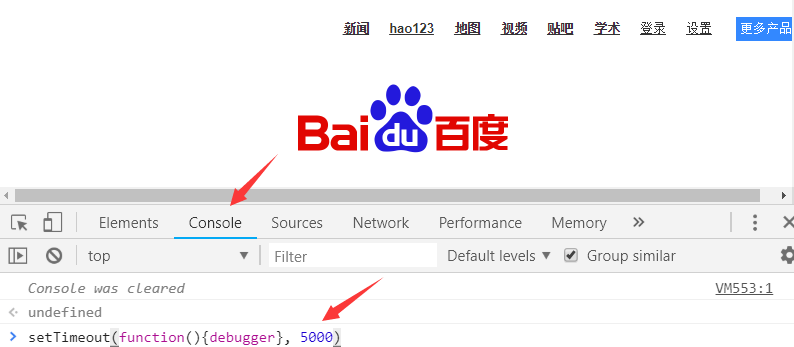

## 操作元素

之前我们对web元素做的操作主要是：**选择元素**，然后 **点击元素** 或者 **输入** 字符串。

还有没有其他的操作了呢？

有。

比如：比如 鼠标右键点击、双击、移动鼠标到某个元素、鼠标拖拽等。

这些操作，可以通过 Selenium 提供的  `ActionChains`  类来实现。

ActionChains 类 里面提供了 一些特殊的动作的模拟，我们可以通过 ActionChains 类的代码查看到，如下所示



我们以鼠标  **光标悬停** 到某个元素，和 **拖放** 为例。

[点击打开这个网址](https://www.byhy.net/cdn2/files/selenium/sample4.html)：

可以把鼠标放在导航栏最右边的 `更多` 上，就会弹出更多的导航项目。

下方正文区域，可以拖动左边实战班课程 放到 右边的选中区域。

示例代码如下：

```py
from selenium import webdriver
from selenium.webdriver.common.by import By
import time

wd = webdriver.Chrome()
wd.implicitly_wait(5)

wd.get('https://www.byhy.net/cdn2/files/selenium/sample4.html')


from selenium.webdriver.common.action_chains import ActionChains
ac = ActionChains(wd)

time.sleep(3)

# 光标悬停 到元素上
ac.move_to_element(
    wd.find_element(By.CSS_SELECTOR, '.navbar-nav > li.dropdown')
).perform()

time.sleep(3)

# 拖放元素
for i in range(1,6):
    ac.drag_and_drop(
        wd.find_element(By.ID, f'course-{i}'),
        wd.find_element(By.ID,'selected-courses')
    ).perform()

    time.sleep(0.5)

input('\n\n按回车退出')
```

## 直接执行javascript

我们可以直接让浏览器运行一段javascript代码，并且得到返回值，如下

```py
# 直接执行 javascript，里面可以直接用return返回我们需要的数据
nextPageButtonDisabled = driver.execute_script(
    '''
    ele = document.querySelector('.soupager > button:last-of-type');
    return ele.getAttribute('disabled')
    ''')

# 返回的数据转化为Python中的数据对象进行后续处理
if nextPageButtonDisabled == 'disabled': # 是最后一页
    return True
else: # 不是最后一页
    return False
```


有时，自动化的网页内容很长，或者很宽，超过一屏显示，

如果我们要点击的元素不在窗口可见区内，新版本的selenium协议， 浏览器发现要操作（比如点击操作）的元素，不在可见区内，往往会操作失败，

出现类似下面的提示

```html
element click intercepted: Element <span>这里是元素html</span> 
is not clickable at point (119, 10). 
Other element would receive the click: <div>...</div>
```

这时，可以调用 `execute_script` 直接执行js代码，让该元素出现在窗口可见区正中

```py
driver.execute_script("arguments[0].scrollIntoView({block:'center',inline:'center'})", job) 
```

其中  `arguments[0]`  就指代了后面的第一个参数 `job`  对应的js对象，

js对象的  `scrollIntoView` 方法，就是让元素滚动到可见部分

`block:'center'`  指定垂直方向居中

`inline:'center'` 指定水平方向居中

## 冻结界面

有些网站上面的元素， 我们鼠标放在上面，会动态弹出一些内容。

比如，百度首页的右上角，有个 **更多产品** 选项

如果我们把鼠标放在上边，就会弹出 下面的 糯米、音乐、图片 等图标。

如果我们要用 selenium 自动化 点击 糯米图标，就需要 F12 查看这个元素的特征。

但是  当我们的鼠标 从 糯米图标 移开， 这个 栏目就整个消失了， 就没法 查看 其对应的 HTML。

怎么办？

可以如下图所示：



在 开发者工具栏 console 里面执行如下js代码

```js
setTimeout(function(){debugger}, 5000)
```

这句代码什么意思呢？

表示在 5000毫秒后，执行 debugger 命令

执行该命令会 浏览器会进入debug状态。 debug状态有个特性， 界面被冻住，  不管我们怎么点击界面都不会触发事件。

所以，我们可以在输入上面代码并回车 执行后， 立即 鼠标放在界面 右上角 更多产品处。

这时候，就会弹出  下面的 糯米、音乐、图片 等图标。

然后，我们仔细等待 5秒 到了以后， 界面就会因为执行了 debugger 命令而被冻住。

然后，我们就可以点击 开发者工具栏的 查看箭头， 再去 点击  糯米图标 ，查看其属性了。

## 弹出对话框

有的时候，我们经常会在操作界面的时候，出现一些弹出的对话框。

[请点击打开这个网址](https://www.byhy.net/cdn2/files/selenium/test4.html)

分别点击界面的3个按钮，你可以发现：

弹出的对话框有三种类型，分别是 Alert（警告信息）、confirm（确认信息）和prompt（提示输入）

### Alert

Alert 弹出框，目的就是显示通知信息，只需用户看完信息后，点击 OK（确定） 就可以了。

那么，自动化的时候，代码怎么模拟用户点击 OK 按钮呢？

selenium提供如下方法进行操作

```py
driver.switch_to.alert.accept()
```

👓 注意

注意：如果我们不去点击它，页面的其它元素是不能操作的。

如果程序要获取弹出对话框中的信息内容， 可以通过 如下代码

```py
driver.switch_to.alert.text
```

示例代码如下

```py
from selenium import webdriver
from selenium.webdriver.common.by import By

driver = webdriver.Chrome()
driver.implicitly_wait(5)
driver.get('https://www.byhy.net/cdn2/files/selenium/test4.html')


# --- alert ---
driver.find_element(By.ID, 'b1').click()

# 打印 弹出框 提示信息
print(driver.switch_to.alert.text) 

# 点击 OK 按钮
driver.switch_to.alert.accept()
```

### Confirm

Confirm弹出框，主要是让用户确认是否要进行某个操作。

比如：当管理员在网站上选择删除某个账号时，就可能会弹出 Confirm弹出框， 要求确认是否确定要删除。

Confirm弹出框 有两个选择供用户选择，分别是 OK 和 Cancel， 分别代表 确定 和 取消 操作。

那么，自动化的时候，代码怎么模拟用户点击 OK 或者 Cancel 按钮呢？

selenium提供如下方法进行操作

如果我们想点击 OK 按钮， 还是用刚才的 accept方法，如下

```py
driver.switch_to.alert.accept()
```

如果我们想点击 Cancel 按钮， 可以用 dismiss方法，如下

```py
driver.switch_to.alert.dismiss()
```

示例代码如下

```py
from selenium import webdriver
from selenium.webdriver.common.by import By

driver = webdriver.Chrome()
driver.implicitly_wait(5)

driver.get('https://www.byhy.net/cdn2/files/selenium/test4.html')

# --- confirm ---
driver.find_element(By.ID, 'b2').click()

# 打印 弹出框 提示信息
print(driver.switch_to.alert.text)

# 点击 OK 按钮 
driver.switch_to.alert.accept()

driver.find_element(By.ID, 'b2').click()

# 点击 取消 按钮
driver.switch_to.alert.dismiss()
```

### Prompt

出现 Prompt 弹出框 是需要用户输入一些信息，提交上去。

比如：当管理员在网站上选择给某个账号延期时，就可能会弹出 Prompt 弹出框， 要求输入延期多长时间。

可以调用如下方法

```py
driver.switch_to.alert.send_keys()
```

示例代码如下

```py
from selenium import webdriver
from selenium.webdriver.common.by import By

driver = webdriver.Chrome()
driver.implicitly_wait(5)
driver.get('https://www.byhy.net/cdn2/files/selenium/test4.html')


# --- prompt ---
driver.find_element(By.ID, 'b3').click()

# 获取 alert 对象
alert = driver.switch_to.alert

# 打印 弹出框 提示信息
print(alert.text)

# 输入信息，并且点击 OK 按钮 提交
alert.send_keys('web自动化 - selenium')
alert.accept()

# 点击 Cancel 按钮 取消
driver.find_element(By.ID, 'b3').click()
alert = driver.switch_to.alert
alert.dismiss()
```

👓 注意

有些弹窗并非浏览器的alert 窗口，而是**html元素**，这种对话框，只需要通过之前介绍的选择器选中并进行相应的操作就可以了。

## 其他技巧

下面是一些其他的 Selenium 自动化技巧

### 窗口大小

有时间我们需要获取窗口的属性和相应的信息，并对窗口进行控制

- 获取窗口大小

```py
driver.get_window_size()
```

- 改变窗口大小

```py
driver.set_window_size(x, y)
```

### 获取当前窗口标题

浏览网页的时候，我们的窗口标题是不断变化的，可以使用WebDriver的title属性来获取当前窗口的标题栏字符串。

```py
driver.title
```

### 获取当前窗口URL地址

```py
driver.current_url
```

例如，访问网易，并获取当前窗口的标题和URL

```py
from selenium import  webdriver

driver = webdriver.Chrome()
driver.implicitly_wait(5)

# 打开网站
driver.get('https://www.163.com')

# 获取网站标题栏文本
print(driver.title) 

# 获取网站地址栏文本
print(driver.current_url) 
```

### 截屏

有的时候，我们需要把浏览器屏幕内容保存为图片文件。

比如，做自动化测试时，一个测试用例检查点发现错误，我们可以截屏为文件，以便测试结束时进行人工核查。

可以使用 WebDriver 的 get_screenshot_as_file方法来截屏并保存为图片。

```py
from selenium import  webdriver

driver = webdriver.Chrome()
driver.implicitly_wait(5)

# 打开网站
driver.get('https://www.baidu.com/')

# 截屏保存为图片文件
driver.get_screenshot_as_file('1.png')
```

### 手机模式

我们可以通过  `desired_capabilities` 参数，指定以手机模式打开chrome浏览器

参考代码，如下

```py
from selenium import webdriver

mobile_emulation = { "deviceName": "iPhone 14 Pro Max" }

chrome_options = webdriver.ChromeOptions()

chrome_options.add_experimental_option("mobileEmulation", mobile_emulation)

driver = webdriver.Chrome(options=chrome_options)

driver.get('http://www.baidu.com')

input()
driver.quit()
```

### 上传文件

有时候，网站操作需要上传文件。

比如，著名的在线图片压缩网站： <https://tinypng.com/>

通常，网站页面上传文件的功能，是通过  `type`  属性 为  `file`  的 HTML  `input`  元素实现的。

如下所示：

```html
<input type="file" multiple="multiple">
```

使用selenium自动化上传文件，我们只需要定位到该input元素，然后通过 send_keys 方法传入要上传的文件路径即可。

如下所示：

```py
# 先定位到上传文件的 input 元素
ele = wd.find_element(By.CSS_SELECTOR, 'input[type=file]')

# 再调用 WebElement 对象的 send_keys 方法
ele.send_keys(r'h:\g02.png')
```

如果需要上传多个文件，可以多次调用send_keys，如下

```py
ele = wd.find_element(By.CSS_SELECTOR,  'input[type=file]')
ele.send_keys(r'h:\g01.png')
ele.send_keys(r'h:\g02.png')
```

但是，有的网页上传，是没有 file 类型 的 input 元素的。

如果是Windows上的自动化，可以采用 Windows 平台专用的方法：

执行

```py
pip install pypiwin32
```

确保 pywin32 已经安装，然后参考如下示例代码

```py
# 找到点击上传的元素，点击
driver.find_element(By.CSS_SELECTOR, '.dropzone').click()

sleep(2) # 等待上传选择文件对话框打开

# 直接发送键盘消息给 当前应用程序，
# 前提是浏览器必须是当前应用
import win32com.client
shell = win32com.client.Dispatch("WScript.Shell")

# 输入文件路径，最后的'\n'，表示回车确定，也可能时 '\r' 或者 '\r\n'
shell.Sendkeys(r"h:\a2.png" + '\n')
sleep(1)
```
