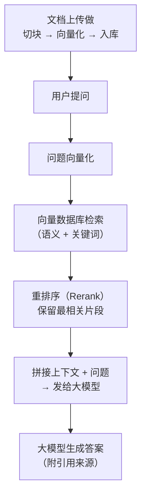
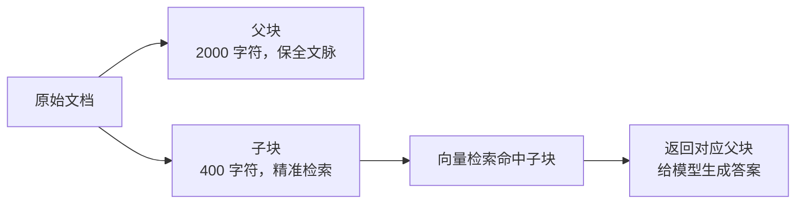

# AI 知识库别乱搭！RAG 向量库实战讲透

## 一、视频主题概述

很多团队搭建企业知识库时思路很简单：**把公司文档丢进向量库 → 接个大模型 → 完工**。Demo 阶段看起来效果惊艳，但一上线就开始**乱答、找错资料、引用过期文档**。

本期视频的核心观点——**"把文档丢进向量库再接模型"不等于企业知识库**。真正能落地的 RAG 系统，需要把以下六个环节全部做扎实：

1. RAG 的底层原理
2. 向量库的工作机制
3. 文档切块策略
4. 混合检索 + Rerank
5. 权限控制
6. 效果评测

---

## 二、核心观点摘要

### 观点一：Demo ≠ 生产

简单 Demo（LangChain + FAISS + 大模型）的准确率典型值只有 **~60%**。常见问题能答，技术细节和专业术语频频出错——分块粗糙、关键词和编号搜不到、Prompt 太简单、没有权限控制。

> 方向可行，但离生产还差得远，需要系统性优化。

### 观点二：单纯向量检索远远不够

企业内部文档充满**专有名词、产品型号、编号、版本号、法规条款号**——这些内容靠语义相似度很难精确命中。纯语义检索会忽略这些细节，导致回答看似合理但依据错误。

### 观点三：80% 的 RAG 效果问题源于数据处理

行业共识——**数据治理是成败关键**。模型能力再强，如果喂进去的是过期文档、重复文档、错误文档、权限混乱的数据，最终输出也不可靠。

### 观点四：混合检索是企业 RAG 的标配

| 检索方式 | 适合的问题类型 | 局限 |
| :--- | :--- | :--- |
| 向量检索 | 语义问答、相似问题、概念解释 | 对编号、实体、精确字段不稳定 |
| BM25 / 关键词检索 | 编号、条款、产品名、专有名词 | 对同义词和意图理解弱 |
| 元数据过滤 | 部门、角色、时间、来源、密级 | 依赖元数据质量 |

### 观点五：没有评估的 RAG 就是盲人摸象

必须内置评估框架，对每次问答的"忠实度""相关性""完整性"进行自动化打分。配合用户反馈闭环持续迭代。

---

## 三、重要细节和数据

### 主题一：RAG 的底层原理

**RAG（Retrieval-Augmented Generation）** = 检索增强生成。目标不是让模型"凭记忆"回答，而是在回答前**先检索外部知识库**，再基于真实资料生成答案，从而降低幻觉、提高准确性。



**关键认知**：RAG 是"检索 + 生成"的架构思想，向量检索只是其中一种实现。RAG 的真正流程是**先检索证据，再基于证据生成**，而非把文档"训练进模型"。

---

### 主题二：向量库到底干什么

向量库的核心工作流程：

1. **文档入库**
   - 文档切块（Chunking）
   - 每个 chunk 用 Embedding 模型转成高维向量（如 bge-base-zh-v1.5 → 768 维）
   - 向量 + 原文 + 元数据一起存入向量数据库

2. **用户提问时**
   - 问题同样用 Embedding 模型向量化
   - 在向量空间中计算余弦相似度
   - 返回最相似的 Top-K 个 chunk

**Embedding 选择建议**：

| 模型 | 维度 | 适用场景 | 特点 |
| :--- | :--- | :--- | :--- |
| bge-base-zh-v1.5 | 768 | 通用中文 | 开源可自部署，效果/速度平衡 |
| text-embedding-3-small | 1536 | 通用英文/多语言 | OpenAI 官方，需 API 调用 |
| all-MiniLM-L6-v2 | 384 | 英文入门 | 轻量快速，适合原型 |

**主流向量数据库选型**：

| 数据库 | 特点 | 适用规模 |
| :--- | :--- | :--- |
| Qdrant | Rust 编写，部署简单，元数据过滤强 | 单机到中等规模 |
| FAISS | Meta 出品，极致性能 | 适合嵌入已有系统 |
| Milvus | 分布式，云原生 | 千万级以上 |
| Chroma | 轻量，适合原型和开发 | 小规模 / 原型 |
| pgvector | PostgreSQL 插件 | 已有 PG 的团队 |

---

### 主题三：文档怎么切块（这是 80% 问题的根源）

**❌ 错误做法**：固定 500 字一刀切，断句、断表、断代码。

**✅ 正确做法**：按文档类型采用不同策略。

#### 通用切分策略：递归字符切分

```json
chunk_size = 512 tokens
chunk_overlap = 15%（约 80 tokens）
分隔符优先级：\n\n → \n → 。 → ！ → ？ → 空格
```

#### 不同文档类型的建议参数

| 文档类型 | 单块大小（字符） | 重叠长度 | 原因 |
| :--- | :--- | :--- | :--- |
| 通用办公文档 | 1000 | 200 | 语义松散，兼顾完整与效率 |
| 技术文档 / API | 800 | 150 | 术语密集，缩小块避免冗余 |
| 法律 / 合规文档 | 1500 | 300 | 条款关联性强，需长上下文 |
| FAQ / 问答 | 500 | 100 | 问答结构独立，精简尺寸 |

#### 进阶策略：父子分块



- **子块**（小）：用于向量检索，命中精准
- **父块**（大）：承载完整上下文，用于模型生成
- **效果**：检索精准 + 上下文完整，召回率显著提升

---

### 主题四：混合检索 + Rerank 怎么做

单一向量检索在企业场景极易失效。行业标配是**三阶段流水线**：

#### 阶段一：多路召回（混合检索）

| 路径 | 工具 | 擅长 | 典型 Top-K |
| :--- | :--- | :--- | :--- |
| 稠密检索（向量） | Qdrant / Milvus | 语义理解、概念匹配 | 15-20 |
| 稀疏检索（BM25） | Elasticsearch | 编号、关键词、型号精准匹配 | 10-15 |
| 元数据过滤 | 向量库内置 | 部门、时间、密级限定范围 | — |

**融合算法**：RRF（Reciprocal Rank Fusion），无需训练，零额外成本，平衡两路结果的排序。

#### 阶段二：重排序（Rerank）

合并去重后的候选片段（约 40-60 条），送入 Rerank 模型深度打分。

```json
原始候选: 向量 Top-20 + BM25 Top-15 → 合并去重 ~35 条
              ↓ Rerank 模型二次打分
最终上下文: Top 5-8 条 → 送给大模型生成答案
```

**Rerank 模型选择**：

| 层级 | 代表模型 | 适用场景 |
| :--- | :--- | :--- |
| 通用重排 | bge-reranker-base / v2-m3 | 一般知识问答 |
| 领域重排 | 法律/医疗专用模型 | 专业场景 |
| LLM-as-Reranker | GPT-4 等大模型判断 | 高成本，高精度场景 |

#### 阶段三：上下文压缩

误区：上下文越多越准。实际上杂乱的长上下文会稀释有效信息、加剧幻觉。需要精简提纯，剔除冗余重复内容，只保留核心信息送入大模型。

#### 生产环境真实耗时参考

| 阶段 | 平均耗时 |
| :--- | :--- |
| 权限过滤 | 20-50 ms |
| 向量检索 | 80-200 ms |
| 关键词检索 | 50-150 ms |
| Rerank 重排 | 300-900 ms |
| 大模型生成 | 1.5-5 s |
| **总体响应** | **2-7 s** |

---

### 主题五：权限控制怎么落地

企业知识库和公共搜索最大的区别——**权限是刚需**。

#### 三道防线

**防线一：元数据标注（入库时）**

```json
{
  "department": "sales_1",
  "access_level": "internal",
  "allowed_roles": ["sales_manager", "sales_staff"],
  "expiry_date": "2026-12-31"
}
```

**防线二：检索前过滤（查询时）**

```python
retriever = vector_store.as_retriever(
    search_kwargs={
        "k": 10,
        "filter": {
            "department": {"$in": user_departments},
            "access_level": {"$in": user_levels}
        }
    }
)
```

- 权限过滤在**检索阶段完成**，不在生成后遮挡
- 否则模型会"看到不该看的内容"——即使不输出也会泄露

**防线三：审计日志**

每次查询记录：用户、问题、命中文档列表、使用片段、模型回答、用户反馈、时间、Token 消耗、是否触发敏感词。用于问题追溯和质量优化。

---

### 主题六：评测怎么落地

没有评估的 RAG 就是盲人摸象。需要建立**全维度监控体系**。

#### 评测维度

| 维度 | 指标 | 工具 |
| :--- | :--- | :--- |
| 检索质量 | 召回率、命中率 | 人工标注 + 自动评估 |
| 答案质量 | 忠实度、相关性、完整性 | RAGAS / TruLens |
| 系统性能 | 检索耗时、并发、错误率 | 日志 + 监控 |
| 用户反馈 | 点赞/点踩/纠错 | 产品内嵌 |

#### 从 Demo 到生产的提升路径

```json
配置                         准确率表现
仅关键词检索              50-60%（依赖关键词命中）
仅向量检索                55-65%（编号和型号不稳定）
向量 + 关键词              65-75%（明显提升）
向量 + 关键词 + Rerank     75-85%（最稳定）
+ 引用来源 + 拒答策略      85%+（幻觉明显降低）
+ 用户反馈闭环             持续提升
```

> 生产实测中，最大的提升并**不是**来自更换更大的模型，而是来自：清洗无效文档 → 调整切分策略 → 增加元数据过滤 → 使用混合检索 → 加入 Rerank → 优化 Prompt → 建立用户反馈闭环。

#### 标准 Prompt 模板（防幻觉）

```json
你是专业的企业知识助手，请严格遵循以下规则：
1. 仅使用下文上下文内容作答，禁止调用外部知识；
2. 无相关信息时，直接回复："抱歉，未在知识库中查询到相关内容"；
3. 答案客观简洁，所有结论必须标注文档来源；
4. 若上下文信息存在矛盾，逐一列出冲突内容及对应来源。

上下文：{context}
问题：{question}
答案：
```

---

## 四、总结与要点

### 核心结论

| 要点 | 说明 |
| :--- | :--- |
| **向量库 ≠ 知识库** | 只是检索链条上的一个环节 |
| **80% 问题在数据** | 文档清洗、切块策略、元数据设计决定上限 |
| **混合检索是底线** | 向量 + BM25 + 元数据过滤，单一检索企业场景不稳 |
| **Rerank 必不可少** | 多路召回后必须重排序，否则 Top-K 噪声大 |
| **权限在检索层做** | 不在前端遮挡、不在生成后过滤，检索时就限定范围 |
| **评测必须闭环** | RAGAS + 用户反馈 + 性能监控，没有评估就没法迭代 |
| **Demo 到生产差距巨大** | 准确率从 60% → 85%+ 靠的不是换模型，是系统性优化 |

### 最终建议

不要一上来就追求"大而全"。落地路线建议：

1. 先在小批量文档（几百份）验证架构
2. 确认分块策略和混合检索效果
3. 逐步扩容至千级、万级、百万级
4. 上线后持续通过评测和用户反馈迭代

> **真正能用的企业知识库，不是"丢文档 + 接模型"的 Demo，而是一套集文档处理、多维检索、权限隔离、效果评测于一体的系统工程。**

---

*本文基于抖音视频《AI知识库别乱搭！RAG向量库实战讲透》的主题框架，结合联网搜索的行业实战资料（CSDN 企业知识库从 0 到 1 落地全记录、Tencent Cloud 工程化落地实战、JitKnow 千万级文档 RAG 实战等）整理而成。*
