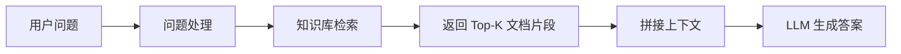
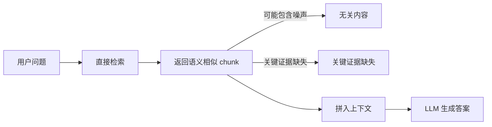
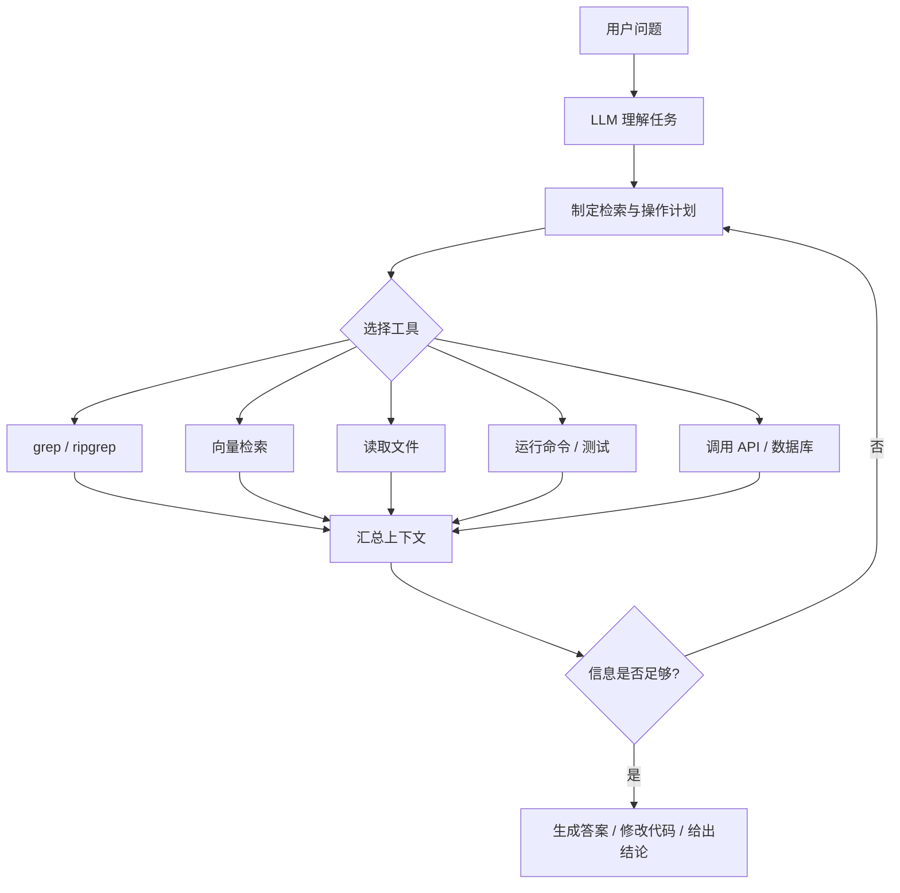
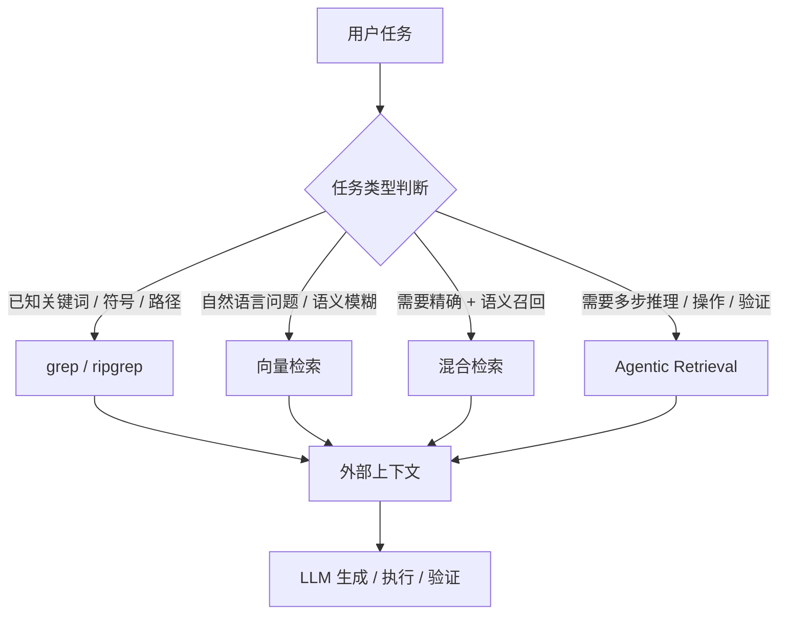
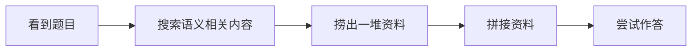
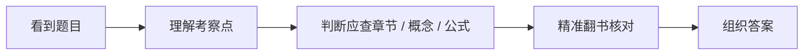
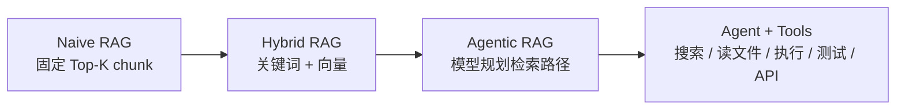
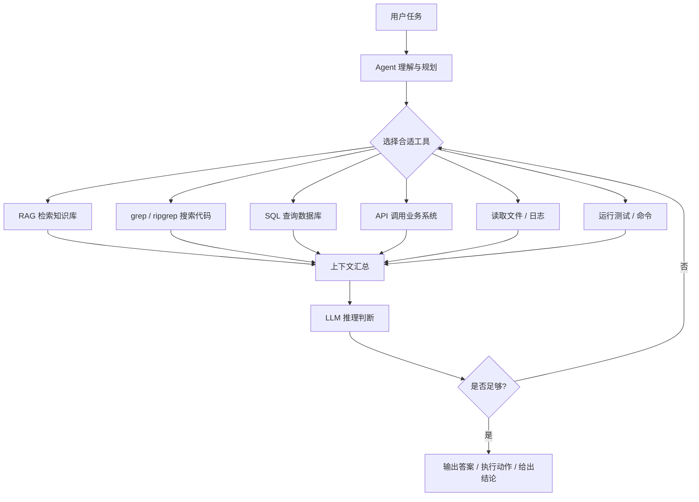

# RAG 已死一年了，如今死得怎么样了？

过去一年，AI 圈反复流行一句话：

> **RAG 已死。**

这并不是空穴来风。2025 年前后，随着模型推理能力、代码理解能力和工具调用能力显著提升，以 Claude Code 为代表的代码 Agent 开始迅速进入开发工作流。它们可以读取代码库、搜索文件、编辑代码、运行命令、执行测试，并根据结果继续调整策略。

于是，一个问题自然出现了：

> 既然 Agent 可以先理解问题，再主动搜索资料、阅读代码、运行命令、验证结果，那传统 RAG 还有存在价值吗？
> RAG 是不是真的已经被 Agent 吞掉了？

结论是：

> **RAG 没死，死的是 naive RAG。**
> 更准确地说，被冲击的不是"检索"本身，而是"先盲目检索，再让模型回答"的旧范式。

---

## 一、先说清楚：RAG 到底是什么？

RAG，全称 **Retrieval-Augmented Generation**，即**检索增强生成**。

它的基本流程很简单：在 LLM 回答用户问题之前，系统先从外部知识库中检索相关资料，再把这些资料拼入上下文，让模型基于外部信息生成答案。

换句话说，RAG 的目标不是让模型完全"凭记忆"回答，而是让模型在回答前先参考外部知识，从而降低幻觉，提高答案的准确性和可追溯性。

一个典型的传统 RAG 流程如下：

这里需要先澄清一个常见误解：

> **RAG 不等于向量检索。**

RAG 是一种"检索 + 生成"的架构思想，而向量检索只是其中一种常见实现方式。真正的 RAG 可以使用向量检索，也可以使用关键词检索、BM25、SQL、图数据库、API 调用、文件搜索，甚至是多种方式组合起来的混合检索。

因此，讨论"RAG 已死"时，首先要区分清楚：**死的是 RAG 这个思想，还是某种低质量、固定化、缺乏任务理解的 RAG 实现**？

答案显然是后者。

---

## 二、Agent + grep 冲击的到底是什么？

过去很多 RAG 系统的流程大致是：

> 用户问题 → 向量检索 Top-K chunk → 拼进上下文 → LLM 生成答案

这种做法最大的问题在于：**检索动作发生在模型真正理解问题之前。**

用户问了一个问题，系统就直接把问题向量化，然后去知识库里寻找语义相似的片段。检索器找到什么，模型就只能基于什么回答。这个过程有点像"**手脚先动，大脑后想**"：系统先把一堆"可能相关"的资料捞上来，再交给模型判断哪些有用。

传统 naive RAG 可以理解为下面这个流程：

而 Agent 模式的变化在于：

> **先让模型理解任务，再由模型决定查什么、怎么查、查完之后是否继续查。**

在代码场景中，这种变化尤其明显。代码 Agent 不再只是被动接收检索结果，而是可以先分析用户需求，再决定搜索函数名、类名、错误信息、配置项、API 调用、文件路径、测试用例或调用链。它可以先粗读项目结构，再精确定位文件；也可以在修改代码后运行测试，把测试结果重新纳入下一轮判断。

Agentic retrieval 的流程更像这样：

所以，真正的变化不是：

> grep 打败了 RAG。

而是：

> **检索从一个固定前置步骤，变成了 Agent 推理过程中的一个可调度工具。**

这才是核心。

---

## 三、这不是 grep 和向量检索的战争

很多人在讨论时，会把问题简化成：

> 过去是 RAG + 向量检索，现在是 Agent + grep。

这个说法有一定观察价值，但并不严谨。

首先，RAG 不是向量检索。RAG 是"检索 + 生成"的架构思想。其次，grep 也不是 Agent 的全部。grep 或 ripgrep 代表的是一种**精确文本检索能力**，特别适合在代码仓库中查找函数名、变量名、类名、宏定义、错误日志、配置项、API 名称和文件路径。

但 grep 的缺点也很明显：**它必须依赖准确关键词**。如果你不知道某个功能在项目里叫什么，不知道作者用了哪个缩写，也不知道业务概念对应哪个类名，grep 就会变得很吃力。

反过来，向量检索擅长语义召回。即使用户问题和文档表达不完全一致，只要含义接近，它也可能找到相关内容。但它的问题是依赖 chunk 切分、embedding 的质量和索引维护，尤其在代码仓库这类频繁变动、强依赖精确符号的场景中，会遇到不小的工程负担。

因此，grep 和向量检索不是谁消灭谁，而是适用场景不同：

| 检索方式 | 核心特点 | 适合场景 | 主要限制 |
| --- | --- | --- | --- |
| grep / ripgrep | 关键词或正则精确匹配 | 代码仓库、日志、配置、符号搜索 | 依赖准确关键词 |
| 向量检索 | 语义相似度匹配 | 文档问答、知识库、自然语言资料 | 依赖 chunk、embedding 和索引维护 |
| 混合检索 | 关键词 + 向量结合 | 企业知识库、产品文档、复杂问答 | 工程复杂度更高 |
| Agentic retrieval | 模型先规划，再调用工具 | 代码修改、复杂排障、多步骤任务 | 延迟和 token 成本更高 |

更合理的理解是：**grep、向量检索、SQL、API、文件读取，本质上都是工具。关键不在于工具本身，而在于谁来决定什么时候使用什么工具。**

过去 naive RAG 是系统固定决定。
现在 Agentic workflow 是模型根据任务动态决定。

这才是范式变化。

---

## 四、一个例子

可以用一个开卷考试的例子来理解这次变化。

假设今天考试允许**翻书**。

小渣平时没怎么学。看到题目后，它只能在书里搜索所有看起来语义相关的内容。它可能翻到很多相似段落，但并不知道哪个才是题目真正考察的知识点。最后它把这些内容拼在一起，答案有可能对，也有可能跑偏。

这就像传统 naive RAG：先搜索所有语义相似内容，再把资料拼进上下文，最后让模型尝试作答。

小霸则不一样。它平时学得很扎实，看到题目后，马上知道这道题考察哪一章、哪一节、哪个公式、哪个概念。然后它再去书中定位相关内容，核对细节，组织答案。

它也在查资料，但它不是盲查，而是带着问题、路径和判断标准去查。

这个例子的重点不是说"向量检索差，grep 好"，而是说：

> **当模型本身变聪明之后，检索方式会从"召回驱动"变成"推理驱动"。**

真正受到冲击的，不是某一种检索方式，而是那种"模型还没理解任务，系统就先把一堆内容塞给模型"的工作模式。

---

## 五、RAG 到底还死不死？

如果说最早那种 naive RAG：固定 chunk、固定 Top-K、固定上下文、固定让模型回答，那它确实已经不够用了。

它的核心问题可以概括为四个方面。

**第一，naive RAG 容易召回噪声。** 检索到的内容看似相关，实际不一定能回答问题。上下文里塞入太多无关信息后，不仅浪费 token，还可能干扰模型判断。

**第二，它过度依赖 chunk 切分。** chunk 切得太碎，上下文断裂；chunk 切得太粗，又会引入大量无关内容。很多时候，文档本身是完整的，但切片之后，语义结构反而被破坏了。

**第三，它对动态知识库不友好。** 尤其是代码仓库，文件频繁变动，如果使用向量库，就需要持续处理增量索引、重切片、重嵌入、删除过期 chunk，以及保证索引和真实文件一致。这些都会显著增加工程复杂度。

**第四，它缺乏任务意识。** 用户可能是在找定义、找调用链、查配置项、定位 bug 根因、判断某段代码能不能改，或者综合多个来源做结论。但 naive RAG 往往不理解这些任务差异，只是机械地召回相似内容。

所以，"RAG 已死"如果作为技术判断，就太粗糙了。

更准确的说法应该是：

> **RAG 没死，RAG 被 Agent 化了。**
> **检索没死，检索从固定流水线变成了模型可调度的工具。**
> **向量检索没死，它只是从唯一主角变成了众多检索手段之一。**

可以把这次变化理解为下面这条演进路径：

真正死掉的是那个时代：

> 把用户问题向量化，捞几个 chunk，拼进上下文，然后祈祷模型答对。

这个时代确实正在过去。

但 RAG 的核心思想，也就是"通过外部知识增强模型生成能力"，并没有死，反而在 Agent 时代变得更加重要。

---

## 六、不同场景下到底该用什么？

如果是简单 FAQ、企业制度问答、产品文档问答、客服知识库，传统 RAG 或混合检索 RAG 往往已经足够。它的优势是便宜、稳定、延迟低、工程化简单，也更容易控制数据源、引用来源和权限边界。

如果是代码修改、复杂排障、多文件理解、多步骤任务规划，那么 Agent 模式优势会明显得多。因为这类任务不是简单地"找一段资料回答问题"，而是要经历"理解目标 → 制定计划 → 多轮查证 → 执行动作 → 验证结果"的完整链路。

不同场景的选择可以总结如下：

| 场景 | 更适合的方案 | 原因 |
| --- | --- | --- |
| FAQ 问答 | 传统 RAG / 混合 RAG | 问题稳定，知识库相对静态 |
| 产品文档问答 | 混合 RAG | 既需要语义召回，也需要术语精确匹配 |
| 企业内部知识库 | RAG + 权限控制 | 数据来源明确，需要可追溯 |
| 代码仓库查询 | Agent + grep / AST / LSP | 符号、路径、调用链更关键 |
| 代码修改 | Agent + Tools | 需要读文件、改代码、跑测试 |

| 场景 | 更适合的方案 | 原因 |
| --- | --- | --- |
| 复杂排障 | Agentic retrieval | 需要多轮搜索、验证和推理 |
| 数据分析 | Agent + SQL / Python | 需要查询、计算和解释 |
| 多系统业务流程 | Agent + API / DB / RAG | 需要跨工具编排 |

最终，更合理的系统形态不是 RAG 和 Agent 二选一，而是让 Agent 作为决策层，让 RAG、grep、SQL、API、文件系统等工具作为执行层。

---

## 七、最终结论

所以，RAG 到底死了吗？

我的答案是：

> **Naive RAG 死了。**
> **但 RAG 没死，它只是换了一具更像 Agent 的身体。**

Agent 不是 RAG 的反面，而是 RAG 的上层编排者。RAG 也不是 grep 的反面，而是更广义的外部知识注入机制。

未来更合理的系统形态，不是：

> RAG vs Agent

而是：

> **Agent 负责思考和规划，RAG / grep / SQL / API / 文件系统负责提供证据和上下文。**

如果认真讨论技术演进，更准确的判断应该是：

> **死掉的不是 RAG，而是低智商模型时代的固定检索流水线。**
> **活下来的也不是某一种检索工具，而是由模型推理驱动的上下文获取能力。**

换句话说：

> **RAG 没死。**
> **它只是从"手脚主导大脑"，进化成了"大脑指挥手脚"。**

---

## 参考资料

- Anthropic: Claude 3.7 Sonnet and Claude Code announcement
- Anthropic Docs: Claude Code common workflows
- Lewis et al., 2020: Retrieval-Augmented Generation for Knowledge-Intensive NLP Tasks
- AWS: What is Retrieval-Augmented Generation?
- Microsoft Azure AI Search: Vector search and hybrid search documentation
